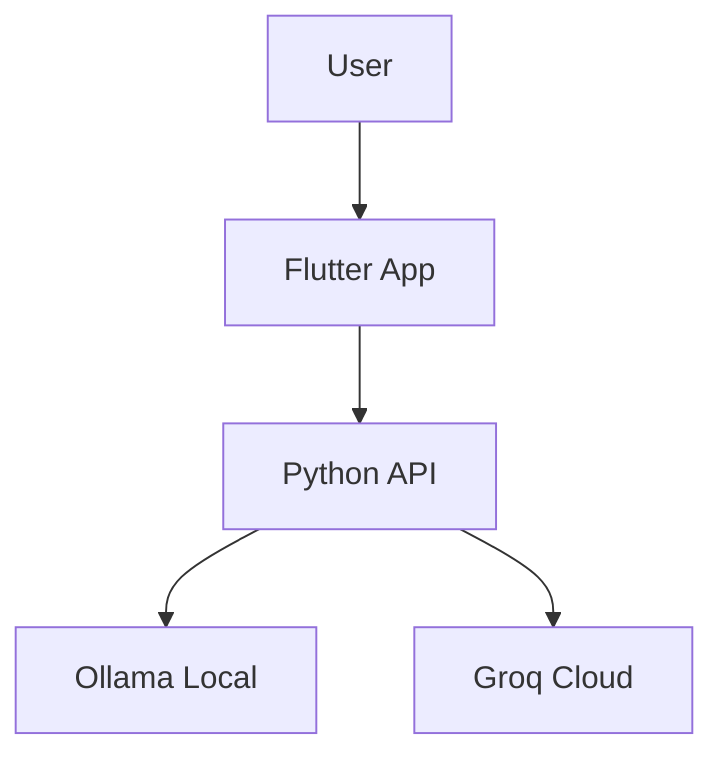

# 📝 Documentation Standards (The Knowledge Arch)

> **Objective:** Maintain a clear distinction between project documentation ("Logbook") and knowledge consumed by AI ("Brain").

---

## 1. Directory Taxonomy

### 📘 `doc/` (Live Documentation / Logbook)
* **Audience:** Humans (Developers, Auditors, Users).
* **Content:**
    * How to install the project (`SETUP_GUIDE`).
    * The TFM memory (`MEMORIA_METODOLOGICA`).
* **Format:** Free Markdown, explanatory, with Mermaid diagrams if necessary.

### 🧠 `packages/knowledge_base/` (RAG Brain / Assets)
* **Audience:** AI Agents (ArchitectZero).
* **Content:**
    * Pure rules: "In Flutter, use camelCase".
    * Facts: Objective technical data about used technologies.
* **Format:** Strict Markdown, atomic (small files), optimized for vectorization (Chunking friendly). Avoid long introductions. Get to the point.

---

## 2. Writing Rules (Style Guide)

### For `doc/`
1.  **Language:** Spanish (Native to the project).
2.  **Tone:** Professional, academic but pragmatic.
3.  **Update:** Must be updated in the same Pull Request that changes the code (`Docs-as-Code`).

### For `packages/knowledge_base/`
1.  **Language:** Preferably English for technical terms (better LLM understanding), or neutral Spanish technical.
2.  **Structure:**
    * Use Headers (`#`, `##`) clearly to facilitate *Semantic Splitting*.
    * Use code blocks for examples (` ```python `).
3.  **Meta-data:** If possible, include a frontmatter block or context header:
    ```markdown
    ---
    tech: flutter
    category: state-management
    ---
    ```

---

## 3. Diagrams and Visuals

Mermaid.js is recommended for architecture diagrams, as it is readable by humans and AIs (as text).



---

## 4. Versioning and Updates

* **Version Control:** All documentation is versioned with the code.
* **Review Process:** Documentation changes require review by at least one other team member.
* **Accessibility:** Ensure diagrams have alt text and code blocks have syntax highlighting.