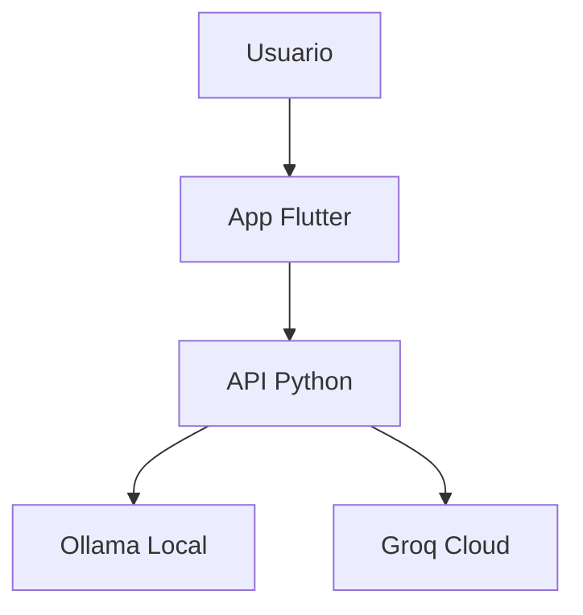

# 📝 Estándares de Documentación (The Knowledge Arch)

> **Objetivo:** Mantener una distinción clara entre la documentación del proyecto ("Bitácora") y el conocimiento que consume la IA ("Cerebro").

---

## 1. Taxonomía de Directorios

### 📘 `doc/` (Documentación Viva / Bitácora)
* **Audiencia:** Humanos (Desarrolladores, Auditores, Usuarios).
* **Contenido:**
    * Cómo instalar el proyecto (`SETUP_GUIDE`).
    * La memoria del TFM (`MEMORIA_METODOLOGICA`).
* **Formato:** Markdown libre, explicativo, con diagramas Mermaid si es necesario.

### 🧠 `packages/knowledge_base/` (Cerebro RAG / Assets)
* **Audiencia:** Agentes de IA (ArchitectZero).
* **Contenido:**
    * Reglas puras: "En Flutter se usa camelCase".
    * Facts: Datos técnicos objetivos sobre las tecnologías usadas.
* **Formato:** Markdown estricto, atómico (archivos pequeños), optimizado para ser vectorizado (Chunking friendly). Evitar introducciones largas. Ir al grano.

---

## 2. Reglas de Escritura (Style Guide)

### Para `doc/`
1.  **Idioma:** Español (Nativo del proyecto).
2.  **Tono:** Profesional, académico pero pragmático.
3.  **Actualización:** Debe actualizarse en el mismo Pull Request que cambia el código (`Docs-as-Code`).

### Para `packages/knowledge_base/`
1.  **Idioma:** Preferiblemente Inglés para términos técnicos (mejor comprensión del LLM), o Español técnico neutro.
2.  **Estructura:**
    * Usar Headers (`#`, `##`) claramente para facilitar el *Semantic Splitting*.
    * Usar bloques de código para ejemplos (` ```python `).
3.  **Meta-data:** Si es posible, incluir un bloque de frontmatter o una cabecera de contexto:
    ```markdown
    ---
    tech: flutter
    category: state-management
    ---
    ```

---

## 3. Diagramas y Visuales

Se recomienda el uso de **Mermaid.js** incrustado en el Markdown para diagramas de arquitectura, ya que es legible por humanos y por IAs (como texto).



---

## 4. Versionado y Actualizaciones

* **Control de Versiones:** Toda la documentación se versiona con el código.
* **Proceso de Revisión:** Los cambios en documentación requieren revisión por al menos otro miembro del equipo.
* **Accesibilidad:** Asegurar que los diagramas tengan alt text y los bloques de código tengan resaltado de sintaxis.