# 🔄 System End-to-End Workflow

> **Fecha:** 30 de Enero de 2026
> **Estado:** ✅ Workflow Diagram Complete
> **Versión:** 1.0
> **Audiencia:** Arquitectos, Diseñadores, Desarrolladores

---

## 📖 Tabla de Contenidos

- [Descripción General](#descripción-general)
- [Diagrama Completo](#diagrama-completo)
- [Desglose por Fase](#desglose-por-fase)
  - [Fase 0: Entrada del Usuario](#fase-0-entrada-del-usuario)
  - [Fase 1: Gobernanza e Identidad](#fase-1-gobernanza-e-identidad)
  - [Fase 2: Requisitos y Seguridad](#fase-2-requisitos-y-seguridad)
  - [Fase 3: Arquitectura Técnica](#fase-3-arquitectura-técnica)
  - [Fases 4-5: UX y Planificación](#fases-4-5-ux-y-planificación)
- [Flujo de Interacción](#flujo-de-interacción)
- [Documentos Generados](#documentos-generados)
- [Gates de Validación](#gates-de-validación)

---

## 🎯 Descripción General

Este diagrama ilustra el **flujo end-to-end completo** de SoftArchitect AI, desde que un usuario ingresa al sistema hasta que la documentación técnica está lista para iniciar el desarrollo de código.

**Ejemplo de Caso de Uso:** Un emprendedor entra al chat y describe una idea: *"Aplicación estilo Tinder para adoptar mascotas, hecha en Flutter, sin fines de lucro"*.

El sistema RAG utiliza el Knowledge Base (Fases 0-6) para:
1. **Analizar** la entrada del usuario (constraints, patrones, tecnologías)
2. **Generar** documentos técnicos usando templates de `01-TEMPLATES/`
3. **Presentar** borradores para validación interactiva
4. **Refinar** basado en feedback del usuario
5. **Guardar** en `context/` para posterior generación de código

---

## 🔀 Diagrama Completo

```mermaid
graph TD
    %% ESTILOS
    classDef user fill:#e1f5fe,stroke:#01579b,stroke-width:2px,color:#000;
    classDef system fill:#f3e5f5,stroke:#4a148c,stroke-width:2px,color:#000;
    classDef doc fill:#fff9c4,stroke:#fbc02d,stroke-width:2px,stroke-dasharray: 5 5,color:#000;
    classDef gate fill:#ffcdd2,stroke:#b71c1c,stroke-width:4px,color:#000;

    %% INICIO
    Start((🟢 INICIO)) --> P0_UI["🖱️ Click: 'Crear Nuevo Proyecto'"]
    P0_UI --> P0_Chat["💬 Chat Abierto: '¿Cuál es tu idea millonaria?'"]
    class P0_UI,P0_Chat user;

    %% FASE 0: INPUT
    P0_Chat --> UserInput["🗣️ Usuario escribe:<br/>'App estilo Tinder para adoptar mascotas,<br/>Flutter, sin fines de lucro'"]
    class UserInput user;

    %% FASE 1: IDENTIDAD
    subgraph FASE_1["FASE 1: GOBERNANZA E IDENTIDAD"]
        UserInput --> AI_Analyze1["🧠 RAG Análisis:<br/>• Detecta 'Flutter' Tech constraint<br/>• Detecta 'Sin fines lucro' Cost constraint<br/>• Detecta 'Tinder-like' UX Pattern"]
        AI_Analyze1 --> Gen_Manifesto["📝 Generando Borrador:<br/>PROJECT_MANIFESTO.md"]
        Gen_Manifesto --> Show_Manifesto["💬 RAG Responde:<br/>'Entendido. Aquí tienes la Visión.<br/>¿Te parece bien este alcance para MVP?'"]

        Show_Manifesto --> Interact1{{"¿Usuario<br/>Aprueba?"}}
        Interact1 -->|No, cambios| Refine1["🛠️ Usuario pide ajustes"]
        Refine1 --> Gen_Manifesto
        Interact1 -->|✅ SÍ| Save_F1["💾 Guardar en<br/>context/10-CONTEXT/"]
    end
    class AI_Analyze1,Show_Manifesto,Refine1 system;
    class Gen_Manifesto,Save_F1 doc;
    class Interact1 gate;

    %% FASE 2: REQUISITOS
    Save_F1 --> AI_Analyze2["🧠 RAG Deducción:<br/>• Tinder-like = Swipe Logic RF<br/>• Geolocalización = Maps API RF<br/>• Gratuito = Low Cost Hosting RNF"]

    subgraph FASE_2["FASE 2: REQUISITOS Y SEGURIDAD"]
        AI_Analyze2 --> Gen_Reqs["📝 Generando Borradores:<br/>• REQUIREMENTS_MASTER.md<br/>• USER_STORIES.json<br/>• SECURITY_POLICY.md"]
        Gen_Reqs --> Show_Reqs["💬 RAG Responde:<br/>'He definido Historias de Usuario.<br/>Añadido GDPR compliance para donantes.'"]

        Show_Reqs --> Interact2{{"¿Usuario<br/>Aprueba?"}}
        Interact2 -->|Falta algo| Refine2["🛠️ Usuario añade detalles"]
        Refine2 --> Gen_Reqs
        Interact2 -->|✅ SÍ| Save_F2["💾 Guardar en<br/>context/20-REQUIREMENTS/"]
    end
    class AI_Analyze2,Show_Reqs,Refine2 system;
    class Gen_Reqs,Save_F2 doc;
    class Interact2 gate;

    %% FASE 3: ARQUITECTURA
    Save_F2 --> AI_Analyze3["🧠 RAG Consultor:<br/>• Busca TechPack 'Flutter'<br/>• Busca Backend 'Firebase/Supabase'<br/>Por requisito despliegue gratuito"]

    subgraph FASE_3["FASE 3: ARQUITECTURA TÉCNICA"]
        AI_Analyze3 --> Gen_Arch["📝 Generando Planos:<br/>• TECH_STACK_DECISION.md<br/>• PROJECT_STRUCTURE_MAP.md<br/>• API_CONTRACT.md"]
        Gen_Arch --> Show_Arch["💬 RAG Responde:<br/>'Sugiero Firebase por coste cero.<br/>Aquí estructura Clean Arch Flutter.'"]

        Show_Arch --> Interact3{{"¿Usuario<br/>Aprueba?"}}
        Interact3 -->|Prefiero AWS| Refine3["🛠️ Usuario cambia Stack"]
        Refine3 --> AI_Analyze3
        Interact3 -->|✅ SÍ| Save_F3["💾 Guardar en<br/>context/30-ARCHITECTURE/"]
    end
    class AI_Analyze3,Show_Arch,Refine3 system;
    class Gen_Arch,Save_F3 doc;
    class Interact3 gate;

    %% FASE 4 & 5: UX Y PLANNING
    Save_F3 --> AI_Analyze4["🧠 RAG Designer:<br/>• Define paleta 'Amigable/Mascotas'<br/>• Define Roadmap MVP"]

    subgraph FASE_4_5["FASES 4-5: UX, PLANIFICACIÓN Y CIERRE"]
        AI_Analyze4 --> Gen_Final["📝 Generando:<br/>• UI_WIREFRAMES.md<br/>• ROADMAP.md<br/>• CI_CD_PIPELINE.md"]
        Gen_Final --> Show_Final["💬 RAG Responde:<br/>'Wireframes y Plan listo.<br/>¿Cerrar documentación?'"]

        Show_Final --> Interact4{{"¿Usuario<br/>Aprueba?"}}
        Interact4 -->|Ajustar fechas| Refine4["🛠️ Usuario ajusta Roadmap"]
        Refine4 --> Gen_Final
        Interact4 -->|✅ COMPLETAR| Save_F4["💾 Guardar en<br/>context/35-UX y 40-PLANNING"]
    end
    class AI_Analyze4,Show_Final,Refine4 system;
    class Gen_Final,Save_F4 doc;
    class Interact4 gate;

    %% FIN
    Save_F4 --> EndState["🏁 CONTEXTO COMPLETADO"]
    EndState --> NextStep["🚀 RAG:<br/>'Documentación lista.<br/>¿Generar código?'"]
    class EndState,NextStep system;
```



---

## 📋 Desglose por Fase

### **FASE 0: Entrada del Usuario**

| Componente | Descripción |
|------------|-------------|
| **Trigger** | Usuario hace clic en "Crear Nuevo Proyecto" |
| **Input RAG** | Descripción natural de la idea en lenguaje libre |
| **Análisis** | Extrae constraints (Tech, Cost, Domain), patrones (UX), scope |
| **Ejemplo** | "App estilo Tinder para adoptar mascotas, Flutter, sin fines de lucro" |
| **Salida** | Parsed request lista para siguiente fase |

---

### **FASE 1: Gobernanza e Identidad**

| Documento | Template | Propósito |
|-----------|----------|----------|
| `PROJECT_MANIFESTO.md` | `PROJECT_MANIFESTO.template.md` | Define visión, valores, compromisos del proyecto |
| `AGENTS.md` | `AGENTS.template.md` | Define roles (Product Owner, Architect, Dev, QA) |
| `RULES.md` | `RULES.template.md` | Establece convenciones y reglas de ingeniería |
| `DOMAIN_LANGUAGE.md` | `DOMAIN_LANGUAGE.template.md` | Glosario DDD (Ubiquitous Language) |

**Gate de Validación:** ¿Usuario aprueba la visión y scope del MVP?

---

### **FASE 2: Requisitos y Seguridad**

| Documento | Template | Propósito |
|-----------|----------|----------|
| `REQUIREMENTS_MASTER.md` | `REQUIREMENTS_MASTER.template.md` | RF + RNF + Constraints |
| `USER_STORIES.json` | `USER_STORIES_MASTER.template.json` | Historias de usuario estructuradas |
| `SECURITY_PRIVACY_POLICY.md` | `SECURITY_PRIVACY_POLICY.template.md` | GDPR, CCPA, compliance legal |
| `COMPLIANCE_MATRIX.md` | `COMPLIANCE_MATRIX.template.md` | Matriz de cumplimiento normativo |

**Gate de Validación:** ¿Requisitos cubryen necesidades? ¿Seguridad adecuada?

---

### **FASE 3: Arquitectura Técnica**

| Documento | Template | Propósito |
|-----------|----------|----------|
| `TECH_STACK_DECISION.md` | `TECH_STACK_DECISION.template.md` | Justificación de tecnologías elegidas |
| `PROJECT_STRUCTURE_MAP.md` | `PROJECT_STRUCTURE_MAP.template.md` | Mapa ASCII de directorios (THE LAW) |
| `API_INTERFACE_CONTRACT.md` | `API_INTERFACE_CONTRACT.template.md` | Especificación de endpoints REST/gRPC |
| `DATA_MODEL_SCHEMA.md` | `DATA_MODEL_SCHEMA.template.md` | ERD, tipos de datos, validaciones |
| `ARCH_DECISION_RECORDS.md` | `ARCH_DECISION_RECORDS.template.md` | ADRs (por qué cada decisión) |
| `SECURITY_THREAT_MODEL.md` | `SECURITY_THREAT_MODEL.template.md` | STRIDE analysis, mitigaciones |

**Gate de Validación:** ¿Stack técnico cumple requisitos? ¿Seguridad a nivel arquitectura?

---

### **FASES 4-5: UX y Planificación**

#### **Fase 4: Experiencia y Frontera**

| Documento | Template | Propósito |
|-----------|----------|----------|
| `DESIGN_SYSTEM.md` | `DESIGN_SYSTEM.template.md` | Tokens de color, tipografía, componentes |
| `UI_WIREFRAMES_FLOW.md` | `UI_WIREFRAMES_FLOW.template.md` | Wireframes con Mermaid, flujos de pantalla |
| `ACCESSIBILITY_GUIDE.md` | `ACCESSIBILITY_GUIDE.template.md` | WCAG 2.1 AA compliance |

#### **Fase 5: Operaciones y Calidad**

| Documento | Template | Propósito |
|-----------|----------|----------|
| `ROADMAP_PHASES.md` | `ROADMAP_PHASES.template.md` | MVP, V1, V2 con timeline |
| `TESTING_STRATEGY.md` | `TESTING_STRATEGY.template.md` | Test pyramid, cobertura, métricas |
| `CI_CD_PIPELINE.md` | `CI_CD_PIPELINE.template.md` | Stages: build, test, deploy |
| `DEPLOYMENT_INFRASTRUCTURE.md` | `DEPLOYMENT_INFRASTRUCTURE.template.md` | Cloud architecture diagram |

**Gate de Validación:** ¿UX alineada con visión? ¿Timeline realista?

---

## 🔄 Flujo de Interacción

El sistema implementa un **ciclo iterativo interactivo**:

```
1. RAG Genera borrador usando template + constraints
2. Sistema presenta al usuario para revisión
3. Usuario puede:
   ✅ APROBAR → Guardar en context/ y avanzar siguiente fase
   🔄 RECHAZAR/AJUSTAR → Refinar y regenerar
   ❓ PREGUNTAR → RAG consulta Knowledge Base y responde
```

**Ventajas:**
- No es "one-shot generation" (generación única)
- Usuario iteractúa en cada fase crítica
- Control total sobre el resultado final
- Aprendizaje colaborativo: usuario + IA

---

## 📄 Documentos Generados

Al completar todo el workflow, se habrán generado **~40 documentos** repartidos en:

```
context/
├── 10-CONTEXT/           (7 docs: Gobernanza)
├── 20-REQUIREMENTS/      (4 docs: Especificación)
├── 30-ARCHITECTURE/      (6 docs: Diseño técnico)
├── 35-UX_UI/             (3 docs: UX/Accesibilidad)
└── 40-PLANNING/          (4 docs: Roadmap)
                          ─────────
                          Total: 24 docs
```

Cada documento es:
- **Reusable:** Template con {{PLACEHOLDERS}}
- **Verificable:** Puede ser revisado y validado
- **Versionable:** Almacenado en Git
- **Referenciable:** Linkeable internamente en código/PRs

---

## 🎯 Gates de Validación

El workflow incluye **5 gates críticos** donde el usuario debe aprobar antes de continuar:

| Gate # | Fase | Pregunta | Si NO | Si SÍ |
|--------|------|----------|-------|-------|
| 1 | 1 | ¿Visión y scope OK? | Refine | Continúa → Fase 2 |
| 2 | 2 | ¿Requisitos completos? | Añade detalles | Continúa → Fase 3 |
| 3 | 3 | ¿Stack técnico correcto? | Cambia stack | Continúa → Fase 4 |
| 4 | 4-5 | ¿UX y timeline OK? | Ajusta roadmap | Continúa → Codegen |
| ✅ | FIN | ¿Listo para coding? | Revisa docs | **START DEVELOPMENT** |

---

## 🚀 Próxima Acción

Una vez completado este workflow, el usuario verá:

```
🏁 ✅ DOCUMENTACIÓN COMPLETADA

Tu contexto técnico está 100% listo.

🚀 Opciones:
  1. Revisar documentos generados
  2. Iniciar generación de código (Git structure + boilerplate)
  3. Exportar PDF para equipo
  4. Compartir en GitHub como issue template
```

---

## 📚 Relación con el Knowledge Base

Este workflow **consume y produce** contenido del Knowledge Base:

**Consume (Input):**
- `packages/knowledge_base/01-TEMPLATES/` - Plantillas dinámicas
- `packages/knowledge_base/00-META/WORKFLOW_RULES.yaml` - Flujo definido
- `packages/knowledge_base/02-TECH-PACKS/` - Decisiones técnicas predefinidas

**Produce (Output):**
- Documentos guardados en `context/` para cada proyecto
- Historial de decisiones (audit trail)
- Nuevos patrones observados → retroalimentan Tech Packs

---

**Última Actualización:** 30 de Enero de 2026
**Responsable:** ArchitectZero AI
**Estado:** ✅ DOCUMENTACIÓN COMPLETA
