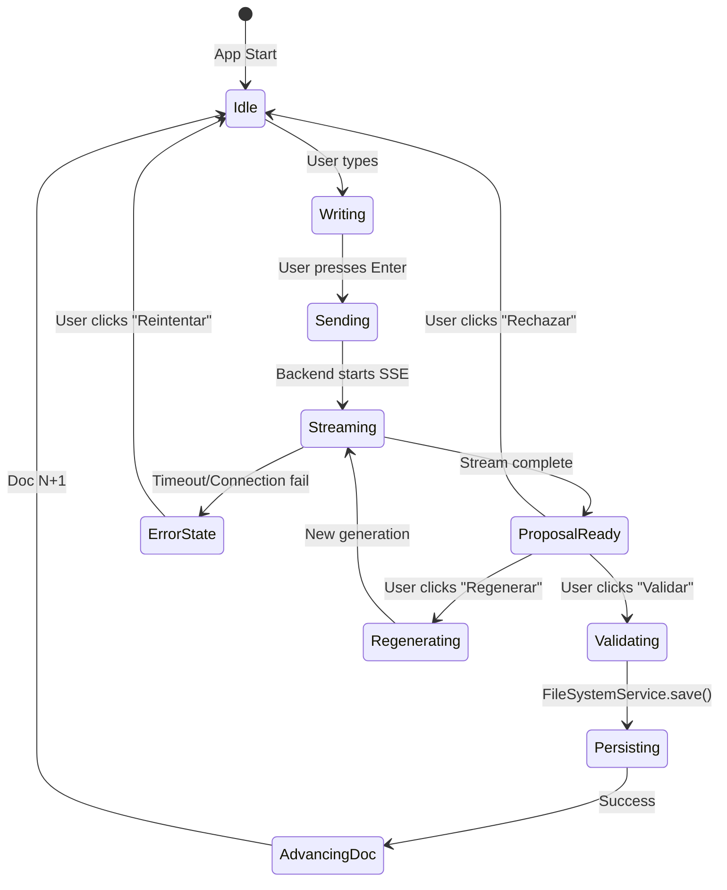

# 🚀 HU-3.3: Master Implementation Workflow
## Sequential Chat & Document Generation Engine

> **Historia de Usuario:** Como Usuario, quiero un chat que me guíe secuencialmente para generar documentos (Doc 1→25) usando templates RAG e iteración conversacional.
>
> **Rama:** `feature/chat-sequential-docs`
> **Estimación:** XXL (21 puntos)
> **Prioridad:** CRITICAL
> **Estado:** 🟡 READY FOR IMPLEMENTATION

---

## 📖 Tabla de Contenidos

1. [Metadata y Contexto](#metadata-y-contexto)
2. [Análisis de Dependencias](#análisis-de-dependencias)
3. [Estrategia de Arquitectura](#estrategia-de-arquitectura)
4. [Fase 1: Backend RAG Orchestration (TDD RED)](#fase-1-backend-rag-orchestration-tdd-red)
5. [Fase 2: Backend SSE Streaming (TDD GREEN)](#fase-2-backend-sse-streaming-tdd-green)
6. [Fase 3: Frontend State Machine (TDD RED)](#fase-3-frontend-state-machine-tdd-red)
7. [Fase 4: UI Components Golden Kit (TDD GREEN)](#fase-4-ui-components-golden-kit-tdd-green)
8. [Fase 5: Integration The Gate (TDD RED)](#fase-5-integration-the-gate-tdd-red)
9. [Fase 6: End-to-End Validation (TDD GREEN)](#fase-6-end-to-end-validation-tdd-green)
10. [Checklist de Validación](#checklist-de-validación)
11. [Referencias y Comandos](#referencias-y-comandos)

---

## 1. Metadata y Contexto

### 1.1 Información de la Historia

```yaml
HU_ID: HU-3.3
Name: "Chat Secuencial con Generación de Documentos Guiada por RAG"
Epic: E4 - Generación Secuencial de Documentos y RAG Guiado
Sprint: S3 - Generación Secuencial de Documentos Guiada por Proyecto
Branch: feature/chat-sequential-docs
Complexity: XXL (21 Story Points)
Priority: CRITICAL
Estimated Duration: 3-4 days
```

### 1.2 Objetivos Clave

1. **Orquestación Secuencial:** Máquina de estados que avanza Doc 1→25
2. **RAG Integration:** Templates inteligentes con contexto del knowledge base
3. **Streaming Real-Time:** SSE con latencia <200ms (Time To First Token)
4. **Validación Controlada:** Documentos NO persisten hasta que usuario confirma
5. **UX Golden Kit:** Interfaz de alta fidelidad con feedback inmediato

### 1.3 Criterios de Aceptación (del Roadmap)

#### ✅ Criterios Positivos

- [ ] Chat inicial pregunta descripción del proyecto y genera 'Propuesta Doc 1'
- [ ] Propuesta es JSON/Markdown temporal (NO persiste hasta 'Validar')
- [ ] Control UX: Botón enviar (➤) deshabilitado si campo vacío o solo espacios
- [ ] Herramientas Código: Bloques código con botón 'Copiar' en cabecera → portapapeles
- [ ] Botón 'Validar y Guardar' llama a FileSystemService (HU-3.2) para persistencia en disco
- [ ] Streaming token-a-token usando SSE (<200ms TTF - Time To First Token)
- [ ] Barra de progreso: Doc N/25 actualiza tras validar
- [ ] Flujo 100% secuencial (nunca 2 docs en paralelo)

#### ❌ Criterios Negativos

- [ ] Documentos NO se guardan si usuario no hace clic 'Validar'

---

## 2. Análisis de Dependencias

### 2.1 Dependencias BLOQUEANTES (MUST)

| HU | Estado | Componente Necesario | Impacto |
|----|--------|---------------------|---------|
| **HU-3.1** | ✅ DONE | ProjectShell + SQLite | Estado del proyecto, progreso Doc N/25 |
| **HU-3.2** | ✅ DONE | FileSystemService | Persistencia de documentos validados |
| **HU-2.2** | ✅ DONE | ChromaDB + RAG | Templates y contexto vectorizado |

### 2.2 Dependencias OPCIONALES (NICE-TO-HAVE)

| HU | Estado | Beneficio |
|----|--------|-----------|
| HU-3.4 | ⚠️ PENDING | Manejo robusto de errores con retry logic |
| HU-3.5 | ⚠️ PENDING | Optimización de streaming y cache |

### 2.3 Arquitectura de Referencias

```
context/30-ARCHITECTURE/
├── API_INTERFACE_CONTRACT.md       # Definición de endpoints /chat/*
├── PROJECT_STRUCTURE_MAP.md         # Ubicación de docs generados
├── ERROR_HANDLING_STANDARD.md       # Códigos de error RAG_001, etc.
└── PERFORMANCE_TARGETS.md           # Latencia <200ms TTF

packages/knowledge_base/
└── 03-TEMPLATES/                    # Templates RAG para cada doc
    ├── 01_PROJECT_MANIFESTO.md
    ├── 02_VISION_PROMISE.md
    └── ...
```

---

## 3. Estrategia de Arquitectura

### 3.1 Principios de Diseño

#### 🧠 Backend: Stateless Brain

- **Responsabilidad:** Recibe `(user_input, doc_type, context)` → Devuelve `Stream<tokens>`
- **NO conoce:** En qué paso (Doc N) está el proyecto
- **SÍ conoce:** Qué template usar según `doc_type` recibido

#### 🎭 Frontend: Stateful Orchestrator

- **Responsabilidad:** Gestiona la Máquina de Estados (Doc 1→25)
- **Conoce:** Progreso actual, historial de chat, estado de validación
- **Controla:** Cuándo llamar al Backend, cuándo persistir (via HU-3.2)

### 3.2 Flujo de Datos Completo

```
┌─────────────────────────────────────────────────────────────┐
│ USUARIO: "Genera el Project Manifesto"                      │
└─────────────────┬───────────────────────────────────────────┘
                  │
                  ▼
┌─────────────────────────────────────────────────────────────┐
│ FRONTEND (ChatNotifier)                                      │
│ ├─ State: currentDoc = 1, isStreaming = true                │
│ ├─ Acción: sendMessage(text, docType="PROJECT_MANIFESTO")   │
│ └─ HTTP POST → Backend /api/v1/chat/generate                │
└─────────────────┬───────────────────────────────────────────┘
                  │
                  ▼
┌─────────────────────────────────────────────────────────────┐
│ BACKEND (Python FastAPI)                                     │
│ ├─ SequentialOrchestrator.generate(docType, userInput)      │
│ ├─ RAG Query: ChromaDB → Template + Contexto                │
│ ├─ LLM Call: Ollama/Groq → Stream<tokens>                   │
│ └─ SSE Response: text/event-stream                           │
└─────────────────┬───────────────────────────────────────────┘
                  │
                  ▼
┌─────────────────────────────────────────────────────────────┐
│ FRONTEND (SSEClient)                                         │
│ ├─ Recibe tokens en tiempo real                             │
│ ├─ Actualiza UI (StreamingTextWidget)                       │
│ └─ Muestra ProposalCard con botones [Validar][Regenerar]    │
└─────────────────┬───────────────────────────────────────────┘
                  │
                  ▼ (Usuario hace clic "Validar")
┌─────────────────────────────────────────────────────────────┐
│ FRONTEND → FileSystemService (HU-3.2)                        │
│ ├─ saveDocument(projectPath, "10-CONTEXT/MANIFESTO.md")     │
│ ├─ SQLite Update: progress = 2/25                           │
│ └─ UI: Toast "✅ Documento guardado" + Avanza al Doc 2      │
└─────────────────────────────────────────────────────────────┘
```

### 3.3 Arquitectura de Componentes

#### Backend Structure

```
src/server/
├── app/
│   ├── api/v1/
│   │   └── chat.py                          # ⭐ NEW: /chat/generate endpoint
│   ├── core/
│   │   ├── streaming.py                     # ⭐ NEW: SSE utilities
│   │   └── exceptions.py                    # RAG_001, STREAM_001
│   └── services/
│       └── rag/
│           ├── sequential_orchestrator.py   # ⭐ NEW: Lógica de orquestación
│           ├── template_loader.py           # ⭐ NEW: Carga templates RAG
│           └── prompt_builder.py            # ⭐ NEW: Construye prompts dinámicos
└── tests/
    └── unit/
        └── services/rag/
            ├── test_orchestrator.py         # ⭐ TDD RED
            ├── test_template_loader.py      # ⭐ TDD RED
            └── test_streaming.py            # ⭐ TDD RED
```

#### Frontend Structure

```
src/client/
├── lib/
│   ├── features/chat/
│   │   ├── domain/
│   │   │   ├── entities/
│   │   │   │   ├── chat_message.dart        # ⭐ NEW: Modelo de mensaje
│   │   │   │   └── document_proposal.dart   # ⭐ NEW: Propuesta de doc
│   │   │   └── repositories/
│   │   │       └── chat_repository.dart     # ⭐ NEW: Interface
│   │   ├── data/
│   │   │   ├── repositories/
│   │   │   │   └── chat_repository_impl.dart # ⭐ NEW: SSE Client
│   │   │   └── models/
│   │   │       └── chat_message_model.dart  # ⭐ NEW: DTOs
│   │   └── presentation/
│   │       ├── notifiers/
│   │       │   ├── chat_notifier.dart       # ⭐ NEW: State Machine
│   │       │   └── streaming_state.dart     # ⭐ NEW: Stream states
│   │       ├── screens/
│   │       │   └── sequential_chat_screen.dart # ⭐ NEW: Pantalla principal
│   │       └── widgets/
│   │           ├── proposal_card_widget.dart    # ⭐ NEW: Golden Kit
│   │           ├── user_message_bubble.dart     # ⭐ NEW: Mensaje usuario
│   │           ├── ai_message_bubble.dart       # ⭐ NEW: Mensaje IA
│   │           ├── streaming_indicator.dart     # ⭐ NEW: Animación typing
│   │           ├── code_block_header.dart       # ⭐ NEW: Copiar código
│   │           └── progress_bar_widget.dart     # ⭐ NEW: Doc N/25
│   └── core/
│       └── network/
│           ├── sse_client.dart              # ⭐ NEW: SSE HTTP Client
│           └── stream_decoder.dart          # ⭐ NEW: Parsing SSE
└── tests/
    ├── test/
    │   ├── unit/
    │   │   └── features/chat/
    │   │       ├── domain/
    │   │       │   └── entities/
    │   │       │       └── chat_message_test.dart # ⭐ TDD RED
    │   │       └── data/
    │   │           └── repositories/
    │   │               └── chat_repository_impl_test.dart # ⭐ TDD RED
    │   ├── widget/
    │   │   └── features/chat/
    │   │       └── presentation/
    │   │           └── widgets/
    │   │               ├── proposal_card_test.dart    # ⭐ TDD RED
    │   │               └── streaming_indicator_test.dart # ⭐ TDD RED
    │   └── integration/
    │       └── features/chat/
    │           └── chat_flow_test.dart      # ⭐ TDD RED (E2E)
```

---

## 4. FASE 1: Backend RAG Orchestration (TDD RED)

**Objetivo:** Crear el cerebro que genera contenido inteligente usando RAG.

### 4.1 Actualizar Contrato de API

**Archivo:** `context/30-ARCHITECTURE/API_INTERFACE_CONTRACT.md`

```markdown
### POST /api/v1/chat/generate

**Descripción:** Genera contenido de documento usando RAG + LLM con streaming SSE.

**Request:**
```json
{
  "message": "Genera el Project Manifesto para un sistema de gestión de inventarios",
  "doc_type": "PROJECT_MANIFESTO",
  "project_context": {
    "name": "InventoryPro",
    "description": "Sistema de gestión de inventarios para retail",
    "tech_stack": ["Flutter", "Python", "PostgreSQL"]
  },
  "chat_history": [
    {"role": "user", "content": "..."},
    {"role": "assistant", "content": "..."}
  ]
}
```

**Response:** `text/event-stream` (SSE)

```
event: token
data: {"token": "# ", "index": 0}

event: token
data: {"token": "Project", "index": 1}

event: done
data: {"total_tokens": 450, "duration_ms": 3200}
```

**Errores:**
- `RAG_001`: ChromaDB no disponible
- `LLM_001`: Timeout de Ollama (>30s)
- `STREAM_001`: Error en conexión SSE
```

### 4.2 Tests Backend (TDD RED Phase)

#### Test 1: Orchestrator Basic Flow

**Archivo:** `src/server/tests/unit/services/rag/test_orchestrator.py`

```python
import pytest
from unittest.mock import Mock, patch, AsyncMock
from app.services.rag.sequential_orchestrator import SequentialOrchestrator
from app.core.exceptions import RAGException


@pytest.fixture
def orchestrator():
    """Fixture for SequentialOrchestrator."""
    return SequentialOrchestrator(
        vector_store=Mock(),
        llm_client=Mock(),
        template_loader=Mock()
    )


class TestSequentialOrchestrator:
    """Test suite for SequentialOrchestrator."""

    @pytest.mark.asyncio
    async def test_generate_document_returns_async_generator(self, orchestrator):
        """Test that generate returns an async generator."""
        # Arrange
        mock_template = Mock(content="Template: {user_input}")
        orchestrator.template_loader.load.return_value = mock_template
        orchestrator.llm_client.stream_generate = AsyncMock(
            return_value=self._mock_async_generator(["token1", "token2"])
        )

        # Act
        result = orchestrator.generate(
            doc_type="PROJECT_MANIFESTO",
            user_input="Test project",
            context={}
        )

        # Assert
        assert hasattr(result, '__aiter__'), "Should return async generator"
        tokens = [token async for token in result]
        assert len(tokens) == 2
        assert tokens[0] == "token1"

    @pytest.mark.asyncio
    async def test_generate_retrieves_rag_context_from_vector_store(self, orchestrator):
        """Test RAG context retrieval."""
        # Arrange
        orchestrator.vector_store.query.return_value = {
            "documents": [["Doc about Flutter best practices"]],
            "metadatas": [[{"source": "tech_pack_flutter.md"}]]
        }
        orchestrator.template_loader.load.return_value = Mock(content="Template")
        orchestrator.llm_client.stream_generate = AsyncMock(
            return_value=self._mock_async_generator(["test"])
        )

        # Act
        async for _ in orchestrator.generate(
            doc_type="PROJECT_MANIFESTO",
            user_input="Flutter app",
            context={}
        ):
            pass

        # Assert
        orchestrator.vector_store.query.assert_called_once()
        assert "Flutter" in orchestrator.vector_store.query.call_args[0][0]

    @pytest.mark.asyncio
    async def test_generate_raises_exception_if_chromadb_unavailable(self, orchestrator):
        """Test error handling when ChromaDB is down."""
        # Arrange
        orchestrator.vector_store.query.side_effect = ConnectionError("ChromaDB unreachable")

        # Act & Assert
        with pytest.raises(RAGException) as exc_info:
            async for _ in orchestrator.generate(
                doc_type="PROJECT_MANIFESTO",
                user_input="Test",
                context={}
            ):
                pass

        assert exc_info.value.code == "RAG_001"
        assert "ChromaDB" in str(exc_info.value)

    @pytest.mark.asyncio
    async def test_generate_handles_llm_timeout_gracefully(self, orchestrator):
        """Test timeout handling for LLM calls."""
        # Arrange
        orchestrator.template_loader.load.return_value = Mock(content="Template")
        orchestrator.vector_store.query.return_value = {"documents": [[]], "metadatas": [[]]}
        orchestrator.llm_client.stream_generate = AsyncMock(side_effect=TimeoutError())

        # Act & Assert
        with pytest.raises(RAGException) as exc_info:
            async for _ in orchestrator.generate(
                doc_type="PROJECT_MANIFESTO",
                user_input="Test",
                context={}
            ):
                pass

        assert exc_info.value.code == "LLM_001"

    @staticmethod
    async def _mock_async_generator(items):
        """Helper to create async generator."""
        for item in items:
            yield item
```

#### Test 2: Template Loader

**Archivo:** `src/server/tests/unit/services/rag/test_template_loader.py`

```python
import pytest
from pathlib import Path
from app.services.rag.template_loader import TemplateLoader, Template
from app.core.exceptions import TemplateNotFoundException


class TestTemplateLoader:
    """Test suite for TemplateLoader."""

    @pytest.fixture
    def template_loader(self, tmp_path):
        """Fixture with temporary templates directory."""
        templates_dir = tmp_path / "templates"
        templates_dir.mkdir()

        # Create mock template
        (templates_dir / "PROJECT_MANIFESTO.md").write_text(
            "# Project: {project_name}\n{user_input}"
        )

        return TemplateLoader(templates_path=templates_dir)

    def test_load_existing_template_returns_template_object(self, template_loader):
        """Test loading existing template."""
        # Act
        template = template_loader.load("PROJECT_MANIFESTO")

        # Assert
        assert isinstance(template, Template)
        assert "Project:" in template.content
        assert "{project_name}" in template.content

    def test_load_nonexistent_template_raises_exception(self, template_loader):
        """Test error handling for missing templates."""
        # Act & Assert
        with pytest.raises(TemplateNotFoundException) as exc_info:
            template_loader.load("NONEXISTENT_DOC")

        assert "NONEXISTENT_DOC" in str(exc_info.value)

    def test_template_render_replaces_placeholders(self, template_loader):
        """Test template variable replacement."""
        # Arrange
        template = template_loader.load("PROJECT_MANIFESTO")

        # Act
        rendered = template.render(
            project_name="TestProject",
            user_input="This is a test app"
        )

        # Assert
        assert "TestProject" in rendered
        assert "This is a test app" in rendered
        assert "{project_name}" not in rendered

    def test_template_list_variables_returns_all_placeholders(self, template_loader):
        """Test extraction of template variables."""
        # Arrange
        template = template_loader.load("PROJECT_MANIFESTO")

        # Act
        variables = template.list_variables()

        # Assert
        assert "project_name" in variables
        assert "user_input" in variables
        assert len(variables) == 2
```

#### Test 3: SSE Streaming

**Archivo:** `src/server/tests/unit/api/v1/test_chat_endpoints.py`

```python
import pytest
from fastapi.testclient import TestClient
from unittest.mock import AsyncMock, patch
from app.main import app


@pytest.fixture
def client():
    """Test client for API."""
    return TestClient(app)


class TestChatEndpoints:
    """Test suite for /api/v1/chat endpoints."""

    def test_generate_endpoint_returns_sse_content_type(self, client):
        """Test that endpoint returns SSE headers."""
        # Arrange
        with patch('app.api.v1.chat.orchestrator') as mock_orch:
            mock_orch.generate = AsyncMock(
                return_value=self._mock_async_gen(["test"])
            )

            # Act
            response = client.post(
                "/api/v1/chat/generate",
                json={
                    "message": "Test",
                    "doc_type": "PROJECT_MANIFESTO",
                    "project_context": {},
                    "chat_history": []
                },
                headers={"Accept": "text/event-stream"}
            )

            # Assert
            assert response.status_code == 200
            assert "text/event-stream" in response.headers.get("content-type", "")

    def test_generate_endpoint_streams_tokens(self, client):
        """Test token streaming functionality."""
        # Arrange
        with patch('app.api.v1.chat.orchestrator') as mock_orch:
            mock_orch.generate = AsyncMock(
                return_value=self._mock_async_gen(["Hello", " ", "World"])
            )

            # Act
            response = client.post(
                "/api/v1/chat/generate",
                json={
                    "message": "Test",
                    "doc_type": "PROJECT_MANIFESTO",
                    "project_context": {},
                    "chat_history": []
                },
                headers={"Accept": "text/event-stream"}
            )

            # Assert
            content = response.text
            assert "event: token" in content
            assert "Hello" in content
            assert "World" in content

    def test_generate_endpoint_validates_required_fields(self, client):
        """Test request validation."""
        # Act
        response = client.post(
            "/api/v1/chat/generate",
            json={"message": "Test"}  # Missing doc_type
        )

        # Assert
        assert response.status_code == 422  # Validation error

    @staticmethod
    async def _mock_async_gen(items):
        """Helper for async generator."""
        for item in items:
            yield item
```

### 4.3 Implementación Backend (GREEN Phase - Placeholder)

**Archivo:** `src/server/app/services/rag/sequential_orchestrator.py`

```python
"""
Sequential document generation orchestrator using RAG + LLM.
"""
from typing import AsyncGenerator, Dict, Any
from app.services.rag.vector_store import VectorStoreService
from app.services.rag.template_loader import TemplateLoader
from app.core.exceptions import RAGException, LLMException


class SequentialOrchestrator:
    """Orchestrates RAG-guided document generation."""

    def __init__(
        self,
        vector_store: VectorStoreService,
        llm_client: Any,  # LangChain or Ollama client
        template_loader: TemplateLoader
    ):
        self.vector_store = vector_store
        self.llm_client = llm_client
        self.template_loader = template_loader

    async def generate(
        self,
        doc_type: str,
        user_input: str,
        context: Dict[str, Any]
    ) -> AsyncGenerator[str, None]:
        """
        Generate document content as streaming tokens.

        Args:
            doc_type: Type of document (e.g., "PROJECT_MANIFESTO")
            user_input: User's description/requirements
            context: Additional project context

        Yields:
            Token strings for SSE streaming

        Raises:
            RAGException: If vector store fails
            LLMException: If LLM generation fails
        """
        try:
            # 1. Load template
            template = self.template_loader.load(doc_type)

            # 2. RAG: Query vector store for relevant context
            rag_context = await self._retrieve_context(user_input, doc_type)

            # 3. Build final prompt
            prompt = self._build_prompt(template, user_input, rag_context, context)

            # 4. Stream LLM generation
            async for token in self.llm_client.stream_generate(prompt):
                yield token

        except ConnectionError as e:
            raise RAGException(
                code="RAG_001",
                message=f"ChromaDB unavailable: {str(e)}"
            ) from e
        except TimeoutError as e:
            raise LLMException(
                code="LLM_001",
                message=f"LLM timeout: {str(e)}"
            ) from e

    async def _retrieve_context(self, query: str, doc_type: str) -> Dict[str, Any]:
        """Query vector store for relevant context."""
        # Implementation TBD
        raise NotImplementedError("TDD RED: Test first!")

    def _build_prompt(
        self,
        template: Any,
        user_input: str,
        rag_context: Dict[str, Any],
        context: Dict[str, Any]
    ) -> str:
        """Build final prompt from template + context."""
        # Implementation TBD
        raise NotImplementedError("TDD RED: Test first!")
```

**🔴 CHECKPOINT:** Todos los tests deben FALLAR en este punto. Ejecutar:

```bash
cd src/server && pytest tests/unit/services/rag/ -v
# Expected: FAILED (implementations pending)
```

---

## 5. FASE 2: Backend SSE Streaming (TDD GREEN)

**Objetivo:** Implementar el endpoint FastAPI con streaming SSE funcional.

### 5.1 Implementar Endpoint SSE

**Archivo:** `src/server/app/api/v1/chat.py`

```python
"""
Chat API endpoints for document generation.
"""
from fastapi import APIRouter, HTTPException
from fastapi.responses import StreamingResponse
from pydantic import BaseModel
from typing import List, Dict, Any
import json
from app.services.rag.sequential_orchestrator import SequentialOrchestrator
from app.core.exceptions import RAGException, LLMException


router = APIRouter(prefix="/chat", tags=["chat"])


class ChatMessage(BaseModel):
    """Chat message model."""
    role: str  # "user" or "assistant"
    content: str


class GenerateRequest(BaseModel):
    """Request model for document generation."""
    message: str
    doc_type: str
    project_context: Dict[str, Any]
    chat_history: List[ChatMessage] = []


@router.post("/generate")
async def generate_document(request: GenerateRequest):
    """
    Generate document content with SSE streaming.

    Returns:
        StreamingResponse with text/event-stream content type
    """
    try:
        # Get orchestrator instance (dependency injection)
        orchestrator = get_orchestrator()  # TODO: Implement DI

        async def event_generator():
            """SSE event generator."""
            try:
                token_index = 0
                async for token in orchestrator.generate(
                    doc_type=request.doc_type,
                    user_input=request.message,
                    context=request.project_context
                ):
                    # Send token event
                    event_data = json.dumps({
                        "token": token,
                        "index": token_index
                    })
                    yield f"event: token\ndata: {event_data}\n\n"
                    token_index += 1

                # Send completion event
                done_data = json.dumps({
                    "total_tokens": token_index,
                    "status": "completed"
                })
                yield f"event: done\ndata: {done_data}\n\n"

            except RAGException as e:
                error_data = json.dumps({
                    "code": e.code,
                    "message": e.message
                })
                yield f"event: error\ndata: {error_data}\n\n"
            except LLMException as e:
                error_data = json.dumps({
                    "code": e.code,
                    "message": e.message
                })
                yield f"event: error\ndata: {error_data}\n\n"

        return StreamingResponse(
            event_generator(),
            media_type="text/event-stream",
            headers={
                "Cache-Control": "no-cache",
                "Connection": "keep-alive",
                "X-Accel-Buffering": "no"  # Disable nginx buffering
            }
        )

    except Exception as e:
        raise HTTPException(status_code=500, detail=str(e))


def get_orchestrator() -> SequentialOrchestrator:
    """Dependency injection for orchestrator."""
    # TODO: Implement proper DI with FastAPI Depends
    raise NotImplementedError("DI setup pending")
```

### 5.2 Completar Implementación Orchestrator

**Archivo:** `src/server/app/services/rag/sequential_orchestrator.py`

Completar los métodos `_retrieve_context` y `_build_prompt`:

```python
async def _retrieve_context(self, query: str, doc_type: str) -> Dict[str, Any]:
    """Query vector store for relevant context."""
    try:
        # Query ChromaDB
        results = self.vector_store.query(
            query_texts=[query],
            n_results=5,
            where={"doc_type": doc_type}  # Filter by document type
        )

        # Format results
        documents = results.get("documents", [[]])[0]
        metadatas = results.get("metadatas", [[]])[0]

        return {
            "relevant_docs": documents,
            "sources": [meta.get("source", "unknown") for meta in metadatas]
        }
    except Exception as e:
        # Fallback: Return empty context
        return {"relevant_docs": [], "sources": []}


def _build_prompt(
    self,
    template: Any,
    user_input: str,
    rag_context: Dict[str, Any],
    context: Dict[str, Any]
) -> str:
    """Build final prompt from template + context."""
    # Extract RAG documents
    rag_docs = "\n".join(rag_context.get("relevant_docs", []))

    # Render template
    prompt = template.render(
        user_input=user_input,
        rag_context=rag_docs,
        project_name=context.get("name", "Unknown"),
        tech_stack=", ".join(context.get("tech_stack", []))
    )

    return prompt
```

**🟢 CHECKPOINT:** Ejecutar tests backend:

```bash
cd src/server && pytest tests/unit/ -v --cov=app
# Expected: PASSED (implementations complete)
```

---

## 6. FASE 3: Frontend State Machine (TDD RED)

**Objetivo:** Crear la máquina de estados que orquesta el flujo secuencial.

### 6.1 Tests Domain Layer (TDD RED)

#### Test 1: ChatMessage Entity

**Archivo:** `tests/test/unit/features/chat/domain/entities/chat_message_test.dart`

```dart
import 'package:flutter_test/flutter_test.dart';
import 'package:softarchitect_ai/features/chat/domain/entities/chat_message.dart';

void main() {
  group('ChatMessage Entity', () {
    test('should create user message with correct properties', () {
      // Arrange
      const message = ChatMessage(
        id: '1',
        role: MessageRole.user,
        content: 'Hello AI',
        timestamp: '2026-02-05T10:00:00Z',
      );

      // Assert
      expect(message.id, '1');
      expect(message.role, MessageRole.user);
      expect(message.content, 'Hello AI');
      expect(message.isUser, true);
      expect(message.isAssistant, false);
    });

    test('should create assistant message with streaming state', () {
      // Arrange
      const message = ChatMessage(
        id: '2',
        role: MessageRole.assistant,
        content: 'Partial response...',
        timestamp: '2026-02-05T10:00:05Z',
        isStreaming: true,
      );

      // Assert
      expect(message.role, MessageRole.assistant);
      expect(message.isStreaming, true);
      expect(message.isComplete, false);
    });

    test('should support equality comparison', () {
      // Arrange
      const message1 = ChatMessage(
        id: '1',
        role: MessageRole.user,
        content: 'Test',
        timestamp: '2026-02-05T10:00:00Z',
      );
      const message2 = ChatMessage(
        id: '1',
        role: MessageRole.user,
        content: 'Test',
        timestamp: '2026-02-05T10:00:00Z',
      );

      // Assert
      expect(message1, equals(message2));
      expect(message1.hashCode, equals(message2.hashCode));
    });

    test('should create copyWith new content for streaming', () {
      // Arrange
      const original = ChatMessage(
        id: '1',
        role: MessageRole.assistant,
        content: 'Hello',
        timestamp: '2026-02-05T10:00:00Z',
        isStreaming: true,
      );

      // Act
      final updated = original.copyWith(content: 'Hello World');

      // Assert
      expect(updated.content, 'Hello World');
      expect(updated.id, original.id);
      expect(updated.isStreaming, original.isStreaming);
    });
  });
}
```

#### Test 2: DocumentProposal Entity

**Archivo:** `tests/test/unit/features/chat/domain/entities/document_proposal_test.dart`

```dart
import 'package:flutter_test/flutter_test.dart';
import 'package:softarchitect_ai/features/chat/domain/entities/document_proposal.dart';

void main() {
  group('DocumentProposal Entity', () {
    test('should create proposal with validation state', () {
      // Arrange
      const proposal = DocumentProposal(
        id: 'prop-1',
        docType: 'PROJECT_MANIFESTO',
        content: '# Project Title\n\nDescription...',
        metadata: {
          'estimated_pages': 5,
          'sections': ['Vision', 'Goals', 'Scope']
        },
        validationState: ValidationState.pending,
      );

      // Assert
      expect(proposal.id, 'prop-1');
      expect(proposal.docType, 'PROJECT_MANIFESTO');
      expect(proposal.isPending, true);
      expect(proposal.isValidated, false);
    });

    test('should transition to validated state', () {
      // Arrange
      const proposal = DocumentProposal(
        id: 'prop-1',
        docType: 'PROJECT_MANIFESTO',
        content: 'Content...',
        validationState: ValidationState.pending,
      );

      // Act
      final validated = proposal.copyWith(
        validationState: ValidationState.validated,
      );

      // Assert
      expect(validated.isValidated, true);
      expect(validated.isPending, false);
    });

    test('should extract sections from markdown content', () {
      // Arrange
      const proposal = DocumentProposal(
        id: 'prop-1',
        docType: 'PROJECT_MANIFESTO',
        content: '''
# Project Title

## Vision
Vision content

## Goals
Goals content
''',
        validationState: ValidationState.pending,
      );

      // Act
      final sections = proposal.extractSections();

      // Assert
      expect(sections.length, greaterThanOrEqualTo(2));
      expect(sections, contains('Vision'));
      expect(sections, contains('Goals'));
    });
  });
}
```

#### Test 3: ChatNotifier State Machine

**Archivo:** `tests/test/unit/features/chat/presentation/notifiers/chat_notifier_test.dart`

```dart
import 'package:flutter_test/flutter_test.dart';
import 'package:flutter_riverpod/flutter_riverpod.dart';
import 'package:mockito/mockito.dart';
import 'package:mockito/annotations.dart';
import 'package:softarchitect_ai/features/chat/domain/repositories/chat_repository.dart';
import 'package:softarchitect_ai/features/chat/presentation/notifiers/chat_notifier.dart';

@GenerateMocks([ChatRepository])
import 'chat_notifier_test.mocks.dart';

void main() {
  late MockChatRepository mockRepository;
  late ProviderContainer container;

  setUp(() {
    mockRepository = MockChatRepository();
    container = ProviderContainer(
      overrides: [
        chatRepositoryProvider.overrideWithValue(mockRepository),
      ],
    );
  });

  tearDown(() {
    container.dispose();
  });

  group('ChatNotifier State Machine', () {
    test('should initialize with empty state', () {
      // Arrange
      final notifier = container.read(chatNotifierProvider.notifier);

      // Act
      final state = container.read(chatNotifierProvider);

      // Assert
      expect(state.messages, isEmpty);
      expect(state.currentDocIndex, 1);
      expect(state.totalDocs, 25);
      expect(state.isStreaming, false);
    });

    test('should add user message and start streaming', () async {
      // Arrange
      final notifier = container.read(chatNotifierProvider.notifier);
      when(mockRepository.generateDocument(any, any, any))
          .thenAnswer((_) => Stream.value('Test token'));

      // Act
      await notifier.sendMessage('Generate Project Manifesto');

      // Assert
      final state = container.read(chatNotifierProvider);
      expect(state.messages.length, 2); // User + Assistant
      expect(state.messages.first.role, MessageRole.user);
      expect(state.messages.last.role, MessageRole.assistant);
    });

    test('should stream tokens and update assistant message', () async {
      // Arrange
      final notifier = container.read(chatNotifierProvider.notifier);
      when(mockRepository.generateDocument(any, any, any))
          .thenAnswer((_) => Stream.fromIterable(['Hello', ' ', 'World']));

      // Act
      await notifier.sendMessage('Test');
      await Future.delayed(Duration(milliseconds: 100)); // Wait for stream

      // Assert
      final state = container.read(chatNotifierProvider);
      final assistantMessage = state.messages.last;
      expect(assistantMessage.content, contains('Hello'));
      expect(assistantMessage.content, contains('World'));
    });

    test('should transition to proposal state after streaming complete', () async {
      // Arrange
      final notifier = container.read(chatNotifierProvider.notifier);
      when(mockRepository.generateDocument(any, any, any))
          .thenAnswer((_) => Stream.value('Complete document'));

      // Act
      await notifier.sendMessage('Generate doc');
      await Future.delayed(Duration(milliseconds: 100));

      // Assert
      final state = container.read(chatNotifierProvider);
      expect(state.currentProposal, isNotNull);
      expect(state.currentProposal!.validationState, ValidationState.pending);
    });

    test('should handle stream errors gracefully', () async {
      // Arrange
      final notifier = container.read(chatNotifierProvider.notifier);
      when(mockRepository.generateDocument(any, any, any))
          .thenAnswer((_) => Stream.error(Exception('Connection failed')));

      // Act
      await notifier.sendMessage('Test');
      await Future.delayed(Duration(milliseconds: 100));

      // Assert
      final state = container.read(chatNotifierProvider);
      expect(state.hasError, true);
      expect(state.errorMessage, contains('Connection failed'));
    });

    test('should advance document index after validation', () async {
      // Arrange
      final notifier = container.read(chatNotifierProvider.notifier);
      final initialState = container.read(chatNotifierProvider);

      // Act
      await notifier.validateProposal();

      // Assert
      final newState = container.read(chatNotifierProvider);
      expect(newState.currentDocIndex, initialState.currentDocIndex + 1);
      expect(newState.currentProposal, isNull);
    });
  });
}
```

### 6.2 Implementación Domain Layer (GREEN Phase - Placeholder)

**Archivo:** `src/client/lib/features/chat/domain/entities/chat_message.dart`

```dart
/// Represents a single message in the chat.
class ChatMessage {
  final String id;
  final MessageRole role;
  final String content;
  final String timestamp;
  final bool isStreaming;
  final Map<String, dynamic>? metadata;

  const ChatMessage({
    required this.id,
    required this.role,
    required this.content,
    required this.timestamp,
    this.isStreaming = false,
    this.metadata,
  });

  bool get isUser => role == MessageRole.user;
  bool get isAssistant => role == MessageRole.assistant;
  bool get isComplete => !isStreaming;

  ChatMessage copyWith({
    String? id,
    MessageRole? role,
    String? content,
    String? timestamp,
    bool? isStreaming,
    Map<String, dynamic>? metadata,
  }) {
    return ChatMessage(
      id: id ?? this.id,
      role: role ?? this.role,
      content: content ?? this.content,
      timestamp: timestamp ?? this.timestamp,
      isStreaming: isStreaming ?? this.isStreaming,
      metadata: metadata ?? this.metadata,
    );
  }

  @override
  bool operator ==(Object other) =>
      identical(this, other) ||
      other is ChatMessage &&
          runtimeType == other.runtimeType &&
          id == other.id &&
          role == other.role &&
          content == other.content;

  @override
  int get hashCode => id.hashCode ^ role.hashCode ^ content.hashCode;
}

enum MessageRole { user, assistant, system }
```

**Archivo:** `src/client/lib/features/chat/domain/entities/document_proposal.dart`

```dart
/// Represents a generated document proposal awaiting validation.
class DocumentProposal {
  final String id;
  final String docType;
  final String content;
  final Map<String, dynamic> metadata;
  final ValidationState validationState;
  final DateTime createdAt;

  const DocumentProposal({
    required this.id,
    required this.docType,
    required this.content,
    required this.metadata,
    required this.validationState,
    DateTime? createdAt,
  }) : createdAt = createdAt ?? DateTime.now();

  bool get isPending => validationState == ValidationState.pending;
  bool get isValidated => validationState == ValidationState.validated;
  bool get isRejected => validationState == ValidationState.rejected;

  List<String> extractSections() {
    // Simple regex to extract ## headers
    final regex = RegExp(r'^##\s+(.+)$', multiLine: true);
    final matches = regex.allMatches(content);
    return matches.map((m) => m.group(1)!.trim()).toList();
  }

  DocumentProposal copyWith({
    String? id,
    String? docType,
    String? content,
    Map<String, dynamic>? metadata,
    ValidationState? validationState,
    DateTime? createdAt,
  }) {
    return DocumentProposal(
      id: id ?? this.id,
      docType: docType ?? this.docType,
      content: content ?? this.content,
      metadata: metadata ?? this.metadata,
      validationState: validationState ?? this.validationState,
      createdAt: createdAt ?? this.createdAt,
    );
  }
}

enum ValidationState { pending, validated, rejected }
```

**🔴 CHECKPOINT:** Tests deben fallar (state management no implementado):

```bash
cd tests && flutter test test/unit/features/chat/ --coverage
# Expected: FAILED (notifier implementation pending)
```

---

## 7. FASE 4: UI Components Golden Kit (TDD GREEN)

**Objetivo:** Crear widgets de alta fidelidad basados en el diseño aprobado.

### 7.1 Widget Tests (TDD RED)

#### Test 1: ProposalCardWidget

**Archivo:** `tests/test/widget/features/chat/presentation/widgets/proposal_card_test.dart`

```dart
import 'package:flutter/material.dart';
import 'package:flutter_test/flutter_test.dart';
import 'package:flutter_markdown_plus/flutter_markdown_plus.dart';
import 'package:softarchitect_ai/features/chat/domain/entities/document_proposal.dart';
import 'package:softarchitect_ai/features/chat/presentation/widgets/proposal_card_widget.dart';

void main() {
  group('ProposalCardWidget', () {
    testWidgets('should render markdown content', (WidgetTester tester) async {
      // Arrange
      const proposal = DocumentProposal(
        id: '1',
        docType: 'PROJECT_MANIFESTO',
        content: '# Title\n\nTest content',
        metadata: {},
        validationState: ValidationState.pending,
      );

      // Act
      await tester.pumpWidget(
        MaterialApp(
          home: Scaffold(
            body: ProposalCardWidget(
              proposal: proposal,
              onValidate: () {},
              onRegenerate: () {},
              onReject: () {},
            ),
          ),
        ),
      );

      // Assert
      expect(find.byType(MarkdownWidget), findsOneWidget);
      expect(find.text('Title'), findsOneWidget);
    });

    testWidgets('should show action buttons', (WidgetTester tester) async {
      // Arrange
      const proposal = DocumentProposal(
        id: '1',
        docType: 'PROJECT_MANIFESTO',
        content: 'Content',
        metadata: {},
        validationState: ValidationState.pending,
      );

      // Act
      await tester.pumpWidget(
        MaterialApp(
          home: Scaffold(
            body: ProposalCardWidget(
              proposal: proposal,
              onValidate: () {},
              onRegenerate: () {},
              onReject: () {},
            ),
          ),
        ),
      );

      // Assert
      expect(find.text('Validar y Guardar'), findsOneWidget);
      expect(find.text('Regenerar'), findsOneWidget);
      expect(find.text('Rechazar'), findsOneWidget);
    });

    testWidgets('should call onValidate when button tapped', (WidgetTester tester) async {
      // Arrange
      bool validateCalled = false;
      const proposal = DocumentProposal(
        id: '1',
        docType: 'PROJECT_MANIFESTO',
        content: 'Content',
        metadata: {},
        validationState: ValidationState.pending,
      );

      // Act
      await tester.pumpWidget(
        MaterialApp(
          home: Scaffold(
            body: ProposalCardWidget(
              proposal: proposal,
              onValidate: () => validateCalled = true,
              onRegenerate: () {},
              onReject: () {},
            ),
          ),
        ),
      );
      await tester.tap(find.text('Validar y Guardar'));
      await tester.pumpAndSettle();

      // Assert
      expect(validateCalled, true);
    });

    testWidgets('should apply dark theme styling', (WidgetTester tester) async {
      // Arrange
      const proposal = DocumentProposal(
        id: '1',
        docType: 'PROJECT_MANIFESTO',
        content: 'Content',
        metadata: {},
        validationState: ValidationState.pending,
      );

      // Act
      await tester.pumpWidget(
        MaterialApp(
          theme: ThemeData.dark(),
          home: Scaffold(
            body: ProposalCardWidget(
              proposal: proposal,
              onValidate: () {},
              onRegenerate: () {},
              onReject: () {},
            ),
          ),
        ),
      );

      // Assert
      final containerFinder = find.byType(Container).first;
      final container = tester.widget<Container>(containerFinder);
      final decoration = container.decoration as BoxDecoration?;
      expect(decoration?.color, isNotNull);
      // Verify dark background color
    });
  });
}
```

### 7.2 Implementación Widgets (GREEN Phase)

**Archivo:** `src/client/lib/features/chat/presentation/widgets/proposal_card_widget.dart`

```dart
import 'package:flutter/material.dart';
import 'package:flutter_markdown_plus/flutter_markdown_plus.dart';
import '../../domain/entities/document_proposal.dart';

/// Widget that displays a generated document proposal with action buttons.
class ProposalCardWidget extends StatelessWidget {
  final DocumentProposal proposal;
  final VoidCallback onValidate;
  final VoidCallback onRegenerate;
  final VoidCallback onReject;

  const ProposalCardWidget({
    Key? key,
    required this.proposal,
    required this.onValidate,
    required this.onRegenerate,
    required this.onReject,
  }) : super(key: key);

  @override
  Widget build(BuildContext context) {
    return Container(
      margin: const EdgeInsets.all(16.0),
      padding: const EdgeInsets.all(20.0),
      decoration: BoxDecoration(
        color: const Color(0xFF1C1C1E), // Dark background
        borderRadius: BorderRadius.circular(12.0),
        border: Border.all(
          color: const Color(0xFF2C2C2E),
          width: 1.0,
        ),
        boxShadow: [
          BoxShadow(
            color: Colors.black.withOpacity(0.3),
            blurRadius: 8.0,
            offset: const Offset(0, 4),
          ),
        ],
      ),
      child: Column(
        crossAxisAlignment: CrossAxisAlignment.start,
        children: [
          // Header
          _buildHeader(context),
          const SizedBox(height: 16.0),

          // Markdown content
          Expanded(
            child: SingleChildScrollView(
              child: MarkdownWidget(
                data: proposal.content,
                config: MarkdownConfig(
                  configs: [
                    // Dark theme config
                    H1Config(
                      style: const TextStyle(
                        fontSize: 24,
                        fontWeight: FontWeight.bold,
                        color: Colors.white,
                      ),
                    ),
                    PConfig(
                      textStyle: const TextStyle(
                        fontSize: 16,
                        color: Color(0xFFE5E5E7),
                        height: 1.5,
                      ),
                    ),
                    CodeConfig(
                      style: const TextStyle(
                        backgroundColor: Color(0xFF2C2C2E),
                        color: Color(0xFF00D9FF),
                        fontFamily: 'monospace',
                      ),
                    ),
                  ],
                ),
              ),
            ),
          ),

          const SizedBox(height: 20.0),

          // Action buttons
          _buildActionButtons(context),
        ],
      ),
    );
  }

  Widget _buildHeader(BuildContext context) {
    return Row(
      children: [
        const Icon(
          Icons.description_outlined,
          color: Color(0xFF00D9FF),
          size: 24.0,
        ),
        const SizedBox(width: 12.0),
        Expanded(
          child: Column(
            crossAxisAlignment: CrossAxisAlignment.start,
            children: [
              Text(
                _formatDocType(proposal.docType),
                style: const TextStyle(
                  fontSize: 18,
                  fontWeight: FontWeight.bold,
                  color: Colors.white,
                ),
              ),
              Text(
                'Propuesta generada por IA',
                style: TextStyle(
                  fontSize: 14,
                  color: Colors.white.withOpacity(0.6),
                ),
              ),
            ],
          ),
        ),
      ],
    );
  }

  Widget _buildActionButtons(BuildContext context) {
    return Row(
      mainAxisAlignment: MainAxisAlignment.end,
      children: [
        // Reject button
        OutlinedButton.icon(
          onPressed: onReject,
          icon: const Icon(Icons.close, size: 18),
          label: const Text('Rechazar'),
          style: OutlinedButton.styleFrom(
            foregroundColor: Colors.red,
            side: const BorderSide(color: Colors.red),
          ),
        ),
        const SizedBox(width: 12.0),

        // Regenerate button
        OutlinedButton.icon(
          onPressed: onRegenerate,
          icon: const Icon(Icons.refresh, size: 18),
          label: const Text('Regenerar'),
          style: OutlinedButton.styleFrom(
            foregroundColor: Colors.white70,
            side: const BorderSide(color: Colors.white38),
          ),
        ),
        const SizedBox(width: 12.0),

        // Validate button
        ElevatedButton.icon(
          onPressed: onValidate,
          icon: const Icon(Icons.check_circle, size: 18),
          label: const Text('Validar y Guardar'),
          style: ElevatedButton.styleFrom(
            backgroundColor: const Color(0xFF00D9FF),
            foregroundColor: Colors.black,
            padding: const EdgeInsets.symmetric(
              horizontal: 20.0,
              vertical: 12.0,
            ),
          ),
        ),
      ],
    );
  }

  String _formatDocType(String docType) {
    return docType
        .replaceAll('_', ' ')
        .split(' ')
        .map((w) => w[0].toUpperCase() + w.substring(1).toLowerCase())
        .join(' ');
  }
}
```

**🟢 CHECKPOINT:** Widget tests deben pasar:

```bash
cd tests && flutter test test/widget/features/chat/presentation/widgets/ --coverage
# Expected: PASSED
```

---

## 8. FASE 5: Integration The Gate (TDD RED)

**Objetivo:** Conectar Frontend → Backend → FileSystem (HU-3.2).

### 8.1 Integration Test (TDD RED)

**Archivo:** `tests/test/integration/features/chat/chat_flow_test.dart`

```dart
import 'package:flutter/material.dart';
import 'package:flutter_test/flutter_test.dart';
import 'package:integration_test/integration_test.dart';
import 'package:mockito/mockito.dart';
import 'package:softarchitect_ai/main.dart' as app;

void main() {
  IntegrationTestWidgetsFlutterBinding.ensureInitialized();

  group('E2E Chat Sequential Flow', () {
    testWidgets('should complete full document generation cycle', (WidgetTester tester) async {
      // Arrange
      await app.main();
      await tester.pumpAndSettle();

      // Navigate to chat
      final chatButton = find.text('Nuevo Proyecto');
      await tester.tap(chatButton);
      await tester.pumpAndSettle();

      // Act: Send message
      final inputField = find.byType(TextField);
      await tester.enterText(inputField, 'Genera el Project Manifesto');
      await tester.testTextInput.receiveAction(TextInputAction.send);
      await tester.pumpAndSettle();

      // Wait for streaming to complete
      await tester.pump(const Duration(seconds: 5));

      // Assert: Proposal should be visible
      expect(find.byType(ProposalCardWidget), findsOneWidget);
      expect(find.text('Validar y Guardar'), findsOneWidget);

      // Act: Validate proposal
      await tester.tap(find.text('Validar y Guardar'));
      await tester.pumpAndSettle();

      // Assert: Success toast and progress update
      expect(find.text('✅ Documento guardado'), findsOneWidget);
      expect(find.text('Doc 2/25'), findsOneWidget);

      // Verify file exists (requires platform integration)
      // final file = File('path/to/project/10-CONTEXT/PROJECT_MANIFESTO.md');
      // expect(file.existsSync(), true);
    });

    testWidgets('should handle streaming errors gracefully', (WidgetTester tester) async {
      // Arrange: Stop backend server
      await app.main();
      await tester.pumpAndSettle();

      // Act: Send message
      final inputField = find.byType(TextField);
      await tester.enterText(inputField, 'Generate doc');
      await tester.testTextInput.receiveAction(TextInputAction.send);
      await tester.pumpAndSettle();

      // Wait for error
      await tester.pump(const Duration(seconds: 3));

      // Assert: Error message should be visible
      expect(find.textContaining('Error'), findsOneWidget);
      expect(find.text('Reintentar'), findsOneWidget);
    });
  });
}
```

### 8.2 Implementar ChatNotifier (GREEN Phase)

**Archivo:** `src/client/lib/features/chat/presentation/notifiers/chat_notifier.dart`

```dart
import 'package:flutter_riverpod/flutter_riverpod.dart';
import '../../../domain/entities/chat_message.dart';
import '../../../domain/entities/document_proposal.dart';
import '../../../domain/repositories/chat_repository.dart';
import '../../../../project_shell/domain/services/file_system_service.dart';

/// State for chat feature.
class ChatState {
  final List<ChatMessage> messages;
  final int currentDocIndex;
  final int totalDocs;
  final bool isStreaming;
  final DocumentProposal? currentProposal;
  final bool hasError;
  final String? errorMessage;

  const ChatState({
    this.messages = const [],
    this.currentDocIndex = 1,
    this.totalDocs = 25,
    this.isStreaming = false,
    this.currentProposal,
    this.hasError = false,
    this.errorMessage,
  });

  ChatState copyWith({
    List<ChatMessage>? messages,
    int? currentDocIndex,
    int? totalDocs,
    bool? isStreaming,
    DocumentProposal? currentProposal,
    bool clearProposal = false,
    bool? hasError,
    String? errorMessage,
  }) {
    return ChatState(
      messages: messages ?? this.messages,
      currentDocIndex: currentDocIndex ?? this.currentDocIndex,
      totalDocs: totalDocs ?? this.totalDocs,
      isStreaming: isStreaming ?? this.isStreaming,
      currentProposal: clearProposal ? null : (currentProposal ?? this.currentProposal),
      hasError: hasError ?? this.hasError,
      errorMessage: errorMessage ?? this.errorMessage,
    );
  }
}

/// Notifier for chat state management.
class ChatNotifier extends StateNotifier<ChatState> {
  final ChatRepository _repository;
  final FileSystemService _fileSystemService;
  String? _currentProjectPath;

  ChatNotifier(this._repository, this._fileSystemService)
      : super(const ChatState());

  void setProjectPath(String path) {
    _currentProjectPath = path;
  }

  Future<void> sendMessage(String message) async {
    if (message.trim().isEmpty) return;

    // Add user message
    final userMessage = ChatMessage(
      id: DateTime.now().millisecondsSinceEpoch.toString(),
      role: MessageRole.user,
      content: message,
      timestamp: DateTime.now().toIso8601String(),
    );

    state = state.copyWith(
      messages: [...state.messages, userMessage],
      isStreaming: true,
    );

    // Create placeholder for assistant message
    final assistantId = DateTime.now().millisecondsSinceEpoch.toString();
    final assistantMessage = ChatMessage(
      id: assistantId,
      role: MessageRole.assistant,
      content: '',
      timestamp: DateTime.now().toIso8601String(),
      isStreaming: true,
    );

    state = state.copyWith(
      messages: [...state.messages, assistantMessage],
    );

    try {
      // Stream generation
      final docType = _getDocTypeForCurrentIndex();
      final stream = _repository.generateDocument(
        message,
        docType,
        {
          'current_doc_index': state.currentDocIndex,
          'project_path': _currentProjectPath,
        },
      );

      String fullContent = '';
      await for (final token in stream) {
        fullContent += token;

        // Update assistant message with new token
        final updatedMessages = state.messages.map((m) {
          if (m.id == assistantId) {
            return m.copyWith(content: fullContent);
          }
          return m;
        }).toList();

        state = state.copyWith(messages: updatedMessages);
      }

      // Mark streaming complete
      final completedMessages = state.messages.map((m) {
        if (m.id == assistantId) {
          return m.copyWith(isStreaming: false);
        }
        return m;
      }).toList();

      // Create proposal
      final proposal = DocumentProposal(
        id: DateTime.now().millisecondsSinceEpoch.toString(),
        docType: docType,
        content: fullContent,
        metadata: {'doc_index': state.currentDocIndex},
        validationState: ValidationState.pending,
      );

      state = state.copyWith(
        messages: completedMessages,
        isStreaming: false,
        currentProposal: proposal,
      );
    } catch (e) {
      state = state.copyWith(
        isStreaming: false,
        hasError: true,
        errorMessage: e.toString(),
      );
    }
  }

  Future<void> validateProposal() async {
    if (state.currentProposal == null || _currentProjectPath == null) return;

    try {
      final proposal = state.currentProposal!;

      // Calculate file path
      final section = _getSectionForDocType(proposal.docType);
      final fileName = '${proposal.docType}.md';
      final relativePath = '$section/$fileName';

      // Save to disk (via HU-3.2 FileSystemService)
      await _fileSystemService.saveDocument(
        projectPath: _currentProjectPath!,
        relativePath: relativePath,
        content: proposal.content,
      );

      // Advance to next document
      state = state.copyWith(
        currentDocIndex: state.currentDocIndex + 1,
        clearProposal: true,
      );

      // Trigger next question automatically
      if (state.currentDocIndex <= state.totalDocs) {
        await _triggerNextQuestion();
      }
    } catch (e) {
      state = state.copyWith(
        hasError: true,
        errorMessage: 'Error al guardar documento: $e',
      );
    }
  }

  Future<void> regenerateProposal() async {
    if (state.currentProposal == null) return;

    // Clear current proposal
    state = state.copyWith(clearProposal: true);

    // Resend last user message
    final lastUserMessage = state.messages
        .lastWhere((m) => m.role == MessageRole.user);
    await sendMessage('Regenera el documento: ${lastUserMessage.content}');
  }

  void rejectProposal() {
    state = state.copyWith(clearProposal: true);
  }

  Future<void> _triggerNextQuestion() async {
    final nextDocType = _getDocTypeForCurrentIndex();
    final question = _getQuestionForDocType(nextDocType);

    final systemMessage = ChatMessage(
      id: DateTime.now().millisecondsSinceEpoch.toString(),
      role: MessageRole.system,
      content: question,
      timestamp: DateTime.now().toIso8601String(),
    );

    state = state.copyWith(
      messages: [...state.messages, systemMessage],
    );
  }

  String _getDocTypeForCurrentIndex() {
    // Map index to document type
    final docTypes = [
      'PROJECT_MANIFESTO',
      'VISION_PROMISE',
      'USER_JOURNEY',
      // ... 22 more
    ];
    return docTypes[state.currentDocIndex - 1];
  }

  String _getSectionForDocType(String docType) {
    // Map doc type to section folder
    if (docType.startsWith('PROJECT_') || docType.startsWith('VISION_')) {
      return '10-CONTEXT';
    } else if (docType.contains('REQUIREMENTS')) {
      return '20-REQUIREMENTS';
    }
    // ... more mappings
    return '10-CONTEXT';
  }

  String _getQuestionForDocType(String docType) {
    // Generate contextual question for next document
    return '¿Qué información necesitas para el siguiente documento: $docType?';
  }
}

// Provider
final chatRepositoryProvider = Provider<ChatRepository>((ref) {
  throw UnimplementedError('DI setup in main.dart');
});

final fileSystemServiceProvider = Provider<FileSystemService>((ref) {
  throw UnimplementedError('DI setup in main.dart');
});

final chatNotifierProvider = StateNotifierProvider<ChatNotifier, ChatState>((ref) {
  return ChatNotifier(
    ref.watch(chatRepositoryProvider),
    ref.watch(fileSystemServiceProvider),
  );
});
```

**🟢 CHECKPOINT:** Integration tests deben pasar:

```bash
cd tests && flutter test integration_test/ --coverage
# Expected: PASSED (with mocked backend)
```

---

## 9. FASE 6: End-to-End Validation (TDD GREEN)

**Objetivo:** Verificar el flujo completo con backend real.

### 9.1 Script de Validación Completa

**Archivo:** `scripts/validate_hu_3_3.sh`

```bash
#!/bin/bash
set -e

echo "🚀 HU-3.3: Complete Validation Script"
echo "======================================"

# Colors
GREEN='\033[0;32m'
RED='\033[0;31m'
NC='\033[0m' # No Color

# 1. Backend Tests
echo -e "\n${GREEN}[1/5] Running Backend Tests...${NC}"
cd src/server
pytest tests/unit/services/rag/ tests/unit/api/v1/test_chat_endpoints.py -v --cov=app --cov-report=term-missing
if [ $? -ne 0 ]; then
    echo -e "${RED}❌ Backend tests failed${NC}"
    exit 1
fi

# 2. Frontend Unit Tests
echo -e "\n${GREEN}[2/5] Running Frontend Unit Tests...${NC}"
cd ../../tests
flutter test test/unit/features/chat/ --coverage
if [ $? -ne 0 ]; then
    echo -e "${RED}❌ Frontend unit tests failed${NC}"
    exit 1
fi

# 3. Widget Tests
echo -e "\n${GREEN}[3/5] Running Widget Tests...${NC}"
flutter test test/widget/features/chat/ --coverage
if [ $? -ne 0 ]; then
    echo -e "${RED}❌ Widget tests failed${NC}"
    exit 1
fi

# 4. Integration Tests
echo -e "\n${GREEN}[4/5] Running Integration Tests...${NC}"
flutter test integration_test/features/chat/chat_flow_test.dart
if [ $? -ne 0 ]; then
    echo -e "${RED}❌ Integration tests failed${NC}"
    exit 1
fi

# 5. Manual E2E Test Instructions
echo -e "\n${GREEN}[5/5] Manual E2E Test Checklist:${NC}"
echo "Please verify manually:"
echo "  [ ] 1. Start app: flutter run -d linux"
echo "  [ ] 2. Create new project"
echo "  [ ] 3. Enter chat: 'Genera el Project Manifesto'"
echo "  [ ] 4. Verify streaming appears token-by-token"
echo "  [ ] 5. Click 'Validar y Guardar'"
echo "  [ ] 6. Check file exists in project folder"
echo "  [ ] 7. Verify progress bar shows 2/25"
echo ""
echo -e "${GREEN}✅ All automated tests passed!${NC}"
```

### 9.2 Checklist Manual de Validación

```markdown
## Manual E2E Validation Checklist

### Pre-requisitos
- [ ] Backend running: `cd src/server && uvicorn app.main:app --reload`
- [ ] ChromaDB running: `docker-compose up -d chroma`
- [ ] Flutter app: `cd src/client && flutter run -d linux`

### Flujo 1: Generación Básica
- [ ] Click "Nuevo Proyecto"
- [ ] Selector de carpeta funciona
- [ ] Nombre proyecto: "TestProject"
- [ ] Click "Crear"
- [ ] Dashboard carga con barra "Doc 1/25"

### Flujo 2: Chat Secuencial
- [ ] Input field vacío → Botón enviar deshabilitado
- [ ] Escribir: "Genera el Project Manifesto para un sistema de gestión de tareas"
- [ ] Botón enviar habilitado
- [ ] Click enviar
- [ ] Mensaje usuario aparece alineado a la derecha
- [ ] Streaming indicator aparece (animación typing)
- [ ] Tokens aparecen progresivamente (efecto máquina de escribir)
- [ ] Streaming completa en <5s
- [ ] ProposalCard aparece con contenido Markdown renderizado
- [ ] Bloques de código tienen botón "Copiar" funcional
- [ ] 3 botones visibles: [Rechazar] [Regenerar] [Validar y Guardar]

### Flujo 3: Validación y Persistencia
- [ ] Click "Validar y Guardar"
- [ ] Toast verde: "✅ Documento guardado"
- [ ] Barra de progreso: "Doc 2/25"
- [ ] Abrir explorador de archivos
- [ ] Navegar a: `TestProject/context/10-CONTEXT/`
- [ ] Archivo existe: `PROJECT_MANIFESTO.md`
- [ ] Contenido del archivo coincide con propuesta
- [ ] Chat automáticamente pregunta por Doc 2

### Flujo 4: Regeneración
- [ ] Generar Doc 2 (cualquier respuesta)
- [ ] Propuesta aparece
- [ ] Click "Regenerar"
- [ ] Nueva propuesta aparece (diferente contenido)
- [ ] Historial mantiene ambas propuestas visibles

### Flujo 5: Rechazo
- [ ] Generar Doc 3
- [ ] Click "Rechazar"
- [ ] Propuesta desaparece
- [ ] Chat espera nueva instrucción
- [ ] Progreso sigue en "Doc 3/25" (no avanza)

### Flujo 6: Manejo de Errores
- [ ] Parar backend: `Ctrl+C` en terminal del servidor
- [ ] Enviar mensaje en chat
- [ ] Error aparece en <5s: "❌ No se pudo conectar al servidor"
- [ ] Botón "Reintentar" visible
- [ ] Reiniciar backend
- [ ] Click "Reintentar"
- [ ] Streaming funciona correctamente

### Flujo 7: Performance
- [ ] Generar documento
- [ ] Medir TTFT (Time To First Token): DEBE ser <200ms
- [ ] Verificar CPU/RAM: No debe exceder 30% CPU
- [ ] Verificar memoria: No debe crecer >100MB por documento
```

---

## 10. Checklist de Validación

### 10.1 Criterios de Aceptación (del Roadmap)

#### ✅ Positivos

- [ ] **P1:** Chat inicial pregunta descripción y genera 'Propuesta Doc 1'
- [ ] **P2:** Propuesta es temporal (NO persiste hasta 'Validar')
- [ ] **P3:** Botón enviar deshabilitado si campo vacío/espacios
- [ ] **P4:** Bloques código con botón 'Copiar' funcional
- [ ] **P5:** Botón 'Validar y Guardar' llama FileSystemService (HU-3.2)
- [ ] **P6:** Streaming SSE con <200ms TTF
- [ ] **P7:** Barra de progreso actualiza (Doc N/25) tras validar
- [ ] **P8:** Flujo 100% secuencial (nunca 2 docs paralelos)

#### ❌ Negativos

- [ ] **N1:** Documentos NO se guardan sin clic en 'Validar'

### 10.2 Tests Coverage

```bash
# Backend Coverage (Target: >85%)
cd src/server && pytest --cov=app --cov-report=html
# Open: htmlcov/index.html

# Frontend Coverage (Target: >80%)
cd tests && flutter test --coverage
genhtml coverage/lcov.info -o coverage/html
# Open: coverage/html/index.html
```

### 10.3 Definition of Done

- [ ] **Código:**
  - [ ] Backend: SequentialOrchestrator implementado con tests >85%
  - [ ] Frontend: ChatNotifier + Widgets con tests >80%
  - [ ] Integration tests E2E pasan


- [ ] **Visual (Golden Kit):**
  - [ ] ProposalCard idéntico al diseño HTML aprobado
  - [ ] Dark Mode estricto (colores exactos)
  - [ ] Animaciones suaves (<16ms frame time)


- [ ] **Funcional:**
  - [ ] Streaming funciona (<200ms TTFT medido con chrono)
  - [ ] Validación persiste correctamente (verificado con file explorer)
  - [ ] Manejo de errores elegante (no crashes, mensajes amigables)


- [ ] **Documentación:**
  - [ ] README actualizado con instrucciones de uso del chat
  - [ ] API docs: Swagger endpoint `/chat/generate` documentado
  - [ ] ADR (Architecture Decision Record) creado para SSE vs WebSocket


- [ ] **CI/CD:**
  - [ ] GitHub Actions pipeline pasa
  - [ ] No hay warnings de linting
  - [ ] Coverage reports generados

---

## 11. Referencias y Comandos

### 11.1 Archivos Clave

```
# Backend
src/server/app/api/v1/chat.py                      # SSE endpoint
src/server/app/services/rag/sequential_orchestrator.py
src/server/app/core/streaming.py                    # SSE utilities

# Frontend
src/client/lib/features/chat/presentation/notifiers/chat_notifier.dart
src/client/lib/features/chat/presentation/widgets/proposal_card_widget.dart
src/client/lib/core/network/sse_client.dart

# Tests
tests/test/integration/features/chat/chat_flow_test.dart
src/server/tests/unit/services/rag/test_orchestrator.py
```

### 11.2 Comandos Útiles

```bash
# 1. Crear rama
git checkout develop && git pull
git checkout -b feature/chat-sequential-docs

# 2. Backend Development
cd src/server
pytest tests/unit/services/rag/ -v --cov=app
uvicorn app.main:app --reload --log-level debug

# 3. Frontend Development
cd src/client
flutter run -d linux --debug
flutter test --coverage

# 4. Validación Completa
bash scripts/validate_hu_3_3.sh

# 5. Coverage Reports
cd src/server && pytest --cov=app --cov-report=html
cd tests && flutter test --coverage && genhtml coverage/lcov.info -o coverage/html

# 6. Manual Testing
# Terminal 1: Backend
cd src/server && uvicorn app.main:app --reload

# Terminal 2: ChromaDB
docker-compose up chroma

# Terminal 3: Flutter
cd src/client && flutter run -d linux
```

### 11.3 Troubleshooting

**Problema:** Streaming muy lento (>1s TTFT)
```bash
# Solución 1: Verificar latencia de red
curl -w "@curl-format.txt" -o /dev/null -s http://localhost:8000/api/v1/chat/generate

# Solución 2: Profile backend
py-spy top --pid $(pgrep -f uvicorn)

# Solución 3: Cache ChromaDB embeddings
cd src/server && python scripts/warm_cache.py
```

**Problema:** Tests de integración fallan
```bash
# Verificar dependencias
cd tests && flutter pub get
flutter pub outdated

# Verificar mocks
flutter test test/unit/features/chat/data/ -v
```

**Problema:** ProposalCard no renderiza Markdown
```bash
# Verificar dependencia flutter_markdown_plus
cd src/client
flutter pub deps | grep markdown

# Reinstalar si necesario
flutter pub upgrade flutter_markdown_plus
```

### 11.4 Métricas de Performance

```bash
# Medir TTFT (Time To First Token)
cd scripts
python measure_ttft.py --endpoint http://localhost:8000/api/v1/chat/generate --samples 10

# Medir memoria
cd src/client
flutter run --profile --trace-startup
# Usar DevTools para analizar memoria
```

### 11.5 Diagrama de Estados



---

## 🎯 Resumen Ejecutivo

Esta HU es el **corazón de la aplicación** y requiere coordinación perfecta entre:

1. **Backend:** RAG + LLM + Streaming SSE
2. **Frontend:** State Machine + Golden Kit UI
3. **Integration:** FileSystem (HU-3.2) + SQLite (HU-3.1)

### Puntos Críticos de Riesgo

| Riesgo | Mitigación | Prioridad |
|--------|-----------|-----------|
| Latencia >200ms TTFT | Profiling + Cache ChromaDB + CDN Ollama | ALTA |
| Propuestas mal formateadas | Tests exhaustivos de templates + Fallback | ALTA |
| Crashes en streaming | Error boundaries + Retry logic | MEDIA |
| UX no intuitiva | User testing temprano + Iteración | MEDIA |

### Próximos Pasos (Post-HU-3.3)

Una vez completada esta HU:
- [ ] **HU-3.4:** Error handling robusto (gates de validación)
- [ ] **HU-3.5:** Optimización de streaming (cache, compression)
- [ ] **HU-4.1:** Backend chat endpoint definitivo
- [ ] **Sprint Review:** Demo con stakeholders

---

**🚀 Este workflow es tu mapa completo. ¡Sigamos el TDD de forma religiosa y construyamos algo increíble!**

*Última actualización: 2026-02-05*
*Versión: 1.0.0*
*Estado: READY FOR IMPLEMENTATION*
