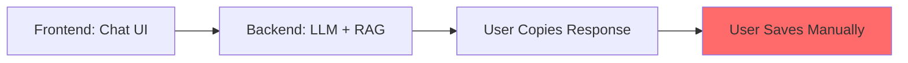
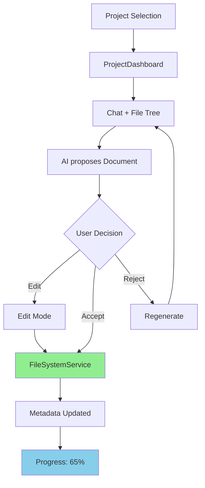

# 🎯 Executive Summary: Propuesta HU-3.x Project-First Refactor

> **Date:** 02/02/2026
> **Para:** Architecture Review Board + Stakeholders
> **Status:** ✅ ANÁLISIS COMPLETO - AGUARDANDO DECISIÓN
> **Documents de Soporte:** HU-3_REFACTOR_ANALYSIS.es.md + HU-3_IMPROVEMENT_PROPOSALS.es.md

---

## 📊 Resumen de 60 Segundos

### ¿Qué cambia?

```
ANTES (Chat-First)              →    DESPUÉS (Project-First)

Usuario abre app                     Usuario crea Proyecto
    ↓                                     ↓
Selecciona "Chat"           →    Selecciona/Crea Proyecto
    ↓                                     ↓
Escribe pregunta                    Chatea con IA
    ↓                                     ↓
Recibe respuesta streaming          Recibe PROPUESTAS de docs
    ↓                                     ↓
[Copia/Pega manualmente]            Valida explícitamente ✅
                                        ↓
                                    Persistencia automática
```

### Impacto Clave

| Métrica | Antes | Después | Cambio |
|---------|-------|---------|--------|
| **HUs en Sprint 3** | 3 | 5 | +2 |
| **Estimación Total** | ~50 pts | ~70 pts | +40% |
| **Complejidad** | Baja-Media | Media-Alta | +1 nivel |
| **Testing Coverage** | Modesto | Exhaustivo | ↑↑↑ |
| **User Control** | Pasivo | Activo | ↑↑ |
| **Persistencia** | Manual | Automática | ↑↑ |

---

## 🎨 Visualización del Cambio Arquitectónico

### Actual (HU-3.x v1)



**Problema:** El usuario es responsable de guardar. Sin validación. Sin control de propuestas.

### Propuesto (HU-3.x v2)



**Beneficio:** Flujo explícito. Control usuario. Persistencia segura.

---

## 🔄 Cambios Propuestos: HU-3.x Descomposición

### Opción Elegida: **Opción B (5 HUs Separadas)** ✅

```
S3 E3: Experiencia Frontend Completa

├─ HU-3.1: Project Shell (UI & Navigation)
│  └─ Estilo IDE, Sidebar con proyectos, Modal crear proyecto
│  └─ Estimación: XL (~13 pts)
│  └─ Prioridad: CRITICAL
│
├─ HU-3.2: File System Logic (Motor I/O Backend)
│  └─ FileSystemService, crear/leer/escribir proyectos
│  └─ Estimación: L (~8 pts)
│  └─ Prioridad: CRITICAL
│
├─ HU-3.3: Chat con Propuestas (UI + Interacción)
│  └─ DocumentProposalWidget, botón Validar, streaming
│  └─ Estimación: XL (~13 pts)
│  └─ Prioridad: CRITICAL
│
├─ HU-3.4: Error Handling & Resilience
│  └─ ErrorBanner, retry automático, mensajes amigables
│  └─ Estimación: M (~5 pts)
│  └─ Prioridad: HIGH
│
└─ HU-3.5: Streaming Optimization
   └─ SSE, Optimistic UI, auto-scroll
   └─ Estimación: M (~5 pts)
   └─ Prioridad: HIGH

📊 Total: ~44 pts (incluyendo integración + testing)
```

---

## 🏗️ Cambios Arquitectónicos Necesarios

### Backend (Python FastAPI)

**Nuevo(s):**
```
services/
├─ project/
│  ├─ project_metadata_service.py      [NEW]
│  └─ document_proposal_service.py      [NEW]
├─ filesystem/
│  ├─ file_system_service.py           [NEW]
│  └─ path_validator.py                 [NEW]

api/v1/endpoints/
├─ projects.py                          [NEW - replaces chat.py]
```

**Endpoints Nuevos:**
```
POST   /api/v1/projects                 (Crear proyecto)
GET    /api/v1/projects/{id}           (Get proyecto metadata)
POST   /api/v1/projects/{id}/chat/stream (Chat + Propuestas)
POST   /api/v1/projects/{id}/document/validate (Persistir doc)
```

### Frontend (Flutter Desktop)

**Cambios Principales:**
```dart
// Estructura de navegación
MainScreen  // NEW: Reemplaza ChatScreen
├─ ProjectSidebar
├─ ProjectDashboard
│  ├─ SummaryPanel
│  ├─ ChatPanel
│  └─ FileTreePanel
└─ ProjectFileTree
```

---

## 📈 Impacto en Timeline

### Escenario A: Proceder con Opción B (Recomendado)

```
Sprint 3: 8 semanas (vs. 6 anterior)
├─ Week 1-2:   HU-3.1 + HU-3.2 (Paralelo)
├─ Week 2-4:   HU-3.3 Integration
├─ Week 4-5:   HU-3.4 + HU-3.5 (Paralelo)
├─ Week 5-6:   Testing + QA
├─ Week 6-7:   Bug fixes + Polish
└─ Week 7-8:   Integration with S4

Sprint 4: Puede empezar Week 4-5 (HU-4.1 adaptado)
└─ Dependencia: HU-3.2 debe estar completa
```

### Escenario B: Mantener Opción A (No Recomendado)

```
Risk: Underestimation → Mid-sprint crisis
├─ Week 2: "Wait, we need FileSystemService too?"
├─ Week 3: "We forgot permission checks?"
├─ Week 4: "Backend isn't ready!"
└─ Result: Scope creep, technical debt
```

---

## 💰 Analysis Costo-Beneficio

### Opción B (5 HUs) - RECOMENDADA

| Aspecto | Costo | Beneficio |
|---------|-------|----------|
| **Tiempo** | +2 semanas | ✅ Mejor UX, control usuario |
| **Complejidad** | +40% estimación | ✅ Más realista, menos sorpresas |
| **Testing** | +8 horas | ✅ Seguridad filesystem crítica |
| **Mantenibilidad** | -20% (mejor docs) | ✅ HUs claras, responsabilidades definidas |

**ROI:** ✅ POSITIVO - Vale la pena

---

## ⚠️ Riesgos Identificados

### Riesgo 1: Complejidad del FileSystemService

**Severidad:** MEDIUM
**Probabilidad:** HIGH
**Mitigación:**
- Usar `pytest.tmp_path` para tests aislados
- Unit tests antes de integración
- Soporte para Windows/Linux/macOS

### Riesgo 2: Permisos del Sistema de Files

**Severidad:** MEDIUM
**Probabilidad:** MEDIUM
**Mitigación:**
- Path validation exhaustiva
- Backup automático antes de escribir
- Mensajes de error específicos por SO

### Riesgo 3: Timeline Slip

**Severidad:** HIGH
**Probabilidad:** MEDIUM
**Mitigación:**
- Estimación realista (70 pts vs. 50)
- Spike en Week 1 para FileSystemService
- Paralelización HU-3.1 + HU-3.2

---

## 🚀 Next Steps (Decisión Requerida)

### ✅ Si atests Opción B:

1. **Confirmar decisión** (esta conversación)
2. **Create rama:** `feature/hu-3-project-first-refactor` (develop → new branch)
3. **Actualizar JSON:** Reemplazar HU-3.1, HU-3.2, HU-3.3 + agregar HU-3.4, HU-3.5
4. **Create PR** con description bilingual
5. **Mergear a develop** (no a main)
6. **Iniciar Sprint 3** con nueva estimación

### ❌ Si rechazas (alternativa):

1. Mantener Opción A (3 HUs)
2. Riesgo de underestimation mid-sprint
3. Revisitar si aparecer problemas

---

## 📋 Checklist de Decisión

Antes de proceder, confirma:

```
☐ ¿Entendemos el cambio de Chat-First → Project-First?
☐ ¿Aceptamos +2 semanas de timeline?
☐ ¿Aceptamos +40% complejidad en estimación?
☐ ¿Priorizamos control usuario sobre velocidad?
☐ ¿Tenemos recursos para 70 pts (vs. 50)?
☐ ¿Está OK impacto en S4/S5/S6?
```

---

## 📚 Documentación de Soporte

Lectura completa (recomendada):

1. [HU-3_REFACTOR_ANALYSIS.es.md](./HU-3_REFACTOR_ANALYSIS.es.md)
   - Analysis comparativo detallado
   - Propuestas de 5 HUs con spec completa
   - Impacto en sprints posteriores

2. [HU-3_IMPROVEMENT_PROPOSALS.es.md](./HU-3_IMPROVEMENT_PROPOSALS.es.md)
   - Mejoras en UI/UX
   - Arquitectura detallada de backend
   - Estrategia de testing
   - Trade-offs y alternativas

3. [AGENTS.md - Section 5](../../AGENTS.md#-4-arquitectura-y-estructura)
   - Principios de Clean Architecture
   - Estándares de desarrollo

---

## 🎯 Recomendación Final

### ✅ **PROCEDER CON OPCIÓN B (5 HUs - Project-First Paradigm)**

**Justificación:**
1. ✅ Alineado con visión "Local-First" of the project
2. ✅ Mejor UX (control explícito del usuario)
3. ✅ Más seguro (validación en cada paso)
4. ✅ Más mantenible (responsabilidades claras)
5. ✅ ROI positivo (complejidad justificada por beneficio)

**Próximo paso:** Comunicar esta decisión al equipo + create rama de trabajo.

---

**Document firmado por:** ArchitectZero (AI Lead)
**Fecha:** 02/02/2026
**Status:** ✅ ANÁLISIS COMPLETO - AGUARDANDO CONFIRMACIÓN USUARIO
