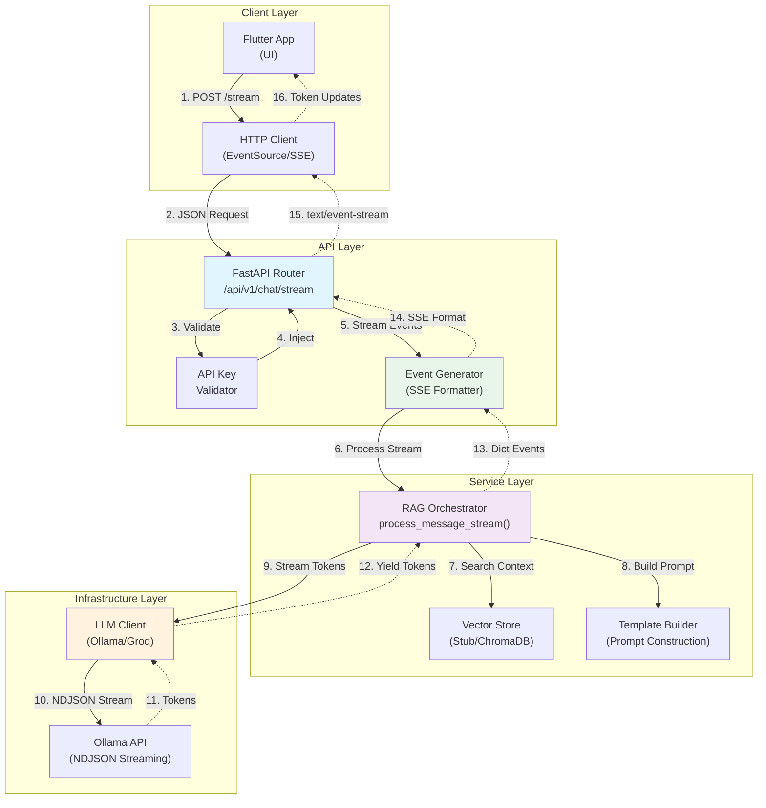
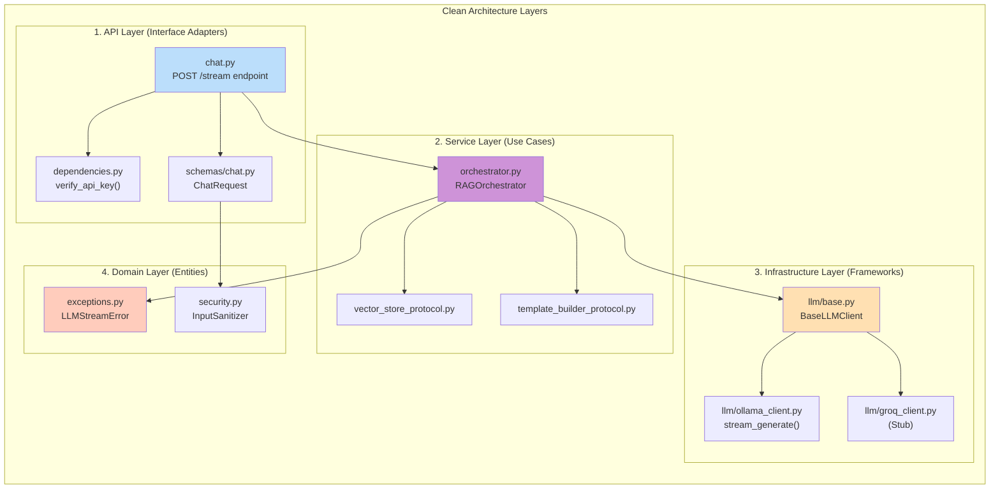
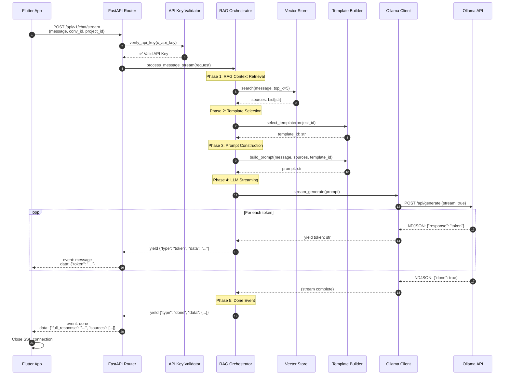
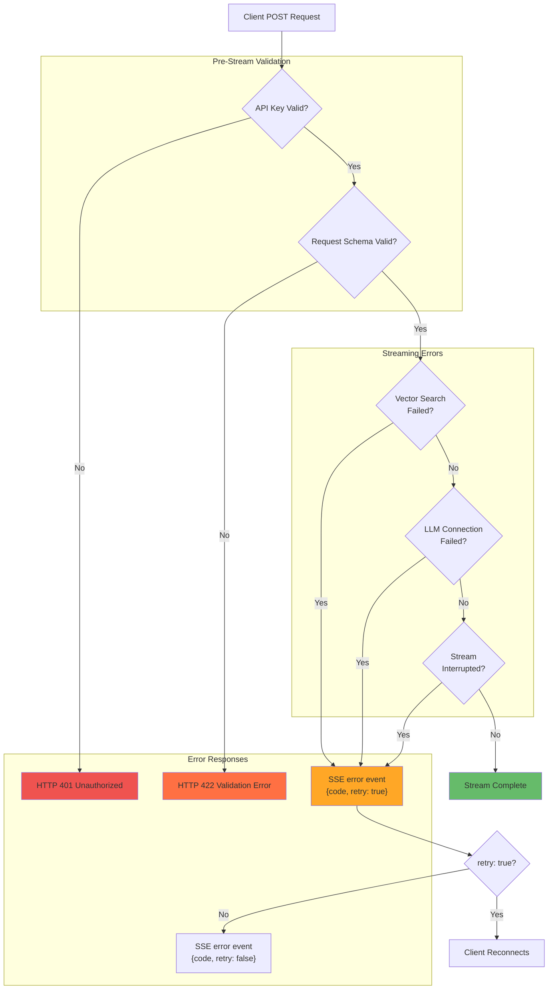
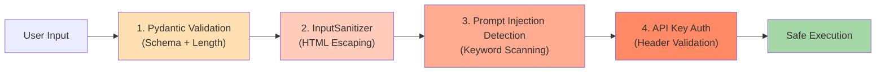

# Architecture Diagram: SSE Streaming (HU-4.3 Fase 2)

> **Versión:** 1.0.0
> **Estado:** ✅ Fase 2 Complete
> **Creard:** 2026-02-15
> **Author:** ArchitectZero

---

## 📖 Tabla de Contenidos

- [Overview](#overview)
- [System Architecture](#system-architecture)
- [Component Diagram](#component-diagram)
- [Sequence Diagram](#sequence-diagram)
- [Data Flow](#data-flow)
- [Error Flow](#error-flow)
- [Technology Stack](#technology-stack)

---

## Overview

This documento provides architectural diagrams for the SSE streaming feature implemented in HU-4.3 Fase 2. It covers the full request-response cycle, component interactions, and error handling flows.

**Key Architectural Decisions:**
1. **SSE Protocol:** Chosen over WebSockets for simplicity (HTTP-based, auto-reconnection)
2. **AsyncGenerator Pattern:** Python async generators for natural streaming semantics
3. **Event-Driven Design:** Three event types (message, done, error) for clear state management
4. **Stateless Backend:** No connection state stored (conversation context passed per request)

---

## System Architecture

### High-Level Architecture



---

## Component Diagram

### Layer Responsibilities



### Component Details

| Component | Responsibility | Key Methods |
|-----------|----------------|-------------|
| **chat.py** | SSE endpoint router | `chat_message_stream()`, `event_generator()` |
| **dependencies.py** | DI & auth | `verify_api_key()`, `get_rag_orchestrator()` |
| **orchestrator.py** | Streaming orchestration | `process_message_stream()` (AsyncGenerator) |
| **base.py** | LLM protocol | `stream_generate()` abstract method |
| **ollama_client.py** | Ollama streaming | `stream_generate()` NDJSON parser |
| **schemas/chat.py** | Request validation | `ChatRequest` Pydantic model |
| **exceptions.py** | Domain errors | `LLMStreamError`, `RAGRetrievalError` |

---

## Sequence Diagram

### Happy Path: Successful Streaming



---

## Data Flow

### Token Streaming Flow

```mermaid
graph LR
    subgraph "1. Input Processing"
        Request["ChatRequest<br/>{message, conv_id, project_id}"]
        Sanitizer["InputSanitizer<br/>HTML escaping, injection detection"]
        ValidatedInput["Validated Input"]
    end

    subgraph "2. RAG Pipeline"
        VectorSearch["Vector Store<br/>Semantic search (top_k=5)"]
        TemplateSelect["Template Builder<br/>Select template by project_id"]
        PromptBuild["Prompt Construction<br/>Augmented with context"]
    end

    subgraph "3. LLM Streaming"
        OllamaStream["Ollama API<br/>NDJSON streaming"]
        TokenParser["Token Parser<br/>JSON.parse each line"]
        TokenYield["Yield Token"]
    end

    subgraph "4. SSE Formatting"
        EventMapper["Event Mapper<br/>token → message event"]
        SSEFormatter["SSE Formatter<br/>event: + data: + \\n\\n"]
        ClientStream["Client Receives SSE"]
    end

    Request --> Sanitizer
    Sanitizer --> ValidatedInput
    ValidatedInput --> VectorSearch
    VectorSearch --> TemplateSelect
    TemplateSelect --> PromptBuild
    PromptBuild --> OllamaStream
    OllamaStream --> TokenParser
    TokenParser --> TokenYield
    TokenYield --> EventMapper
    EventMapper --> SSEFormatter
    SSEFormatter --> ClientStream

    style Sanitizer fill:#ffcdd2
    style OllamaStream fill:#fff9c4
    style SSEFormatter fill:#c8e6c9
```



### Event Type Mapping

| Source | Event Type | Payload | Condition |
|--------|-----------|---------|-----------|
| `LLM.stream_generate()` | `token` | `{"token": str, "is_final": false}` | During streaming |
| `Orchestrator` | `done` | `{"full_response": str, "sources": list, "metadata": dict}` | After all tokens |
| `Exception` | `error` | `{"error": str, "code": str, "retry": bool}` | On failure |

---

## Error Flow

### Error Handling Chain



### Error Code Matrix

| Error Condition | HTTP Estado | SSE Event | Code | Retry? |
|----------------|-------------|-----------|------|--------|
| Missing API key | 401 | N/A | N/A | No |
| Invalid UUID | 422 | N/A | N/A | No |
| Vector store down | 200 | `error` | `RAG_RETRIEVAL_ERROR` | Yes |
| Ollama unreachable | 200 | `error` | `LLM_CONNECTION_ERROR` | Yes |
| Stream timeout | 200 | `error` | `LLM_STREAM_ERROR` | Yes |
| Unexpected exception | 200 | `error` | `ORCHESTRATOR_ERROR` | No |

---

## Technology Stack

### Backend Components

| Layer | Technology | Version | Purpose |
|-------|-----------|---------|---------|
| **API Framework** | FastAPI | 0.115.6 | Async HTTP server, SSE support |
| **HTTP Client** | httpx | 0.28.1 | Async LLM API calls, streaming |
| **Validation** | Pydantic | 2.10.6 | Request/response schema validation |
| **LLM Provider** | Ollama | Laprueba | Local inference, NDJSON streaming |
| **Vector Store** | ChromaDB (stub) | Future | Semantic search for RAG context |
| **Pruebaing** | pyprueba + httpx | 8.3.4 | Integración pruebas with ASGITransport |

### Frontend Components (Flutter)

| Component | Package | Purpose |
|-----------|---------|---------|
| SSE Client | `http` | Native Dart SSE parsing |
| State Management | `riverpod` | Stream subscription management |
| UI Updates | `Stream<String>` | Real-time text rendering |

### Protocol Standards

- **SSE Specification:** W3C EventSource ([spec](https://html.spec.whatwg.org/multipage/server-sent-events.html))
- **Content-Type:** `text/event-stream; charset=utf-8`
- **Event Format:** `event: <type>\ndata: <json>\n\n`

---

## Performance Optimizations

### 1. Async Pipeline

```python
# Parallel execution of RAG retrieval and template selection
async with asyncio.TaskGroup() as tg:
    sources_task = tg.create_task(vector_store.search(...))
    template_task = tg.create_task(template_builder.select_template(...))
```

### 2. Streaming Buffering

```python
# Immediate token flushing (no chunking delay)
async for token in llm_client.stream_generate(prompt):
    yield {"type": "token", "data": token, "is_final": False}
    # Flushed to client instantly via StreamingResponse
```

### 3. Connection Pooling

```python
# httpx AsyncClient reused across requests
async with httpx.AsyncClient(timeout=30.0) as client:
    async with client.stream("POST", endpoint, json=payload) as response:
        # Connection kept alive until stream complete
```

---

## Security Architecture

### Defense Layers



### Security Controls

1. **Input Validation:** Pydantic enforces UUID format, max length (2000 chars)
2. **HTML Escaping:** `<`, `>`, `&` converted to entities
3. **Prompt Injection Prevention:** Detects "ignore", "system:", "jailbreak"
4. **API Key Authentication:** Min 10 chars, validated before streaming
5. **HTTPS Enforcement:** Required in production (TLS 1.2+)

---

## Related Documentos

- [API_CONTRACT.md](./API_CONTRACT.md) - SSE endpoint specification
- [COVERAGE_REPORT.md](./COVERAGE_REPORT.md) - Prueba metrics
- [PROGRESS.md](./PROGRESS.md) - Implementación timeline

---

**Changelog:**

| Version | Date | Changes |
|---------|------|---------|
| 1.0.0 | 2026-02-15 | Initial architecture documentoation |
