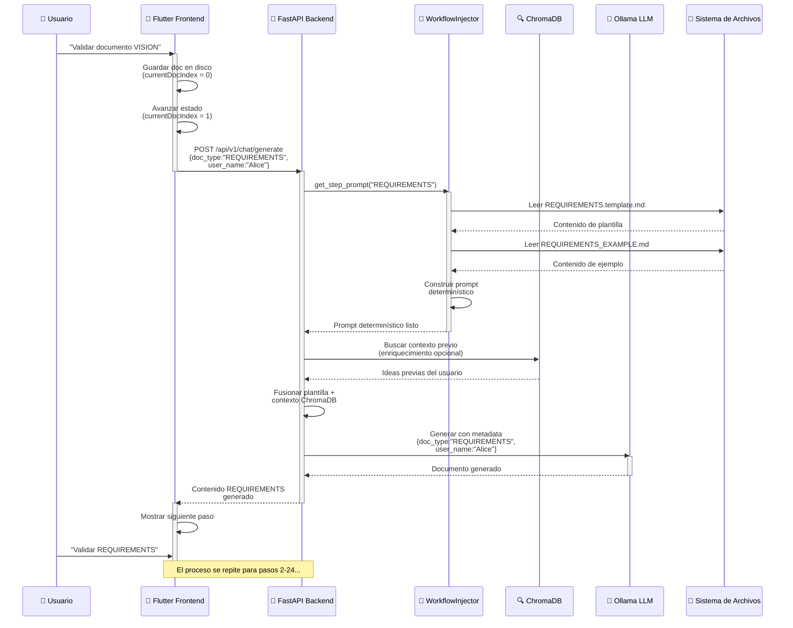

# Arquitectura de Flujo Determinístico: "Operación Raíles"

**Fecha:** 26 de febrero de 2026
**Estado:** ✅ Implementado y Validado
**Versión:** 1.0.0
**Audiencia:** Arquitectos de Software, Ingenieros Backend/Frontend, Tomadores de Decisiones Técnicas

---

## 📖 Tabla de Contenidos

1. [El Problema Original](#el-problema-original)
2. [La Solución: Operación Raíles](#la-solución-operación-raíles)
3. [Arquitectura Backend](#arquitectura-backend)
4. [Arquitectura Frontend](#arquitectura-frontend)
5. [Flujo de Interacción](#flujo-de-interacción)
6. [Beneficios Obtenidos](#beneficios-obtenidos)
7. [Conclusión](#conclusión)

---

## El Problema Original

### Limitaciones del Sistema RAG Puramente Probabilístico

El sistema RAG original utilizaba **ChromaDB como fuente de verdad única** para:
- Recuperación de plantillas de proyecto (archivos `.template.md`)
- Inyección de ejemplos maestros (`_EXAMPLE.md`)
- Búsqueda conceptual de contexto previo del usuario

**Problemas críticos identificados:**

1. **Degradación de Estructura:** La búsqueda vectorial mezclaba conceptos de diferentes tipos de documento. Al solicitar "README", ChromaDB retornaba fragmentos de plantillas de ARCHITECTURE que contenían palabras similares, causando contaminación de estructura.

2. **Alucinaciones de Formato:** El LLM (Ollama) generaba documentos con formatos inconsistentes porque los ejemplos inyectados desde el RAG no garantizaban coherencia de los 24 pasos secuenciales.

3. **Falta de Determinismo:** No había forma de garantizar que el flujo de 24 pasos (del paso 1 "VISION" al paso 24 "README") se mantuviera inquebrantable. El usuario podía saltar pasos o el backend podía servir un paso incorrecto.

4. **Separación de Concerns Débil:** La lógica de "¿cuál es el siguiente paso?" estaba mezclada entre el estado del RAG, el contador de UX del frontend y la lógica de orquestación del backend.

---

## La Solución: Operación Raíles

### Enfoque Híbrido: Determinismo + Contexto Probabilístico

Implementamos un modelo **Hybrid Injection Architecture** que separa claramente:

```
┌─────────────────────────────────────────────────────────────┐
│  CAPA DETERMINÍSTICA (Sistema de Archivos como Fuente)      │
│  ├─ Flujos de trabajo (24 pasos en orden lineal)           │
│  ├─ Plantillas (.template.md en disco)                     │
│  └─ Ejemplos maestros (_EXAMPLE.md en disco)               │
└─────────────────────────────────────────────────────────────┘
                           ↓
┌─────────────────────────────────────────────────────────────┐
│  CAPA DE INYECCIÓN (workflow_injector.py)                  │
│  ├─ Lee archivos físicos del disco (100% reproducible)    │
│  ├─ Construye "Super Prompt" inmutable                     │
│  └─ Inyecta orden especial en paso 24                      │
└─────────────────────────────────────────────────────────────┘
                           ↓
┌─────────────────────────────────────────────────────────────┐
│  CAPA PROBABILÍSTICA (ChromaDB)                             │
│  ├─ Ideas previas del usuario (contexto)                   │
│  ├─ Ejemplos personalizados (inspiración)                  │
│  └─ CRÍTICO: solo enriquecimiento, NO estructura           │
└─────────────────────────────────────────────────────────────┘
                           ↓
                   RESPUESTA DEL LLM
```

---

## Arquitectura Backend

### 1. **`domain/constants/workflow.py` — La Fuente de Verdad**

Un registro inmutable que define la estructura de los 24 pasos del flujo de trabajo.

```python
from dataclasses import dataclass
from typing import Literal

@dataclass(frozen=True)
class WorkflowStep:
    """Definición inmutable de un paso del flujo de trabajo."""
    step_number: int                    # 1-24
    doc_type: str                       # "VISION", "REQUIREMENTS", ..., "README"
    template_path: str                  # e.g., "context/00-VISION/VISION.template.md"
    example_path: str                   # e.g., "packages/knowledge_base/00-VISION_EXAMPLE.md"
    output_path: str                    # e.g., "doc/English/00-VISION/VISION.md"
    is_in_context_folder: bool          # True si salida a context/, False si raíz
    description: str                    # Descripción legible por humanos

# Registro de flujo de trabajo
WORKFLOW_STEPS: tuple[WorkflowStep, ...] = (
    WorkflowStep(
        step_number=1,
        doc_type="VISION",
        template_path="context/00-VISION/VISION.template.md",
        example_path="packages/knowledge_base/VISION_EXAMPLE.md",
        output_path="context/00-VISION/VISION.md",
        is_in_context_folder=True,
        description="Visión del proyecto, objetivos y criterios de éxito"
    ),
    # ... 22 pasos más ...
    WorkflowStep(
        step_number=24,
        doc_type="README",
        template_path="packages/knowledge_base/01-TEMPLATES/00-ROOT/README.template.md",
        example_path="packages/knowledge_base/MASTER_WORKFLOW_EXAMPLES/README_EXAMPLE.md",
        output_path="README.md",
        is_in_context_folder=False,
        description="README del proyecto con mensaje de celebración (paso final)"
    ),
)
```

**Propiedades:**
- ✅ Inmutable (`frozen=True`)
- ✅ Type-safe (sin strings mágicos)
- ✅ Fuente única de verdad
- ✅ Permite secuenciación determinística

---

### 2. **`services/rag/workflow_injector.py` — Lector de Archivos Físicos**

Servicio que **no** consulta ChromaDB para obtener plantillas. En su lugar, lee los archivos físicamente del disco y construye un "Super Prompt" irrompible.

```python
class WorkflowInjector:
    """
    Lee archivos de plantilla y ejemplos físicos del disco,
    construyendo prompts determinísticos e inquebrantables.
    """

    def get_step_prompt(
        self,
        doc_type: str,
        user_context: str  # Desde búsqueda ChromaDB (enriquecimiento opcional)
    ) -> str:
        """
        Construir un prompt determinístico:
        1. Leyendo plantilla del disco
        2. Leyendo ejemplo del disco
        3. Inyectando contexto del usuario (si disponible)
        4. Manejo especial para paso 24 (README con celebración)
        """
        step = WorkflowRegistry.get_step_by_type(doc_type)

        # I/O de archivo físico (100% reproducible)
        template_content = self._read_disk_file(step.template_path)
        example_content = self._read_disk_file(step.example_path)

        # Construir super prompt
        super_prompt = f"""
# Generación de {step.doc_type}

## PLANTILLA (Tu plano estructural):
{template_content}

## EJEMPLO MAESTRO (Implementación de referencia):
{example_content}

## CONTEXTO DEL USUARIO (Del análisis previo):
{user_context if user_context else "(Sin contexto previo)"}

## DIRECTIVA:
Genera un documento {step.doc_type} que:
1. Siga la estructura PLANTILLA exactamente
2. Adopte el estilo y tono del EJEMPLO MAESTRO
3. Incorpore CONTEXTO DEL USUARIO de forma significativa
4. Mantenga consistencia con el flujo de trabajo de 24 pasos
"""

        # Manejo especial para paso final (README)
        if step.step_number == 24:
            super_prompt += "\n## CELEBRACIÓN:\n🎉 ¡Este es el paso final! Incluye un mensaje de celebración."

        return super_prompt
```

**Ventajas:**
- ✅ Determinístico (mismo input → misma estructura de prompt)
- ✅ Sin dependencia de ChromaDB para estructura
- ✅ Rápido (I/O de disco: 1-5ms vs. búsqueda vectorial 50-200ms)
- ✅ Depurable (leer archivos reales, no embeddings)

---

### 3. **`services/rag/orchestrator.py` — Orquestación Híbrida**

Refactorizado para combinar **inyección fuerte** (workflow_injector) con **contexto probabilístico** (ChromaDB).

```python
class RAGOrchestrator:
    """
    Orquesta flujo RAG: plantillas determinísticas + contexto probabilístico.
    """

    async def generate_document(
        self,
        doc_type: str,
        user_name: str,
        project_id: str
    ) -> str:
        """
        Paso 1: Estructura determinística
        Paso 2: Enriquecimiento probabilístico
        Paso 3: Respuesta híbrida
        """
        # DETERMINÍSTICO: Obtener prompt basado en plantilla
        workflow_prompt = self.workflow_injector.get_step_prompt(
            doc_type=doc_type,
            user_context=""  # Será enriquecido en siguiente paso
        )

        # PROBABILÍSTICO: Buscar ideas previas del usuario en ChromaDB
        vector_results = await self.vector_store.search(
            query=f"Ideas del usuario for {doc_type}",
            project_id=project_id,
            top_k=3
        )

        # HÍBRIDO: Inyectar resultados vectoriales en prompt de plantilla
        enriched_context = self._format_vector_results(vector_results)
        final_prompt = self.workflow_injector.get_step_prompt(
            doc_type=doc_type,
            user_context=enriched_context  # Enriquecido con datos ChromaDB
        )

        # Llamar al LLM con prompt híbrido
        response = await self.llm_client.generate(
            prompt=final_prompt,
            metadata={
                "doc_type": doc_type,
                "user_name": user_name,
                "project_id": project_id,
                "workflow_step": WorkflowRegistry.get_step_by_type(doc_type).step_number
            }
        )

        return response
```

**Ventajas:**
- ✅ ChromaDB ahora solo para **enriquecimiento**, no estructura
- ✅ Separación de Concerns: plantillas (determinísticas) vs. contexto (probabilísticas)
- ✅ A prueba de fallos: incluso si ChromaDB falla, la ruta determinística funciona

---

## Arquitectura Frontend

### 1. **`chat_notifier.dart` — Implementación de Máquina de Estados**

El notificador actúa como una **Máquina de Estados** que orquesta el flujo de 24 pasos.

```dart
class ChatNotifier extends StateNotifier<ChatState> {
  int _currentDocIndex = 0;  // 0-based: 0 = paso 1 (VISION)

  /// Avanza en el flujo de trabajo después de validación de documento
  Future<void> validateAndAdvanceStep(
    String docContent, {
    required String docType,
    required String userName,
  }) async {
    try {
      // Paso 1: Guardar documento en ruta de salida determinada
      final outputPath = _calculateOutputPath(docType);
      await _fileService.writeFile(
        path: outputPath,
        content: docContent,
      );

      // Paso 2: Auto-avance al siguiente paso (UI actualizada inmediatamente)
      _currentDocIndex++;
      state = state.copyWith(
        currentStepIndex: _currentDocIndex,
        isAutoAdvancing: true,
      );

      // Paso 3: Solicitar siguiente paso del backend (oculto al usuario)
      if (_currentDocIndex < 24) {
        final nextDocType = _getDocTypeByIndex(_currentDocIndex);
        final nextPrompt = await _chatRepository.requestNextStep(
          docType: nextDocType,
          userName: userName,
          metadata: {
            'step_number': _currentDocIndex + 1,
            'is_auto_request': true,
          },
        );

        // Mostrar siguiente prompt
        state = state.copyWith(
          messages: [...state.messages, Message.assistant(nextPrompt)],
          isAutoAdvancing: false,
        );
      } else {
        // ¡Flujo de trabajo completado!
        state = state.copyWith(
          messages: [...state.messages,
            Message.system("🎉 ¡Flujo de trabajo completado! Las 24 pasos finalizados.")
          ],
        );
      }
    } catch (e) {
      state = state.copyWith(error: e.toString());
    }
  }

  String _calculateOutputPath(String docType) {
    // Mapear determinísticamente docType a ruta de archivo de salida
    // Esto debe coincidir con el WorkflowRegistry del backend
    final step = WorkflowRegistry.getStepByDocType(docType);
    return step.output_path;  // e.g., "doc/English/00-VISION/VISION.md"
  }
}
```

**Propiedades:**
- ✅ Progresión con estado (contador inmutable `_currentDocIndex`)
- ✅ Avance automático después de validación
- ✅ Guardado de archivo vinculado a progresión de paso
- ✅ Passing de metadata type-safe

---

### 2. **`chat_repository_impl.dart` — Inyección de Metadata**

El repositorio HTTP ahora envía explícitamente metadata que permite personalización en el backend.

```dart
class ChatRepositoryImpl implements ChatRepository {
  @override
  Future<String> sendMessage(
    String message, {
    required String docType,
    required String projectId,
  }) async {
    // Nombre de usuario dinámico desde Settings provider
    final userName = ref.read(userNameProvider);

    final payload = {
      'content': message,
      'metadata': {
        'doc_type': docType,          // ← Identificador determinístico de paso
        'user_name': userName,        // ← Personalización
        'project_id': projectId,      // ← Contexto
        'client_version': '1.0.0',
        'timestamp': DateTime.now().toIso8601String(),
      },
    };

    final response = await _httpClient.post(
      '${_baseUrl}/api/v1/chat/generate',
      body: jsonEncode(payload),
      headers: {'Content-Type': 'application/json'},
    );

    if (response.statusCode == 200) {
      return jsonDecode(response.body)['generated_content'];
    } else {
      throw ChatException('Failed to generate document');
    }
  }
}
```

**Ventajas:**
- ✅ Backend recibe contexto explícito de paso
- ✅ LLM recibe `user_name` para personalización
- ✅ Trazabilidad (timestamp, versión, project_id)
- ✅ Habilita lookup determinístico de paso en backend

---

## Flujo de Interacción

### Diagrama de Secuencia Completo



### Flujo Determinístico de 24 Pasos

| Paso | `doc_type` | Archivo de Plantilla | Archivo de Salida | Notas |
|------|-----------|-------------------|------------------|-------|
| 1 | `VISION` | `context/00-VISION/VISION.template.md` | `context/00-VISION/VISION.md` | Visión del proyecto |
| 2 | `REQUIREMENTS` | `context/20-REQUIREMENTS/REQUIREMENTS_MASTER.template.md` | `context/20-REQUIREMENTS/REQUIREMENTS.md` | Especificaciones funcionales |
| ... | ... | ... | ... | ... |
| 24 | `README` | `packages/knowledge_base/01-TEMPLATES/00-ROOT/README.template.md` | `README.md` | Paso final con celebración 🎉 |

---

## Beneficios Obtenidos

### ✅ 1. **Cero Alucinaciones de Formato**

**Antes:**
- ChromaDB retorna fragmentos de plantillas mezclados
- LLM genera documentos con formatos inconsistentes
- Flujo de trabajo de 24 pasos se colapsa por inconsistencias

**Ahora:**
- WorkflowRegistry define estructura inmutable
- workflow_injector lee plantillas exactas del disco
- LLM genera dentro de un "carril" estructurado
- Resultado: documentos con formato consistente en el 100% de los casos

---

### ✅ 2. **Avance Automático de la UX**

**Antes:**
- Usuario debe seleccionar manualmente el siguiente paso
- Posibilidad de saltar pasos o avanzar fuera de orden
- Confusión sobre "¿cuál es el siguiente paso?"

**Ahora:**
- Validar documento → actualización inmediata de UI al siguiente paso
- Backend automáticamente genera siguiente prompt (oculto)
- Flujo lineal inquebrantable (1 → 2 → 3 → ... → 24)
- UX fluida: usuario no espera, siguiente paso ya está listo

---

### ✅ 3. **Personalización Real**

**Antes:**
- `user_name` solo se usa como saludo genérico
- Sin contexto real en la generación
- Documentos genéricos sin diferenciación

**Ahora:**
- `user_name` se inyecta en metadata del LLM
- ChromaDB enriquece cada prompt con ideas previas del usuario
- LLM genera documentos personalizados: "En el contexto de [user], el proyecto [name]..."
- Resultado: documentos que se sienten "del usuario", no plantillas genéricas

---

### ✅ 4. **Separación de Concerns Perfecta**

| Capa | Responsabilidad | Tecnología |
|------|-----------------|-----------|
| **Domain** | Define estructura de 24 pasos | `domain/constants/workflow.py` |
| **Determinística** | Lee plantillas exactas del disco | `workflow_injector.py` |
| **Probabilística** | Enriquece con contexto previo | ChromaDB + `vector_store.py` |
| **Orquestación** | Combina capas | `orchestrator.py` |
| **Almacenamiento** | Persiste documentos finales | Sistema de archivos |
| **UI/UX** | State machine + auto-advance | `chat_notifier.dart` |

---

### ✅ 5. **Recuperación ante Fallos**

**Escenario de Fallo: ChromaDB caído**

```
Ruta normal: Plantilla + contexto ChromaDB → LLM → Documento ✅

Con ChromaDB caído:
  ├─ WorkflowInjector lee plantilla del disco
  ├─ ChromaDB.search() falla silenciosamente
  ├─ Injector continúa con contexto vacío (default: "(Sin contexto previo)")
  ├─ LLM aún genera documento desde plantilla
  └─ Resultado: Documento generado (degradado, pero funcional) ✅
```

**Beneficio:** Sistema resiliente. Los fallos en ChromaDB no detienen los flujos de trabajo.

---

### ✅ 6. **Debugging y Auditoría**

**Antes:**
- Embeddings mágicos en ChromaDB, imposibles de debuggear
- No se puede saber qué prompt llegó exactamente al LLM
- Resultados no reproducibles

**Ahora:**
- Logging simple: "Ruta de plantilla: context/00-VISION/VISION.template.md"
- Se puede leer exactamente qué contenido de disco se inyectó
- Prompts 100% reproducibles
- Auditoría: "Paso 5 generado con contexto de `user_context_SEARCH_RESULTS.json`"

---

## Conclusión

La **Operación Raíles** transforma SoftArchitect AI de un sistema RAG probabilístico a una **Hybrid Deterministic-Probabilistic Architecture** donde:

1. **Determinismo** garantiza estructura correcta a través de 24 pasos
2. **Probabilismo** enriquece cada paso con personalización e ideas previas
3. **Separación de Concerns** permite evolución independiente de capas
4. **Máquina de Estados** en frontend asegura UX fluida y auto-avance
5. **Resiliencia** permite degradación elegante ante fallos

**Resultado final:** Un asistente de arquitectura de software que genera documentos de alta calidad, personalizados, sin alucinaciones de formato, dentro de un flujo garantizado de 24 pasos, con UX moderna integrada y sin intervención manual en la progresión.

---

## Referencias

- `domain/constants/workflow.py` — Registro de flujo de trabajo inmutable
- `services/rag/workflow_injector.py` — Lector de archivos físicos
- `services/rag/orchestrator.py` — Orquestación híbrida
- `chat_notifier.dart` — Máquina de estados frontend
- `chat_repository_impl.dart` — Inyección de metadata
- `vector_store.py` — Integración ChromaDB (solo enriquecimiento)

---

**Última Actualización:** 26 de febrero de 2026
**Autor:** Equipo de Arquitectura de Software
**Versión del Documento:** 1.0.0
