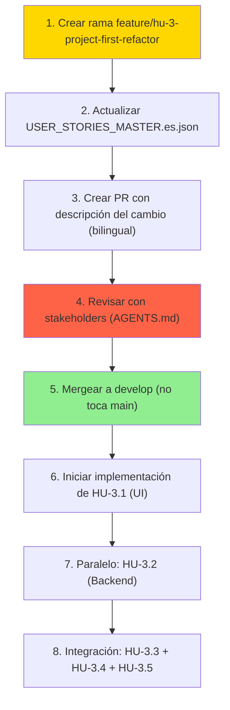

# 📊 Análisis Estratégico: Refactor de HU-3.x (Proyecto-First Paradigm)

> **Fecha:** 02/02/2026
> **Estado:** 🔍 ANÁLISIS EN PROGRESO (Sin Modificaciones en Rama Actual)
> **Responsable:** ArchitectZero (AI Lead)
> **Impacto:** S3 (Frontend & Logic) + Consecuencias en S4-S7

---

## 📖 Tabla de Contenidos

1. [Resumen Ejecutivo](#-resumen-ejecutivo)
2. [Análisis Comparativo: Actual vs. Propuesto](#-análisis-comparativo-actual-vs-propuesto)
3. [Cambios Arquitectónicos Requeridos](#-cambios-arquitectónicos-requeridos)
4. [Propuesta de Redefinición HU-3.x](#-propuesta-de-redefinición-hu-3x)
5. [Impacto en Sprints Posteriores](#-impacto-en-sprints-posteriores)
6. [Recomendaciones y Próximos Pasos](#-recomendaciones-y-próximos-pasos)

---

## 🎯 Resumen Ejecutivo

### Situación Actual (HU-3.x Original)

**Modelo:** Chat-First + Streaming-Focused

```
Usuario (Chat Input)
    ↓
IA (Streaming Response)
    ↓
Widget Markdown (Display)
    ↓
[Finito - No persistence]
```

**Características de HU-3.x Actuales:**
- **HU-3.1:** UI de chat limpia con Markdown + sintaxis
- **HU-3.2:** Streaming SSE para no bloquear UI
- **HU-3.3:** Manejo amigable de errores

### Visión Propuesta (Proyecto-First Paradigm)

**Modelo:** Sequential Documento Generation + Guided RAG + Iterative Validation

```
Usuario Crea Proyecto
    ↓
Auto-crear: context/10-CONTEXT, 20-REQUIREMENTS, 30-ARCHITECTURE, 35-UX_UI, 40-PLANNING
    ↓
Usuario escribe idea en chat (ej: "App adopción mascotas estilo Tinder")
    ↓
[FLUJO SECUENCIAL - Un documento a la vez]
    ├─ IA propone DOC 1 (PROJECT_MANIFESTO.md) - Guiado por template 10-CONTEXT
    ├─ Usuario: ✅ Valida OR 🔄 Interactúa en chat para mejorar
    ├─ Si 🔄 Interactúa → Chat iterativo → Regenera → Valida nuevamente
    ├─ Si ✅ Valida → Persiste en context/10-CONTEXT/
    │
    ├─ IA propone DOC 2 (REQUIREMENTS_MASTER.md) - Guiado por template 20-REQUIREMENTS
    ├─ Usuario: ✅ Valida OR 🔄 Interactúa
    ├─ [Mismo ciclo...]
    │
    └─ ... (continúa hasta DOC 25 en 40-PLANNING)
    ↓
🏁 "✅ Documentación completa. ¿Generar código?"
```

**Características Clave:**
- ✅ Flujo **100% secuencial** (nunca paralelo)
- ✅ Cada documentoo debe validarse antes de pasar al siguiente
- ✅ RAG **100% guiado por templates** (no generación libre)
- ✅ Chat histórico en BD + Documentoos validados en disco
- ✅ Iteración conversacional (usuario refina en chat antes de guardar)
- ✅ Resultadoado: 25 documentoos de arquitecto/ingeniero senior en MINUTOS

---

## 🔄 Análisis Comparativo: Actual vs. Propuesto

### Tabla Comparativa

| Aspecto | HU-3.x Actual | Propuesta Proyecto-First |
|---------|--------------|------------------------|
| **Modelo Mental** | Chatbot efímero | Gestor de documentoación secuencial (guiado) |
| **Punto de Entrada** | Abre app → chat | Crea proyecto → auto-crear dirs context/10-20-30-35-40 |
| **Concepto de "Sesión"** | Conversación temporal | Mix: Chat histórico en BD + Documentoos validados en disco |
| **Persistencia de Datos** | Ninguna (histórico en BD) | Chat en BD + Docs en context/{10-20-30-35-40}/ por validación |
| **UI Principal** | ChatScreen | ProyectoDashboard (Chat + Progress Bar "Doc 1/25") |
| **Flujo de Generación** | Propuesta única | **Secuencial obligatorio:** Doc 1 → Validar → Guardar → Doc 2 → ... → Doc 25 |
| **Validación del Usuario** | Aprobar/rechazar | **Aprobar O Interactuar en chat para mejorar** → Regenerar → Validar |
| **Integración RAG** | "Transparente" | **100% guiada por templates** (01-TEMPLATES/) adaptados al proyecto |
| **Caso de Uso Primario** | Consultas adhoc | Generar 25 documentoos de arquitecto senior en minutos |
| **Persistencia Automática** | No | Sí (tras validación) |
| **Documentoos Finales** | Variable | 25 documentoos (estándar del proyecto) |

---

## 🔀 Diagrama Secuencial: Flujo de Generación de Documentoos

```
PROYECTO CREADO
    ↓
[Crear Auto-dirs: context/10-CONTEXT, 20-REQUIREMENTS, 30-ARCHITECTURE, 35-UX_UI, 40-PLANNING]
    ↓
┌─────────────────────────────────────────────────────────────────────────┐
│ CICLO ITERATIVO POR DOCUMENTO (Repetir 25 veces)                        │
├─────────────────────────────────────────────────────────────────────────┤
│  1. 🧠 RAG Genera Documento (Guiado por Template + Contexto Proyecto)  │
│  ├─ Selecciona template automáticamente (ej: 10-CONTEXT/...)           │
│  ├─ Adapta contenido al proyecto específico                            │
│  └─ Inserta referencias a decisiones previas                           │
│  2. 💬 Sistema propone en Chat: "Aquí está [DOC_NAME]..."              │
│  3. 👤 Usuario decide:                                                 │
│     ✅ Validar → context/{fase}/[DOC_NAME].md → Siguiente doc          │
│     🔄 Mejorar → Chat iterativo → RAG regenera → Valida nuevamente    │
└─────────────────────────────────────────────────────────────────────────┘
    ↓
🏁 ✅ DOCUMENTACIÓN COMPLETA (25 docs en context/)
```

**Garantías:**
- ✅ **Secuencial:** Nunca 2 documentoos en paralelo
- ✅ **RAG 100% Guiado:** Templates de 01-TEMPLATES/ + adaptación
- ✅ **Iterativo:** Usuario refina en chat antes de guardar
- ✅ **Persistente:** Solo documentoos validados en disco
- ✅ **Auditable:** Chat histórico en BD

---

### Análisis Profundo

#### ✅ Ventajas de Proyecto-First + Sequential Workflow

1. **Ownership y Gobernanza:**
   - Usuario tiene control explícito sobre cada documentoo
   - Iteración conversacional: refina antes de guardar
   - Trace audit completo: chat en BD + docs en disco

2. **Generación Predecible y de Calidad:**
   - RAG 100% guiado por templates (no generación libre)
   - Secuencial: cada documentoo mejora en base a anteriores
   - Resultadoado: 25 documentoos = arquitecto/ingeniero senior en MINUTOS
   - Estandarización: todos los proyectos siguen la misma estructura

3. **Iteración Conversacional:**
   - Usuario no es pasivo (no solo aprueba/rechaza)
   - Puede pedir cambios en el chat → RAG regenera
   - Multiples ciclos posibles hasta satisfacción

4. **Persistencia Segura:**
   - Directorios creados automáticamente al inicio
   - Solo documentoos validados llegan a disco
   - Histórico conversacional en BD (recuperable)
   - Backup implícito: versión previa siempre disponible

#### ❌ Riesgos de Proyecto-First + Sequential Workflow

1. **Complejidad del Orquestador RAG:**
   - Necesita rastrear estado de "qué documentoo sigue"
   - Necesita inyectar contexto de documentoos previos
   - Manejo de conversación multi-turno para refinar

2. **Experiencia de Onboarding:**
   - Usuario debe entender concepto de "25 documentoos secuenciales"
   - La barrera de entrada es mayor (no es "chat simple")
   - Educación requerida

3. **Gestión de Estado Conversacional:**
   - El chat histórico debe recuperar contexto entre documentoos
   - Si usuario vuelve a un documentoo anterior, ¿qué sucede?
   - Necesidad de "cancelar" flujo y reiniciar

---

## 🏗️ Cambios Arquitectónicos Requeridos

### 1. Cambio en Estructura de Datos Frontend

**Actual (HU-3.x):**
```dart
// Modelo simple de conversación
class Message {
  String id;
  String role; // "user" o "assistant"
  String content;
  DateTime timestamp;
  MessageType type; // text, error, info
}
```

**Propuesto (Proyecto-First):**
```dart
// Modelo de Proyecto
class Project {
  String id;
  String name;
  String basePath; // /home/user/projects/my-arch
  DateTime createdAt;
  DocumentationState state; // incomplete, draft, final
}

// Modelo de Propuesta de Documento
class DocumentProposal {
  String id;
  String documentType; // "VISION", "ARCHITECTURE", "ERROR_HANDLING", etc.
  String content; // Markdown generado por IA
  DocumentationTemplate template; // Referencia al template del RAG
  String[] sources; // IDs de chunks usados del RAG
  ProposalStatus status; // proposed, accepted, rejected, modified
}

// Historial de interacciones
class ProjectInteraction {
  String projectId;
  String type; // "document_proposed", "document_validated", "modification_requested"
  Timestamp timestamp;
  MetadataMap details;
}
```

### 2. Cambio en Arquitectura de Servicios

**Agregar nuevo servicio:** `ArchivoSystemService`

```python
# src/server/services/filesystem/file_system_service.py

class FileSystemService:
    """
    Motor de I/O para gestionar proyectos en disco.

    Responsabilidades:
    1. Crear estructura de carpetas (root/, context/, etc.)
    2. Validar permisos antes de escribir
    3. Leer estado actual de la carpeta (qué documentos faltan)
    4. Guardar archivos Markdown/JSON tras validación
    5. Backup automático de versiones previas
    """

    async def create_project(
        self,
        project_name: str,
        base_path: str
    ) -> ProjectCreationResult:
        """Crear estructura base sin copiar templates"""
        # Crear /base_path/
        # Crear /base_path/context/
        # Crear /base_path/.project.json (metadata)

    async def get_project_state(
        self,
        base_path: str
    ) -> ProjectFileState:
        """Leer qué documentos existen en context/"""
        # List files in context/
        # Check which templates are missing
        # Return metadata about existing files

    async def write_validated_document(
        self,
        project_path: str,
        document_type: str,
        content: str,
        metadata: DocumentMetadata
    ) -> FileWriteResult:
        """Guardar documento tras validación explícita"""
        # Backup versión anterior (si existe)
        # Validar permisos
        # Escribir archivo
        # Crear entry en audit log
```

### 3. Cambio en API Backend (HU-4)

**Nuevo endpoint requerido:**

```python
# POST /api/v1/projects/document/validate

@router.post("/projects/{project_id}/document/validate")
async def validate_and_save_document(
    project_id: str,
    document_proposal: DocumentProposalInput,  # Content + metadata
) -> DocumentSaveResult:
    """
    Endpoint para PERSISTIR un documento propuesto tras validación.

    Flujo:
    1. Validar que proyecto existe
    2. Llamar FileSystemService.write_validated_document()
    3. Actualizar SQLite (proyecto.state)
    4. Retornar confirmación con path del archivo guardado
    """
```

### 4. Cambio en UI/UX

**Navegación Nueva:**
```
MainScreen (IDE-like)
├─ Sidebar: List de Proyectos
│   ├─ [+] New Project Button
│   ├─ Project 1 (selected)
│   ├─ Project 2
│   └─ Project 3
│
├─ Central Panel: ProjectDashboard
│   ├─ Tab 1: Documentos Generados (estado: pendiente, validado, rechazado)
│   ├─ Tab 2: Chat de Propuestas (HU-3.2 mejorado)
│   └─ Tab 3: Historial de Iteraciones
│
└─ Right Panel: FileTree de context/ (en tiempo real)
```

---

## 📋 Propuesta de Redefinición HU-3.x

### Opción A: Refactor Mínimo (Mantener 3 HUs)

**Riesgo:** Lose the "Proyecto" concept in individual HUs

**NO RECOMENDADO** ❌

---

### Opción B: Descomposición en 5 HUs (RECOMENDADO) ✅

#### **HU-3.1: Proyecto Shell (UI & Navigation)**

```json
{
  "hu_id": "HU-3.1",
  "name": "Como Usuario, quiero una interfaz estilo IDE que me permita crear y gestionar Proyectos Locales, para tener control total sobre mis arquitecturas.",
  "priority": "Critical",
  "estimation": "XL",  // Up from L
  "branch_name": "feature/ui-project-shell",
  "context": "Project-First Paradigm",
  "description": [
    "Interfaz tipo VS Code Dark Mode",
    "Sidebar izquierda: Lista de Proyectos",
    "Botón '+' para crear nuevo proyecto (abre modal con Name + BasePath)",
    "Dashboard central que cambia según proyecto seleccionado",
    "NO hay concepto de 'login' (todo es local)"
  ],
  "verification_criteria": [
    "✅ Crear nuevo proyecto abre modal 'Name' + 'Base Path' input",
    "✅ Al validar, se crea carpeta en disco + estructura base",
    "✅ Sidebar muestra lista actualizada de proyectos",
    "✅ Seleccionar proyecto cambia el panel central",
    "✅ UI responde a redimensionamiento de ventana",
    "✅ Colores siguen DESIGN_SYSTEM.md (Dark Mode)",
    "❌ No hay persistencia de proyecto en disco hasta HU-3.2"
  ],
  "technical_tasks": [
    "Implementar MainScreen con Riverpod State Management",
    "Crear ProjectListProvider (StreamProvider que escucha cambios en disco)",
    "Implementar ProjectSidebarWidget reusable",
    "Implementar ProjectDashboard placeholder",
    "Crear modal 'CreateProjectDialog'",
    "Conectar con FileSystemService (call-only, no persist yet)"
  ],
  "dependencies": [
    "context/30-ARCHITECTURE/DESIGN_SYSTEM.md",
    "HU-3.2"  // Dependency: FileSystemService
  ]
}
```

#### **HU-3.2: Archivo System Logic (I/O Motor)**

```json
{
  "hu_id": "HU-3.2",
  "name": "Como Backend, quiero implementar FileSystemService para crear y gestionar proyectos en disco de forma segura, permitiendo la persistencia controlada de documentos.",
  "priority": "Critical",
  "estimation": "L",
  "branch_name": "feature/backend-filesystem-service",
  "context": "Project-First Paradigm - Core Infrastructure",
  "description": [
    "Crear carpeta proyecto: root/ + root/context/",
    "Validar permisos antes de escribir",
    "Leer estado de proyecto (qué documentos existen)",
    "Escribir documentos tras validación explícita",
    "Backup automático de versiones previas"
  ],
  "verification_criteria": [
    "✅ Crear proyecto crea estructura: project/ + project/context/ + project/.project.json",
    "✅ get_project_state() retorna lista correcta de documentos existentes",
    "✅ write_validated_document() no sobrescribe sin backup",
    "✅ Manejo de permisos: función devuelve error si no hay permisos write",
    "✅ Audit log creado en project/.audit.log",
    "❌ Endpoint todavía no escrito (eso es HU-4.1)"
  ],
  "technical_tasks": [
    "Crear services/filesystem/file_system_service.py",
    "Implementar create_project(name, base_path) → ProjectResult",
    "Implementar get_project_state(base_path) → ProjectFileState",
    "Implementar write_validated_document(project_path, doc_type, content) → FileWriteResult",
    "Implementar backup logic (rename old file to .bak.N)",
    "Crear unit tests (mock filesystem con pytest.tmp_path)",
    "Documentar permisos requeridos por plataforma (Windows / Linux / macOS)"
  ],
  "dependencies": [
    "HU-3.1",
    "context/20-REQUIREMENTS_AND_SPEC/SECURITY_AND_PRIVACY_RULES.md"
  ]
}
```

#### **HU-3.3: Chat with Documento Proposals (UI + Interaction)**

```json
{
  "hu_id": "HU-3.3",
  "name": "Como Usuario, quiero propuestas de documentos desde la IA con botón de validación explícita, para mantener control sobre qué se escribe en mi proyecto.",
  "priority": "Critical",
  "estimation": "XL",
  "branch_name": "feature/ui-document-proposals",
  "context": "Project-First Paradigm - User Interaction",
  "description": [
    "Chat mejorado con soporte para dos tipos de mensajes:",
    "  1. Texto conversacional (streaming normal)",
    "  2. Propuesta de documento (widget especial + botón Validar)",
    "Propuesta incluye: tipo de documento, contenido, fuentes (sources)",
    "Botón 'Validar y Guardar' llama backend para persistir",
    "Streaming via SSE (sin bloqueo de UI)"
  ],
  "verification_criteria": [
    "✅ Chat recibe dos tipos de mensaje: conversational + document_proposal",
    "✅ Document_proposal renderiza Markdown + fuentes",
    "✅ Botón 'Validar' habilitado solo cuando hay propuesta",
    "✅ Al validar, UI muestra spinner y desactiva botón",
    "✅ Respuesta del backend: confirmación de guardar + path del archivo",
    "✅ Error: muestra ErrorBanner amigable (no stack trace)",
    "✅ Streaming funciona sin bloqueo de UI",
    "❌ RAG no integrado todavía (eso es HU-4.x)"
  ],
  "technical_tasks": [
    "Crear DocumentProposalMessage widget (renderiza Markdown + sources)",
    "Crear ValidationButton widget con loading state",
    "Extender ChatProvider (Riverpod) para manejar dos tipos de mensajes",
    "Implementar chatRepository.validateAndSaveDocument(proposal)",
    "Integrar con FileSystemService (backend)",
    "Manejo de errores con ErrorBanner widget",
    "Tests: mock document proposals, validate button interactions"
  ],
  "dependencies": [
    "HU-3.1",
    "HU-3.2",
    "context/30-ARCHITECTURE/API_INTERFACE_CONTRACT.md"
  ]
}
```

#### **HU-3.4: Error Handling & Resiliencia**

```json
{
  "hu_id": "HU-3.4",
  "name": "Como Usuario, quiero que los errores se muestren de forma clara y que el sistema reintente automáticamente cuando sea posible, para tener una experiencia sin frustración.",
  "priority": "High",
  "estimation": "M",
  "branch_name": "feature/ui-resilience-layer",
  "context": "Cross-cutting Concern (Frontend Error Handling)",
  "description": [
    "ErrorBanner widget reusable",
    "Mapear códigos de error a mensajes en español",
    "Retry automático para errores transitorios",
    "Timeout handling + fallback UI"
  ],
  "verification_criteria": [
    "✅ Si backend no responde: 'No hay conexión con el servidor'",
    "✅ Si FileSystemService falla: 'No se puede escribir en disco, verifica permisos'",
    "✅ Si ChromaDB caído: 'Base de conocimiento no disponible, reintentando...'",
    "✅ Errores desaparecen después de 5s (autohide)",
    "✅ Retry automático hasta 3 intentos",
    "❌ Stack traces nunca visibles al usuario"
  ],
  "technical_tasks": [
    "Crear ErrorBanner widget con timer autohide",
    "Crear error code → mensaje map (ES + EN)",
    "Implementar ErrorMiddleware en Riverpod",
    "Implementar retry logic con exponential backoff",
    "Tests: simulate errors, verify retry count, verify messages"
  ],
  "dependencies": [
    "context/30-ARCHITECTURE/ERROR_HANDLING_STANDARD.md"
  ]
}
```

#### **HU-3.5: Streaming y Optimistic UI**

```json
{
  "hu_id": "HU-3.5",
  "name": "Como Usuario, quiero que el chat responda en tiempo real sin bloquear la interfaz, para mantener la sensación de responsividad.",
  "priority": "High",
  "estimation": "M",
  "branch_name": "feature/ui-streaming-optimization",
  "context": "UX Performance",
  "description": [
    "Server-Sent Events (SSE) para streaming",
    "Optimistic UI (mostrar input vacío inmediatamente)",
    "Auto-scroll al nuevo contenido",
    "Manejo de desconexión + reconexión"
  ],
  "verification_criteria": [
    "✅ Al enviar mensaje, input se limpia inmediatamente (Optimistic)",
    "✅ Tokens llegan uno a uno (streaming visible)",
    "✅ Scroll baja automáticamente",
    "✅ Latencia primer token <200ms",
    "✅ Si conexión se corta, reintenta automáticamente",
    "❌ No hay freezing de UI durante streaming"
  ],
  "technical_tasks": [
    "Implementar SSE client en Dart",
    "Crear StreamProvider con SSE",
    "Auto-scroll logic al widget nuevo",
    "Reconexión automática con exponential backoff",
    "Tests: mock SSE stream, verify token arrival"
  ],
  "dependencies": [
    "HU-3.3"
  ]
}
```

### Comparación de Opciones

| Aspecto | Opción A (3 HUs) | Opción B (5 HUs) |
|--------|------------------|------------------|
| **Claridad** | Ambigua | Clara |
| **Pruebaabilidad** | Difícil | Fácil (cada HU isolada) |
| **Paralelización** | Bloqueada | Posible (HU-3.3,3.4,3.5 después de 3.1+3.2) |
| **Complejidad** | Subestimada | Más realista |
| **Estimación Total** | ~50 pts | ~60-70 pts (pero más defendible) |

---

## 🔗 Impacto en Sprints Posteriores

### Sprint 4 (HU-4: Backend Chat & RAG Integración)

#### Cambios Requeridos en HU-4.1:

**Actual:**
```
POST /api/v1/chat/message
{conversation_id, message}
→ {response, sources}
```

**Propuesto:**
```
POST /api/v1/projects/{project_id}/chat/message
{message, conversation_id}
→ {response_type: "text"|"document_proposal", content, sources}

POST /api/v1/projects/{project_id}/document/validate
{document_proposal: {type, content, sources}}
→ {status: "success"|"error", file_path: "context/VISION.md"}
```

**Impacto en Estimación:** HU-4.1 +L (de L a XL)

#### Nueva HU-4.4 (Archivo Persistence Backend):

```json
{
  "hu_id": "HU-4.4",
  "name": "Como Backend, quiero que los documentos validados se guarden en disco a través de FileSystemService.",
  "priority": "High",
  "estimation": "M",
  "branch_name": "feature/backend-document-persistence",
  "dependencies": ["HU-3.2", "HU-4.1"]
}
```

### Sprint 5 (HU-5: Cleanup)

**Sin cambios significativos**, pero:
- Remover endpoints temporales de `/api/v1/chat/*` que no usen `proyecto_id`
- Actualizar CLI tools para aceptar `--proyecto-path`

### Sprint 6 (HU-6: Packaging)

**Agregado:**
- En primer inicio, crear "Default Proyecto" (~/SoftArchitect-AI/)
- Onboarding debe explicar concepto de Proyecto

### Sprint 7 (HU-7: CI/CD)

**Sin cambios**, workflows siguen igual.

---

## 💡 Recomendaciones y Próximos Pasos

### Recomendación General

**✅ PROCEDER CON OPCIÓN B (5 HUs) - Proyecto-First Paradigm**

**Rationale:**
1. **Alineación:** Es un cambio arquitectónico fundamental, no un refinamiento
2. **Claridad:** Cada HU tiene responsabilidad clara
3. **Pruebaabilidad:** Mucho más fácil escribir pruebas para HUs separadas
4. **Mantenibilidad:** Futuro developer entenderá por qué existe cada HU
5. **Realismo:** Estimaciones más precisas

### Flujo de Implementación Recomendado



### Cambios a Realizar en `USER_STORIES_MASTER.es.json`

#### Step 1: Reemplazar HU-3.1

**De:**
```json
"name": "Como Usuario, quiero una interfaz de chat limpia..."
```

**A:**
```json
"name": "Como Usuario, quiero una interfaz estilo IDE que me permita crear y gestionar Proyectos Locales...",
"estimation": "XL",
"description": "[Project Shell - UI & Navigation]",
"context": "Project-First Paradigm"
```

#### Step 2: Reemplazar HU-3.2

**De:**
```json
"name": "Como Usuario, quiero recibir la respuesta de la IA en tiempo real..."
```

**A:**
```json
"name": "Como Backend, quiero implementar FileSystemService...",
"priority": "Critical",
"estimation": "L",
"branch_name": "feature/backend-filesystem-service",
"context": "Project-First Paradigm - Core Infrastructure"
```

#### Step 3: Reemplazar HU-3.3

**De:**
```json
"name": "Como Usuario, quiero que los errores se muestren..."
```

**A:**
```json
"name": "Como Usuario, quiero propuestas de documentos desde la IA...",
"estimation": "XL"
```

#### Step 4: Agregar HU-3.4 y HU-3.5

Ver propuestas arriba.

### Cambios a Realizar en Backend (HU-4.x)

**Agregar a HU-4.1 dependencies:**
```json
"dependencies": ["HU-2.2", "HU-3.2", "context/30-ARCHITECTURE/API_INTERFACE_CONTRACT.md"]
```

**Crear nueva HU-4.4:**
```json
"hu_id": "HU-4.4",
"name": "Como Backend, quiero que los documentos validados se guarden...",
"priority": "High",
"estimation": "M",
"branch_name": "feature/backend-document-persistence"
```

---

## 📊 Matriz de Cambios Resumida

| Elemento | Cambio | Impacto | Urgencia |
|----------|--------|--------|----------|
| **HU-3.1** | UI: Chat → ProyectoShell (IDE-like) | ALTO | CRITICAL |
| **HU-3.2** | NEW: ArchivoSystemService backend | ALTO | CRITICAL |
| **HU-3.3** | Chat mejorado con validación | ALTO | CRITICAL |
| **HU-3.4** | NEW: Error handling resilient | MEDIO | HIGH |
| **HU-3.5** | NEW: Streaming optimizado | MEDIO | HIGH |
| **HU-4.1** | Agregar `proyecto_id` parámetro | ALTO | CRITICAL |
| **HU-4.4** | NEW: Documento persistence backend | ALTO | HIGH |
| **HU-6.2** | Onboarding debe mencionar Proyectos | BAJO | MEDIUM |
| **Estimación Total S3** | 50 pts → 70 pts | ALTO | - |

---

## ✅ Decisiones Requeridas (Pre-Rama Nueva)

**ANTES de crear la rama `feature/hu-3-proyecto-first-refactor`, confirmamos:**

1. ✅ ¿Proceder con Opción B (5 HUs)?
2. ✅ ¿Aceptar aumento de estimación (50→70 pts)?
3. ✅ ¿Priorizar este cambio en Sprint 3 (desplaza otras features)?
4. ✅ ¿Impacto en timeline? (s/n agregar sprint)

---

## 🔗 Referencias

- `context/10-BUSINESS_AND_SCOPE/VISION_AND_PROMISE.md` - Visión del proyecto
- `context/30-ARCHITECTURE/PROJECT_STRUCTURE_MAP.md` - Estructura de proyectos
- `AGENTS.md` Section 5 - Principios de Arquitectura
- `USER_STORIES_MASTER.es.json` - Roadmap actual

---

**Documentoo preparado para revisión y validación.**
**Próximo paso:** Confirmar decisiones + crear rama de trabajo.
