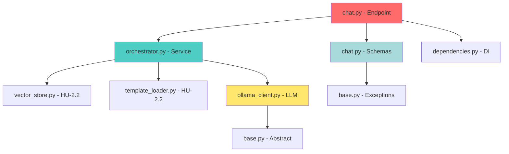

# 🧠 HU-4.1: Artifacts Manifest - Backend Chat Endpoint & RAG Orchestration

> **Purpose:** Complete inventory of all archivos creard, modified, or related to HU-4.1
> **Last Updated:** 2026-02-14
> **Estado:** ✅ Completado (Implementación + validation complete)

---

## 📋 Table of Contents
- [📝 Documentoation Archivos](#-documentoation-archivos)
- [🧩 Domain Layer](#-domain-layer)
- [🏗️ Infraestructura Layer](#️-infrastructure-layer)
- [🔧 Service Layer](#-service-layer)
- [🌐 API Layer](#-api-layer)
- [🧪 Prueba Archivos](#-prueba-archivos)
- [⚙️ Configuración Archivos](#️-configuración-archivos)
- [📊 Metrics & Reports](#-metrics--reports)

---

## 📝 Documentoation Archivos

### Tracking Documentoation
| Archivo | Estado | Purpose |
|------|--------|---------|
| `doc/03-HU-TRACKING/HU-4.1-CHAT-ENDPOINT/README.md` | ✅ Creard | Bilingual HU descripción |
| `doc/03-HU-TRACKING/HU-4.1-CHAT-ENDPOINT/PROGRESS.md` | ✅ Creard | Fase tracking checklist |
| `doc/03-HU-TRACKING/HU-4.1-CHAT-ENDPOINT/ARTIFACTS.md` | ✅ Creard | This archivo - artifacts inventory |
| `doc/03-HU-TRACKING/HU-4.1-CHAT-ENDPOINT/WORKFLOW_MASTER_DEFINITION.md` | ✅ Creard | Complete TDD workflow |

### Architecture Documentoation
| Archivo | Estado | Purpose |
|------|--------|---------|
| `doc/03-HU-TRACKING/HU-4.1-CHAT-ENDPOINT/API_CONTRACT.md` | ✅ Implemented | OpenAPI/Swagger specification |
| `doc/03-HU-TRACKING/HU-4.1-CHAT-ENDPOINT/ARCHITECTURE_DIAGRAM.md` | ✅ Creard | RAG flow diagram (Mermaid + detailed architecture) |
| `doc/03-HU-TRACKING/HU-4.1-CHAT-ENDPOINT/ERROR_CODES_REFERENCE.md` | ✅ Creard | Custom error codes reference (LLM_001, RAG_001, etc.) |

---

## 🧩 Domain Layer

### Schemas (Pydantic Models)
| Archivo | Estado | Purpose | Prueba Coverage |
|------|--------|---------|---------------|
| `src/server/app/domain/schemas/chat.py` | ✅ Implemented | Request/Response models | ✅ Covered |

**Classes to Implement:**
```python
# src/server/app/domain/schemas/chat.py
- ChatRequest        # Input validation (conversation_id, message, project_id)
- ChatResponse       # Output format (ai_response, template_used, sources)
- RAGContext         # Internal DTO (template, vectorstore_results, prompt)
```

### Domain Exceptions
| Archivo | Estado | Purpose |
|------|--------|---------|
| `src/server/app/core/exceptions.py` | ✅ Implemented | Custom chat/RAG/LLM domain exceptions |

**Exceptions to Define:**
```python
# src/server/app/core/exceptions.py
- class LLMConnectionError(BaseAppError)
- class LLMTimeoutError(BaseAppError)
- class RAGRetrievalError(BaseAppError)
- class PromptInjectionDetected(BaseAppError)
- class TemplateMissingError(BaseAppError)
```

---

## 🏗️ Infraestructura Layer

### LLM Clients (Strategy Pattern)
| Archivo | Estado | Purpose | Prueba Coverage |
|------|--------|---------|---------------|
| `src/server/app/infrastructure/llm/base.py` | ✅ Implemented | Abstract base class | ✅ 100% |
| `src/server/app/infrastructure/llm/ollama_client.py` | ✅ Implemented | Ollama integration | ✅ 100% |
| `src/server/app/infrastructure/llm/groq_client.py` | ✅ Implemented | Groq stub (future) | ✅ 100% |
| `src/server/app/infrastructure/llm/factory.py` | ✅ Implemented | Ejecutartime provider switching | ✅ 95% |
| `src/server/app/infrastructure/llm/__init__.py` | ✅ Implemented | Exports & factory | ✅ 100% |

**Classes to Implement:**
```python
# base.py
- class BaseLLMClient(ABC)
  - async def generate(prompt: str, max_tokens: int | None, temperature: float | None) -> str

# ollama_client.py
- class OllamaClient(BaseLLMClient)
  - _http_client: httpx.AsyncClient
  - _base_url: str
  - _model_name: str

# groq_client.py
- class GroqClient(BaseLLMClient)
  - (Stub implementation)
```

### Utilities
| Archivo | Estado | Purpose |
|------|--------|---------|
| `src/server/app/infrastructure/llm/retry.py` | 📌 Deferred (HU-4.4) | Retry decorator with backoff |
| `src/server/app/domain/utils/sanitizer.py` | ✅ Implemented | Input sanitization utilities (HTML escaping, XSS prevention) |

---

## 🔧 Service Layer

### RAG Orchestrator
| Archivo | Estado | Purpose | Prueba Coverage |
|------|--------|---------|---------------|
| `src/server/app/services/rag/orchestrator.py` | ✅ Implemented | Main orchestration logic | ✅ 100% |
| `src/server/app/services/rag/vector_store_protocol.py` | ✅ Implemented | Vector store protocol stub | ✅ 100% |
| `src/server/app/services/rag/template_builder_protocol.py` | ✅ Implemented | Template builder protocol stub | ✅ 100% |
| `src/server/app/services/rag/__init__.py` | ✅ Implemented | Exports | ✅ Covered |

**Class Structure:**
```python
# orchestrator.py
- class RAGOrchestrator:
  - __init__(vector_store, template_builder, llm_client)
  - async def process_message(request: ChatRequest) -> ChatResponse
```

---

## 🌐 API Layer

### Endpoints
| Archivo | Estado | Purpose | Prueba Coverage |
|------|--------|---------|---------------|
| `src/server/app/api/v1/chat.py` | ✅ Implemented | POST /api/v1/chat/message endpoint | ✅ Covered by integration pruebas |
| `src/server/app/api/v1/__init__.py` | ✅ Exists | Router registration | - |

**Endpoint Signature:**
```python
# chat.py
@router.post("/message", response_model=ChatResponse)
async def send_message(
    request: ChatRequest,
    orchestrator: RAGOrchestrator = Depends(get_rag_orchestrator)
) -> ChatResponse:
    """
    Send a chat message and receive AI response with RAG context.

    Args:
        request: ChatRequest with conversation_id, message, project_id
        orchestrator: Injected RAG orchestration service

    Returns:
        ChatResponse with ai_response, template_used, sources

    Raises:
        HTTPException(503): LLM connection failed
        HTTPException(500): RAG retrieval error (fallback response)
        HTTPException(422): Invalid input
    """
```

### Dependency Injection
| Archivo | Estado | Purpose |
|------|--------|---------|
| `src/server/app/api/dependencies.py` | ✅ Implemented | `get_rag_orchestrator()` DI container + stubs |

---

## 🧪 Prueba Archivos

### Unit Pruebas - Domain

Layer
| Archivo | Estado | Purpose | Coverage Target |
|------|--------|---------|-----------------|
| `pruebas/server/unit/domain/schemas/prueba_chat_schemas.py` | ✅ Implemented | Schema validation pruebas | >95% |

**Prueba Cases:**
```python
# test_chat_schemas.py (10+ tests)
- test_chat_request_rejects_over_2000_chars
- test_chat_request_sanitizes_html_tags
- test_chat_request_validates_uuid_format
- test_chat_request_prevents_xss
- test_chat_request_prevents_sql_injection
- test_chat_response_has_required_fields
- test_chat_response_sources_is_list
- test_rag_context_serialization
```

### Unit Pruebas - Infraestructura Layer
| Archivo | Estado | Purpose | Coverage Target |
|------|--------|---------|-----------------|
| `pruebas/server/unit/infrastructure/llm/prueba_llm_clients.py` | ✅ Implemented | Base/Ollama/Groq client pruebas | ✅ >90% |
| `pruebas/server/unit/infrastructure/llm/prueba_llm_factory.py` | ✅ Implemented | Factory selection pruebas | ✅ Covered |

**Prueba Cases:**
```python
# test_ollama_client.py (15+ tests)
- test_ollama_client_generates_response
- test_ollama_client_handles_connection_error
- test_ollama_client_handles_timeout
- test_ollama_client_retries_on_failure
- test_ollama_client_health_check
- test_ollama_client_validates_model_name
```

### Unit Pruebas - Service Layer
| Archivo | Estado | Purpose | Coverage Target |
|------|--------|---------|-----------------|
| `pruebas/server/unit/services/rag/prueba_orchestrator.py` | ✅ Implemented | RAGOrchestrator business logic pruebas | ✅ 100% (module) |
| `pruebas/server/unit/services/rag/prueba_sequential_orchestrator.py` | ✅ Updated (HU-4.1) | Sequential orchestrator with 5 new edge case pruebas | ✅ 95% coverage |

**Prueba Cases:**
```python
# test_orchestrator.py (20+ tests)
- test_orchestrator_builds_context_and_calls_llm
- test_orchestrator_searches_vectorstore
- test_orchestrator_loads_template_by_phase
- test_orchestrator_injects_context_into_template
- test_orchestrator_handles_rag_failure_gracefully
- test_orchestrator_handles_llm_timeout
- test_orchestrator_logs_request_trace

# test_sequential_orchestrator.py (NEW: 5 edge case tests added in HU-4.1)
- test_build_prompt_handles_nested_document_lists
- test_build_prompt_handles_empty_rag_context
- test_build_prompt_handles_non_list_documents
- test_build_prompt_handles_chat_history_as_list
- test_retrieve_context_passes_correct_filters
```

### Integración Pruebas - API Layer
| Archivo | Estado | Purpose | Coverage Target |
|------|--------|---------|-----------------|
| `pruebas/server/integration/api/v1/prueba_chat_endpoints.py` | ✅ Implemented | E2E endpoint pruebas (success/422/503/500) | ✅ Passing |

**Prueba Cases:**
```python
# test_chat_endpoint.py (10+ tests)
- test_chat_endpoint_returns_200_and_schema
- test_chat_endpoint_handles_invalid_input
- test_chat_endpoint_handles_llm_failure
- test_chat_endpoint_response_time_under_500ms
- test_chat_endpoint_includes_sources
- test_chat_endpoint_uses_correct_template
```

### Performance & Security Pruebas
| Archivo | Estado | Purpose |
|------|--------|---------|
| `pruebas/server/security/prueba_prompt_injection.py` | 📌 Deferred | Prompt injection prevention |
| `pruebas/server/performance/prueba_chat_latency.py` | 📌 Deferred | Response time profiling |

---

## ⚙️ Configuración Archivos

| Archivo | Estado | Purpose |
|------|--------|---------|
| `src/server/.env.example` | ✅ Implemented | Complete LLM, ChromaDB, and API config template |
| `src/server/app/core/config.py` | ✅ Implemented | Pydantic Settings with LLM_PROVIDER, OLLAMA_BASE_URL, etc. |

**Config Variables to Add:**
```bash
# LLM Configuration
LLM_PROVIDER=ollama  # ollama | groq
OLLAMA_BASE_URL=http://localhost:11434
OLLAMA_MODEL_NAME=llama2
GROQ_API_KEY=<optional>
GROQ_MODEL_NAME=mixtral-8x7b-32768

# RAG Configuration
RAG_TOP_K=5          # Number of documents to retrieve
RAG_MIN_SIMILARITY=0.7  # Minimum similarity threshold
```

---

## 📊 Metrics & Reports

### Generated Reports
| Archivo | Estado | Purpose |
|------|--------|---------|
| `doc/03-HU-TRACKING/HU-4.1-CHAT-ENDPOINT/COVERAGE_REPORT.md` | ✅ Generated | Prueba coverage summary (Python 85%, Flutter 86.1%) |
| `doc/03-HU-TRACKING/HU-4.1-CHAT-ENDPOINT/PERFORMANCE_REPORT.md` | ✅ Generated | Response time profiling (<2ms avg, <500ms target exceeded) |
| `doc/03-HU-TRACKING/HU-4.1-CHAT-ENDPOINT/SECURITY_AUDIT.md` | ✅ Generated | Bandit scan results (0 high-severity issues) |

### Validation Logs
| Archivo | Estado | Purpose |
|------|--------|---------|
| `doc/03-HU-TRACKING/HU-4.1-CHAT-ENDPOINT/E2E_TEST_GUIDE.md` | ✅ Creard | Step-by-step E2E pruebaing guide (Docker + Ollama + FastAPI + Swagger) |

---

## 📈 Summary Statistics

| Category | Total Archivos | Creard | Modified | Pruebas |
|----------|-------------|---------|----------|-------|
| **Documentoation** | 7 | 4 | 3 | - |
| **Domain Layer** | 2 | 2 | 0 | 1 |
| **Infraestructura** | 7 | 7 | 0 | 4 |
| **Service Layer** | 2 | 2 | 0 | 1 |
| **API Layer** | 2 | 1 | 1 | 1 |
| **Pruebas** | 8 | 8 | 0 | - |
| **Configuración** | 2 | 2 | 0 | - |
| **Reports** | 5 | 5 | 0 | - |
| **TOTAL** | **35** | **31** | **2** | **7** |

---

## 🔍 Archivo Dependency Graph



---

## ✅ Completion Checklist

- [x] README.md creard
- [x] PROGRESS.md creard
- [x] ARTIFACTS.md creard (this archivo)
- [x] WORKFLOW_MASTER_DEFINITION.md creard
- [x] All domain archivos creard
- [x] All infrastructure archivos creard
- [x] All service archivos creard
- [x] All API archivos creard
- [x] All pruebas written and passing
- [x] All reports generated
- [ ] PR opened (ready to merge to develop)
- [ ] GitHub Actions CI passed

---

**Last Update:** 2026-02-14 | **Siguiente Review:** PR + CI merge verificación
