# 🏗️ HU-4.2: System Architecture Diagrams

> **Versión:** 1.0.0
> **Architectural Pattern:** Clean Architecture + Hexagonal Architecture (Ports & Adapters)
> **Fecha:** 2026-02-14

---

## 📋 Table of Contents

1. [Overview](#overview)
2. [Clean Architecture Layers](#clean-architecture-layers)
3. [Data Flow Diagram](#data-flow-diagram)
4. [Component Relationships](#component-relationships)
5. [Persistence Architecture](#persistence-architecture)
6. [Request/Response Lifecycle](#requestresponse-lifecycle)
7. [Dependency Rules](#dependency-rules)

---

## 🔍 Overview

### Architectural Principles

| Principle | Implementación |
|-----------|----------------|
| **Separation of Concerns** | Clean Architecture 4 layers |
| **Dependency Inversion** | Domain layer independent |
| **Pruebaability** | 96% prueba coverage |
| **Framework Independence** | Business logic decoupled |
| **Database Independence** | Repository pattern abstraction |

### Layer Responsibilities

| Layer | Responsibility | Dependencies |
|-------|----------------|--------------|
| **Domain** | Business entities, rules | None (pure Python) |
| **Infraestructura** | Database, persistence | Domain only |
| **Service** | Use cases, orchestration | Domain + Infraestructura |
| **API** | HTTP endpoints, validation | Service + Domain schemas |

---

## 🧱 Clean Architecture Layers

### Layer Structure (Conceptual)

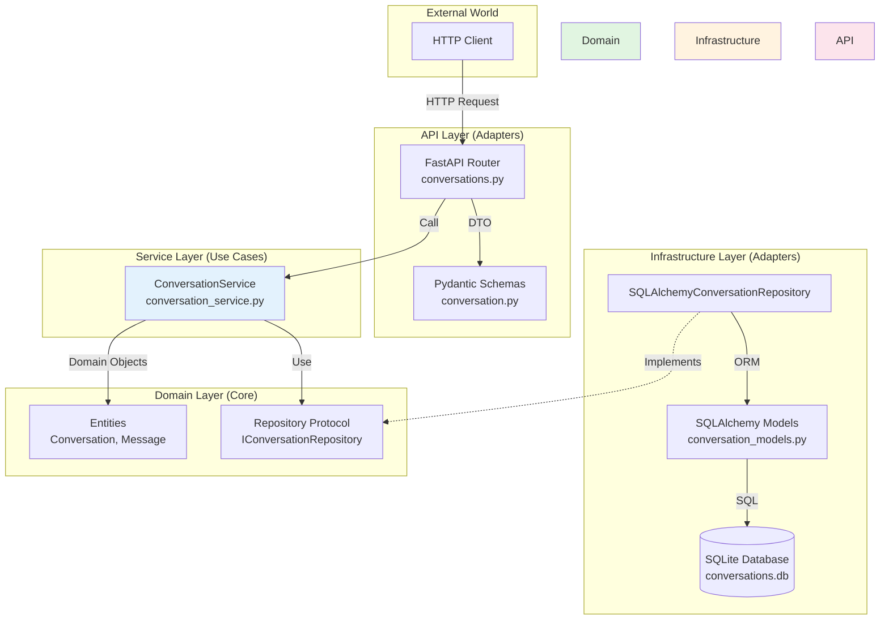

---

## 🔄 Data Flow Diagram

### Request → Response Flow

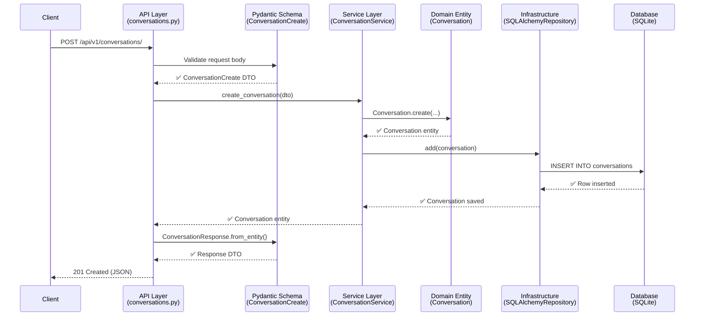

---

## 🧩 Component Relationships

### Dependency Graph

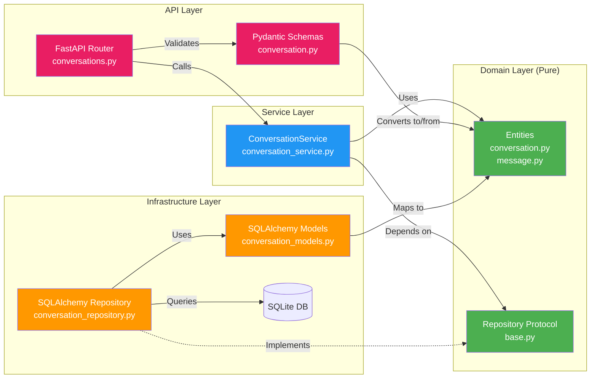

**Legend:**
- 🟢 **Green:** Domain Layer (Pure Business Logic)
- 🔵 **Blue:** Service Layer (Use Cases)
- 🟠 **Orange:** Infraestructura Layer (Persistence)
- 🔴 **Pink:** API Layer (HTTP Interface)

---

## 💾 Persistence Architecture

### SQLAlchemy + SQLite Stack

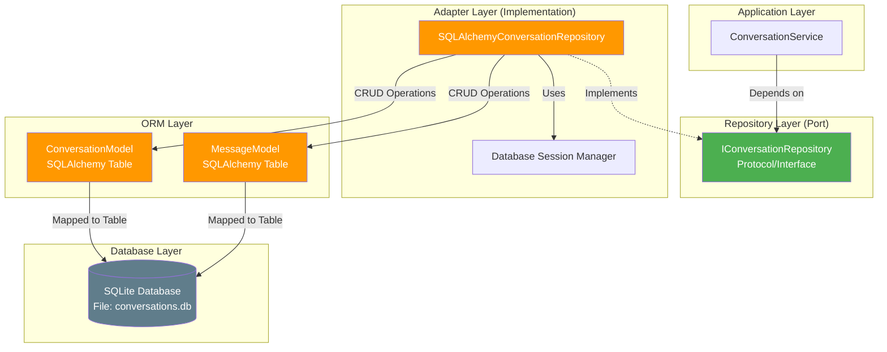

### Table Schema (Entity-Relationship)

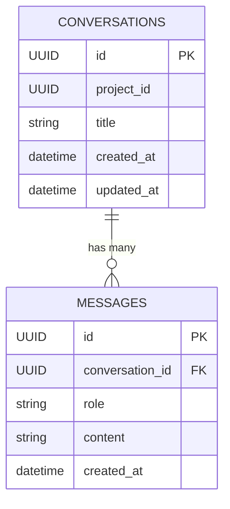

**Relationships:**
- One conversation has many messages (1:N)
- Messages are cascade-eliminard when conversation is eliminard
- All IDs are UUID v4 format

---

## 🔁 Request/Response Lifecycle

### POST /conversations/ (Crear)

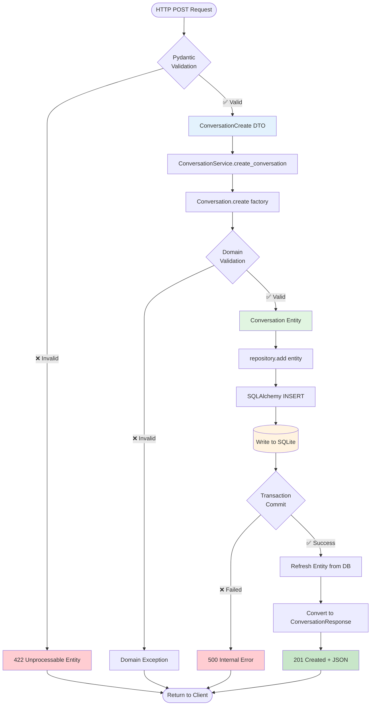

---

### GET /conversations/{id} (Retrieve)

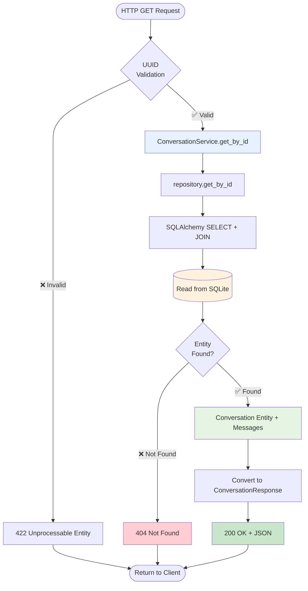

---

### GET /conversations/ (List)

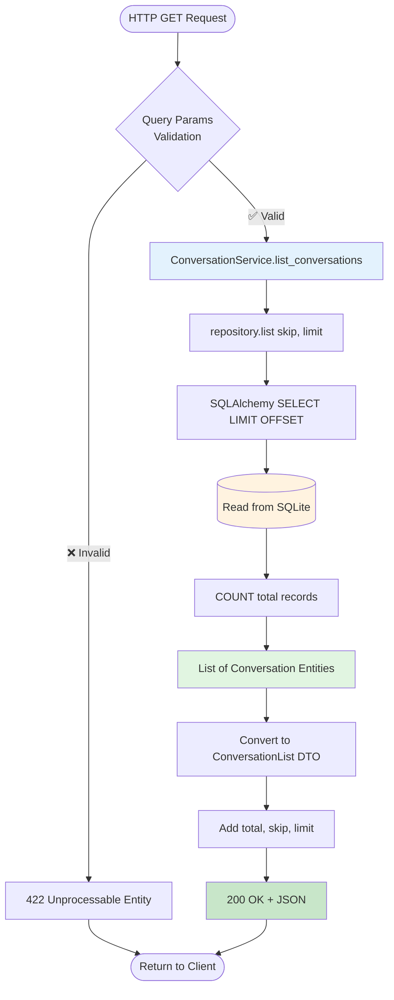

---

## 🚫 Dependency Rules

### The Dependency Rule (Clean Architecture)

> **Core Principle:** Dependencies can only point **inwards**. Outer layers depend on inner layers, but inner layers know nothing about outer layers.

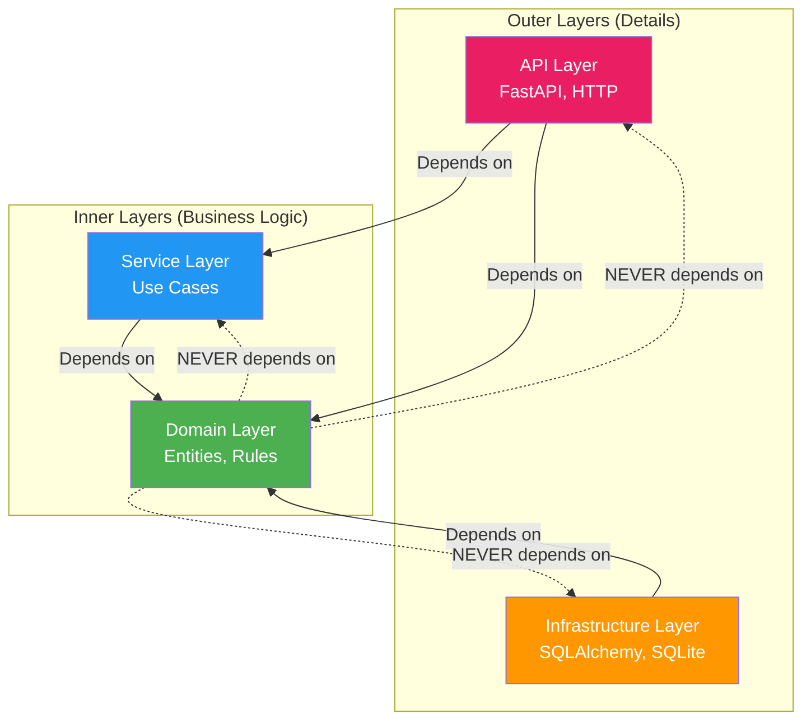

### Dependency Matrix

| From ↓ / To → | Domain | Service | Infraestructura | API |
|---------------|--------|---------|----------------|-----|
| **Domain** | ✅ | ❌ | ❌ | ❌ |
| **Service** | ✅ | ✅ | ✅ (via interface) | ❌ |
| **Infraestructura** | ✅ | ❌ | ✅ | ❌ |
| **API** | ✅ | ✅ | ✅ (for DI) | ✅ |

**Legend:**
- ✅ Allowed dependency
- ❌ Forbidden dependency (violates Clean Architecture)

---

## 📐 Hexagonal Architecture (Ports & Adapters)

### Primary & Secondary Ports

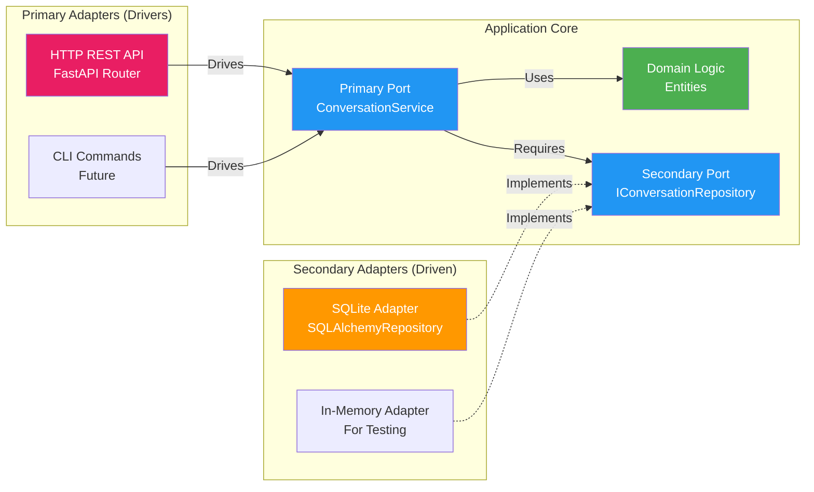

**Explanation:**
- **Primary Ports (Left):** Application services (driven by external actors)
- **Secondary Ports (Right):** Repository interfaces (required by application)
- **Primary Adapters:** HTTP API, CLI (future)
- **Secondary Adapters:** SQLite persistence, in-memory pruebaing adapter

---

## 🧪 Pruebaing Architecture

### Prueba Pyramid

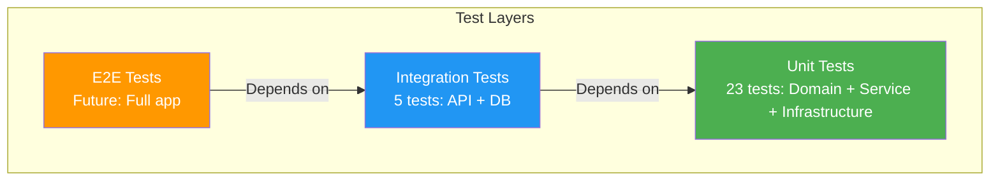

**Coverage Desglose:**
- **Unit Pruebas:** 23 pruebas (Domain 11, Infraestructura 6, Service 6)
- **Integración Pruebas:** 5 pruebas (API endpoints with real DB)
- **Total Coverage:** 96% (199/205 statements)

---

## 🔗 Related Documentoation

- **API Contract:** [API_CONTRACT.md](./API_CONTRACT.md)
- **Coverage Report:** [COVERAGE_REPORT.md](./COVERAGE_REPORT.md)
- **Security Audit:** [SECURITY_AUDIT.md](./SECURITY_AUDIT.md)
- **Clean Architecture Reference:** Uncle Bob's Clean Architecture (2012)

---

## ✅ Architecture Validation

| Criteria | Estado | Evidence |
|----------|--------|----------|
| **Dependency Rule** | ✅ Pass | 0 Pyright errors (no circular deps) |
| **Layer Separation** | ✅ Pass | Clear carpeta structure: domain/ infra/ services/ api/ |
| **Pruebaability** | ✅ Pass | 96% coverage, pruebas isolated |
| **Framework Independence** | ✅ Pass | Domain layer has 0 FastAPI/SQLAlchemy imports |
| **Database Independence** | ✅ Pass | Repository protocol abstracts persistence |

**Architecture Estado:** ✅ **COMPLIANT WITH CLEAN ARCHITECTURE**

---

*Architecture Diagram v1.0.0 - Generated 2026-02-14*
*Clean Architecture + Hexagonal Pattern*
