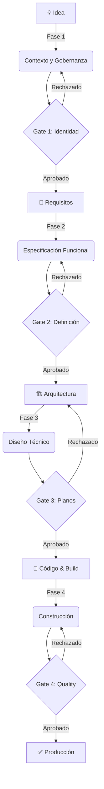

# 🗺️ Master Workflow: De la Idea a la Producción

Este es el camino que todo proyecto en SoftArchitect debe recorrer. No hay atajos.

## 📋 Las 4 Fases Explicadas

### **Fase 1: Gobernanza e Identidad**
Objetivo: Definir quiénes somos y las reglas.

**Entregables:**
- `AGENTS.md` - Roles y responsabilidades
- `RULES.md` - Reglas del proyecto
- `PROJECT_MANIFESTO.md` - Propósito y promesa
- `USER_JOURNEY_MAP.md` - Mapa de usuarios

**Gate 1: Identidad**
- ✅ Todos los documentos existen
- ✅ Mínimo 500 caracteres cada uno
- ✅ Equipos y roles claros

---

### **Fase 2: Especificación y Seguridad**
Objetivo: Definir qué haremos (sin código).

**Entregables:**
- `REQUIREMENTS_MASTER.md` - Requisitos funcionales completos
- `USER_STORIES_MASTER.json` - Historias de usuario estructuradas
- `SECURITY_PRIVACY_POLICY.md` - Política de seguridad

**Gate 2: Definición**
- ✅ JSON válido y bien formado
- ✅ Todas las historias tienen criterios de aceptación
- ✅ Seguridad documentada y revisada

---

### **Fase 3: Arquitectura Técnica**
Objetivo: Definir cómo lo haremos.

**Entregables:**
- `TECH_STACK_DECISION.md` - Stack elegido y justificación
- `PROJECT_STRUCTURE_MAP.md` - Árbol de directorios
- `API_INTERFACE_CONTRACT.md` - Contrato de API
- `SECURITY_THREAT_MODEL.md` - Análisis de amenazas

**Gate 3: Planos**
- ✅ Stack está en APPROVED_TECH_PACKS.json
- ✅ Estructura respeta Clean Architecture
- ✅ Amenazas de seguridad identificadas y mitigadas

---

### **Fase 4: Construcción (Código)**
Objetivo: Implementar según los planos.

**Solo accesible tras superar Gate 3.**

**Acciones:**
1. Scaffolding automático de estructura de carpetas
2. Generación de Dockerfiles desde Tech Pack
3. Implementación de código base (Starter Templates)
4. Tests automatizados generados desde User Stories

**Gate 4: Quality**
- ✅ Tests: 80%+ coverage
- ✅ Linting: 0 errores
- ✅ Security: Bandit 0 HIGH issues
- ✅ Build: ✅ PASS

---

## 🎯 Regla de Oro

> **No puedes avanzar a la siguiente fase si no has superado el gate anterior.**

Esto garantiza que:
- 🔒 La seguridad está diseñada, no parchada después
- 📐 La arquitectura está definida antes de código
- 📋 Los requisitos están claros antes de construir
- ✅ La calidad es medible en cada paso
