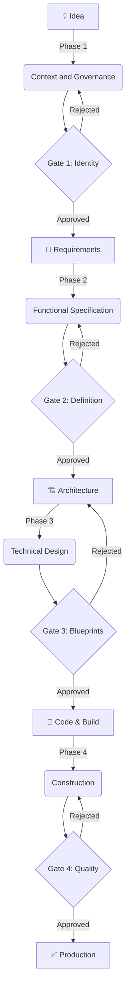

# 🗺️ Master Workflow: From Idea to Production

This is the path every project in SoftArchitect must follow. There are no shortcuts.

```mermaid
graph TD
    A[💡 Idea] -->|Phase 1| B(Context and Governance)
    B --> C{Gate 1: Identity}
    C -->|Approved| D[📝 Requirements]
    C -->|Rejected| B

    D -->|Phase 2| E(Functional Specification)
    E --> F{Gate 2: Definition}
    F -->|Approved| G[🏗️ Architecture]
    F -->|Rejected| E

    G -->|Phase 3| H(Technical Design)
    H --> I{Gate 3: Blueprints}
    I -->|Approved| J[🚀 Code & Build]
    I -->|Rejected| G

    J -->|Phase 4| K(Construction)
    K --> L{Gate 4: Quality}
    L -->|Approved| M[✅ Production]
    L -->|Rejected| K
```

## 📋 The 4 Phases Explained

### **Phase 1: Governance and Identity**
Objective: Define who we are and the rules.

**Deliverables:**
- `AGENTS.md` - Roles and responsibilities
- `RULES.md` - Project rules
- `PROJECT_MANIFESTO.md` - Purpose and promise
- `USER_JOURNEY_MAP.md` - User map

**Gate 1: Identity**
- ✅ All documents exist
- ✅ Minimum 500 characters each
- ✅ Clear teams and roles

---

### **Phase 2: Specification and Security**
Objective: Define what we will do (without code).

**Deliverables:**
- `REQUIREMENTS_MASTER.md` - Complete functional requirements
- `USER_STORIES_MASTER.json` - Structured user stories
- `SECURITY_PRIVACY_POLICY.md` - Security policy

**Gate 2: Definition**
- ✅ Valid and well-formed JSON
- ✅ All stories have acceptance criteria
- ✅ Security documented and reviewed

---

### **Phase 3: Technical Architecture**
Objective: Define how we will do it.

**Deliverables:**
- `TECH_STACK_DECISION.md` - Chosen stack and justification
- `PROJECT_STRUCTURE_MAP.md` - Directory tree
- `API_INTERFACE_CONTRACT.md` - API contract
- `SECURITY_THREAT_MODEL.md` - Threat analysis

**Gate 3: Blueprints**
- ✅ Stack is in APPROVED_TECH_PACKS.json
- ✅ Structure respects Clean Architecture
- ✅ Security threats identified and mitigated

---

### **Phase 4: Construction (Code)**
Objective: Implement according to the blueprints.

**Only accessible after passing Gate 3.**

**Actions:**
1. Automatic scaffolding of folder structure
2. Dockerfile generation from Tech Pack
3. Base code implementation (Starter Templates)
4. Automated tests generated from User Stories

**Gate 4: Quality**
- ✅ Tests: 80%+ coverage
- ✅ Linting: 0 errors
- ✅ Security: Bandit 0 HIGH issues
- ✅ Build: ✅ PASS

---

## 🎯 Golden Rule

> **You cannot advance to the next phase if you have not passed the previous gate.**

This guarantees that:
- 🔒 Security is designed, not patched later
- 📐 Architecture is defined before code
- 📋 Requirements are clear before building
- ✅ Quality is measurable at every step
