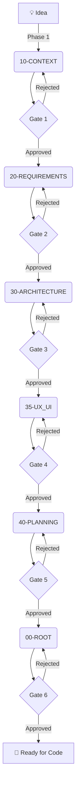

# 🗺️ Master Workflow: From Idea to Production

This is the path every project in SoftArchitect must follow. There are no shortcuts. The AI Agent will generate the documentation strictly in this 24-step sequential order to build context cumulatively.

```mermaid
graph TD
    A[💡 Idea] -->|Phase 1| B(10-CONTEXT)
    B --> C{Gate 1}
    C -->|Approved| D(20-REQUIREMENTS)
    C -->|Rejected| B

    D --> E{Gate 2}
    E -->|Approved| F(30-ARCHITECTURE)
    E -->|Rejected| D

    F --> G{Gate 3}
    G -->|Approved| H(35-UX_UI)
    G -->|Rejected| F

    H --> I{Gate 4}
    I -->|Approved| J(40-PLANNING)
    I -->|Rejected| H

    J --> K{Gate 5}
    K -->|Approved| L(00-ROOT)
    K -->|Rejected| J

    L --> M{Gate 6}
    M -->|Approved| N[🚀 Ready for Code]
    M -->|Rejected| L

```

## 📋 The 6 Phases Explained (24 Sequential Steps)

### **Phase 1: Context (The "Why" and "Who")**

**Objective:** Define the global vision, business goals, and the shared vocabulary before touching any technical aspect.
**Path:** `context/10-CONTEXT/`

**Deliverables:**

1. `PROJECT_MANIFESTO.md` - Product vision, mission, and core objectives.
2. `DOMAIN_LANGUAGE.md` - Strict glossary for ubiquitous language.
3. `USER_JOURNEY_MAP.md` - How the user interacts with the idea.

**Gate 1: Context Definition**

* ✅ All 3 documents exist and are coherent.
* ✅ Domain language is clearly defined and used in the manifesto.

---

### **Phase 2: Requirements (The "What")**

**Objective:** Translate the business vision into formal, testable requirements and security policies.
**Path:** `context/20-REQUIREMENTS/`

**Deliverables:**
4. `REQUIREMENTS_MASTER.md` - Functional and non-functional requirements.
5. `USER_STORIES_MASTER.json` - Epics and structured user stories (Backlog).
6. `SECURITY_PRIVACY_POLICY.md` - Business rules on data privacy (e.g., GDPR).
7. `COMPLIANCE_MATRIX.md` - Regulatory compliance tracking.

**Gate 2: Specification**

* ✅ JSON is valid and well-formed.
* ✅ All user stories have acceptance criteria.
* ✅ Privacy policies cover the user journey.

---

### **Phase 3: Architecture (The "How" - Technical)**

**Objective:** Define the technological foundation, data models, and system interactions.
**Path:** `context/30-ARCHITECTURE/`

**Deliverables:**
8. `TECH_STACK_DECISION.md` - Chosen technologies with justifications.
9. `DATA_MODEL_SCHEMA.md` - Entity-Relationship design.
10. `API_INTERFACE_CONTRACT.md` - Endpoints, WebSockets, and communication contracts.
11. `PROJECT_STRUCTURE_MAP.md` - Physical directory tree design.
12. `SECURITY_THREAT_MODEL.md` - Technical threat analysis and mitigations.
13. `ARCH_DECISION_RECORDS.md` - History of architectural decisions (ADRs).

**Gate 3: Blueprints**

* ✅ Tech stack aligns with the project manifesto.
* ✅ API contracts map directly to the User Stories.
* ✅ Security threats identified and mitigated.

---

### **Phase 4: UX/UI (The "Look & Feel")**

**Objective:** Establish the visual layer, interaction flows, and accessibility standards.
**Path:** `context/35-UX_UI/`

**Deliverables:**
14. `DESIGN_SYSTEM.md` - Color palette (HEX), typography, and base components.
15. `UI_WIREFRAMES_FLOW.md` - Step-by-step screen flows based on user journey.
16. `ACCESSIBILITY_GUIDE.md` - a11y standards and semantic guidelines.

**Gate 4: Interface**

* ✅ UI Flows cover all main user stories.
* ✅ Accessibility guidelines are clearly defined.

---

### **Phase 5: Planning (The "When" and "Ops")**

**Objective:** Define the delivery strategy, cloud infrastructure, and DevOps pipelines.
**Path:** `context/40-PLANNING/`

**Deliverables:**
17. `ROADMAP_PHASES.md` - Sprints and delivery milestones.
18. `DEPLOYMENT_INFRASTRUCTURE.md` - Cloud architecture and server provisioning.
19. `CI_CD_PIPELINE.md` - GitHub Actions / GitLab CI workflows.
20. `TESTING_STRATEGY.md` - QA rules (Unit, E2E, Integration).

**Gate 5: Operability**

* ✅ Roadmap matches the epics.
* ✅ Deployment infrastructure supports the chosen tech stack.

---

### **Phase 6: ROOT / META (The "Glue")**

**Objective:** Compile all generated knowledge into the master operational files. These files live in the project's root directory.
**Path:** `/` (Project Root)

**Deliverables:**
21. `RULES.md` - Specific coding rules derived from the Tech Stack and Architecture.
22. `CONTRIBUTING.md` - Rules for human/AI teams regarding PRs and commits.
23. `AGENTS.md` - System prompts and context paths for AI Coding Agents (Cursor/Copilot).
24. `README.md` - The ultimate project storefront, linking to all key documents.

**Gate 6: Master Ready**

* ✅ NO files placed inside `context/00-ROOT/` (Must be at the root).
* ✅ AGENTS.md successfully links to Architecture and UX/UI files.
* ✅ Ready for code scaffolding.

---

## 🎯 Golden Rule

> **You cannot advance to the next phase if you have not passed the previous gate.**

This guarantees that:

* 🔒 Security is designed, not patched later.
* 📐 Architecture is defined before code.
* 📋 Requirements are clear before building.
* 🤖 AI Coding Agents have perfect context before writing the first line of code.
