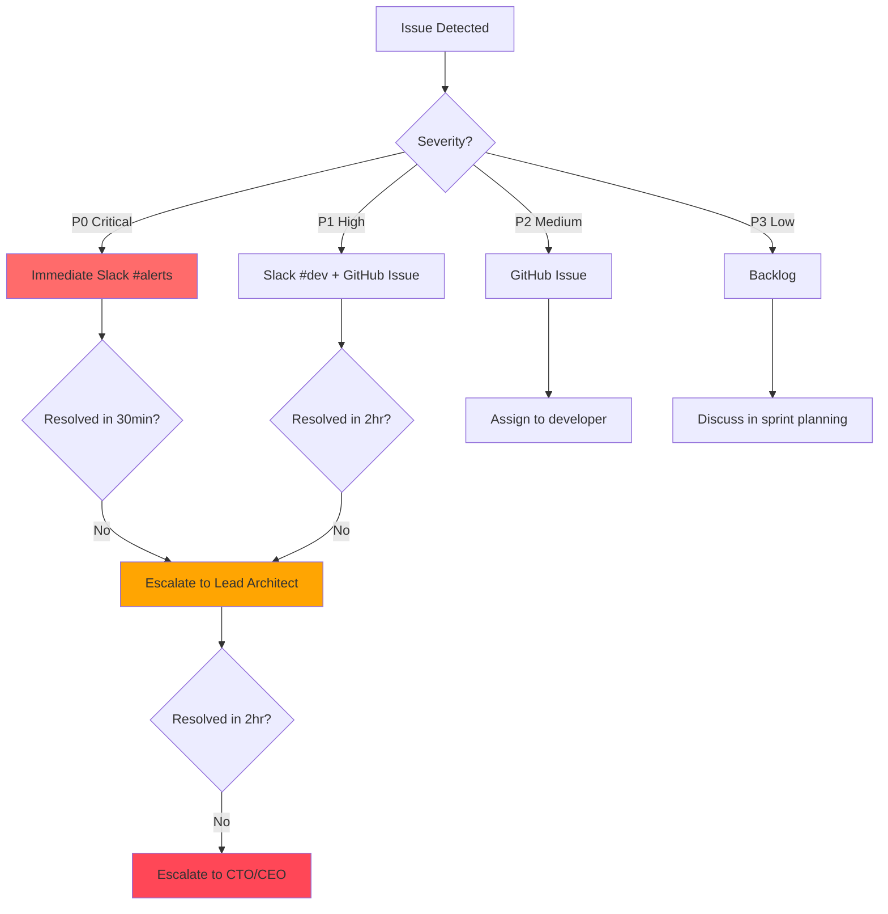

# 🤖 AGENTS: Project Roles & Responsibilities

<!--
════════════════════════════════════════════════════════════════════════════════
📘 TEMPLATE GUIDE: How to Fill Out This Document
════════════════════════════════════════════════════════════════════════════════

PURPOSE:
This document defines WHO does WHAT in your project. It establishes:
- Human team members and their decision-making authority
- AI agents and their operational boundaries
- Communication protocols and escalation paths

WHY THIS MATTERS:
- Prevents confusion about who approves what
- SoftArchitect AI uses this to know who to obey and what tone to use
- Essential for multi-agent AI systems (prevents conflicting directives)

WHEN TO CREATE:
- **Generation Order:** 1/24 (FIRST document in Master Workflow)
- **Prerequisites:** None
- **Duration:** ~15 minutes

INSTRUCTIONS:
1. Replace all {{PLACEHOLDERS}} with your actual values
2. Remove sections marked [OPTIONAL] if not applicable
3. Keep GUIDELINE comments (<!-- ... -->) during initial draft
4. Remove GUIDELINE comments once finalized
5. Update version number in metadata when making changes

RELATED DOCUMENTS:
- README.md (references team members)
- RULES.md (enforces RACI matrix)
- CONTRIBUTING.md (uses roles for PR approval)
════════════════════════════════════════════════════════════════════════════════
-->

> **Project:** {{PROJECT_NAME}}  <!-- e.g., TaskFlow Pro -->
> **Document Type:** Agent & Role Definition
> **Version:** 1.0.0
> **Last Updated:** {{CURRENT_DATE}}  <!-- e.g., January 15, 2025 -->
> **Status:** 🚧 Draft | ✅ Active | 🔒 Approved
> **Owner:** {{LEAD_ARCHITECT_NAME}}  <!-- e.g., Sarah Chen -->

---

## 📖 Table of Contents

- [Document Purpose](#document-purpose)
- [Human Roles](#human-roles)
- [AI Agents](#ai-agents)
- [Decision-Making Authority (RACI Matrix)](#decision-making-authority-raci-matrix)
- [Communication Protocols](#communication-protocols)
- [Escalation Paths](#escalation-paths)
- [Role Assignment History](#role-assignment-history)

---

## 🎯 Document Purpose

<!-- GUIDELINE: Explain WHY this document exists.
     BEST PRACTICE: Be specific about how SoftArchitect AI will use this information. -->

This document defines the **roles and responsibilities** for the **{{PROJECT_NAME}}** project. It serves as the **source of truth** for:

1. **Who has decision-making authority** (approvals, vetoes, final say)
2. **Who AI agents report to** (command chain for multi-agent systems)
3. **Who reviews and approves deliverables** (PR reviews, document sign-offs)
4. **Who escalates issues** (when conflicts or blockers arise)

**How SoftArchitect AI Uses This:**
- **Tone Calibration:** Adjusts formality based on role (e.g., formal with stakeholders, technical with developers)
- **Permission Checks:** Validates who can approve architectural decisions
- **Escalation Logic:** Routes critical issues to correct stakeholders

---

## 👥 Human Roles

<!-- GUIDELINE: List all human team members involved in the project.
     BEST PRACTICE: Use RACI framework (Responsible, Accountable, Consulted, Informed).
     ANTI-PATTERN: Don't leave roles vague like "Developer" without names. -->

### 1. Lead Architect / Tech Lead

**Name:** {{LEAD_ARCHITECT_NAME}}  <!-- e.g., Sarah Chen -->
**Role:** Lead Architect
**Email:** {{LEAD_EMAIL}}  <!-- e.g., sarah.chen@company.com -->
**GitHub:** @{{GITHUB_USERNAME}}  <!-- e.g., @sarahchen -->

**Responsibilities:**
- ✅ Define system architecture and technical vision
- ✅ Approve Architecture Decision Records (ADRs)
- ✅ Review critical PRs (security, performance, breaking changes)
- ✅ Final say on technology stack decisions
- ✅ Mentor junior developers

**Authority Level:** **ACCOUNTABLE** (Final decision maker)
**SoftArchitect AI Permissions:** Full access (can override AI recommendations)

**Example Decision:**
> "Choosing between PostgreSQL and MongoDB for the database layer."

---

### 2. Product Owner / Stakeholder

<!-- GUIDELINE: If you don't have a Product Owner, delete this section. -->

**Name:** {{PRODUCT_OWNER_NAME}}  <!-- e.g., Michael Rodriguez -->
**Role:** Product Owner
**Email:** {{PO_EMAIL}}
**Slack:** @{{SLACK_HANDLE}}

**Responsibilities:**
- ✅ Define product vision and roadmap
- ✅ Prioritize user stories and features
- ✅ Approve UI/UX designs
- ✅ Accept/reject sprint deliverables
- ❌ Does NOT make technical decisions (consult Lead Architect)

**Authority Level:** **ACCOUNTABLE** (for business outcomes)
**SoftArchitect AI Permissions:** Read-only (can view docs, cannot modify architecture)

**Example Decision:**
> "Prioritizing mobile app before web app in roadmap."

---

### 3. Backend Developer

<!-- [OPTIONAL] Add more developers as needed. Copy-paste this section. -->

**Name:** {{BACKEND_DEV_NAME}}  <!-- e.g., Alex Martinez -->
**Role:** Backend Developer (Python/FastAPI)
**Email:** {{BACKEND_EMAIL}}
**GitHub:** @{{BACKEND_GITHUB}}

**Responsibilities:**
- ✅ Implement API endpoints according to API_INTERFACE_CONTRACT.md
- ✅ Write unit and integration tests (≥85% coverage)
- ✅ Review backend PRs
- ✅ Maintain database migrations

**Authority Level:** **RESPONSIBLE** (executes work, does not make final calls)
**SoftArchitect AI Permissions:** Standard (can propose changes, requires approval)

**Example Decision:**
> "Implementing rate limiting middleware for API endpoints."

---

### 4. Frontend Developer

**Name:** {{FRONTEND_DEV_NAME}}  <!-- e.g., Patricia González -->
**Role:** Frontend Developer (Flutter)
**Email:** {{FRONTEND_EMAIL}}
**GitHub:** @{{FRONTEND_GITHUB}}

**Responsibilities:**
- ✅ Implement UI screens according to UI_WIREFRAMES_FLOW.md
- ✅ Integrate with backend APIs
- ✅ Ensure WCAG 2.1 AA accessibility compliance
- ✅ Write widget and integration tests

**Authority Level:** **RESPONSIBLE**
**SoftArchitect AI Permissions:** Standard

**Example Decision:**
> "Choosing BLoC over Riverpod for state management (requires Lead Architect approval)."

---

### 5. QA Engineer

<!-- [OPTIONAL] If you don't have a dedicated QA role, delete this section. -->

**Name:** {{QA_NAME}}  <!-- e.g., Robert Kim -->
**Role:** QA Engineer
**Email:** {{QA_EMAIL}}

**Responsibilities:**
- ✅ Define test strategy (unit, integration, E2E)
- ✅ Maintain test automation framework
- ✅ Report bugs and verify fixes
- ✅ Approve releases (quality gate)

**Authority Level:** **RESPONSIBLE** + **CONSULTED** (quality decisions)
**SoftArchitect AI Permissions:** Standard (can request test generation)

---

## 🤖 AI Agents

<!-- GUIDELINE: Define AI agents if using multi-agent systems (e.g., SoftArchitect AI + specialized sub-agents).
     BEST PRACTICE: Specify each agent's domain expertise and limitations.
     ANTI-PATTERN: Don't give AI agents overlapping responsibilities (causes conflicts). -->

### 1. SoftArchitect AI (Primary Agent)

**Agent Type:** Senior Architect & Project Manager
**Model:** Claude Sonnet 4.5 (via Groq API) / Ollama Local (llama3.2)
**Expertise:**
- Clean Architecture, Domain-Driven Design (DDD)
- Security (OWASP Top 10, STRIDE threat modeling)
- Performance optimization (latency, memory usage)
- Documentation generation (Master Workflow 24 documents)

**Operational Boundaries:**
- ✅ **CAN:** Generate documents, propose ADRs, review code, suggest refactorings
- ❌ **CANNOT:** Make final architectural decisions without {{LEAD_ARCHITECT}} approval
- ❌ **CANNOT:** Commit code to repository (requires human approval)
- ❌ **CANNOT:** Delete production data or infrastructure

**Escalation Rules:**
- **Security vulnerabilities:** Immediate escalation to {{LEAD_ARCHITECT}}
- **Breaking changes:** Require explicit approval before implementation
- **Ambiguous requirements:** Ask clarifying questions, don't assume

**Example Task:**
> "Generate API_INTERFACE_CONTRACT.md based on USER_STORIES_MASTER.json"

---

### 2. Code Gen Agent (Sub-Agent)

<!-- [OPTIONAL] Define sub-agents if implementing specialized AI workers. -->

**Agent Type:** Senior Developer (Code Implementation)
**Model:** {{CODE_MODEL}}  <!-- e.g., DeepSeek Coder 33B -->
**Expertise:**
- Generating production-ready code (Python, Dart/Flutter)
- Writing unit tests with high coverage
- Refactoring legacy code

**Operational Boundaries:**
- ✅ **CAN:** Implement functions, classes, tests according to specs
- ✅ **CAN:** Auto-format code (Black, Prettier)
- ❌ **CANNOT:** Change API contracts without approval
- ❌ **CANNOT:** Install new dependencies without updating TECH_STACK_DECISION.md

**Reports To:** SoftArchitect AI (primary agent)

---

### 3. RAG Knowledge Assistant (Sub-Agent)

<!-- [OPTIONAL] If using RAG for internal knowledge base queries. -->

**Agent Type:** Knowledge Retrieval Specialist
**Model:** {{EMBEDDING_MODEL}}  <!-- e.g., nomic-embed-text (768 dims) -->
**Expertise:**
- Semantic search across project documentation
- Retrieving code examples and design patterns
- Answering "how do I" questions from team

**Operational Boundaries:**
- ✅ **CAN:** Search documentation, return relevant snippets
- ❌ **CANNOT:** Generate new documents (delegates to SoftArchitect AI)
- ❌ **CANNOT:** Modify existing documents

**Example Query:**
> "Show me examples of error handling in FastAPI."

---

## 📊 Decision-Making Authority (RACI Matrix)

<!-- GUIDELINE: Use RACI to clarify who does what.
     R = Responsible (does the work)
     A = Accountable (final approval, only ONE per row)
     C = Consulted (provides input before decision)
     I = Informed (notified after decision) -->

| Decision Type | Lead Architect | Product Owner | Backend Dev | Frontend Dev | QA Engineer | SoftArchitect AI |
|--------------|----------------|---------------|-------------|--------------|-------------|------------------|
| **Architecture Decisions** | **A** | I | C | C | I | R |
| **Technology Stack** | **A** | C | C | C | I | R |
| **API Contract Changes** | **A** | I | R | C | C | C |
| **UI/UX Design** | C | **A** | I | R | C | C |
| **Feature Prioritization** | C | **A** | I | I | I | I |
| **Security Vulnerabilities** | **A** | I | R | R | R | R |
| **Release Go/No-Go** | C | **A** | I | I | **A** | I |
| **Test Strategy** | C | I | R | R | **A** | C |
| **Code Reviews** | **A** | I | R | R | C | C |
| **ADR Approval** | **A** | I | C | C | I | R |

**Legend:**
- **A (Accountable):** Final decision maker, only ONE per row
- **R (Responsible):** Does the work
- **C (Consulted):** Input requested before decision
- **I (Informed):** Notified after decision

---

## 📞 Communication Protocols

<!-- GUIDELINE: Define HOW team members communicate.
     BEST PRACTICE: Specify response time SLAs for different channels. -->

### Primary Channels

| Purpose | Channel | Response Time SLA | Participants |
|---------|---------|-------------------|--------------|
| **Urgent Issues** (P0) | Slack #alerts | <30 min | All |
| **Daily Standup** | Zoom | 9:30 AM (async) | Developers + Lead |
| **Code Reviews** | GitHub PR | <4 hours | Reviewers assigned by CODEOWNERS |
| **Architecture Discussions** | Slack #architecture | <24 hours | Lead Architect + SoftArchitect AI |
| **Sprint Planning** | Zoom (bi-weekly) | Scheduled | All |
| **Documentation Updates** | GitHub (commit to `/doc`) | N/A | Lead Architect approval required |

### SoftArchitect AI Communication Style

<!-- GUIDELINE: Define how AI should communicate with different roles.
     BEST PRACTICE: Match formality to audience (formal for stakeholders, casual for devs). -->

**With Lead Architect:**
Tone: **Technical, concise, proactive**
Example: _"Detected potential N+1 query in `user_service.py:45`. Recommend implementing eager loading with `joinedload()`. Shall I create ADR-012?"_

**With Product Owner:**
Tone: **Business-focused, jargon-free, visual**
Example: _"The proposed feature will add ~2 weeks to sprint due to new API integrations. Here's a Gantt chart..."_

**With Developers:**
Tone: **Collaborative, code-focused, solution-oriented**
Example: _"Your PR looks good! One suggestion: consider extracting line 120-135 into a helper function for reusability."_

---

## 🚨 Escalation Paths

<!-- GUIDELINE: Define WHEN and HOW to escalate issues.
     BEST PRACTICE: Use severity levels (P0, P1, P2, P3) with clear criteria. -->

### Issue Severity Levels

| Level | Definition | Response Time | Escalation Path |
|-------|------------|---------------|-----------------|
| **P0: Critical** | System down, data loss, security breach | <30 min | Slack #alerts → Lead Architect → CTO |
| **P1: High** | Major feature broken, API down | <2 hours | Slack #dev → Lead Architect |
| **P2: Medium** | Minor bug, non-critical feature | <1 day | GitHub issue → Assigned developer |
| **P3: Low** | Cosmetic issue, tech debt | <1 week | Backlog grooming session |

### Escalation Decision Tree

---

## 📜 Role Assignment History

<!-- GUIDELINE: Track changes to team structure over time.
     BEST PRACTICE: Document WHY roles changed (context for future team members). -->

| Date | Change | Reason | Approved By |
|------|--------|--------|-------------|
| {{INITIAL_DATE}} | Initial team structure | Project kickoff | {{LEAD_ARCHITECT}} |
| _TBD_ | _Add new roles here as team grows_ | | |

---

## ✅ Best Practices & Anti-Patterns

### ✅ DO

- **Be specific with names:** Don't leave roles generic like "Developer #1"
- **Update this document:** When team changes, update immediately (not "later")
- **Use RACI consistently:** Every decision should have ONE Accountable person
- **Define AI boundaries:** Clearly state what AI can/cannot do

### ❌ DON'T

- **Don't skip the Product Owner:** Even solo developers should define "who approves features"
- **Don't give AI final authority:** AI should always escalate decisions to humans
- **Don't create overlapping roles:** Two people "accountable" for same decision = conflict
- **Don't ignore escalation paths:** Undefined escalations = delayed crisis response

---

## 📞 Contacts

**Document Owner:** {{LEAD_ARCHITECT_EMAIL}}
**Questions:** Slack #architecture or GitHub Discussions
**Emergency:** Slack #alerts (all team members)

---

## 🔄 Version History

| Version | Date | Changes | Author |
|---------|------|---------|--------|
| 1.0.0 | {{INITIAL_DATE}} | Initial role definition | {{LEAD_ARCHITECT}} |
| _TBD_ | _Future updates here_ | | |

---

> **Tip:** Review this document every sprint (bi-weekly) to ensure roles reflect current reality.
> **Related:** See [README.md](README.md) for team introduction, [RULES.md](RULES.md) for authority enforcement.
