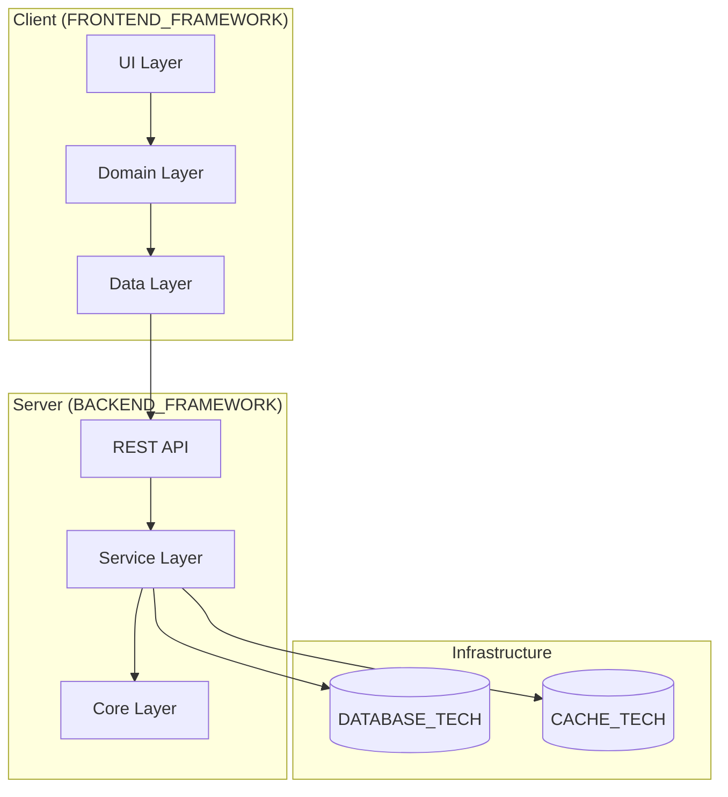

# 🎯 {{PROJECT_NAME}}

<!--
════════════════════════════════════════════════════════════════════════════════
📘 TEMPLATE GUIDE: How to Fill Out This Document
════════════════════════════════════════════════════════════════════════════════

PURPOSE:
Your README is the FIRST thing developers see. It acts as the landing page and
executive summary of the entire project ecosystem. It must answer in <60 seconds:
- What is this project?
- Why does it exist?
- How do I get started in <5 minutes?

WHEN TO CREATE:
- **Generation Order:** 24/24 (FINAL document in Master Workflow)
- **Phase:** 6 - ROOT / META
- **Prerequisites:** All other 23 documents MUST be complete.

BEST PRACTICES & AI INSTRUCTIONS:
✅ **NO HALLUCINATIONS:** Extract the exact architecture, stack, and features from the previously generated documents. Do not invent features or tools.
✅ **KEEP IT CONCISE:** Link to detailed docs instead of writing a 2000-line README.
✅ **REPLACE VARIABLES:** Swap all {{PLACEHOLDERS}} with actual data.
✅ **KEEP PATHS INTACT:** Do not modify the internal links; they are mapped to the 24-document ecosystem.
✅ **SELF-DESTRUCT:** Remove this entire TEMPLATE GUIDE comment block before outputting.

INSTRUCTIONS:
1. Replace ALL {{PLACEHOLDERS}} with actual values.
2. Test badge URLs before publishing.
3. Add a real screenshot.
4. Keep version updated (semantic versioning).
5. Remove TEMPLATE GUIDE section before committing.
6. MERMAID DIAGRAMS: Do NOT use curly braces {} inside Mermaid diagrams. Replace uppercase placeholders like FRONTEND_FRAMEWORK with actual tech names directly.

⚠️ **CRITICAL ROUTING:**
   This file MUST be saved in the ROOT directory (/) of the project.
   Filename MUST be: README.md
   Correct path: /README.md
   Incorrect path: /context/README.md or /context/00-ROOT/README.md
════════════════════════════════════════════════════════════════════════════════
-->
> **{{TAGLINE}}**
> **{{VALUE_PROPOSITION}}**

[](LICENSE)
[](https://github.com/{{GITHUB_ORG}}/{{REPO_NAME}}/actions)
[](https://codecov.io/gh/{{GITHUB_ORG}}/{{REPO_NAME}})
[](https://github.com/{{GITHUB_ORG}}/{{REPO_NAME}}/releases)
[](https://github.com/{{GITHUB_ORG}}/{{REPO_NAME}})


---

## 📖 Table of Contents

- [About](#about)
- [Why This Exists](#why-this-exists)
- [Key Features](#key-features)
- [Architecture](#architecture)
- [Tech Stack](#tech-stack)
- [Quick Start](#quick-start)
- [Project Structure](#project-structure)
- [Development](#development)
- [Testing](#testing)
- [Deployment](#deployment)
- [Contributing](#contributing)
- [Team](#team)
- [License](#license)

---

## 🌟 About

**{{PROJECT_NAME}}** is {{PROJECT_DESCRIPTION}}.

**Problem:** {{PROBLEM_STATEMENT}}

**Solution:** {{SOLUTION_STATEMENT}}

---

## 💡 Why This Exists

**Origin Story:**

{{ORIGIN_STORY}}

**Target Users:**
- {{PERSONA_1}}
- {{PERSONA_2}}
- {{PERSONA_3}}

**Success Metrics:**

| Metric | Target | Current |
|--------|--------|---------|
| Doc Generation Time | <1 hour | {{CURRENT_TIME}} |
| User Rating | >4.5/5 | {{CURRENT_RATING}} |
| Privacy Incidents | 0 | 0 |
| Active Users | {{USER_TARGET}} | {{CURRENT_USERS}} |

---

## ✨ Key Features

| Feature | Description | Status |
|---------|-------------|--------|
| **{{FEATURE_1}}** | {{FEATURE_1_DESC}} | ✅ Live |
| **{{FEATURE_2}}** | {{FEATURE_2_DESC}} | ✅ Live |
| **{{FEATURE_3}}** | {{FEATURE_3_DESC}} | 🚧 Beta |
| **{{FEATURE_4}}** | {{FEATURE_4_DESC}} | 📅 Planned |

**Non-Functional Highlights:**
- **⚡ Fast:** {{LATENCY}}
- **🔒 Private:** {{PRIVACY}}
- **📴 Offline:** {{OFFLINE}}

---

## 🏗️ Architecture



**Principles:**

1. **Clean Architecture:** Domain independent of frameworks
2. **Local-First:** No external APIs required
3. **Hexagonal:** External systems isolated
4. **Event-Driven:** Domain events for communication

See [ARCH_DECISION_RECORDS.md](https://www.google.com/search?q=context/30-ARCHITECTURE/ARCH_DECISION_RECORDS.md) for details.

---

## 🛠️ Tech Stack

### Backend

| Tech | Version | Purpose | Why |
| --- | --- | --- | --- |
| **{{BACKEND_LANG}}** | {{BACKEND_VER}} | Runtime | {{BACKEND_REASON}} |
| **{{BACKEND_FRAMEWORK}}** | {{FRAMEWORK_VER}} | Web framework | {{FRAMEWORK_REASON}} |
| **{{VECTOR_DB}}** | {{VECTOR_VER}} | Vector search | {{VECTOR_REASON}} |

### Frontend

| Tech | Version | Purpose | Why |
| --- | --- | --- | --- |
| **{{FRONTEND_LANG}}** | {{FRONTEND_VER}} | UI language | {{FRONTEND_REASON}} |
| **{{FRONTEND_FRAMEWORK}}** | {{FRONTEND_FRAMEWORK_VER}} | UI framework | {{FRONTEND_FRAMEWORK_REASON}} |

### Infrastructure

* **Docker** 24.0+ - Containerization
* **GitHub Actions** - CI/CD
* **{{DATABASE}}** - Persistence

See [TECH_STACK_DECISION.md](https://www.google.com/search?q=context/30-ARCHITECTURE/TECH_STACK_DECISION.md) for rationale.

---

## 🚀 Quick Start

### Prerequisites

* **Docker Desktop** 24.0+ ([Install](https://docker.com/products/docker-desktop/))
* **{{BACKEND_LANG}}** {{BACKEND_VER}}+ ([Install](https://www.google.com/search?q=%7B%7BBACKEND_INSTALL_URL%7D%7D))
* **{{FRONTEND_FRAMEWORK}}** {{FRONTEND_VER}}+ ([Install](https://www.google.com/search?q=%7B%7BFRONTEND_INSTALL_URL%7D%7D))
* **Git** 2.40+

### Installation (5 Minutes)

```bash
# 1. Clone
git clone {{REPO_URL}}
cd {{REPO_NAME}}

# 2. Start infrastructure
cd infrastructure
docker compose up -d

# 3. Backend
cd ../src/server
pip install -r requirements.txt
uvicorn main:app --reload --port 8080

# 4. Frontend
cd ../client
flutter pub get
flutter run -d {{TARGET_PLATFORM}}  # linux, macos, windows

```

**Expected Output:**

* Backend: `Uvicorn running on http://0.0.0.0:8080`
* Frontend: App launches with home screen

**Issues?** See [Troubleshooting](https://www.google.com/search?q=%23troubleshooting).

---

## 📂 Project Structure

```
{{REPO_NAME}}/
├── src/
│   ├── client/              # {{FRONTEND_FRAMEWORK}} app (Clean Architecture)
│   │   ├── domain/          # Entities, use cases
│   │   ├── data/            # Repositories, DTOs
│   │   └── presentation/    # UI widgets
│   └── server/              # {{BACKEND_FRAMEWORK}} backend
│       ├── core/            # Entities, events
│       ├── services/        # Business logic
│       └── routers/         # API endpoints
├── packages/                # Shared libraries
├── infrastructure/          # Docker, config
├── doc/                     # Documentation
├── tests/                   # Unit, integration, E2E tests
├── context/                 # Source of truth (RULES, AGENTS)
└── scripts/                 # DevOps automation

```

---

## 🔄 Development

**Branching (Gitflow):**

```
main → develop → feature/xyz

```

**Workflow:**

1. `git checkout -b feature/my-feature develop`
2. Make changes + commit
3. Push + open PR to `develop`
4. Code review + CI checks
5. Merge to `develop`
6. Weekly release to `main`

**PR Requirements:**

* ✅ All tests pass
* ✅ Coverage ≥85%
* ✅ No lint errors
* ✅ 1+ approver

See [CONTRIBUTING.md](https://www.google.com/search?q=CONTRIBUTING.md) for details.

---

## 🧪 Testing

```bash
# Backend
pytest tests/server/ --cov=services --cov-report=term

# Frontend
flutter test --coverage

# Integration
pytest tests/integration/ -v

```

**Coverage Targets:**

* Domain: 100%
* Services: ≥90%
* API: ≥85%
* UI: ≥80%
* **Overall: ≥85%**

See [TESTING_STRATEGY.md](https://www.google.com/search?q=context/40-PLANNING/TESTING_STRATEGY.md).

---

## 🚢 Deployment

```bash
# Production build
docker compose -f infrastructure/docker-compose.prod.yml build

# Deploy
docker compose -f infrastructure/docker-compose.prod.yml up -d

# Verify
curl http://localhost:8080/health

```

**Automated:** Push to `main` → GitHub Actions builds release

See [CI_CD_PIPELINE.md](https://www.google.com/search?q=context/40-PLANNING/CI_CD_PIPELINE.md).

---

## 🤝 Contributing

Contributions welcome! Read [CONTRIBUTING.md](https://www.google.com/search?q=CONTRIBUTING.md) for:

* Code of Conduct
* PR process
* Coding standards
* Commit format

**Quick Checklist:**

* [ ] Code formatted
* [ ] Tests added (≥85% coverage)
* [ ] PR description explains WHY
* [ ] Linked to issue

---

## 🐛 Troubleshooting

### Docker Compose Fails

```
ERROR: Service 'chromadb' failed to build

```

**Fix:** Update Docker Desktop to ≥24.0

### Backend Import Error

```
ModuleNotFoundError: No module named 'langchain'

```

**Fix:** `pip install -r requirements.txt --force-reinstall`

### Flutter Build Error

```
Error: Target URI doesn't exist

```

**Fix:** `flutter clean && flutter pub get`

**More?** [Discussions](https://www.google.com/search?q=https://github.com/%7B%7BGITHUB_ORG%7D%7D/%7B%7BREPO_NAME%7D%7D/discussions)

---

## 👥 Team

| Role | Name | Contact |
| --- | --- | --- |
| Lead Architect | {{LEAD_NAME}} | [@{{LEAD_GITHUB}}](https://www.google.com/search?q=https://github.com/%7B%7BLEAD_GITHUB%7D%7D) |
| Product Owner | {{PO_NAME}} | {{PO_EMAIL}} |
| Backend Dev | {{BACKEND_NAME}} | [@{{BACKEND_GITHUB}}](https://www.google.com/search?q=https://github.com/%7B%7BBACKEND_GITHUB%7D%7D) |

See [AGENTS.md](https://www.google.com/search?q=AGENTS.md) for full team structure.

---

## 📄 License

**{{https://www.google.com/search?q=LICENSE_TYPE}}** License - See [LICENSE](https://www.google.com/search?q=LICENSE)

---

## 🔗 Links

- [Documentation](doc/INDEX.md)
- [Architecture](context/30-ARCHITECTURE/ARCH_DECISION_RECORDS.md)
- [Roadmap](context/40-PLANNING/ROADMAP_PHASES.md)
- [Security Threat Model](context/30-ARCHITECTURE/SECURITY_THREAT_MODEL.md)

---

> **Built with ❤️ by {{TEAM_NAME}}**
> **Questions? [Open Discussion](https://github.com/{{GITHUB_ORG}}/{{REPO_NAME}}/discussions)**
