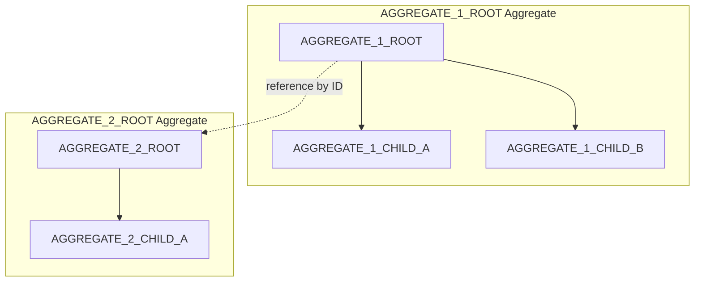
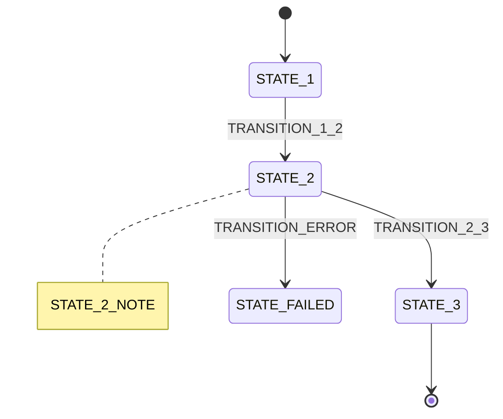

# 🗣️ Domain Language (Ubiquitous Language)

<!--
════════════════════════════════════════════════════════════════════════════════
📘 TEMPLATE GUIDE: How to Fill Out This Document
════════════════════════════════════════════════════════════════════════════════

PURPOSE:
The Domain Language establishes THE SINGLE SOURCE OF TRUTH for business terms
(Ubiquitous Language). It strictly maps Business Concepts to Code/Database implementations to prevent "lost in translation" bugs.

WHEN TO CREATE:
- **Generation Order:** 2/24 (SECOND document in Master Workflow)
- **Phase:** 1 - CONTEXT
- **Prerequisites:** 10-CONTEXT/PROJECT_MANIFESTO.md MUST be complete.

BEST PRACTICES & AI INSTRUCTIONS:
✅ **NO HALLUCINATIONS:** Only extract terms that are genuinely relevant to the project's specific domain.
✅ **STRICT MAPPING:** ALWAYS define the exact PascalCase name for code, and the human-readable name for the UI/Business.
✅ **REPLACE VARIABLES:** Swap all {{PLACEHOLDERS}} with actual data.
✅ **MERMAID DIAGRAMS:** Do NOT use curly braces {} inside Mermaid diagrams. Replace uppercase placeholders (like AGGREGATE_ROOT) directly with the domain terms.
✅ **SELF-DESTRUCT:** Remove this entire TEMPLATE GUIDE block before outputting.

⚠️ **CRITICAL ROUTING:**
   This file MUST be saved in the 10-CONTEXT directory.
   Filename MUST be: DOMAIN_LANGUAGE.md
   Correct path: /context/10-CONTEXT/DOMAIN_LANGUAGE.md
   Incorrect path: /context/DOMAIN_LANGUAGE.md or /DOMAIN_LANGUAGE.md
════════════════════════════════════════════════════════════════════════════════
-->
> **Last Updated:** {{DATE}}
> **Owner:** {{DOMAIN_EXPERT_NAME}}  > **Enforcement:** Code reviews reject PRs with non-standard terms

---

## 📖 Table of Contents

- [Core Entities](#core-entities)
- [Actions & Events](#actions--events)
- [Value Objects](#value-objects)
- [Aggregates & Boundaries](#aggregates--boundaries)
- [Lifecycle States](#lifecycle-states)
- [Important Distinctions](#important-distinctions)
- [Forbidden Terms](#forbidden-terms)
- [Domain Glossary](#domain-glossary)

---

## 🏛️ Core Entities

**Entities** are objects with unique identity that persist over time.

| Code Name | Business Name | Definition | Example |
|-----------|---------------|------------|---------|
| `{{ENTITY_1_CODE}}` | {{ENTITY_1_BIZ}} | {{ENTITY_1_DEF}} | {{ENTITY_1_EXAMPLE}} |
| `{{ENTITY_2_CODE}}` | {{ENTITY_2_BIZ}} | {{ENTITY_2_DEF}} | {{ENTITY_2_EXAMPLE}} |
| `{{ENTITY_3_CODE}}` | {{ENTITY_3_BIZ}} | {{ENTITY_3_DEF}} | {{ENTITY_3_EXAMPLE}} |

**Invariants (Business Rules):**

For `{{ENTITY_1_CODE}}`:
- {{INVARIANT_1}}  - {{INVARIANT_2}}  For `{{ENTITY_2_CODE}}`:
- {{INVARIANT_3}}
- {{INVARIANT_4}}

---

## ⚡ Actions & Events

**Actions** are commands (imperative). **Events** are facts (past tense).

### Actions (Commands)

| Code Name | Business Name | Definition | Triggered By |
|-----------|---------------|------------|--------------|
| `{{ACTION_1_CODE}}` | {{ACTION_1_BIZ}} | {{ACTION_1_DEF}} | {{ACTION_1_TRIGGER}} |
| `{{ACTION_2_CODE}}` | {{ACTION_2_BIZ}} | {{ACTION_2_DEF}} | {{ACTION_2_TRIGGER}} |

### Domain Events

| Event Name | Business Meaning | Consequences |
|------------|------------------|--------------|
| `{{EVENT_1_NAME}}` | {{EVENT_1_MEANING}} | {{EVENT_1_CONSEQUENCES}} |
| `{{EVENT_2_NAME}}` | {{EVENT_2_MEANING}} | {{EVENT_2_CONSEQUENCES}} |

---

## 💎 Value Objects

**Value Objects** have no identity (equality = same fields). Immutable.

| Code Name | Business Name | Definition | Format |
|-----------|---------------|------------|--------|
| `{{VO_1_CODE}}` | {{VO_1_BIZ}} | {{VO_1_DEF}} | {{VO_1_FORMAT}} |
| `{{VO_2_CODE}}` | {{VO_2_BIZ}} | {{VO_2_DEF}} | {{VO_2_FORMAT}} |

---

## 🏗️ Aggregates & Boundaries

**Aggregates** are consistency boundaries (transactional units).



**Rules:**

* External objects can ONLY reference the aggregate root (e.g., `{{AGGREGATE_1_ROOT}}`).
* Changes to `{{AGGREGATE_1_CHILD_A}}` MUST go through `{{AGGREGATE_1_ROOT}}`.

---

## 🔄 Lifecycle States

| Entity | Valid States | Transitions |
| --- | --- | --- |
| `{{ENTITY_1_CODE}}` | {{ENTITY_1_STATES}} | {{ENTITY_1_TRANSITIONS}} |
| `{{ENTITY_2_CODE}}` | {{ENTITY_2_STATES}} | {{ENTITY_2_TRANSITIONS}} |

**State Diagram for MAIN_ENTITY:**



---

## 🔍 Important Distinctions (Disambiguation)

**Confusing Term Pairs:**

### {{TERM_A}} vs {{TERM_B}}

**What {{TERM_A}} IS:**

* {{TERM_A_IS_1}}
* {{TERM_A_IS_2}}

**What {{TERM_A}} IS NOT:**

* {{TERM_A_IS_NOT_1}}
* {{TERM_A_IS_NOT_2}}

**Example:**

> {{TERM_A_EXAMPLE}}

**What {{TERM_B}} IS:**

* {{TERM_B_IS_1}}
* {{TERM_B_IS_2}}

**Example:**

> {{TERM_B_EXAMPLE}}

---

## 🚫 Forbidden Terms (Anti-Patterns)

**DO NOT USE these vague words in code or docs:**

| Forbidden Term | Why Forbidden | Use Instead |
| --- | --- | --- |
| `{{FORBIDDEN_1}}` | {{FORBIDDEN_1_REASON}} | `{{FORBIDDEN_1_REPLACEMENT}}` |
| `{{FORBIDDEN_2}}` | {{FORBIDDEN_2_REASON}} | `{{FORBIDDEN_2_REPLACEMENT}}` |

---

## 📚 Domain Glossary (A-Z)

**Quick Reference (Alphabetical):**

| Term | Type | Definition |
| --- | --- | --- |
| {{TERM_A_ALPHA}} | {{TERM_A_TYPE}} | {{TERM_A_SHORT_DEF}} |
| {{TERM_B_ALPHA}} | {{TERM_B_TYPE}} | {{TERM_B_SHORT_DEF}} |
| {{TERM_C_ALPHA}} | {{TERM_C_TYPE}} | {{TERM_C_SHORT_DEF}} |

---

## 🎯 Usage Examples

### In Code (Backend)

```python
# ✅ CORRECT: Uses Domain Language
class {{ENTITY_1_CODE}}:
    """{{ENTITY_1_BIZ}}: {{ENTITY_1_DEF}}"""

    def {{ACTION_1_CODE}}(self, {{PARAM_1}}: {{VO_1_CODE}}) -> None:
        """{{ACTION_1_DEF}}"""
        event = {{EVENT_1_NAME}}(entity_id=self.id)
        self._raise_event(event)

# ❌ WRONG: Generic names
class Data:
    def process(self, input: str):
        ...

```

### In Database Schema

```sql
-- ✅ CORRECT
CREATE TABLE {{ENTITY_1_CODE}} (
    id UUID PRIMARY KEY,
    {{FIELD_1}} VARCHAR(255),
    {{FIELD_2}} DECIMAL(10, 2)
);

-- ❌ WRONG
CREATE TABLE data (
    id INT,
    value TEXT
);

```

### In API Endpoints

```
✅ CORRECT:
POST /{{ENTITY_1_CODE}}/{{ACTION_1_CODE}}
GET  /{{ENTITY_1_CODE}}/{id}

❌ WRONG:
POST /api/process
GET  /api/data/{id}

```

### In UI Labels

```typescript
// ✅ CORRECT: Uses Business Name
<button>{{ACTION_1_BIZ}}</button>
<h2>{{ENTITY_1_BIZ}} Details</h2>

// ❌ WRONG: Uses Code Name or weird casing
<button>{{ACTION_1_CODE}}</button>
<h2>{{ENTITY_1_CODE}}</h2>

```

---

## 🔄 Evolution Process

**When to Update This Document:**

* New feature introduces new entities/actions
* Stakeholders request terminology change
* Ambiguity discovered during code review

**Update Process:**

1. Propose change via PR (tag `@{{DOMAIN_EXPERT}}`)
2. Discuss in team meeting
3. Update code + database migrations in same PR
4. Announce change in team chat

**Version History:**

| Version | Date | Changes | Author |
| --- | --- | --- | --- |
| v1.0 | {{INITIAL_DATE}} | Initial domain language | {{AUTHOR}} |

---

## 🔗 Related Documents

* [PROJECT_MANIFESTO.md](PROJECT_MANIFESTO.md) - Business vision
* [DATA_MODEL_SCHEMA.md](../30-ARCHITECTURE/DATA_MODEL_SCHEMA.md) - Implements this vocabulary
* [API_INTERFACE_CONTRACT.md](../30-ARCHITECTURE/API_INTERFACE_CONTRACT.md) - Uses these terms in API
* [REQUIREMENTS_MASTER.md](../20-REQUIREMENTS/REQUIREMENTS_MASTER.md) - Requirements use these terms

---

> **Remember:** Consistency is KEY. If in doubt, refer to this document. NO exceptions.
