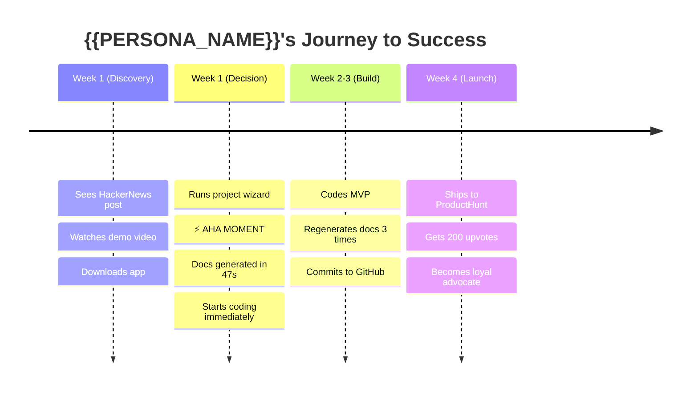

# 🗺️ User Journey Map: {{MAIN_PERSONA}}

<!--
════════════════════════════════════════════════════════════════════════════════
📘 TEMPLATE GUIDE: How to Fill Out This Document
════════════════════════════════════════════════════════════════════════════════

PURPOSE:
The User Journey Map visualizes YOUR USER'S EXPERIENCE from first encounter to
loyal advocate. It reveals:
- Where users get frustrated (friction points)
- Where they feel delighted (aha moments)
- What touchpoints matter (web, app, email)
- What opportunities exist (feature gaps)

WHY THIS MATTERS:
- Identifies critical pain points BEFORE coding (saves 30% dev time)
- Aligns product/design/engineering on shared user understanding
- Highlights where to invest UX effort (80/20 rule)
- Produces empathy (developers see real human impact)

WHEN TO CREATE:
- **Generation Order:** 7/24
- **Phase:** 1 - Context
- **Prerequisites:** PROJECT_MANIFESTO.md (defines personas), DOMAIN_LANGUAGE.md
- **Duration:** ~45 minutes

INSTRUCTIONS:
1. Choose PRIMARY persona (the one who benefits MOST)
2. Map 5-7 journey stages (Discovery → Retention)
3. For each stage, define:
   - User action (what they DO)
   - Touchpoint (WHERE it happens)
   - Emotion (how they FEEL)
   - System opportunity (what WE can improve)
4. Identify THE "Aha Moment" (when value clicks)
5. Remove TEMPLATE GUIDE before committing

CRITICAL RULES:
❌ NEVER map ideal fantasy journey (be realistic!)
❌ NEVER skip emotions (they drive behavior)
❌ NEVER forget edge cases (error states, failures)
✅ ALWAYS validate with REAL users (interviews, surveys)
✅ ALWAYS include negative emotions (frustration, confusion)
✅ ALWAYS link opportunities to features (actionable!)

BEST PRACTICES:
- Use Mermaid timeline diagram for visualization
- Add quotes from real users ("I was so frustrated when...")
- Include edge cases in separate section
- Iterate as you learn more about users

RELATED DOCS:
- PROJECT_MANIFESTO.md (persona definitions)
- UI_WIREFRAMES_FLOW.md (implements journey visually)
- REQUIREMENTS_MASTER.md (features address opportunities)
════════════════════════════════════════════════════════════════════════════════
-->

> **Persona Focus:** {{MAIN_PERSONA}}
> **Last Updated:** {{DATE}}
> **Owner:** {{OWNER_NAME}}  <!-- e.g., UX Designer, Product Manager -->
> **Validated:** {{VALIDATION_STATUS}}  <!-- e.g., "5 user interviews, 20 surveys" -->

---

## 📖 Table of Contents

- [Persona Profile](#persona-profile)
- [Journey Overview](#journey-overview)
- [Detailed Journey Stages](#detailed-journey-stages)
- [Aha Moment](#aha-moment)
- [Pain Points Summary](#pain-points-summary)
- [Opportunities](#opportunities)
- [Edge Cases & Error States](#edge-cases--error-states)
- [Journey Timeline (Mermaid)](#journey-timeline-mermaid)

---

## 👤 Persona Profile

### {{PERSONA_NAME}} - {{PERSONA_ARCHETYPE}}

**Demographics:**
- **Age:** {{PERSONA_AGE}}
- **Role:** {{PERSONA_ROLE}}
- **Company Size:** {{PERSONA_COMPANY_SIZE}}
- **Tech Savviness:** {{PERSONA_TECH_LEVEL}}  <!-- e.g., "High (senior dev)", "Medium (uses CLI)" -->
- **Location:** {{PERSONA_LOCATION}}

**Goals:**
1. {{PERSONA_GOAL_1}}
2. {{PERSONA_GOAL_2}}
3. {{PERSONA_GOAL_3}}

<!-- EXAMPLE:
1. Ship MVPs faster (reduce time-to-market from 6 months to 2)
2. Avoid architectural mistakes (no costly refactors)
3. Document projects properly (stop "I'll do it later" cycle)
-->

**Frustrations (Jobs to Be Done):**
- {{PERSONA_PAIN_1}}
- {{PERSONA_PAIN_2}}
- {{PERSONA_PAIN_3}}

<!-- EXAMPLE:
- Spends 10+ hours writing boilerplate docs (README, API specs)
- Forgets to update docs when code changes (docs go stale)
- Doesn't know "best practices" for architecture decisions (analysis paralysis)
-->

**Day in the Life:**

{{PERSONA_DAY_IN_LIFE}}

<!-- EXAMPLE:
Alex wakes up at 7 AM, checks GitHub notifications over coffee.
Spends 9-11 AM on "deep work" (coding).
Lunch break: scrolls ProductHunt for new tools.
Afternoon: meetings, code reviews, Firebase deployments.
Evening: side project (the passion project that never ships).
Frustration: "I start 5 projects a year. Only finish 1."
-->

---

## 🛤️ Journey Overview

**Core Problem:**

{{CORE_PROBLEM}}

<!-- EXAMPLE:
Alex wants to start a new side project (a task management app)
but gets stuck in "architecture paralysis" for 2 weeks.
Wastes time copy-pasting old docs, inconsistent naming,
no API specs until month 2. By month 3, loses motivation.
-->

**Desired Outcome:**

{{DESIRED_OUTCOME}}

<!-- EXAMPLE:
Alex generates 24 production-ready documents in 1 hour,
confidently starts coding with clear architecture,
ships MVP in 6 weeks instead of 6 months.
-->

**Journey Duration:**

{{JOURNEY_DURATION}}  <!-- e.g., "2 weeks (Discovery to Aha Moment)" -->

---

## 🔄 Detailed Journey Stages

### Stage 1: {{STAGE_1_NAME}}

**User Action:**

{{STAGE_1_ACTION}}

<!-- EXAMPLE:
Alex reads HackerNews, sees post: "Stop wasting time on docs.
Try SoftArchitect AI—generates 24 docs in 1 hour, 100% offline."
Intrigued, clicks link.
-->

**Touchpoint:**

{{STAGE_1_TOUCHPOINT}}  <!-- e.g., "HackerNews → Landing page" -->

**Emotion:**

{{STAGE_1_EMOTION}}  <!-- e.g., "😐 Skeptical (another AI tool?)" -->

**Thoughts:**

> "{{STAGE_1_THOUGHT}}"

<!-- EXAMPLE:
> "Another AI hype tool? But 'offline' catches my attention.
> I'm tired of cloud services leaking my data."
-->

**System Opportunity:**

{{STAGE_1_OPPORTUNITY}}

<!-- EXAMPLE:
Landing page MUST emphasize "offline" + "privacy" in hero section.
Show comparison table vs cloud tools (Notion AI, Copilot).
Add testimonial from developer: "Finally, docs that don't suck."
-->

---

### Stage 2: {{STAGE_2_NAME}}

**User Action:**

{{STAGE_2_ACTION}}

<!-- EXAMPLE:
Alex clicks "Try Demo" button.
Watches 2-minute video showing doc generation in real-time.
Downloads desktop app (Linux .deb file, 200 MB).
-->

**Touchpoint:**

{{STAGE_2_TOUCHPOINT}}  <!-- e.g., "Landing page → Download → Install" -->

**Emotion:**

{{STAGE_2_EMOTION}}  <!-- e.g., "🤔 Curious but cautious" -->

**Thoughts:**

> "{{STAGE_2_THOUGHT}}"

<!-- EXAMPLE:
> "200 MB download? Hope it's not bloated.
> Video looks legit. Let me try on a throwaway project first."
-->

**System Opportunity:**

{{STAGE_2_OPPORTUNITY}}

<!-- EXAMPLE:
Reduce app size to <150 MB (optimize dependencies).
Add "Quick Start" guide in app (first-run tutorial).
Show install progress bar (avoid "frozen" feeling).
-->

---

### Stage 3: {{STAGE_3_NAME}}

**User Action:**

{{STAGE_3_ACTION}}

<!-- EXAMPLE:
Alex opens app, creates new project: "TaskFlow Pro".
Fills out 5-minute wizard (project name, tech stack, vision).
Clicks "Generate Docs".
-->

**Touchpoint:**

{{STAGE_3_TOUCHPOINT}}  <!-- e.g., "Desktop app → Project wizard" -->

**Emotion:**

{{STAGE_3_EMOTION}}  <!-- e.g., "🤔 Hopeful but impatient" -->

**Thoughts:**

> "{{STAGE_3_THOUGHT}}"

<!-- EXAMPLE:
> "Will this actually work? I've been burned by 'magic tools' before.
> 5 minutes feels long—better be worth it."
-->

**System Opportunity:**

{{STAGE_3_OPPORTUNITY}}

<!-- EXAMPLE:
Reduce wizard to 3 minutes (remove non-essential questions).
Show progress indicator ("Step 2 of 4").
Add "Why we ask this" tooltips (context reduces friction).
-->

---

### Stage 4: {{STAGE_4_NAME}} ⚡ **AHA MOMENT**

**User Action:**

{{STAGE_4_ACTION}}

<!-- EXAMPLE:
App generates 24 documents in 47 seconds.
Alex opens README.md: polished, consistent, NO placeholders.
Opens ARCH_DECISION_RECORDS.md: detailed rationale for PostgreSQL vs MongoDB.
Alex's jaw drops: "This would've taken me 10 hours."
-->

**Touchpoint:**

{{STAGE_4_TOUCHPOINT}}  <!-- e.g., "Desktop app → Generated docs folder" -->

**Emotion:**

{{STAGE_4_EMOTION}}  <!-- e.g., "🤩 Amazed + Relieved" -->

**Thoughts:**

> "{{STAGE_4_THOUGHT}}"

<!-- EXAMPLE:
> "Holy shit. This is exactly what I needed.
> It even chose Riverpod for state management—smart.
> I can start coding TODAY instead of 'next week'."
-->

**System Opportunity:**

{{STAGE_4_OPPORTUNITY}}

<!-- EXAMPLE:
Highlight the "time saved" metric (banner: "Saved you 9.5 hours").
Show side-by-side comparison: "Manual docs vs AI docs".
Prompt to share on Twitter: "I just saved 10 hours with @SoftArchitectAI".
-->

---

### Stage 5: {{STAGE_5_NAME}}

**User Action:**

{{STAGE_5_ACTION}}

<!-- EXAMPLE:
Alex codes for 3 days, updates data model.
Runs "Regenerate Docs" command.
API_INTERFACE_CONTRACT.md auto-updates with new endpoints.
Commits to GitHub, opens PR, teammates approve instantly
(because docs are clear).
-->

**Touchpoint:**

{{STAGE_5_TOUCHPOINT}}  <!-- e.g., "CLI command → GitHub PR" -->

**Emotion:**

{{STAGE_5_EMOTION}}  <!-- e.g., "😊 Confident + Productive" -->

**Thoughts:**

> "{{STAGE_5_THOUGHT}}"

<!-- EXAMPLE:
> "Code review was painless for once.
> Docs stayed in sync automatically.
> I'm never going back to manual docs."
-->

**System Opportunity:**

{{STAGE_5_OPPORTUNITY}}

<!-- EXAMPLE:
Add Git hook to auto-regenerate docs on commit (optional feature).
Show diff of updated docs in PR (visual changelog).
Add CI/CD check: "Docs match code" (fails if out of sync).
-->

---

### Stage 6: {{STAGE_6_NAME}}

**User Action:**

{{STAGE_6_ACTION}}

<!-- EXAMPLE:
4 weeks later, Alex ships MVP to ProductHunt.
Gets 200 upvotes, 50 signups.
Someone comments: "Best docs I've seen in a side project."
Alex replies: "Thanks! SoftArchitect AI generated them."
-->

**Touchpoint:**

{{STAGE_6_TOUCHPOINT}}  <!-- e.g., "ProductHunt launch → Social proof" -->

**Emotion:**

{{STAGE_6_EMOTION}}  <!-- e.g., "🥳 Proud + Grateful" -->

**Thoughts:**

> "{{STAGE_6_THOUGHT}}"

<!-- EXAMPLE:
> "This tool saved my project.
> I would've given up by week 3 without good docs.
> I should tell my developer friends."
-->

**System Opportunity:**

{{STAGE_6_OPPORTUNITY}}

<!-- EXAMPLE:
Add "Refer a Friend" feature (get 1 month free for each referral).
Create "Powered by SoftArchitect AI" badge for docs.
Email nurture campaign: "Want to share your success story?"
-->

---

## 🎯 Aha Moment

**Definition:**

The **Aha Moment** is when the user realizes: *"This is EXACTLY what I needed."*

**For {{PERSONA_NAME}}, the Aha Moment happens when:**

{{AHA_MOMENT_DESCRIPTION}}

<!-- EXAMPLE:
Alex opens the first generated README.md and sees:
- Professional formatting (badges, TOC, sections)
- NO placeholders (all filled with project-specific content)
- Consistent with other docs (uses Domain Language)
- Saved 10 hours of boring work

Reaction: "Holy shit, I can START CODING TODAY."
-->

**Metrics Indicating Aha Moment:**

- {{AHA_METRIC_1}}  <!-- e.g., "User generates 2nd project within 1 week" -->
- {{AHA_METRIC_2}}  <!-- e.g., "NPS score ≥9 after first use" -->
- {{AHA_METRIC_3}}  <!-- e.g., "User shares on social media" -->

---

## 😤 Pain Points Summary

**Critical Friction Points:**

| Stage | Pain Point | Severity | Impact | Mitigation |
|-------|------------|----------|--------|------------|
| {{PAIN_STAGE_1}} | {{PAIN_1}} | {{PAIN_1_SEV}} | {{PAIN_1_IMPACT}} | {{PAIN_1_FIX}} |
| {{PAIN_STAGE_2}} | {{PAIN_2}} | {{PAIN_2_SEV}} | {{PAIN_2_IMPACT}} | {{PAIN_2_FIX}} |

<!-- EXAMPLE:
| Discovery | Landing page too wordy (TL;DR) | Medium | 30% bounce rate | Reduce copy to 3 sentences |
| Wizard | 5-minute wizard feels long | High | 20% abandon | Reduce to 3 minutes |
| Install | 200 MB download slow on bad wifi | Low | 5% abandon | Offer "lite" version |
-->

---

## 💡 Opportunities

**Feature Priorities Based on Journey:**

| Opportunity | Stage | Priority | Expected Impact |
|-------------|-------|----------|-----------------|
| {{OPP_1}} | {{OPP_1_STAGE}} | {{OPP_1_PRIORITY}} | {{OPP_1_IMPACT}} |
| {{OPP_2}} | {{OPP_2_STAGE}} | {{OPP_2_PRIORITY}} | {{OPP_2_IMPACT}} |

<!-- EXAMPLE:
| Reduce wizard to 3 min | Decision (Stage 3) | P0 (Critical) | +15% conversion |
| Add "Time Saved" banner | Aha (Stage 4) | P1 (High) | +20% sharing rate |
| Git hook auto-regen | Retention (Stage 5) | P2 (Medium) | +10% weekly usage |
-->

---

## 🚨 Edge Cases & Error States

**Alternative Paths (When Things Go Wrong):**

### Error Case 1: {{ERROR_1_NAME}}

**Scenario:** {{ERROR_1_SCENARIO}}

<!-- EXAMPLE:
User's laptop has outdated Ollama version (0.1.0 vs required 0.2.0).
-->

**User Emotion:** {{ERROR_1_EMOTION}}  <!-- e.g., "😡 Frustrated" -->

**System Response:** {{ERROR_1_RESPONSE}}

<!-- EXAMPLE:
Show clear error: "Ollama 0.2.0+ required. Install: [Link]".
Offer fallback: "Use Groq cloud instead? (requires API key)".
-->

---

### Error Case 2: {{ERROR_2_NAME}}

**Scenario:** {{ERROR_2_SCENARIO}}

<!-- EXAMPLE:
Doc generation fails (Ollama timeout after 30 seconds).
-->

**User Emotion:** {{ERROR_2_EMOTION}}  <!-- e.g., "😨 Confused" -->

**System Response:** {{ERROR_2_RESPONSE}}

<!-- EXAMPLE:
Show retry button + diagnostics: "Ollama is slow. Check system resources."
Add troubleshooting link: "Common Ollama issues".
-->

---

## 📊 Journey Timeline (Mermaid)

---

## 🔗 Related Documents

- [PROJECT_MANIFESTO.md](PROJECT_MANIFESTO.md) - Persona definitions
- [UI_WIREFRAMES_FLOW.md](../35-UX_UI/UI_WIREFRAMES_FLOW.md) - Visual implementation
- [REQUIREMENTS_MASTER.md](../20-REQUIREMENTS/REQUIREMENTS_MASTER.md) - Features addressing opportunities
- [TESTING_STRATEGY.md](../40-PLANNING/TESTING_STRATEGY.md) - Validation testing

---

> **Remember:** This journey is VALIDATED with real users. Update as we learn more.
