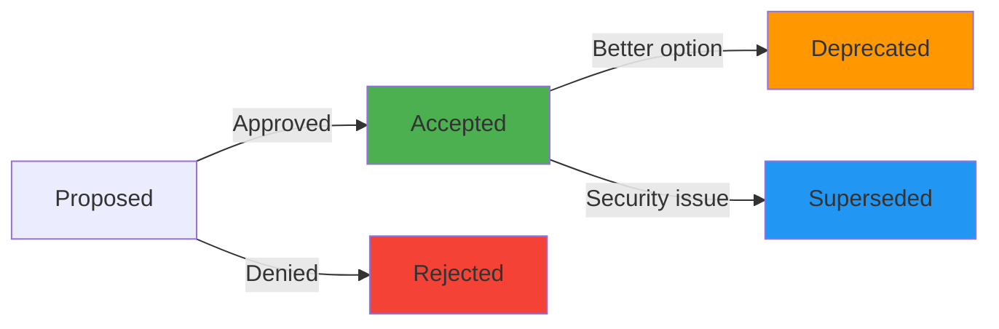

# 📜 Architecture Decision Records (ADRs)

<!-- TEMPLATE GUIDE: ADRs document WHY you made architectural choices.
     - Each decision gets a numbered ADR (ADR-001, ADR-002...)
     - NEVER delete ADRs (they're historical record)
     - Use template: Context → Decision → Consequences
     Generation Order: 15/24 | Phase: 3-Architecture | Duration: ~35 mins
     Remove this guide before committing. -->

> **Project:** {{PROJECT_NAME}}
> **Maintainer:** {{ARCHITECT}}
> **Last Updated:** {{DATE}}

---

## 📖 Table of Contents

- [ADR Template](#adr-template)
- [Decision Log](#decision-log)
- [ADR-001: {{ADR_1_TITLE}}](#adr-001)
- [ADR-002: {{ADR_2_TITLE}}](#adr-002)

---

## 📝 ADR Template

```markdown
# ADR-XXX: {{TITLE}}

**Status:** {{STATUS}}  <!-- Proposed, Accepted, Rejected, Deprecated, Superseded by ADR-YYY -->
**Date:** {{DATE}}
**Deciders:** {{DECIDERS}}  <!-- e.g., "@architect, @cto" -->

## Context

{{SITUATION}}
<!-- What is the issue motivating this decision? -->

## Decision

{{DECISION}}
<!-- What did we decide to do? (imperative mood: "We will...") -->

## Consequences

**Positive:**

- ✅ {{BENEFIT_1}}
- ✅ {{BENEFIT_2}}

**Negative:**

- ❌ {{DRAWBACK_1}}
- ❌ {{DRAWBACK_2}}

**Risks:**

- ⚠️ {{RISK_1}}

## Alternatives Considered

1. **{{ALTERNATIVE_1}}**
   - Pros: {{ALT1_PROS}}
   - Cons: {{ALT1_CONS}}
   - **Why rejected:** {{ALT1_REASON}}

## References

- {{LINK_1}}
- {{LINK_2}}
```

---

## 📊 Decision Log

| ADR | Title | Status | Date | Priority |
|-----|-------|--------|------|----------|
| ADR-001 | {{ADR_1_TITLE}} | {{ADR_1_STATUS}} | {{ADR_1_DATE}} | {{ADR_1_PRIORITY}} |
| ADR-002 | {{ADR_2_TITLE}} | {{ADR_2_STATUS}} | {{ADR_2_DATE}} | {{ADR_2_PRIORITY}} |

<!-- EXAMPLE:
| ADR-001 | Use Flutter for Desktop | ✅ Accepted | 2024-01-15 | P0 |
| ADR-002 | Local-First Architecture | ✅ Accepted | 2024-01-16 | P0 |
| ADR-003 | Ollama for LLM Inference | ✅ Accepted | 2024-01-20 | P0 |
| ADR-004 | ChromaDB for Vector Storage | ✅ Accepted | 2024-01-22 | P1 |
| ADR-005 | Use GraphQL (rejected) | ❌ Rejected | 2024-02-01 | P2 |
-->

---

## ADR-001: {{ADR_1_TITLE}}

**Status:** {{ADR_1_STATUS}}
**Date:** {{ADR_1_DATE}}
**Deciders:** {{ADR_1_DECIDERS}}

### Context

{{ADR_1_CONTEXT}}

<!-- EXAMPLE:

We need a cross-platform desktop framework for the client application.

**Requirements:**
- Must run on Linux, Windows, macOS
- Must support native performance (no Electron bloat)
- Must have strong state management (complex UI)
- Team has mobile experience (Flutter/React Native)

**Constraints:**
- Team size: 2 developers
- Timeline: 3 months MVP
- Budget: $0 (open-source tools only)
-->

### Decision

{{ADR_1_DECISION}}

<!-- EXAMPLE:

We will use **Flutter Desktop** (Dart) for the client application.

**Rationale:**
- Single codebase for all desktop platforms
- Native compilation (no Electron overhead)
- Mature state management (Riverpod, BLoC)
- Team already knows Flutter (mobile projects)
- Fast hot-reload (developer productivity)
-->

### Consequences

**Positive:**

- ✅ {{ADR_1_BENEFIT_1}}
- ✅ {{ADR_1_BENEFIT_2}}

<!-- EXAMPLE:
- ✅ Fast development (hot reload, single codebase)
- ✅ Native performance (~50MB RAM vs 300MB Electron)
- ✅ Rich widget library (Material + Cupertino)
- ✅ Strong typing (Dart null safety)
-->

**Negative:**

- ❌ {{ADR_1_DRAWBACK_1}}
- ❌ {{ADR_1_DRAWBACK_2}}

<!-- EXAMPLE:
- ❌ Desktop ecosystem less mature than mobile (some plugins missing)
- ❌ Larger binary size than web app (~40MB vs 2MB)
- ❌ Harder to hire Flutter devs than React devs
-->

**Risks:**

- ⚠️ {{ADR_1_RISK}}

<!-- EXAMPLE:
- ⚠️ Flutter desktop still in beta (potential breaking changes)
  - **Mitigation:** Pin Flutter version, thorough testing
-->

### Alternatives Considered

1. **{{ADR_1_ALT_1}}**
   - Pros: {{ADR_1_ALT_1_PROS}}
   - Cons: {{ADR_1_ALT_1_CONS}}
   - **Why rejected:** {{ADR_1_ALT_1_REASON}}

<!-- EXAMPLE:

1. **Electron + React**
   - Pros: Huge ecosystem, easy to hire devs, mature tooling
   - Cons: 300MB RAM, slow startup, Chromium bloat
   - **Why rejected:** Performance unacceptable for local-first app

2. **Qt + C++**
   - Pros: Native performance, mature desktop framework
   - Cons: Steep learning curve, slow development, verbose code
   - **Why rejected:** Team has no C++ experience, slower to MVP

3. **Tauri + Svelte**
   - Pros: Small binary, Rust backend, modern web tech
   - Cons: Immature ecosystem, team unfamiliar with Rust
   - **Why rejected:** Too risky for 3-month timeline
-->

### References

- {{ADR_1_REF_1}}
- {{ADR_1_REF_2}}

<!-- EXAMPLE:
- [Flutter Desktop Roadmap](https://flutter.dev/desktop)
- [Electron vs Flutter Performance](https://benchmarks.example.com)
- [TECH_STACK_DECISION.md](TECH_STACK_DECISION.md)
-->

---

## ADR-002: {{ADR_2_TITLE}}

<!-- Repeat structure above for each ADR -->

---

## 🔄 ADR Lifecycle



**Status Definitions:**

- **Proposed:** Under discussion (not implemented)
- **Accepted:** Approved and implemented
- **Rejected:** Proposal denied (document why!)
- **Deprecated:** Still in use but being phased out
- **Superseded:** Replaced by newer ADR (link to ADR-XXX)

---

## 🔗 Related Documents

- [TECH_STACK_DECISION.md](TECH_STACK_DECISION.md) - Technology choices
- [PROJECT_STRUCTURE_MAP.md](PROJECT_STRUCTURE_MAP.md) - Code organization
- [SECURITY_THREAT_MODEL.md](SECURITY_THREAT_MODEL.md) - Security decisions
