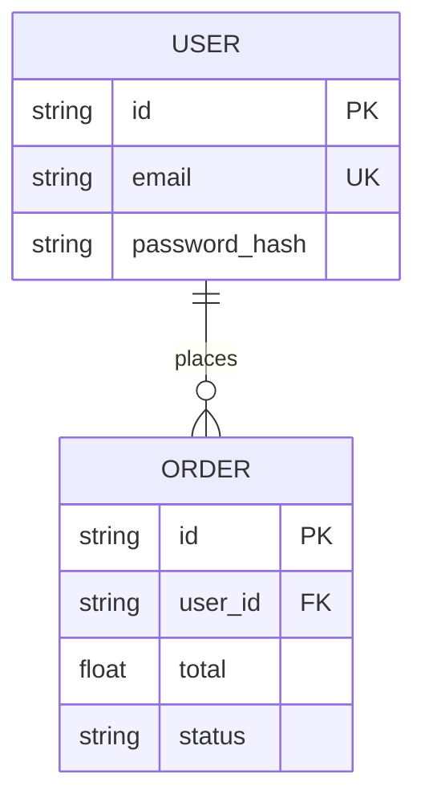

# 🗄️ Data Model Schema

Diseño de persistencia para **{{PROJECT_NAME}}**.
**Motor:** {{DATABASE_ENGINE}}.

## 1. Diagrama ER (Mermaid)

## 2. Definición de Entidades

### Entidad: **{{ENTITY_1}}** (Ej: User)

* **Descripción:** {{ENTITY_1_DESC}}
* **Primary Key:** `id` (UUIDv4).
* **Índices:** `email` (Unique), `created_at` (B-Tree).
* **Relaciones:** `{{ENTITY_2}}` (1:N).

### Entidad: **{{ENTITY_2}}**

* **Descripción:** {{ENTITY_2_DESC}}
* **Campos Clave:**
    * `{{FIELD_1}}`: {{TYPE}}
    * `{{FIELD_2}}`: {{TYPE}}

## 3. Flujos de Datos Críticos

* **Ingesta:** Cómo los datos entran al sistema.
* **Transformación:** Validación y enriquecimiento.
* **Salida:** Cómo se exponen a través de APIs.
