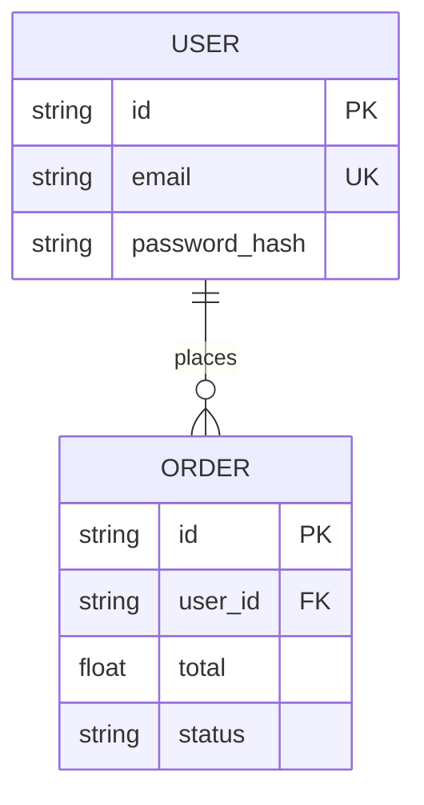

# 🗄️ Data Model Schema

Persistence design for **{{PROJECT_NAME}}**.
**Engine:** {{DATABASE_ENGINE}}.

## 1. ER Diagram (Mermaid)

```mermaid
erDiagram
    USER ||--o{ ORDER : places
    USER {
        string id PK
        string email UK
        string password_hash
    }
    ORDER {
        string id PK
        string user_id FK
        float total
        string status
    }
```

## 2. Entity Definitions

### Entity: **{{ENTITY_1}}** (e.g., User)

* **Description:** {{ENTITY_1_DESC}}
* **Primary Key:** `id` (UUIDv4).
* **Indexes:** `email` (Unique), `created_at` (B-Tree).
* **Relationships:** `{{ENTITY_2}}` (1:N).

### Entity: **{{ENTITY_2}}**

* **Description:** {{ENTITY_2_DESC}}
* **Key Fields:**
    * `{{FIELD_1}}`: {{TYPE}}
    * `{{FIELD_2}}`: {{TYPE}}

## 3. Critical Data Flows

* **Ingestion:** How data enters the system.
* **Transformation:** Validation and enrichment.
* **Output:** How data is exposed through APIs.
