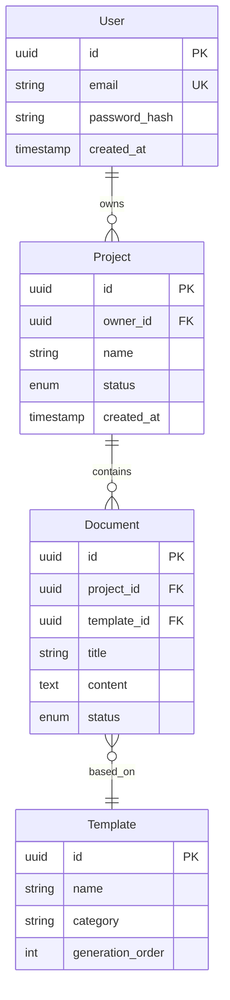

# 🗄️ Data Model & Schema

<!-- TEMPLATE GUIDE: This document defines ALL data structures (database, API, domain).
     - Entity-Relationship Diagrams (ERD)
     - Table schemas (columns, types, constraints)
     - Relationships (1:1, 1:N, N:M)
     Generation Order: 16/24 | Phase: 3-Architecture | Duration: ~45 mins
     Remove this guide before committing. -->

> **Database:** {{DATABASE_TYPE}}  <!-- e.g., PostgreSQL, MongoDB, SQLite -->
> **ORM:** {{ORM}}  <!-- e.g., SQLAlchemy, Prisma, TypeORM -->
> **Version:** {{SCHEMA_VERSION}}
> **Last Migration:** {{LAST_MIGRATION_DATE}}

---

## 📖 Table of Contents

- [Entity-Relationship Diagram](#entity-relationship-diagram)
- [Entities](#entities)
- [Relationships](#relationships)
- [Indexes](#indexes)

---

## 📊 Entity-Relationship Diagram (ERD)

```mermaid
erDiagram
    {{ENTITY_1}} ||--o{ {{ENTITY_2}} : "{{RELATIONSHIP_1}}"
    {{ENTITY_2}} }o--|| {{ENTITY_3}} : "{{RELATIONSHIP_2}}"

    {{ENTITY_1}} {
        {{TYPE_1}} {{FIELD_1}} PK
        {{TYPE_2}} {{FIELD_2}}
        {{TYPE_3}} {{FIELD_3}}
    }

    {{ENTITY_2}} {
        {{TYPE_4}} {{FIELD_4}} PK
        {{TYPE_5}} {{FIELD_5}} FK
        {{TYPE_6}} {{FIELD_6}}
    }
```

<!-- FULL EXAMPLE:


```mermaid
erDiagram
    User ||--o{ Project : "owns"
    Project ||--o{ Document : "contains"
    Document }o--|| Template : "based_on"

    User {
        uuid id PK
        string email UK
        string password_hash
        timestamp created_at
    }

    Project {
        uuid id PK
        uuid owner_id FK
        string name
        enum status
        timestamp created_at
    }

    Document {
        uuid id PK
        uuid project_id FK
        uuid template_id FK
        string title
        text content
        enum status
    }

    Template {
        uuid id PK
        string name
        string category
        int generation_order
    }
```
-->

---

## 🗂️ Entities

### {{ENTITY_1_NAME}}

**Table:** `{{TABLE_1}}`
**Description:** {{ENTITY_1_DESC}}

| Column | Type | Constraints | Description |
|--------|------|-------------|-------------|
| `{{COL_1}}` | {{TYPE_1}} | {{CONSTRAINT_1}} | {{DESC_1}} |
| `{{COL_2}}` | {{TYPE_2}} | {{CONSTRAINT_2}} | {{DESC_2}} |

<!-- FULL EXAMPLE:

### User

**Table:** `users`
**Description:** System users (developers, team members)

| Column | Type | Constraints | Description |
|--------|------|-------------|-------------|
| `id` | UUID | PRIMARY KEY | Unique identifier |
| `email` | VARCHAR(255) | UNIQUE, NOT NULL | Email address (login) |
| `password_hash` | VARCHAR(255) | NOT NULL | Argon2id hash |
| `full_name` | VARCHAR(100) | NOT NULL | Display name |
| `role` | ENUM | NOT NULL, DEFAULT 'developer' | admin, developer, viewer |
| `is_active` | BOOLEAN | DEFAULT true | Account status |
| `created_at` | TIMESTAMP | DEFAULT CURRENT_TIMESTAMP | Registration date |
| `last_login` | TIMESTAMP | NULLABLE | Last login timestamp |

**Indexes:**
- `idx_users_email` on (`email`) - for login queries
- `idx_users_created_at` on (`created_at`) - for analytics

**Validations:**
- Email: RFC 5322 format
- Password hash: 97 characters (Argon2id format)
- Role: One of ['admin', 'developer', 'viewer']

**Example Row:**
```sql
INSERT INTO users (id, email, password_hash, full_name, role) VALUES
  ('550e8400-e29b-41d4-a716-446655440000',
   'john@example.com',
   '$argon2id$v=19$m=65536,t=3,p=4$...',
   'John Doe',
   'developer');
```
-->

---

### {{ENTITY_2_NAME}}

<!-- Repeat structure above for each entity -->

---

## 🔗 Relationships

### {{RELATIONSHIP_1_NAME}}

**Type:** {{REL_TYPE_1}}  <!-- 1:1, 1:N, N:M -->
**From:** `{{TABLE_1}}.{{FK_1}}` → `{{TABLE_2}}.{{PK_2}}`
**Description:** {{REL_DESC_1}}

**Cascade Rules:**

- `ON DELETE`: {{ON_DELETE_1}}  <!-- CASCADE, SET NULL, RESTRICT -->
- `ON UPDATE`: {{ON_UPDATE_1}}  <!-- CASCADE, RESTRICT -->

<!-- EXAMPLE:

### Project → User (Ownership)

**Type:** N:1 (Many projects belong to one user)
**From:** `projects.owner_id` → `users.id`
**Description:** Each project has exactly one owner

**Cascade Rules:**
- `ON DELETE`: RESTRICT (cannot delete user with projects)
- `ON UPDATE`: CASCADE (if user ID changes, update projects)

**Query Example:**
```sql
SELECT p.name, u.full_name
FROM projects p
INNER JOIN users u ON p.owner_id = u.id
WHERE u.email = 'john@example.com';
```
-->

---

## 📈 Indexes

**Purpose:** Optimize query performance (read speed vs write cost)

| Index Name | Table | Columns | Type | Purpose |
|------------|-------|---------|------|---------|
| {{INDEX_1}} | {{TABLE_1}} | {{COLS_1}} | {{TYPE_1}} | {{PURPOSE_1}} |

<!-- EXAMPLE:

| Index Name | Table | Columns | Type | Purpose |
|------------|-------|---------|------|---------|
| `idx_projects_owner` | projects | owner_id | B-tree | User's projects list |
| `idx_documents_status` | documents | status | B-tree | Filter by status |
| `idx_documents_title_ft` | documents | title | Full-text | Search documents |
| `idx_users_email` | users | email | Unique | Login query |

**Performance Impact:**
- Read queries: 10x faster with indexes
- Write queries: 5-10% slower (index maintenance)
- Disk space: +10-15% storage
-->

---

## 🔄 Migrations

**Migration Tool:** {{MIGRATION_TOOL}}  <!-- e.g., Alembic, Flyway, Prisma Migrate -->

**Naming Convention:** `V{VERSION}__{DESCRIPTION}.sql`
**Example:** `V001__create_users_table.sql`

**Migration Example:**

```sql
-- V002__add_user_status.sql
ALTER TABLE users ADD COLUMN is_active BOOLEAN DEFAULT true;
CREATE INDEX idx_users_is_active ON users(is_active);
```

**Rollback Strategy:** {{ROLLBACK_STRATEGY}}
<!-- e.g., "Create down migrations" OR "Backup before migrate" -->

---

## 🔐 Sensitive Data

**PII (Personally Identifiable Information):**

| Table | Column | Encryption | Purpose |
|-------|--------|------------|---------|
| {{PII_TABLE_1}} | {{PII_COL_1}} | {{PII_ENC_1}} | {{PII_PURPOSE_1}} |

<!-- EXAMPLE:

| Table | Column | Encryption | Purpose |
|-------|--------|------------|---------|
| users | email | ❌ Plaintext (needed for login) | User authentication |
| users | password_hash | ✅ Argon2id hash | Credential storage |
| users | api_key | ✅ AES-256 | External API access |
-->

---

## 🔗 Related Documents

- [API_INTERFACE_CONTRACT.md](API_INTERFACE_CONTRACT.md) - API schemas
- [DOMAIN_LANGUAGE.md](../10-CONTEXT/DOMAIN_LANGUAGE.md) - Entity definitions
- [SECURITY_PRIVACY_POLICY.md](../20-REQUIREMENTS/SECURITY_PRIVACY_POLICY.md) - Data protection rules
