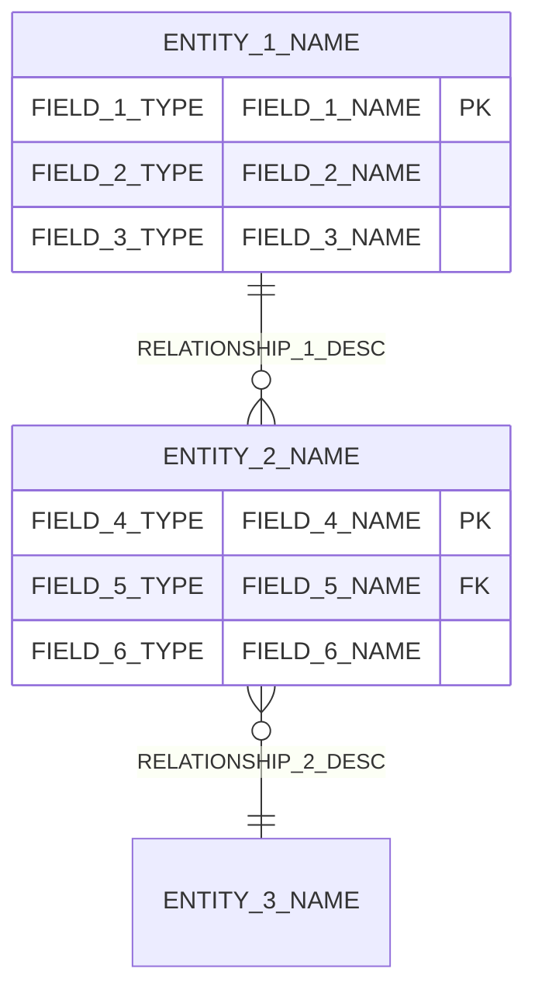

# 🗄️ Data Model & Schema

<!-- ════════════════════════════════════════════════════════════════════════════════
📘 TEMPLATE GUIDE: How to Fill Out This Document
════════════════════════════════════════════════════════════════════════════════

PURPOSE:
This document defines ALL data structures (database, API, domain). It includes Entity-Relationship Diagrams (ERD), table schemas, relationships, and indexing strategies.

WHEN TO CREATE:
- **Generation Order:** 9/24 (Phase 3 - ARCHITECTURE)
- **Phase:** 3 - ARCHITECTURE
- **Prerequisites:** 30-ARCHITECTURE/TECH_STACK_DECISION.md and 10-CONTEXT/DOMAIN_LANGUAGE.md MUST be complete.

BEST PRACTICES & AI INSTRUCTIONS:
✅ **NO HALLUCINATIONS:** Base the entities STRICTLY on the Ubiquitous Language defined in DOMAIN_LANGUAGE.md. Do not invent new core entities that haven't been discussed.
✅ **TECH-SPECIFIC:** Adapt the data types (e.g., UUID, VARCHAR, ObjectId) to the specific database chosen in the Tech Stack (e.g., PostgreSQL vs MongoDB).
✅ **USE EXAMPLES AS GUIDES:** Read the hidden HTML comments () for context, but do not copy them verbatim.
✅ **REPLACE VARIABLES:** Swap all {{PLACEHOLDERS}} with actual project data.
✅ **MERMAID DIAGRAMS:** Do NOT use double curly braces {{ }} inside Mermaid diagrams. Replace uppercase placeholders directly with the entity/relationship names to prevent rendering errors. Single curly braces { } are allowed ONLY for ER diagram structural blocks.
✅ **SELF-DESTRUCT:** You MUST remove this entire TEMPLATE GUIDE comment block before outputting the final Markdown.

⚠️ **CRITICAL ROUTING:**
   This file MUST be saved in the 30-ARCHITECTURE directory.
   Filename MUST be: DATA_MODEL_SCHEMA.md
   Correct path: /context/30-ARCHITECTURE/DATA_MODEL_SCHEMA.md
   Incorrect path: /context/DATA_MODEL_SCHEMA.md or /DATA_MODEL_SCHEMA.md
════════════════════════════════════════════════════════════════════════════════ -->
> **Database:** {{DATABASE_TYPE}}  > **ORM:** {{ORM}}  > **Version:** {{SCHEMA_VERSION}}
> **Last Migration:** {{LAST_MIGRATION_DATE}}

---

## 📖 Table of Contents

- [Entity-Relationship Diagram](#entity-relationship-diagram)
- [Entities](#entities)
- [Relationships](#relationships)
- [Indexes](#indexes)

---

## 📊 Entity-Relationship Diagram (ERD)


```mermaid
erDiagram
    ENTITY_1_NAME ||--o{ ENTITY_2_NAME : "RELATIONSHIP_1_DESC"
    ENTITY_2_NAME }o--|| ENTITY_3_NAME : "RELATIONSHIP_2_DESC"

    ENTITY_1_NAME {
        FIELD_1_TYPE FIELD_1_NAME PK
        FIELD_2_TYPE FIELD_2_NAME
        FIELD_3_TYPE FIELD_3_NAME
    }

    ENTITY_2_NAME {
        FIELD_4_TYPE FIELD_4_NAME PK
        FIELD_5_TYPE FIELD_5_NAME FK
        FIELD_6_TYPE FIELD_6_NAME
    }

```

---

## 🗂️ Entities

### {{ENTITY_1_NAME}}

**Table:** `{{TABLE_1}}`
**Description:** {{ENTITY_1_DESC}}

| Column | Type | Constraints | Description |
| --- | --- | --- | --- |
| `{{COL_1}}` | {{TYPE_1}} | {{CONSTRAINT_1}} | {{DESC_1}} |
| `{{COL_2}}` | {{TYPE_2}} | {{CONSTRAINT_2}} | {{DESC_2}} |

---

### {{ENTITY_2_NAME}}

---

## 🔗 Relationships

### {{RELATIONSHIP_1_NAME}}

**Type:** {{REL_TYPE_1}}  **From:** `{{TABLE_1}}.{{FK_1}}` → `{{TABLE_2}}.{{PK_2}}`
**Description:** {{REL_DESC_1}}

**Cascade Rules:**

* `ON DELETE`: {{ON_DELETE_1}}  - `ON UPDATE`: {{ON_UPDATE_1}}  ---

## 📈 Indexes

**Purpose:** Optimize query performance (read speed vs write cost)

| Index Name | Table | Columns | Type | Purpose |
| --- | --- | --- | --- | --- |
| {{INDEX_1}} | {{TABLE_1}} | {{COLS_1}} | {{TYPE_1}} | {{PURPOSE_1}} |

---

## 🔄 Migrations

**Migration Tool:** {{MIGRATION_TOOL}}  **Naming Convention:** `V{VERSION}__{DESCRIPTION}.sql`
**Example:** `V001__create_users_table.sql`

**Migration Example:**

```sql
-- V002__add_user_status.sql
ALTER TABLE users ADD COLUMN is_active BOOLEAN DEFAULT true;
CREATE INDEX idx_users_is_active ON users(is_active);

```

## **Rollback Strategy:** {{ROLLBACK_STRATEGY}}

## 🔐 Sensitive Data

**PII (Personally Identifiable Information):**

| Table | Column | Encryption | Purpose |
| --- | --- | --- | --- |
| {{PII_TABLE_1}} | {{PII_COL_1}} | {{PII_ENC_1}} | {{PII_PURPOSE_1}} |

---

## 🔗 Related Documents

- [API_INTERFACE_CONTRACT.md](API_INTERFACE_CONTRACT.md) - API schemas
- [DOMAIN_LANGUAGE.md](../10-CONTEXT/DOMAIN_LANGUAGE.md) - Entity definitions
- [SECURITY_PRIVACY_POLICY.md](../20-REQUIREMENTS/SECURITY_PRIVACY_POLICY.md) - Data protection rules
