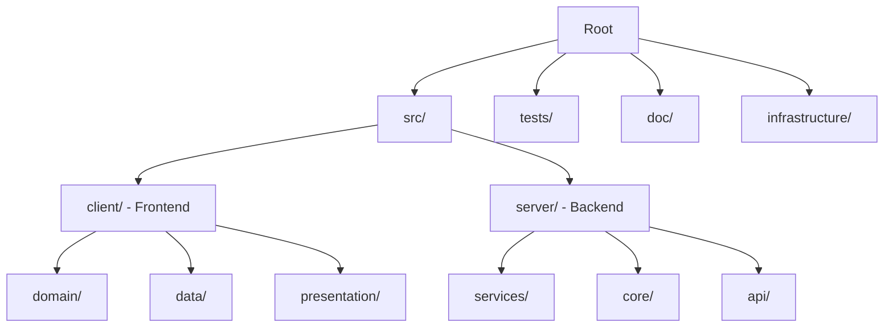

# 🗂️ Project Structure Map

<!-- ════════════════════════════════════════════════════════════════════════════════
📘 TEMPLATE GUIDE: How to Fill Out This Document
════════════════════════════════════════════════════════════════════════════════

PURPOSE:
This document is the FILE TREE + ARCHITECTURE GUIDE. It acts as the definitive map showing where code lives, explaining the purpose of each folder, and defining strict file naming conventions.

WHEN TO CREATE:
- **Generation Order:** 11/24 (Phase 3 - ARCHITECTURE)
- **Phase:** 3 - ARCHITECTURE
- **Prerequisites:** 30-ARCHITECTURE/API_INTERFACE_CONTRACT.md MUST be complete.

BEST PRACTICES & AI INSTRUCTIONS:
✅ **NO HALLUCINATIONS:** The directory structure MUST perfectly reflect the architecture pattern chosen in TECH_STACK_DECISION.md. Do not invent unnecessary folders.
✅ **BE EXPLICIT:** Clearly state what is FORBIDDEN in each layer (e.g., "No UI code in the Domain layer").
✅ **USE EXAMPLES AS GUIDES:** Read the hidden HTML comments () for context, but do not copy them verbatim.
✅ **REPLACE VARIABLES:** Swap all {{PLACEHOLDERS}} with actual project data.
✅ **MERMAID DIAGRAMS:** Do NOT use curly braces {} inside Mermaid diagrams.
✅ **SELF-DESTRUCT:** You MUST remove this entire TEMPLATE GUIDE comment block before outputting the final Markdown.

⚠️ **CRITICAL ROUTING:**
   This file MUST be saved in the 30-ARCHITECTURE directory.
   Filename MUST be: PROJECT_STRUCTURE_MAP.md
   Correct path: /context/30-ARCHITECTURE/PROJECT_STRUCTURE_MAP.md
   Incorrect path: /context/PROJECT_STRUCTURE_MAP.md or /PROJECT_STRUCTURE_MAP.md
════════════════════════════════════════════════════════════════════════════════ -->

> **Project:** {{PROJECT_NAME}}
> **Architecture:** {{ARCHITECTURE_PATTERN}}  <!-- e.g., Clean Architecture, Hexagonal, Modular Monolith -->
> **Last Updated:** {{DATE}}

---

## 📖 Table of Contents

- [High-Level Overview](#high-level-overview)
- [Directory Structure](#directory-structure)
- [Naming Conventions](#naming-conventions)

---

## 🏗️ High-Level Overview



---

## 📂 Directory Structure

```
{{PROJECT_ROOT}}/
├── src/
│   ├── client/              # {{CLIENT_DESC}}
│   │   ├── domain/          # {{DOMAIN_DESC}}
│   │   ├── data/            # {{DATA_DESC}}
│   │   └── presentation/    # {{PRESENTATION_DESC}}
│   └── server/              # {{SERVER_DESC}}
│       ├── services/        # {{SERVICES_DESC}}
│       ├── core/            # {{CORE_DESC}}
│       └── api/             # {{API_DESC}}
├── tests/                   # {{TESTS_DESC}}
├── doc/                     # {{DOC_DESC}}
├── packages/                # {{PACKAGES_DESC}}
├── infrastructure/          # {{INFRA_DESC}}
└── scripts/                 # {{SCRIPTS_DESC}}
```

<!-- FULL EXAMPLE:

```
soft-architect-ai/
├── src/
│   ├── client/              # Flutter Desktop App (Dart)
│   │   ├── domain/          # Business Logic (Entities, Use Cases)
│   │   │   ├── entities/    # Core data models (User, Project)
│   │   │   ├── usecases/    # Business rules (CreateProjectUseCase)
│   │   │   └── repositories/# Abstract interfaces (IProjectRepository)
│   │   ├── data/            # Data Layer (Repositories, APIs)
│   │   │   ├── models/      # DTOs (ProjectDto)
│   │   │   ├── repositories/# Repository implementations
│   │   │   └── datasources/ # HTTP clients, local storage
│   │   └── presentation/    # UI Layer (Widgets, State)
│   │       ├── pages/       # Screens (HomePage, SettingsPage)
│   │       ├── widgets/     # Reusable components (Button, Card)
│   │       └── providers/   # Riverpod state providers
│   └── server/              # Python FastAPI Backend
│       ├── services/        # Business Services (RAGService, DocumentService)
│       ├── core/            # Shared Utilities (config, exceptions, logging)
│       └── api/             # HTTP Routers (endpoints)
├── tests/
│   ├── client/              # Dart tests (unit, widget, integration)
│   └── server/              # Python tests (pytest)
├── doc/                     # Documentation (Architecture, Guides)
├── packages/
│   └── knowledge_base/      # RAG Templates & Tech Packs
├── infrastructure/          # Docker Compose, Nginx configs
└── scripts/                 # Build scripts, migrations
```
-->

---

## 📁 Layer Details

### Client (Frontend)

**Architecture:** {{CLIENT_ARCH}}  <!-- e.g., Clean Architecture -->

#### domain/ - Business Logic

**Purpose:** {{DOMAIN_PURPOSE}}
<!-- e.g., "Pure business logic, no dependencies on UI or data sources" -->

**Files:**

```
domain/
├── entities/
│   ├── user.dart            # User entity (id, email, name)
│   └── project.dart         # Project entity
├── usecases/
│   ├── create_project.dart  # Use case: Create new project
│   └── get_user_profile.dart
└── repositories/
    └── i_project_repository.dart  # Repository interface (contract)
```

**Rule:** {{DOMAIN_RULE}}
<!-- e.g., "NEVER import Flutter or data layer packages here" -->

---

#### data/ - Data Access

**Purpose:** {{DATA_PURPOSE}}
<!-- e.g., "Implement repositories, handle API calls, local storage" -->

**Files:**

```
data/
├── models/
│   └── project_dto.dart     # Data Transfer Object (JSON <-> Entity)
├── repositories/
│   └── project_repository_impl.dart  # Implements IProjectRepository
└── datasources/
    ├── project_remote_datasource.dart  # HTTP client
    └── project_local_datasource.dart   # SQLite/SharedPreferences
```

**Rule:** {{DATA_RULE}}
<!-- e.g., "Never contain business logic, only data transformation" -->

---

#### presentation/ - UI Layer

**Purpose:** {{PRESENTATION_PURPOSE}}
<!-- e.g., "Render UI, handle user interactions, manage state" -->

**Files:**

```
presentation/
├── pages/
│   ├── home/
│   │   ├── home_page.dart              # Screen widget
│   │   ├── home_viewmodel.dart         # Business logic for UI
│   │   └── widgets/
│   │       └── project_card.dart       # Reusable component
│   └── settings/
│       └── settings_page.dart
├── widgets/
│   ├── common/
│   │   ├── custom_button.dart
│   │   └── loading_indicator.dart
│   └── theme/
│       └── app_theme.dart
└── providers/
    └── project_provider.dart           # Riverpod provider
```

**Rule:** {{PRESENTATION_RULE}}
<!-- e.g., "Widgets must be DUMB (no business logic)" -->

---

### Server (Backend)

**Architecture:** {{SERVER_ARCH}}  <!-- e.g., Modular Monolith, Service Layer -->

#### services/ - Business Services

**Purpose:** {{SERVICES_PURPOSE}}

**Files:**

```
services/
├── rag/
│   ├── rag_service.py       # RAG orchestration
│   └── vector_store.py      # ChromaDB wrapper
├── document/
│   └── document_service.py  # Document generation logic
└── auth/
    └── auth_service.py      # User authentication
```

---

#### core/ - Shared Utilities

**Purpose:** {{CORE_PURPOSE}}

**Files:**

```
core/
├── config.py                # Environment variables
├── exceptions.py            # Custom exceptions
├── logging.py               # Logger setup
└── utils/
    └── validators.py        # Input validation helpers
```

---

#### api/ - HTTP Layer

**Purpose:** {{API_PURPOSE}}

**Files:**

```
api/
├── routers/
│   ├── projects.py          # /api/v1/projects endpoints
│   ├── auth.py              # /api/v1/auth endpoints
│   └── rag.py               # /api/v1/rag endpoints
└── middleware/
    └── error_handler.py     # Exception middleware
```

---

## 📝 Naming Conventions

### Files

| Type | Convention | Example |
|------|------------|---------|
| {{FILE_TYPE_1}} | {{CONVENTION_1}} | {{EXAMPLE_1}} |
| {{FILE_TYPE_2}} | {{CONVENTION_2}} | {{EXAMPLE_2}} |

<!-- EXAMPLE:

| Type | Convention | Example |
|------|------------|---------|
| Dart Entity | `snake_case.dart` | `user.dart`, `project.dart` |
| Dart Widget | `snake_case.dart` | `home_page.dart`, `custom_button.dart` |
| Python Service | `snake_case.py` | `rag_service.py`, `auth_service.py` |
| Python Test | `test_*.py` | `test_rag_service.py` |
| Dart Test | `*_test.dart` | `home_page_test.dart` |
-->

---

### Classes

| Type | Convention | Example |
|------|------------|---------|
| {{CLASS_TYPE_1}} | {{CLASS_CONVENTION_1}} | {{CLASS_EXAMPLE_1}} |

<!-- EXAMPLE:

| Type | Convention | Example |
|------|------------|---------|
| Dart Entity | `PascalCase` | `User`, `Project` |
| Dart DTO | `PascalCase + Dto` | `ProjectDto`, `UserDto` |
| Python Service | `PascalCase + Service` | `RAGService`, `AuthService` |
| Python Exception | `PascalCase + Error` | `DatabaseConnectionError` |
-->

---

## 🚫 What NOT to Do

- ❌ **Business logic in UI widgets** (violates separation)
- ❌ **UI dependencies in domain layer** (breaks Clean Arch)
- ❌ **Hardcoded paths** (use relative imports)
- ❌ **God folders** (> 20 files in one folder → split into sub-folders)

---

## 🔗 Related Documents

- [TECH_STACK_DECISION.md](TECH_STACK_DECISION.md) - Technology choices
- [ARCH_DECISION_RECORDS.md](ARCH_DECISION_RECORDS.md) - Architecture decisions
- [RULES.md](../00-ROOT/RULES.md) - Coding standards
