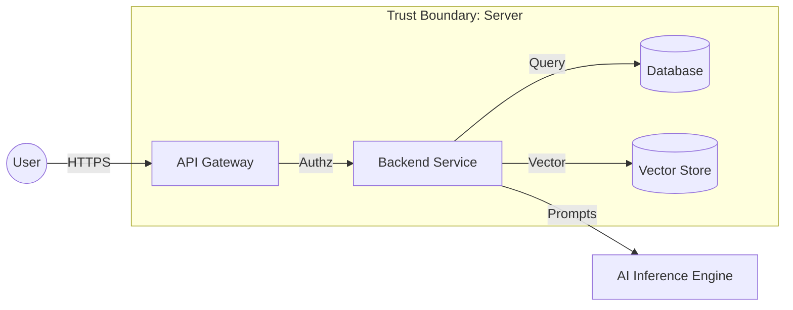

# 🛡️ Security Threat Model

<!-- ════════════════════════════════════════════════════════════════════════════════
📘 TEMPLATE GUIDE: How to Fill Out This Document
════════════════════════════════════════════════════════════════════════════════

PURPOSE:
This document identifies potential security threats using the STRIDE framework and defines specific technical mitigations. It acts as a proactive defense plan for the system's architecture.

WHEN TO CREATE:
- **Generation Order:** 12/24 (Phase 3 - ARCHITECTURE)
- **Phase:** 3 - ARCHITECTURE
- **Prerequisites:** 30-ARCHITECTURE/PROJECT_STRUCTURE_MAP.md MUST be complete.

BEST PRACTICES & AI INSTRUCTIONS:
✅ **NO HALLUCINATIONS:** The threats must be REALISTIC based on the chosen Tech Stack (e.g., if using Python/FastAPI, mention specific SQL Injection or Pydantic validation risks).
✅ **STRIDE FRAMEWORK:** Strictly follow the 6 categories (Spoofing, Tampering, Repudiation, Information Disclosure, Denial of Service, Elevation of Privilege).
✅ **REPLACE VARIABLES:** Swap all {{PLACEHOLDERS}} with actual project data.
✅ **MERMAID DIAGRAMS:** Do NOT use double curly braces {{ }} inside Mermaid diagrams. Use uppercase placeholders directly.
✅ **SELF-DESTRUCT:** You MUST remove this entire TEMPLATE GUIDE comment block before outputting the final Markdown.

⚠️ **CRITICAL ROUTING:**
   This file MUST be saved in the 30-ARCHITECTURE directory.
   Filename MUST be: SECURITY_THREAT_MODEL.md
   Correct path: /context/30-ARCHITECTURE/SECURITY_THREAT_MODEL.md
   Incorrect path: /context/SECURITY_THREAT_MODEL.md or /SECURITY_THREAT_MODEL.md
════════════════════════════════════════════════════════════════════════════════ -->
> **System:** {{SYSTEM_NAME}}
> **Classification:** {{CLASSIFICATION}}
> **Last Review:** {{DATE}}
> **Next Review:** {{NEXT_REVIEW}}

---

## 📖 Table of Contents

- [Threat Modeling Approach](#threat-modeling-approach)
- [Data Flow Diagram](#data-flow-diagram)
- [System Assets](#system-assets)
- [Threat Catalog (STRIDE)](#threat-catalog-stride)
- [Risk Assessment Matrix](#risk-assessment-matrix)

---

## 🎯 Threat Modeling Approach

**Framework:** STRIDE (Spoofing, Tampering, Repudiation, Info Disclosure, Denial of Service, Elevation of Privilege).

---

## 🔍 Data Flow Diagram

The following diagram visualizes the trust boundaries and data movement where threats are most likely to occur.

---

## 🏦 System Assets

| Asset | Value | Loss Impact | Threat Actors |
| --- | --- | --- | --- |
| {{ASSET_1}} | {{VALUE_1}} | {{IMPACT_1}} | {{ACTORS_1}} |
| {{ASSET_2}} | {{VALUE_2}} | {{IMPACT_2}} | {{ACTORS_2}} |

---

## 🚨 Threat Catalog (STRIDE)

### S1: Spoofing - Impersonation

**Threat:** {{S1_THREAT}}
**Mitigation:**

* ✅ {{S1_MITIGATION_1}}
* ✅ {{S1_MITIGATION_2}}

### T1: Tampering - Data Modification

**Threat:** {{T1_THREAT}}
**Mitigation:**

* ✅ {{T1_MITIGATION_1}}

### R1: Repudiation - Denial of Action

**Threat:** {{R1_THREAT}}
**Mitigation:**

* ✅ {{R1_MITIGATION_1}}

### I1: Info Disclosure - Data Leakage

**Threat:** {{I1_THREAT}}
**Mitigation:**

* ✅ {{I1_MITIGATION_1}}

### D1: Denial of Service - System Exhaustion

**Threat:** {{D1_THREAT}}
**Mitigation:**

* ✅ {{D1_MITIGATION_1}}

### E1: Elevation of Privilege - Unauthorized Access

**Threat:** {{E1_THREAT}}
**Mitigation:**

* ✅ {{E1_MITIGATION_1}}

---

## 📊 Risk Assessment Matrix

| Threat ID | Category | Risk | Likelihood | Impact | Status |
| --- | --- | --- | --- | --- | --- |
| S1 | Spoofing | {{RISK_S1}} | {{LIKE_S1}} | {{IMP_S1}} | {{STAT_S1}} |
| T1 | Tampering | {{RISK_T1}} | {{LIKE_T1}} | {{IMP_T1}} | {{STAT_T1}} |
| R1 | Repudiation | {{RISK_R1}} | {{LIKE_R1}} | {{IMP_R1}} | {{STAT_R1}} |
| I1 | Info Disclosure | {{RISK_I1}} | {{LIKE_I1}} | {{IMP_I1}} | {{STAT_I1}} |
| D1 | Denial of Service | {{RISK_D1}} | {{LIKE_D1}} | {{IMP_D1}} | {{STAT_D1}} |
| E1 | Elevation | {{RISK_E1}} | {{LIKE_E1}} | {{IMP_E1}} | {{STAT_E1}} |

---

## 🔗 Related Documents (Internal Paths)

- [SECURITY_PRIVACY_POLICY.md](../20-REQUIREMENTS/SECURITY_PRIVACY_POLICY.md) - Security rules
- [COMPLIANCE_MATRIX.md](../20-REQUIREMENTS/COMPLIANCE_MATRIX.md) - Legal requirements
- [API_INTERFACE_CONTRACT.md](API_INTERFACE_CONTRACT.md) - API security
- [ARCH_DECISION_RECORDS.md](ARCH_DECISION_RECORDS.md) - Security architecture decisions
