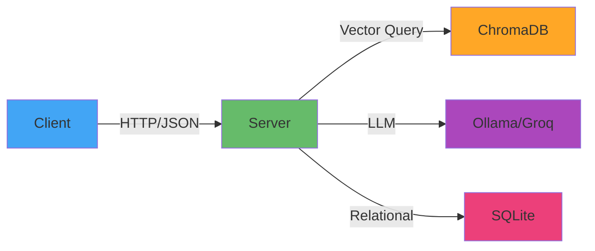

# 🛠️ Tech Stack Decision

<!-- TEMPLATE GUIDE: This document explains WHAT technologies you're using and WHY.
     - For each tech: Name, Purpose, Alternatives Considered, Why Chosen
     - Links to ADRs for deep dives
     Generation Order: 8/24 | Phase: 3-Architecture | Prerequisites: COMPLIANCE_MATRIX.md
     Duration: ~35 mins
     Remove this guide before committing. -->

> **Project:** {{PROJECT_NAME}}
> **Last Updated:** {{DATE}}
> **Architect:** {{ARCHITECT}}

---

## 📖 Table of Contents

- [Technology Overview](#technology-overview)
- [Frontend Stack](#frontend-stack)
- [Backend Stack](#backend-stack)
- [Infrastructure](#infrastructure)

---

## 🏗️ Technology Overview

---

## 💻 Frontend Stack

### {{FRONTEND_TECH_1}}

**Category:** {{CATEGORY_1}}  <!-- e.g., "UI Framework" -->
**Version:** {{VERSION_1}}
**Purpose:** {{PURPOSE_1}}

**Why Chosen:**

- ✅ {{REASON_1_A}}
- ✅ {{REASON_1_B}}
- ✅ {{REASON_1_C}}

**Alternatives Considered:**

| Alternative | Pros | Cons | Why Rejected |
|-------------|------|------|--------------|
| {{ALT_1_A}} | {{ALT_1_A_PROS}} | {{ALT_1_A_CONS}} | {{ALT_1_A_REJECT}} |
| {{ALT_1_B}} | {{ALT_1_B_PROS}} | {{ALT_1_B_CONS}} | {{ALT_1_B_REJECT}} |

**References:** [ADR-001](ARCH_DECISION_RECORDS.md#adr-001)

<!-- FULL EXAMPLE:

### Flutter Desktop

**Category:** UI Framework
**Version:** 3.19.x (stable)
**Purpose:** Build native desktop application (Linux, Windows, macOS)

**Why Chosen:**

- ✅ Single codebase for all desktop platforms (reduces dev time 60%)
- ✅ Native performance (~50MB RAM vs 300MB Electron)
- ✅ Hot reload (fast iteration, 2-3s feedback loop)
- ✅ Team has mobile Flutter experience (zero learning curve)
- ✅ Rich widget library (Material + Cupertino + custom)

**Alternatives Considered:**

| Alternative | Pros | Cons | Why Rejected |
|-------------|------|------|--------------|
| Electron + React | Huge ecosystem, easy hiring | 300MB RAM, slow startup | Performance unacceptable |
| Qt + C++ | Native performance, mature | Steep learning curve, slow dev | Team has no C++ experience |
| Tauri + Svelte | Small binary, modern | Immature ecosystem, Rust unfamiliar | Too risky for 3-month MVP |

**References:** [ADR-001: Use Flutter Desktop](ARCH_DECISION_RECORDS.md#adr-001)
-->

---

### {{FRONTEND_TECH_2}}

<!-- Repeat structure for each frontend tech -->

---

## 🖥️ Backend Stack

### {{BACKEND_TECH_1}}

**Category:** {{CATEGORY_2}}  <!-- e.g., "Web Framework" -->
**Version:** {{VERSION_2}}
**Purpose:** {{PURPOSE_2}}

**Why Chosen:**

- ✅ {{REASON_2_A}}
- ✅ {{REASON_2_B}}

**Alternatives Considered:**

| Alternative | Pros | Cons | Why Rejected |
|-------------|------|------|--------------|
| {{ALT_2_A}} | {{ALT_2_A_PROS}} | {{ALT_2_A_CONS}} | {{ALT_2_A_REJECT}} |

**References:** [ADR-002](ARCH_DECISION_RECORDS.md#adr-002)

<!-- EXAMPLE:

### FastAPI

**Category:** Web Framework
**Version:** 0.110.x
**Purpose:** RESTful API server for client-server communication

**Why Chosen:**

- ✅ Async support (handles 1000+ concurrent requests)
- ✅ Auto-generated OpenAPI docs (Swagger UI)
- ✅ Built-in type validation (Pydantic models)
- ✅ Fast development (similar to Flask but better DX)
- ✅ Python ecosystem (LangChain, ChromaDB, Ollama)

**Alternatives Considered:**

| Alternative | Pros | Cons | Why Rejected |
|-------------|------|------|--------------|
| Django | Batteries included, mature | Too heavy (ORM, admin, templates) | Overkill for API-only |
| Flask | Lightweight, simple | No async, manual validation | Slower async performance |
| Rust + Axum | Blazing fast, type-safe | Steep learning curve, slow dev | Timeline constraint |

**References:** [ADR-002: Use FastAPI](ARCH_DECISION_RECORDS.md#adr-002)
-->

---

### {{BACKEND_TECH_2}}

<!-- Repeat -->

---

## 🗄️ Data Storage

### {{DATA_TECH_1}}

**Category:** {{CATEGORY_3}}  <!-- e.g., "Vector Database" -->
**Version:** {{VERSION_3}}
**Purpose:** {{PURPOSE_3}}

**Why Chosen:**

- ✅ {{REASON_3_A}}
- ✅ {{REASON_3_B}}

**Alternatives Considered:**

| Alternative | Pros | Cons | Why Rejected |
|-------------|------|------|--------------|
| {{ALT_3_A}} | {{ALT_3_A_PROS}} | {{ALT_3_A_CONS}} | {{ALT_3_A_REJECT}} |

<!-- EXAMPLE:

### ChromaDB

**Category:** Vector Database
**Version:** 0.4.x
**Purpose:** Store and query document embeddings for RAG

**Why Chosen:**

- ✅ Runs locally (no cloud dependency = privacy)
- ✅ Simple API (5 lines to query)
- ✅ Persistent storage (SQLite backend)
- ✅ Fast similarity search (<100ms for 10k docs)
- ✅ Python-first (integrates with LangChain)

**Alternatives Considered:**

| Alternative | Pros | Cons | Why Rejected |
|-------------|------|------|--------------|
| Pinecone | Managed service, scalable | Cloud-only (violates privacy req) | Must run offline |
| Weaviate | Production-grade, GraphQL | Complex setup, Docker required | Overkill for MVP |
| FAISS | Facebook-backed, fast | No persistence (RAM only) | Need durable storage |

**References:** [ADR-004: Use ChromaDB](ARCH_DECISION_RECORDS.md#adr-004)
-->

---

## 🤖 AI/ML Stack

### {{AI_TECH_1}}

**Category:** {{CATEGORY_4}}  <!-- e.g., "LLM Inference" -->
**Version:** {{VERSION_4}}
**Purpose:** {{PURPOSE_4}}

**Why Chosen:**

- ✅ {{REASON_4_A}}
- ✅ {{REASON_4_B}}

**Alternatives Considered:**

| Alternative | Pros | Cons | Why Rejected |
|-------------|------|------|--------------|
| {{ALT_4_A}} | {{ALT_4_A_PROS}} | {{ALT_4_A_CONS}} | {{ALT_4_A_REJECT}} |

<!-- EXAMPLE:

### Ollama (Local) + Groq (Cloud Fallback)

**Category:** LLM Inference
**Version:** Ollama 0.1.x, Groq API v1
**Purpose:** Answer user questions using RAG context

**Why Chosen:**

- ✅ Privacy-first: Ollama runs locally (no data leaves machine)
- ✅ Offline support: Works without internet
- ✅ Groq fallback: Fast cloud inference when local unavailable
- ✅ Model flexibility: Swap models (Mistral, Llama, Qwen)
- ✅ Cost: Free (Ollama) + $0.27/M tokens (Groq)

**Alternatives Considered:**

| Alternative | Pros | Cons | Why Rejected |
|-------------|------|------|--------------|
| OpenAI API | Best quality (GPT-4) | Cloud-only, expensive ($30/M tokens) | Privacy violation |
| Anthropic Claude | Long context (200k tokens) | Cloud-only, expensive | Privacy violation |
| llama.cpp | Fully local, C++ fast | Complex integration, no Python bindings | Dev velocity |

**References:** [ADR-003: Hybrid LLM Strategy](ARCH_DECISION_RECORDS.md#adr-003)
-->

---

## 🏗️ Infrastructure

### {{INFRA_TECH_1}}

**Category:** {{CATEGORY_5}}  <!-- e.g., "Containerization" -->
**Version:** {{VERSION_5}}
**Purpose:** {{PURPOSE_5}}

**Why Chosen:**

- ✅ {{REASON_5_A}}
- ✅ {{REASON_5_B}}

**Alternatives Considered:**

| Alternative | Pros | Cons | Why Rejected |
|-------------|------|------|--------------|
| {{ALT_5_A}} | {{ALT_5_A_PROS}} | {{ALT_5_A_CONS}} | {{ALT_5_A_REJECT}} |

<!-- EXAMPLE:

### Docker Compose

**Category:** Container Orchestration
**Version:** 2.24.x
**Purpose:** Run backend services (FastAPI, ChromaDB, Ollama) in isolated containers

**Why Chosen:**

- ✅ Reproducible environments (dev = prod)
- ✅ Easy setup (`docker-compose up` = running system)
- ✅ No dependency hell (Python, Node versions isolated)
- ✅ Cross-platform (Linux, macOS, Windows)
- ✅ Free and simple (no Kubernetes overhead)

**Alternatives Considered:**

| Alternative | Pros | Cons | Why Rejected |
|-------------|------|------|--------------|
| Kubernetes | Production-grade, auto-scaling | Complex (overkill for 3 services) | MVP doesn't need it |
| Bare metal | No overhead | Manual dependency management | Error-prone setup |
| VMs (Vagrant) | True isolation | Heavy (GB disk, slow startup) | Docker faster |

**References:** [ADR-006: Use Docker Compose](ARCH_DECISION_RECORDS.md#adr-006)
-->

---

## 📦 Full Stack Summary

| Layer | Technology | Version | Why |
|-------|------------|---------|-----|
| **Frontend** | {{FRONTEND_STACK}} | {{FRONTEND_VERSION}} | {{FRONTEND_WHY}} |
| **Backend** | {{BACKEND_STACK}} | {{BACKEND_VERSION}} | {{BACKEND_WHY}} |
| **Database** | {{DATABASE_STACK}} | {{DATABASE_VERSION}} | {{DATABASE_WHY}} |
| **AI/ML** | {{AI_STACK}} | {{AI_VERSION}} | {{AI_WHY}} |
| **Infra** | {{INFRA_STACK}} | {{INFRA_VERSION}} | {{INFRA_WHY}} |

<!-- EXAMPLE:

| Layer | Technology | Version | Why |
|-------|------------|---------|-----|
| **Frontend** | Flutter Desktop | 3.19.x | Native perf, single codebase |
| **Backend** | FastAPI | 0.110.x | Async, type-safe, fast dev |
| **Vector DB** | ChromaDB | 0.4.x | Local-first, RAG support |
| **Relational DB** | SQLite | 3.45.x | Embedded, zero config |
| **LLM** | Ollama + Groq | 0.1.x + API v1 | Privacy + speed fallback |
| **Orchestration** | Docker Compose | 2.24.x | Simple, reproducible |
| **CI/CD** | GitHub Actions | N/A | Free, integrated |
-->

---

## 🔗 Related Documents

- [ARCH_DECISION_RECORDS.md](ARCH_DECISION_RECORDS.md) - Detailed ADRs
- [PROJECT_STRUCTURE_MAP.md](PROJECT_STRUCTURE_MAP.md) - How tech is organized
- [DEPLOYMENT_INFRASTRUCTURE.md](../40-PLANNING/DEPLOYMENT_INFRASTRUCTURE.md) - Production setup
