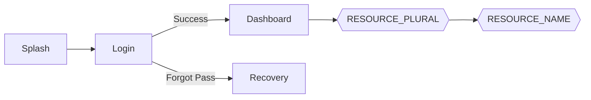

# 📱 UI Wireframes & Screen Flow

Mapa de navegación y estados de la interfaz para **{{PROJECT_NAME}}**.

## 1. Mapa de Navegación (Screen Flow)

## 2. Definición de Pantallas Clave

### Pantalla: **{{SCREEN_1_NAME}}** (Ej: Dashboard)

* **Objetivo:** {{SCREEN_1_GOAL}}
* **Componentes Clave:**
    * Navbar con {{NAV_ITEMS}}.
    * Lista de {{LIST_ITEM_TYPE}}.
    * FAB para crear nuevo.

* **Estados UI:**
    * `Loading`: Skeleton loader.
    * `Empty`: Ilustración de "No hay datos".
    * `Error`: Toast con mensaje y botón de reintentar.

### Pantalla: **{{SCREEN_2_NAME}}**

* **Objetivo:** {{SCREEN_2_GOAL}}
* **Componentes Clave:**
    * {{COMPONENT_1}}
    * {{COMPONENT_2}}

* **Estados UI:**
    * `Loading`: {{LOADING_STATE}}
    * `Success`: {{SUCCESS_STATE}}
    * `Error`: {{ERROR_STATE}}

## 3. Transiciones y Animaciones
* **Duración Estándar:** {{ANIMATION_DURATION}}ms.
* **Timing Function:** {{TIMING_FUNCTION}} (ease-in-out / linear).
