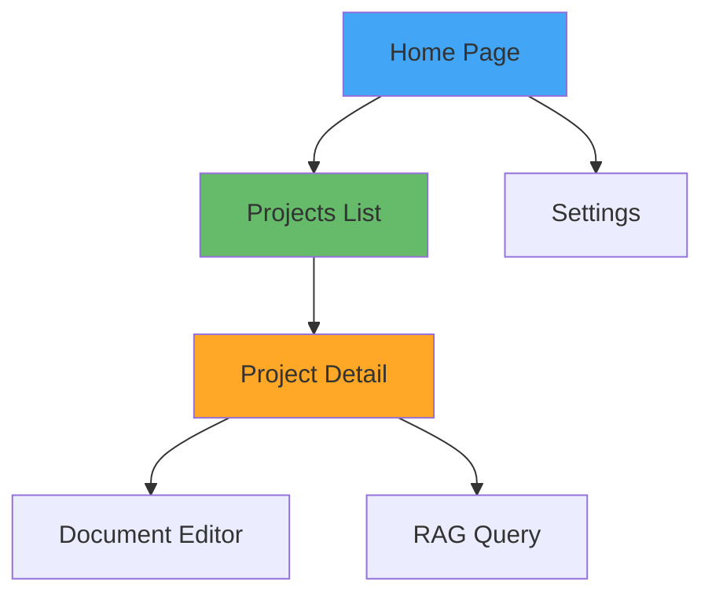

# 🖼️ UI Wireframes & User Flow

<!-- TEMPLATE GUIDE: This document shows HOW users move through the app (screen-by-screen).
     - Wireframes (low-fidelity sketches)
     - User flows (screen transitions)
     - Navigation structure
     Generation Order: 22/24 | Phase: 4-UX/UI | Duration: ~30 mins
     Remove this guide before committing. -->

> **Project:** {{PROJECT_NAME}}
> **Design Tool:** {{DESIGN_TOOL}}  <!-- e.g., Figma, Sketch, Balsamiq -->
> **Wireframes URL:** {{WIREFRAMES_URL}}
> **Last Updated:** {{DATE}}

---

## 📖 Table of Contents

- [Navigation Structure](#navigation-structure)
- [User Flow](#user-flow)
- [Key Screens](#key-screens)

---

## 🗺️ Navigation Structure


```mermaid
graph TD
    A[Home Page] --> B[Projects List]
    A --> C[Settings]
    B --> D[Project Detail]
    D --> E[Document Editor]
    D --> F[RAG Query]

    style A fill:#42a5f5
    style B fill:#66bb6a
    style D fill:#ffa726
```

**Top-Level Navigation:**

| Screen | Route | Access |
|--------|-------|--------|
| {{SCREEN_1}} | {{ROUTE_1}} | {{ACCESS_1}} |
| {{SCREEN_2}} | {{ROUTE_2}} | {{ACCESS_2}} |

<!-- EXAMPLE:

| Screen | Route | Access |
|--------|-------|--------|
| Home | `/` | Public |
| Projects List | `/projects` | Authenticated |
| Project Detail | `/projects/:id` | Project owner |
| Settings | `/settings` | Authenticated |
-->

---

## 🚶 User Flow: {{FLOW_NAME}}

**Goal:** {{FLOW_GOAL}}
**User Persona:** {{FLOW_PERSONA}}


```mermaid
flowchart LR
    A[Landing Page] -->|Click 'Get Started'| B[Sign Up]
    B -->|Submit Form| C[Email Verification]
    C -->|Click Link| D[Dashboard]
    D -->|Click 'New Project'| E[Project Wizard]
    E -->|Fill Details| F[Generate Docs]
    F -->|Processing...| G[Project Created ✅]

    style A fill:#e3f2fd
    style G fill:#c8e6c9
```

**Steps:**

1. **{{STEP_1_NAME}}**
   - Action: {{STEP_1_ACTION}}
   - Screen: {{STEP_1_SCREEN}}
   - Next: {{STEP_1_NEXT}}

<!-- FULL EXAMPLE:

1. **Landing Page**
   - Action: User clicks "Get Started" button
   - Screen: `landing_page.dart`
   - Next: Sign Up form

2. **Sign Up**
   - Action: User enters email + password, clicks "Create Account"
   - Screen: `signup_page.dart`
   - Validation: Email format, password ≥12 chars
   - Next: Email verification screen

3. **Email Verification**
   - Action: User clicks link in email
   - Screen: `verify_email_page.dart`
   - Backend: Verify token, activate account
   - Next: Dashboard

4. **Dashboard**
   - Action: User clicks "New Project" button
   - Screen: `dashboard_page.dart`
   - Next: Project creation wizard

5. **Project Wizard**
   - Action: User fills project name, tech stack, description
   - Screen: `project_wizard_page.dart`
   - Validation: Name required, max 100 chars
   - Next: Document generation (loading screen)

6. **Generate Docs**
   - Action: System generates 24 documents
   - Screen: `generating_docs_page.dart` (progress bar)
   - Duration: ~47 seconds
   - Next: Project detail page

7. **Project Created ✅**
   - Action: User sees success message + project documents
   - Screen: `project_detail_page.dart`
   - Next: User can edit documents, query RAG
-->

---

## 🖼️ Key Screens

### Screen 1: {{SCREEN_1_NAME}}

**Purpose:** {{SCREEN_1_PURPOSE}}
**Route:** {{SCREEN_1_ROUTE}}

**Wireframe:**

```
┌─────────────────────────────────────┐
│  [Logo]               [Settings ⚙️] │ ← Header
├─────────────────────────────────────┤
│                                     │
│   Welcome to {{PROJECT_NAME}}       │ ← Title (H1)
│                                     │
│   {{TAGLINE}}                       │ ← Subtitle
│                                     │
│   [Get Started →]                   │ ← CTA Button (Primary)
│                                     │
├─────────────────────────────────────┤
│  Footer: Privacy | Terms | Contact │
└─────────────────────────────────────┘
```

**Components:**

- Header: Logo (left), Settings icon (right)
- Hero section: Title, subtitle, CTA button
- Footer: 3 links

**Interactions:**

| Element | Action | Result |
|---------|--------|--------|
| {{ELEMENT_1}} | {{ACTION_1}} | {{RESULT_1}} |

<!-- EXAMPLE:

| Element | Action | Result |
|---------|--------|--------|
| "Get Started" button | Click | Navigate to `/signup` |
| Settings icon | Click | Navigate to `/settings` |
| Logo | Click | Reload home page |
-->

---

### Screen 2: {{SCREEN_2_NAME}}

**Purpose:** {{SCREEN_2_PURPOSE}}
**Route:** {{SCREEN_2_ROUTE}}

**Wireframe:**

```
┌─────────────────────────────────────┐
│  [← Back]  {{SCREEN_2_TITLE}}       │ ← Header
├─────────────────────────────────────┤
│                                     │
│  ┌─────────────────────────────┐   │
│  │  {{CONTENT_AREA}}           │   │ ← Main content
│  │                             │   │
│  │  [Action Button]            │   │
│  └─────────────────────────────┘   │
│                                     │
└─────────────────────────────────────┘
```

<!-- FULL EXAMPLE:

### Screen 2: Projects List

**Purpose:** Display all user's projects in a grid

**Wireframe:**

```
┌─────────────────────────────────────┐
│  [← Back]  My Projects   [+ New]    │ ← Header (title + action)
├─────────────────────────────────────┤
│                                     │
│  ┌──────────┐  ┌──────────┐       │
│  │ Project A│  │ Project B│       │ ← Project cards (2-column grid)
│  │ Flutter  │  │ React    │       │
│  │ [Open →] │  │ [Open →] │       │
│  └──────────┘  └──────────┘       │
│                                     │
│  ┌──────────┐  ┌──────────┐       │
│  │ Project C│  │ Project D│       │
│  │ Python   │  │ Rust     │       │
│  │ [Open →] │  │ [Open →] │       │
│  └──────────┘  └──────────┘       │
│                                     │
└─────────────────────────────────────┘
```

**Components:**

- Header: Back button, title, "New Project" button
- Grid: 2-column responsive (1-column on mobile)
- Project card: Icon, name, tech stack, "Open" button

**Interactions:**

| Element | Action | Result |
|---------|--------|--------|
| "New Project" button | Click | Navigate to `/projects/new` |
| Project card | Click | Navigate to `/projects/{id}` |
| Back button | Click | Navigate to `/` |
-->

---

### Screen 3: {{SCREEN_3_NAME}}

<!-- Repeat structure for additional screens -->

---

## 📱 Responsive Breakpoints

| Breakpoint | Width | Layout Changes |
|------------|-------|----------------|
| Mobile | <600px | {{MOBILE_LAYOUT}} |
| Tablet | 600-1024px | {{TABLET_LAYOUT}} |
| Desktop | >1024px | {{DESKTOP_LAYOUT}} |

<!-- EXAMPLE:

| Breakpoint | Width | Layout Changes |
|------------|-------|----------------|
| Mobile | <600px | Single column, hamburger menu, stacked cards |
| Tablet | 600-1024px | 2-column grid, side navigation visible |
| Desktop | >1024px | 3-column grid, full navigation, max-width 1200px |
-->

---

## 🎭 State Transitions

### Loading State

**When:** Async operations (API calls, document generation)

**UI:**

```
┌─────────────────────────┐
│   [Spinner Animation]   │
│                         │
│   {{LOADING_MESSAGE}}   │ ← "Generating documents..."
│                         │
│   [Progress: 47%]       │ ← Optional progress bar
└─────────────────────────┘
```

---

### Error State

**When:** Operation fails (network error, validation error)

**UI:**

```
┌─────────────────────────┐
│   [❌ Icon]             │
│                         │
│   {{ERROR_TITLE}}       │ ← "Something went wrong"
│   {{ERROR_MESSAGE}}     │ ← "Please check your connection"
│                         │
│   [Try Again]           │ ← Action button
└─────────────────────────┘
```

---

### Empty State

**When:** No data to display (new user, no projects)

**UI:**

```
┌─────────────────────────┐
│   [📂 Icon]             │
│                         │
│   No projects yet       │
│   Click "New Project"   │
│   to get started        │
│                         │
│   [Create First Project]│
└─────────────────────────┘
```

---

## 🔗 Related Documents

- [USER_JOURNEY_MAP.md](../10-CONTEXT/USER_JOURNEY_MAP.md) - User goals and pain points
- [DESIGN_SYSTEM.md](DESIGN_SYSTEM.md) - Visual components library
- [ACCESSIBILITY_GUIDE.md](ACCESSIBILITY_GUIDE.md) - Keyboard navigation
