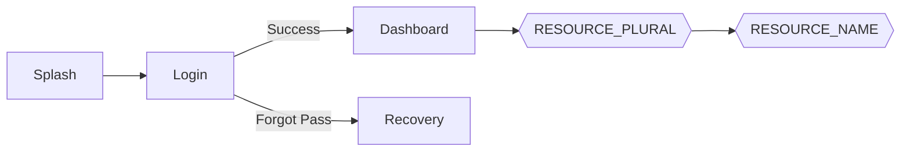

# 📱 UI Wireframes & Screen Flow

Navigation map and interface states for **{{PROJECT_NAME}}**.

## 1. Navigation Map (Screen Flow)

```mermaid
graph LR
    Splash --> Login
    Login -->|Success| Dashboard
    Login -->|Forgot Pass| Recovery
    Dashboard --> List{{RESOURCE_PLURAL}}
    List{{RESOURCE_PLURAL}} --> Detail{{RESOURCE_NAME}}
```

## 2. Key Screen Definitions

### Screen: **{{SCREEN_1_NAME}}** (e.g., Dashboard)

* **Goal:** {{SCREEN_1_GOAL}}
* **Key Components:**
    * Navbar with {{NAV_ITEMS}}.
    * List of {{LIST_ITEM_TYPE}}.
    * FAB to create new.

* **UI States:**
    * `Loading`: Skeleton loader.
    * `Empty`: "No data" illustration.
    * `Error`: Toast with message and retry button.

### Screen: **{{SCREEN_2_NAME}}**

* **Goal:** {{SCREEN_2_GOAL}}
* **Key Components:**
    * {{COMPONENT_1}}
    * {{COMPONENT_2}}

* **UI States:**
    * `Loading`: {{LOADING_STATE}}
    * `Success`: {{SUCCESS_STATE}}
    * `Error`: {{ERROR_STATE}}

## 3. Transitions and Animations
* **Standard Duration:** {{ANIMATION_DURATION}}ms.
* **Timing Function:** {{TIMING_FUNCTION}} (ease-in-out / linear).
