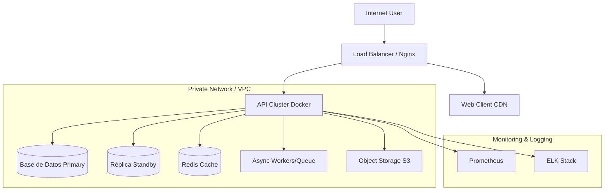

# ☁️ Infrastructure & Deployment Architecture

Diagrama de despliegue para **{{PROJECT_NAME}}**.
**Entorno:** {{CLOUD_PROVIDER}} (AWS / Azure / DigitalOcean / On-Premise).

## 1. Diagrama de Infraestructura

## 2. Recursos Requeridos

| Recurso | Especificación (CPU/RAM) | Escalabilidad | Costo Est. |
| :--- | :--- | :--- | :--- |
| **API Server** | {{API_INSTANCE_SIZE}} | Horizontal (Auto-scaling 1-5 nodos) | {{API_COST}} |
| **Database Primary** | {{DB_INSTANCE_SIZE}} | Vertical | {{DB_COST}} |
| **Cache (Redis)** | {{REDIS_INSTANCE_SIZE}} | Vertical o Cluster | {{REDIS_COST}} |
| **Storage** | {{STORAGE_TYPE}} (S3/Blob) | Ilimitada | {{STORAGE_COST}} |

## 3. Estrategia de Backup

* **DB:** Snapshot diario a las 03:00 AM UTC. Retención {{RETENTION_DAYS}} días.
* **Storage:** Replicación cross-region (si aplica).
* **Disaster Recovery:**
    * RTO (Tiempo recuperación): {{RTO}}
    * RPO (Pérdida datos máxima): {{RPO}}

## 4. Seguridad en Infraestructura

* **Network:** VPC privada con NAT Gateway.
* **Firewall:** Inbound permitido solo desde Cloudflare/CDN.
* **SSL/TLS:** Certificados Let's Encrypt con auto-renovación.
* **Secretos:** Almacenados en {{SECRETS_MANAGER}} (AWS Secrets / Vault).

## 5. Monitoreo y Alertas

* **Métricas:** CPU > 80%, RAM > 85%, Disk > 90%.
* **Logs:** Centralizados en {{LOG_AGGREGATOR}} (CloudWatch / ELK).
* **Uptime:** Meta 99.9% SLA.
