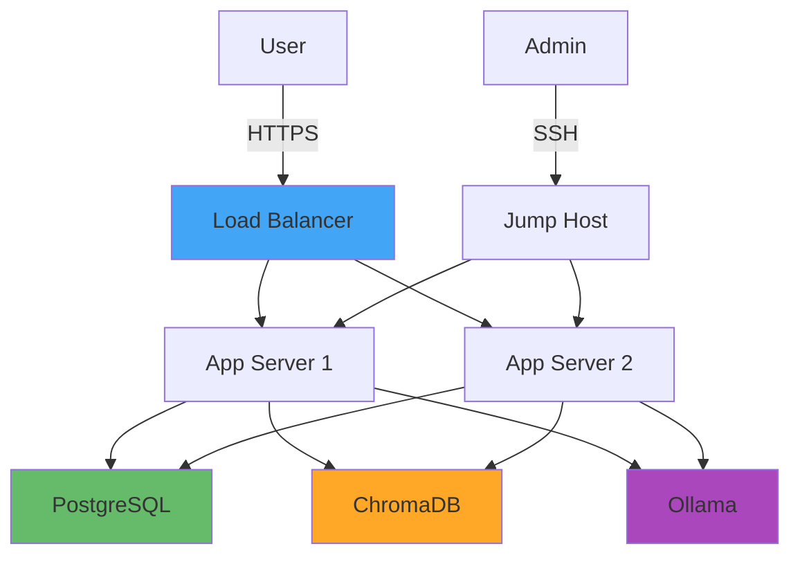

# 🏗️ Deployment & Infrastructure

<!-- ════════════════════════════════════════════════════════════════════════════════
📘 TEMPLATE GUIDE: How to Fill Out This Document
════════════════════════════════════════════════════════════════════════════════

PURPOSE:
This document defines the production environment, hardware/cloud specifications,
network security, and disaster recovery plans. It ensures the application is
scalable, observable, and resilient.

WHEN TO CREATE:
- **Generation Order:** 18/24 (The FINAL document of the Master Workflow)
- **Phase:** 5 - PLANNING
- **Prerequisites:** 30-ARCHITECTURE/TECH_STACK_DECISION.md and 40-PLANNING/CI_CD_PIPELINE.md MUST be complete.

BEST PRACTICES & AI INSTRUCTIONS:
✅ **NO HALLUCINATIONS:** The infrastructure MUST be consistent with the Tech Stack. If the stack is "Local-First", the infrastructure should focus on "Self-Hosted" or "On-Premise" specs. If cloud-based, use specific provider services (AWS, GCP, etc.).
✅ **RELIABILITY FIRST:** Always define clear Backup, Recovery (RTO/RPO), and Monitoring strategies.
✅ **USE EXAMPLES AS GUIDES:** Read the hidden HTML comments () for context, but do not copy them verbatim.
✅ **REPLACE VARIABLES:** Swap all {{PLACEHOLDERS}} with actual project data.
✅ **MERMAID DIAGRAMS:** Do NOT use double curly braces {{ }} inside Mermaid diagrams.
✅ **SELF-DESTRUCT:** You MUST remove this entire TEMPLATE GUIDE comment block before outputting the final Markdown.

⚠️ **CRITICAL ROUTING:**
   This file MUST be saved in the 40-PLANNING directory.
   Filename MUST be: DEPLOYMENT_INFRASTRUCTURE.md
   Correct path: /context/40-PLANNING/DEPLOYMENT_INFRASTRUCTURE.md
════════════════════════════════════════════════════════════════════════════════ -->

> **Cloud Provider:** {{CLOUD_PROVIDER}}  <!-- e.g., AWS, GCP, Azure, Self-Hosted -->
> **Region:** {{REGION}}
> **Environment:** {{ENVIRONMENT}}  <!-- Development, Staging, Production -->
> **Last Updated:** {{DATE}}

---

## 📖 Table of Contents

- [Architecture Diagram](#architecture-diagram)
- [Infrastructure Components](#infrastructure-components)
- [Deployment Process](#deployment-process)
- [Monitoring & Alerting](#monitoring--alerting)

---

## 🏗️ Architecture Diagram


```mermaid
graph TD
    A[User] -->|HTTPS| B[Load Balancer]
    B --> C[App Server 1]
    B --> D[App Server 2]
    C --> E[PostgreSQL]
    C --> F[ChromaDB]
    C --> G[Ollama]
    D --> E
    D --> F
    D --> G

    H[Admin] -->|SSH| I[Jump Host]
    I --> C
    I --> D

    style B fill:#42a5f5
    style E fill:#66bb6a
    style F fill:#ffa726
    style G fill:#ab47bc
```

**Explanation:**

- **Load Balancer:** Distributes traffic across app servers (NGINX / AWS ALB)
- **App Servers:** Run FastAPI backend (2+ instances for HA)
- **Databases:** PostgreSQL (relational), ChromaDB (vectors), Ollama (LLM)
- **Jump Host:** Bastion server for secure SSH access

---

## 🖥️ Infrastructure Components

### 1. Application Servers

**Specification:**

| Resource | Value | Justification |
|----------|-------|---------------|
| **Instance Type** | {{INSTANCE_TYPE}} | {{INSTANCE_JUSTIFICATION}} |
| **vCPUs** | {{VCPUS}} | {{CPU_JUSTIFICATION}} |
| **RAM** | {{RAM}} | {{RAM_JUSTIFICATION}} |
| **Disk** | {{DISK}} | {{DISK_JUSTIFICATION}} |
| **OS** | {{OS}} | {{OS_JUSTIFICATION}} |

<!-- EXAMPLE:

| Resource | Value | Justification |
|----------|-------|---------------|
| **Instance Type** | AWS EC2 t3.medium | Burstable CPU for variable load |
| **vCPUs** | 2 vCPUs | Handles 100 concurrent requests |
| **RAM** | 4 GB | FastAPI + Ollama (small model) |
| **Disk** | 50 GB SSD | OS (10GB) + Docker (20GB) + Logs (20GB) |
| **OS** | Ubuntu 22.04 LTS | Stable, 5 years support |
-->

**Auto-Scaling (if applicable):**

- **Min Instances:** {{MIN_INSTANCES}}
- **Max Instances:** {{MAX_INSTANCES}}
- **Scale Up Trigger:** CPU >70% for 5 minutes
- **Scale Down Trigger:** CPU <30% for 10 minutes

---

### 2. Database (PostgreSQL)

**Specification:**

| Resource | Value |
|----------|-------|
| **Instance Type** | {{DB_INSTANCE}} |
| **Storage** | {{DB_STORAGE}} |
| **Backup** | {{DB_BACKUP_STRATEGY}} |
| **HA (High Availability)** | {{DB_HA}} |

<!-- EXAMPLE:

| Resource | Value |
|----------|-------|
| **Instance Type** | AWS RDS db.t3.small |
| **Storage** | 20 GB SSD (auto-scaling to 100 GB) |
| **Backup** | Daily automated backups (7-day retention) |
| **HA** | Multi-AZ deployment (synchronous replication) |
-->

---

### 3. Vector Database (ChromaDB)

**Deployment:**

- **Where:** Same instance as app server (embedded mode) OR dedicated container
- **Storage:** {{CHROMA_STORAGE}}  <!-- e.g., "Persistent volume (50 GB)" -->
- **Backup:** {{CHROMA_BACKUP}}  <!-- e.g., "Daily snapshot to S3" -->

---

### 4. LLM Inference (Ollama)

**Deployment:**

- **Where:** {{OLLAMA_DEPLOYMENT}}  <!-- e.g., "Dedicated GPU instance (g4dn.xlarge)" OR "CPU instance (co-located)" -->
- **Model:** {{OLLAMA_MODEL}}  <!-- e.g., "Mistral 7B (4-bit quantized)" -->
- **GPU:** {{OLLAMA_GPU}}  <!-- e.g., "NVIDIA T4 (16GB VRAM)" OR "None (CPU inference)" -->

---

## 🚀 Deployment Process

### Manual Deployment (Initial Setup)

```bash
# 1. Provision infrastructure (Terraform example)
cd infrastructure/terraform
terraform init
terraform apply

# 2. SSH into server
ssh -i key.pem ubuntu@{{SERVER_IP}}

# 3. Clone repository
git clone {{REPO_URL}} /opt/app
cd /opt/app

# 4. Set environment variables
cp .env.example .env
nano .env  # Fill in secrets

# 5. Start services (Docker Compose)
docker-compose up -d

# 6. Verify services
curl http://localhost:8000/health  # Should return {"status": "ok"}
```

---

### Automated Deployment (CI/CD)

**Trigger:** Push to `main` branch

**Process:**

1. **Build:** GitHub Actions builds Docker images
2. **Push:** Images pushed to Docker Hub / ECR
3. **Deploy:** SSH to server, pull images, restart containers
4. **Health Check:** Verify `/health` endpoint responds
5. **Rollback (if fails):** Revert to previous image

**Deployment Command:**

```yaml
# .github/workflows/deploy.yml
- name: Deploy to Production
  run: |
    ssh ${{ secrets.PROD_SERVER }} << 'EOF'
      cd /opt/app
      git pull origin main
      docker-compose pull
      docker-compose up -d --remove-orphans
      docker-compose exec -T app python -c "import sys; sys.exit(0 if requests.get('http://localhost:8000/health').status_code == 200 else 1)"
    EOF
```

---

## 🛡️ Security

### Network Security

| Component | Configuration | Purpose |
|-----------|---------------|---------|
| **Firewall** | {{FIREWALL_RULES}} | {{FIREWALL_PURPOSE}} |
| **SSL/TLS** | {{SSL_CONFIG}} | {{SSL_PURPOSE}} |

<!-- EXAMPLE:

| Component | Configuration | Purpose |
|-----------|---------------|---------|
| **Firewall** | Allow 443 (HTTPS), 22 (SSH from Jump Host only) | Restrict public access |
| **SSL/TLS** | Let's Encrypt (auto-renewal), TLS 1.3 minimum | Encrypt traffic |
| **DDoS Protection** | Cloudflare (rate limiting 100 req/min per IP) | Mitigate attacks |
-->

---

### Access Control

| Resource | Who Has Access | How |
|----------|----------------|-----|
| **Production Servers** | {{PROD_ACCESS}} | {{PROD_ACCESS_METHOD}} |
| **Database** | {{DB_ACCESS}} | {{DB_ACCESS_METHOD}} |

<!-- EXAMPLE:

| Resource | Who Has Access | How |
|----------|----------------|-----|
| **Production Servers** | DevOps team (3 people) | SSH keys (no passwords) via Jump Host |
| **Database** | App servers only | Private network (no public IP) |
| **Admin Panel** | CTO + Lead Architect | VPN + 2FA |
-->

---

## 📊 Monitoring & Alerting

### Health Checks

**Endpoint:** `GET /health`

**Response:**

```json
{
  "status": "ok",
  "timestamp": "2024-02-22T10:30:00Z",
  "services": {
    "database": "ok",
    "chroma": "ok",
    "ollama": "ok"
  }
}
```

**Monitoring Tool:** {{MONITORING_TOOL}}  <!-- e.g., Prometheus + Grafana, Datadog, New Relic -->

---

### Metrics

| Metric | Threshold | Alert Action |
|--------|-----------|--------------|
| **Uptime** | <99.5% | {{UPTIME_ALERT}} |
| **Response Time (p95)** | >2 seconds | {{LATENCY_ALERT}} |
| **Error Rate** | >1% | {{ERROR_ALERT}} |
| **CPU Usage** | >80% | {{CPU_ALERT}} |
| **Disk Space** | <10% free | {{DISK_ALERT}} |

<!-- EXAMPLE:

| Metric | Threshold | Alert Action |
|--------|-----------|--------------|
| **Uptime** | <99.5% | PagerDuty alert to on-call engineer |
| **Response Time (p95)** | >2 seconds | Slack #alerts channel |
| **Error Rate** | >1% | Email CTO + rollback |
| **CPU Usage** | >80% for 10 min | Auto-scale up |
| **Disk Space** | <10% free | Email DevOps + trigger cleanup |
-->

---

### Alerting Channels

| Channel | Use Case | Recipients |
|---------|----------|------------|
| {{ALERT_CHANNEL_1}} | {{ALERT_USE_1}} | {{ALERT_RECIPIENTS_1}} |

<!-- EXAMPLE:

| Channel | Use Case | Recipients |
|---------|----------|------------|
| **PagerDuty** | P0 incidents (service down) | On-call engineer |
| **Slack #alerts** | P1 incidents (high latency) | DevOps team |
| **Email** | P2 incidents (warning thresholds) | Engineering managers |
-->

---

## 🔄 Backup & Recovery

### Backup Strategy

| Data | Frequency | Retention | Storage |
|------|-----------|-----------|---------|
| **Database** | {{DB_BACKUP_FREQ}} | {{DB_RETENTION}} | {{DB_BACKUP_STORAGE}} |
| **ChromaDB** | {{CHROMA_BACKUP_FREQ}} | {{CHROMA_RETENTION}} | {{CHROMA_BACKUP_STORAGE}} |
| **User Files** | {{FILES_BACKUP_FREQ}} | {{FILES_RETENTION}} | {{FILES_BACKUP_STORAGE}} |

<!-- EXAMPLE:

| Data | Frequency | Retention | Storage |
|------|-----------|-----------|---------|
| **Database** | Daily (3 AM UTC) | 30 days | AWS S3 (encrypted) |
| **ChromaDB** | Weekly | 90 days | AWS S3 (encrypted) |
| **User Files** | Real-time (S3 versioning) | 90 days | AWS S3 (versioned) |
-->

---

### Disaster Recovery

**RTO (Recovery Time Objective):** {{RTO}}  <!-- e.g., "4 hours" -->
**RPO (Recovery Point Objective):** {{RPO}}  <!-- e.g., "24 hours (last backup)" -->

**Recovery Steps:**

1. {{RECOVERY_STEP_1}}
2. {{RECOVERY_STEP_2}}

<!-- EXAMPLE:

1. Provision new infrastructure (Terraform)
2. Restore latest database backup from S3
3. Pull Docker images
4. Start services
5. Update DNS to point to new servers
6. Verify health checks

**Estimated Time:** 2-3 hours
-->

---

## 💰 Cost Estimate

| Resource | Monthly Cost | Notes |
|----------|--------------|-------|
| {{COST_ITEM_1}} | {{COST_1}} | {{COST_NOTES_1}} |

<!-- EXAMPLE:

| Resource | Monthly Cost | Notes |
|----------|--------------|-------|
| **EC2 Instances (2x t3.medium)** | $60 | On-demand pricing |
| **RDS PostgreSQL (db.t3.small)** | $30 | Single-AZ |
| **S3 Storage (backups)** | $5 | 100 GB |
| **Data Transfer** | $10 | 500 GB/month |
| **CloudWatch** | $5 | Logging + metrics |
| **TOTAL** | **$110/month** | ~$1,320/year |
-->

---

## 🔗 Related Documents

- [CI_CD_PIPELINE.md](CI_CD_PIPELINE.md) - Automated deployment
- [TESTING_STRATEGY.md](TESTING_STRATEGY.md) - Pre-deploy validation
- [SECURITY_THREAT_MODEL.md](../30-ARCHITECTURE/SECURITY_THREAT_MODEL.md) - Infrastructure security
