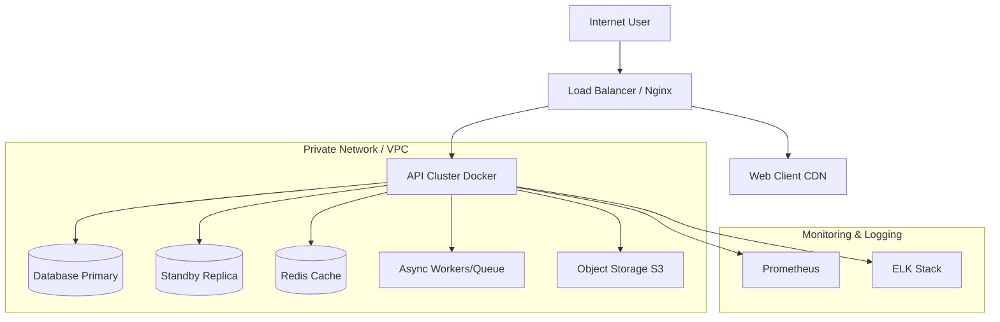

# ☁️ Infrastructure & Deployment Architecture

Deployment diagram for **{{PROJECT_NAME}}**.
**Environment:** {{CLOUD_PROVIDER}} (AWS / Azure / DigitalOcean / On-Premise).

## 1. Infrastructure Diagram

```mermaid
graph TD
    User[Internet User] --> LB[Load Balancer / Nginx]
    LB --> API[API Cluster Docker]
    LB --> Web[Web Client CDN]

    subgraph PrivateNetwork["Private Network / VPC"]
        API --> DB[(Database Primary)]
        API --> Replica[(Standby Replica)]
        API --> Redis[(Redis Cache)]
        API --> Worker[Async Workers/Queue]
        API --> Storage[Object Storage S3]
    end

    subgraph Monitoring["Monitoring & Logging"]
        API --> Prometheus[Prometheus]
        API --> ELK[ELK Stack]
    end
```

## 2. Required Resources

| Resource | Specification (CPU/RAM) | Scalability | Est. Cost |
| :--- | :--- | :--- | :--- |
| **API Server** | {{API_INSTANCE_SIZE}} | Horizontal (Auto-scaling 1-5 nodes) | {{API_COST}} |
| **Database Primary** | {{DB_INSTANCE_SIZE}} | Vertical | {{DB_COST}} |
| **Cache (Redis)** | {{REDIS_INSTANCE_SIZE}} | Vertical or Cluster | {{REDIS_COST}} |
| **Storage** | {{STORAGE_TYPE}} (S3/Blob) | Unlimited | {{STORAGE_COST}} |

## 3. Backup Strategy

* **DB:** Daily snapshot at 03:00 AM UTC. Retention {{RETENTION_DAYS}} days.
* **Storage:** Cross-region replication (if applicable).
* **Disaster Recovery:**
    * RTO (Recovery Time): {{RTO}}
    * RPO (Max Data Loss): {{RPO}}

## 4. Infrastructure Security

* **Network:** Private VPC with NAT Gateway.
* **Firewall:** Inbound allowed only from Cloudflare/CDN.
* **SSL/TLS:** Let's Encrypt certificates with auto-renewal.
* **Secrets:** Stored in {{SECRETS_MANAGER}} (AWS Secrets / Vault).

## 5. Monitoring and Alerts

* **Metrics:** CPU > 80%, RAM > 85%, Disk > 90%.
* **Logs:** Centralized in {{LOG_AGGREGATOR}} (CloudWatch / ELK).
* **Uptime:** 99.9% SLA target.
