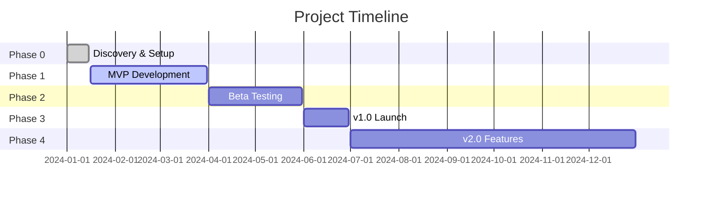

# 🗓️ Roadmap & Phases

<!-- TEMPLATE GUIDE: This document shows the project timeline (past, present, future).
     - Phases (MVP, v1.0, v2.0...)
     - Milestones with dates
     - Feature prioritization
     Generation Order: 6/24 | Phase: 5-Planning | Duration: ~30 mins
     Remove this guide before committing. -->

> **Project:** {{PROJECT_NAME}}
> **Current Phase:** {{CURRENT_PHASE}}
> **Start Date:** {{START_DATE}}
> **Target Launch:** {{LAUNCH_DATE}}
> **Last Updated:** {{DATE}}

---

## 📖 Table of Contents

- [Timeline Overview](#timeline-overview)
- [Phases](#phases)
- [Milestones](#milestones)
- [Feature Prioritization](#feature-prioritization)

---

## 🗓️ Timeline Overview

---

## 🚀 Phases

### Phase 0: Discovery & Setup ✅ COMPLETED

**Duration:** {{PHASE_0_DURATION}}  <!-- e.g., "2 weeks" -->
**Dates:** {{PHASE_0_START}} to {{PHASE_0_END}}
**Goal:** {{PHASE_0_GOAL}}

**Deliverables:**

- ✅ {{DELIVERABLE_0_1}}
- ✅ {{DELIVERABLE_0_2}}

<!-- EXAMPLE:

**Duration:** 2 weeks
**Dates:** 2024-01-01 to 2024-01-15
**Goal:** Define vision, setup infrastructure, validate tech stack

**Deliverables:**

- ✅ Project charter (vision, scope, non-negotiables)
- ✅ Architecture decision records (ADR-001 to ADR-006)
- ✅ Tech stack selected (Flutter, Python, FastAPI, ChromaDB)
- ✅ Development environment setup (Docker Compose)
- ✅ CI/CD pipeline (GitHub Actions)
- ✅ Initial documentation (README, CONTRIBUTING)

**Key Decisions:**

- ADR-001: Use Flutter Desktop (native performance)
- ADR-002: Local-first architecture (privacy requirement)
- ADR-003: Hybrid LLM (Ollama local + Groq cloud)
-->

---

### Phase 1: MVP Development 🚧 IN PROGRESS

**Duration:** {{PHASE_1_DURATION}}
**Dates:** {{PHASE_1_START}} to {{PHASE_1_END}}
**Goal:** {{PHASE_1_GOAL}}

**Features:**

- {{FEATURE_1_1}} - {{FEATURE_1_1_STATUS}}
- {{FEATURE_1_2}} - {{FEATURE_1_2_STATUS}}

<!-- EXAMPLE:

**Duration:** 10 weeks
**Dates:** 2024-01-16 to 2024-03-31
**Goal:** Build core functionality (RAG, doc generation, basic UI)

**Features:**

- ✅ User authentication (email + password)
- ✅ Project creation wizard
- ✅ Document generation (24 templates)
- 🚧 RAG query system (80% complete)
- 🚧 Desktop UI (70% complete)
- ⏳ Knowledge base management (not started)

**Success Criteria:**

- 10 alpha users can create project + generate docs
- RAG answers 80% of questions correctly
- <200ms UI latency
- ≥80% test coverage
-->

---

### Phase 2: Beta Testing 📅 PLANNED

**Duration:** {{PHASE_2_DURATION}}
**Dates:** {{PHASE_2_START}} to {{PHASE_2_END}}
**Goal:** {{PHASE_2_GOAL}}

**Features:**

- {{FEATURE_2_1}}
- {{FEATURE_2_2}}

<!-- EXAMPLE:

**Duration:** 8 weeks
**Dates:** 2024-04-01 to 2024-05-31
**Goal:** Gather feedback, fix bugs, polish UX

**Features:**

- Onboarding tutorial (first-time user guide)
- Export project to ZIP (share with team)
- RAG context management (pin/unpin documents)
- Dark mode support
- Performance optimization (target <150ms UI)

**Success Criteria:**

- 100 beta users
- ≥4.0/5.0 satisfaction score (NPS survey)
- <5 critical bugs
- 95% uptime
-->

---

### Phase 3: v1.0 Launch 📅 PLANNED

**Duration:** {{PHASE_3_DURATION}}
**Dates:** {{PHASE_3_START}} to {{PHASE_3_END}}
**Goal:** {{PHASE_3_GOAL}}

**Features:**

- {{FEATURE_3_1}}
- {{FEATURE_3_2}}

<!-- EXAMPLE:

**Duration:** 4 weeks
**Dates:** 2024-06-01 to 2024-06-30
**Goal:** Public launch, marketing, scaling

**Features:**

- Landing page + marketing site
- Payment integration (if paid tier)
- Windows + macOS builds (currently Linux only)
- Analytics dashboard (usage metrics)
- API rate limiting (prevent abuse)

**Success Criteria:**

- 1,000 registered users
- 500 active projects created
- <1% error rate
- 99.5% uptime
-->

---

### Phase 4: v2.0 Features 📅 PLANNED

**Duration:** {{PHASE_4_DURATION}}
**Dates:** {{PHASE_4_START}} to {{PHASE_4_END}}
**Goal:** {{PHASE_4_GOAL}}

**Features (Backlog):**

- {{FEATURE_4_1}}
- {{FEATURE_4_2}}

<!-- EXAMPLE:

**Duration:** 6 months
**Dates:** 2024-07-01 to 2024-12-31
**Goal:** Advanced features based on user feedback

**Features (Backlog):**

- Team collaboration (multi-user projects)
- Git integration (auto-commit generated docs)
- Custom template editor (user-created templates)
- AI code generation (not just docs)
- Mobile app (Flutter mobile port)
- Cloud sync (optional, opt-in)

**Prioritization:** User voting + business value
-->

---

## 🎯 Milestones

| Milestone | Date | Status | Deliverable |
|-----------|------|--------|-------------|
| {{MILESTONE_1}} | {{M1_DATE}} | {{M1_STATUS}} | {{M1_DELIVERABLE}} |
| {{MILESTONE_2}} | {{M2_DATE}} | {{M2_STATUS}} | {{M2_DELIVERABLE}} |

<!-- EXAMPLE:

| Milestone | Date | Status | Deliverable |
|-----------|------|--------|-------------|
| M1: Tech Stack Finalized | 2024-01-15 | ✅ Done | 6 ADRs approved |
| M2: MVP Feature Complete | 2024-03-15 | 🚧 85% | Core features implemented |
| M3: Alpha Release | 2024-03-31 | ⏳ Pending | 10 users testing |
| M4: Beta Launch | 2024-04-01 | ⏳ Pending | 100 beta invites sent |
| M5: v1.0 Launch | 2024-06-30 | ⏳ Pending | Public announcement |
-->

---

## 📊 Feature Prioritization

**Framework:** {{PRIORITIZATION_FRAMEWORK}}  <!-- e.g., RICE, MoSCoW, Value vs Effort -->

### MoSCoW Method

| Priority | Feature | Justification | Phase |
|----------|---------|---------------|-------|
| **Must Have** | {{MUST_HAVE_1}} | {{MUST_JUSTIFICATION_1}} | {{MUST_PHASE_1}} |
| **Should Have** | {{SHOULD_HAVE_1}} | {{SHOULD_JUSTIFICATION_1}} | {{SHOULD_PHASE_1}} |
| **Could Have** | {{COULD_HAVE_1}} | {{COULD_JUSTIFICATION_1}} | {{COULD_PHASE_1}} |
| **Won't Have (Now)** | {{WONT_HAVE_1}} | {{WONT_JUSTIFICATION_1}} | N/A |

<!-- EXAMPLE:

| Priority | Feature | Justification | Phase |
|----------|---------|---------------|-------|
| **Must Have** | RAG query | Core value prop | Phase 1 (MVP) |
| **Must Have** | Doc generation | Core value prop | Phase 1 (MVP) |
| **Should Have** | Dark mode | User preference (32% request) | Phase 2 (Beta) |
| **Should Have** | Export ZIP | Sharing workflow | Phase 2 (Beta) |
| **Could Have** | Git integration | Nice-to-have automation | Phase 4 (v2.0) |
| **Could Have** | Mobile app | Low user demand (<5%) | Phase 4 (v2.0) |
| **Won't Have** | WYSIWYG editor | Complex, low ROI | Backlog |
| **Won't Have** | Social features | Out of scope | Backlog |
-->

---

## 🔄 Version History

| Version | Release Date | Highlights |
|---------|--------------|------------|
| {{VERSION_1}} | {{V1_DATE}} | {{V1_HIGHLIGHTS}} |

<!-- EXAMPLE:

| Version | Release Date | Highlights |
|---------|--------------|------------|
| v0.1.0 (Prototype) | 2024-01-15 | Basic CRUD, proof of concept |
| v0.5.0 (Alpha) | 2024-03-31 | MVP features, 10 alpha users |
| v0.9.0 (Beta) | 2024-05-31 | 100 beta users, bug fixes |
| v1.0.0 (Launch) | 2024-06-30 | Public release, Windows + macOS |
| v2.0.0 (Major) | 2024-12-31 | Team collaboration, Git integration |
-->

---

## 🔗 Related Documents

- [PROJECT_MANIFESTO.md](../10-CONTEXT/PROJECT_MANIFESTO.md) - MVP scope
- [USER_STORIES_MASTER.json](../../USER_STORIES_MASTER.json) - Feature backlog
- [CI_CD_PIPELINE.md](CI_CD_PIPELINE.md) - Release process
