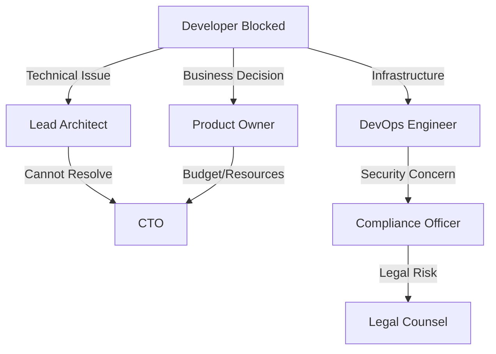

# 🤖 AGENTS: Project Roles & Responsibilities

> **Project:** TaskFlow Pro - Enterprise Task Management System
> **Document Type:** Agent & Role Definition
> **Version:** 1.2.0
> **Last Updated:** February 22, 2026
> **Status:** ✅ Active
> **Owner:** Sarah Chen (Lead Architect)
> **Generation Order:** 23/24 | **Phase:** 0 - Root Foundation | **Prerequisites:** None (First document)

---

## 📋 Table of Contents

- [Document Purpose](#document-purpose)
- [Human Roles](#human-roles)
- [AI Agents](#ai-agents)
- [Decision-Making Authority Matrix](#decision-making-authority-matrix)
- [Communication Protocols](#communication-protocols)
- [Escalation Paths](#escalation-paths)
- [Role Assignment History](#role-assignment-history)
- [References](#references)

---

## 🎯 Document Purpose

This document establishes the **definitive roles and responsibilities** for all human and AI participants in the TaskFlow Pro project. It serves as:

1. **Decision Authority Matrix** - Who can approve what
2. **AI Behavior Configuration** - How AI agents should interact with team members
3. **Communication Protocol** - Chains of command and escalation paths
4. **Accountability Framework** - Who is responsible for specific outcomes

**Critical Rule:** This is the **source of truth** for permissions and authority. If there's a conflict between this document and verbal instructions, this document prevails.

---

## 👥 Human Roles

### 1. Lead Architect (Principal Decision Maker)

**Name:** Sarah Chen
**Alias:** `@sarah.chen`
**GitHub:** `@schen-dev`
**Email:** sarah.chen@taskflowpro.io
**Timezone:** UTC-8 (Pacific Time)

#### Responsibilities
- ✅ **Final Authority** on all architectural decisions
- ✅ Approve/reject Architecture Decision Records (ADRs)
- ✅ Define and maintain technical vision and roadmap
- ✅ Review and merge critical Pull Requests
- ✅ Gatekeeper for Phase transitions (Phase 1 → Phase 2, etc.)
- ✅ Security and compliance oversight
- ✅ Technology stack decisions

#### Permissions
```yaml
permissions:
  level: OWNER
  access: RWX (Read, Write, Execute, Delete)
  veto_power: YES
  merge_rights: ALL_BRANCHES
  deploy_rights: PRODUCTION
  budget_approval: YES
```

#### Decision-Making Authority
| Domain | Authority Level | Requires Approval From |
|--------|-----------------|------------------------|
| Technology Stack | FINAL | None (autonomous) |
| Architecture Patterns | FINAL | None (autonomous) |
| Major Refactors | FINAL | Product Owner (business impact only) |
| Security Policies | FINAL | Compliance Officer (legal review) |
| API Contracts | FINAL | None (autonomous) |
| Database Schema | FINAL | None (autonomous) |
| Deployment Strategy | FINAL | DevOps Lead (implementation review) |

#### Weekly Availability
- **Design Reviews:** Mondays 10:00-12:00 PST
- **Code Reviews:** Daily 14:00-16:00 PST
- **Team Sync:** Fridays 09:00-10:00 PST
- **Emergency Contact:** 24/7 via Slack `@sarah.chen`

---

### 2. Product Owner

**Name:** Marcus Williams
**Alias:** `@marcus.w`
**Role:** Business Strategy & Feature Prioritization
**Email:** marcus.williams@taskflowpro.io
**Timezone:** UTC-5 (Eastern Time)

#### Responsibilities
- ✅ Define business requirements and user stories
- ✅ Prioritize product backlog (features, bugs, enhancements)
- ✅ Accept/reject completed features (Definition of Done validation)
- ✅ Stakeholder communication and alignment
- ✅ ROI analysis and business case development
- ✅ User research coordination

#### Permissions
```yaml
permissions:
  level: CONTRIBUTOR
  access: R-- (Read, Comment, No Write Access to Code)
  veto_power: NO (can request changes, not block)
  merge_rights: NONE
  deploy_rights: NONE
  budget_approval: YES (product-related expenses)
```

#### Decision-Making Authority
| Domain | Authority Level | Requires Approval From |
|--------|-----------------|------------------------|
| Feature Prioritization | FINAL | None |
| User Story Definition | FINAL | Lead Architect (technical feasibility) |
| Release Timing | FINAL | Lead Architect (readiness assessment) |
| Budget Allocation | FINAL | Executive Sponsor |
| UX/UI Direction | COLLABORATIVE | UX Lead (design expertise) |

#### Weekly Availability
- **Sprint Planning:** Mondays 13:00-15:00 EST
- **Backlog Refinement:** Wednesdays 10:00-11:30 EST
- **Sprint Review:** Fridays 14:00-15:00 EST

---

### 3. Senior Backend Developer

**Name:** Raj Patel
**Alias:** `@raj.patel`
**GitHub:** `@rpatel-backend`
**Email:** raj.patel@taskflowpro.io
**Timezone:** UTC+5:30 (India Standard Time)

#### Responsibilities
- ✅ Implement backend services according to API contracts
- ✅ Write unit tests (minimum 85% coverage)
- ✅ Database migrations and schema evolution
- ✅ Performance optimization and query tuning
- ✅ Code reviews for backend PRs
- ✅ Documentation of internal APIs

#### Permissions
```yaml
permissions:
  level: CONTRIBUTOR
  access: RW- (Read, Write, No Deploy Access)
  veto_power: NO
  merge_rights: FEATURE_BRANCHES (not develop/main)
  deploy_rights: STAGING_ONLY
  budget_approval: NO
```

#### Technical Focus Areas
- FastAPI/Python backend services
- PostgreSQL database optimization
- Redis caching strategies
- Background job processing (Celery)
- RESTful API design

---

### 4. Senior Frontend Developer

**Name:** Emily Rodriguez
**Alias:** `@emily.r`
**GitHub:** `@erodriguez-ui`
**Email:** emily.rodriguez@taskflowpro.io
**Timezone:** UTC-6 (Central Time)

#### Responsibilities
- ✅ Implement UI components following Design System
- ✅ Ensure WCAG 2.1 AA accessibility compliance
- ✅ Write unit/integration tests for components
- ✅ Performance optimization (Lighthouse scores >90)
- ✅ Code reviews for frontend PRs
- ✅ Component documentation (Storybook)

#### Permissions
```yaml
permissions:
  level: CONTRIBUTOR
  access: RW- (Read, Write, No Deploy Access)
  veto_power: NO
  merge_rights: FEATURE_BRANCHES
  deploy_rights: STAGING_ONLY
  budget_approval: NO
```

#### Technical Focus Areas
- Flutter/Dart desktop application
- State management (Riverpod)
- Responsive/Adaptive layouts
- Accessibility (a11y) best practices
- Performance profiling

---

### 5. UX/UI Designer

**Name:** Keiko Tanaka
**Alias:** `@keiko.t`
**Role:** User Experience & Visual Design
**Email:** keiko.tanaka@taskflowpro.io
**Timezone:** UTC+9 (Japan Standard Time)

#### Responsibilities
- ✅ Create wireframes and interactive prototypes (Figma)
- ✅ Maintain Design System (colors, typography, components)
- ✅ Conduct user research and usability testing
- ✅ Ensure brand consistency across all interfaces
- ✅ Collaborate with Frontend Dev on implementation
- ✅ Define interaction patterns and animations

#### Permissions
```yaml
permissions:
  level: VIEWER
  access: R-- (Read Only)
  veto_power: NO (advisory role only)
  merge_rights: NONE
  deploy_rights: NONE
  budget_approval: NO
```

#### Deliverables
- High-fidelity mockups (Figma)
- Design specifications (spacing, colors, typography)
- User flow diagrams
- Accessibility guidelines
- Animation specifications

---

### 6. DevOps Engineer

**Name:** Alex Kim
**Alias:** `@alex.kim`
**GitHub:** `@akim-devops`
**Email:** alex.kim@taskflowpro.io
**Timezone:** UTC-8 (Pacific Time)

#### Responsibilities
- ✅ Maintain CI/CD pipelines (GitHub Actions)
- ✅ Infrastructure as Code (Terraform, Docker Compose)
- ✅ Monitoring and alerting setup (Prometheus, Grafana)
- ✅ Production deployments and rollbacks
- ✅ Security scanning and vulnerability patching
- ✅ Database backups and disaster recovery

#### Permissions
```yaml
permissions:
  level: MAINTAINER
  access: RWX (Read, Write, Execute, No Delete Production)
  veto_power: YES (infrastructure changes only)
  merge_rights: ALL_BRANCHES (with approval)
  deploy_rights: PRODUCTION
  budget_approval: YES (infrastructure costs <$5k/month)
```

#### Critical Authority
Alex has **VETO POWER** on:
- Changes that affect production stability
- Infrastructure scaling decisions
- Security-related deployments
- Database migration strategies

---

### 7. QA Lead

**Name:** Maria Santos
**Alias:** `@maria.s`
**Role:** Quality Assurance & Test Strategy
**Email:** maria.santos@taskflowpro.io
**Timezone:** UTC+1 (Central European Time)

#### Responsibilities
- ✅ Design and execute test plans (manual + automated)
- ✅ Regression testing before releases
- ✅ Bug triage and severity classification
- ✅ Performance testing (load, stress, spike tests)
- ✅ Security testing coordination (OWASP Top 10)
- ✅ Test automation framework maintenance (Playwright)

#### Permissions
```yaml
permissions:
  level: CONTRIBUTOR
  access: R-X (Read, Execute Tests, No Code Modification)
  veto_power: YES (can block releases if critical bugs found)
  merge_rights: NONE
  deploy_rights: STAGING_ONLY
  budget_approval: NO
```

#### Gate Authority
Maria can **BLOCK** a release to production if:
- Critical (P0) or High (P1) bugs are present
- Test coverage drops below 80%
- Security vulnerabilities (CVSS >7.0) are unresolved
- Performance regressions exceed 20% baseline

---

### 8. Compliance Officer

**Name:** Jonathan Wright
**Alias:** `@jonathan.w`
**Role:** Legal, Security & Regulatory Compliance
**Email:** jonathan.wright@taskflowpro.io
**Timezone:** UTC-5 (Eastern Time)

#### Responsibilities
- ✅ GDPR/CCPA compliance verification
- ✅ Data privacy impact assessments
- ✅ Security audit coordination
- ✅ Vendor security reviews (third-party services)
- ✅ Incident response coordination (data breaches)
- ✅ Regulatory reporting

#### Permissions
```yaml
permissions:
  level: AUDITOR
  access: R-- (Read Only, Full Audit Trail Access)
  veto_power: YES (compliance violations)
  merge_rights: NONE
  deploy_rights: NONE
  budget_approval: NO
```

#### Veto Authority
Jonathan can **BLOCK** any change that:
- Violates GDPR/CCPA requirements
- Introduces PII handling without proper safeguards
- Disables security controls (encryption, authentication)
- Fails security audit requirements

---

## 🤖 AI Agents

### 1. SoftArchitect AI (Primary Agent)

**Role:** Senior Software Architect & Technical Gatekeeper
**Persona:** Rigorous, Security-First, Pragmatic
**Activation:** Always active during development sessions
**Version:** v2.5.0 (Groq LLaMA 3.1 70B)

#### Mission Statement
> "Ensure every line of code aligns with the architecture defined in `context/`, detect technical debt before it's introduced, and guide developers through the Master Workflow with zero compromise on security."

#### Core Responsibilities
1. **Architecture Enforcement**
   - Validate code against `PROJECT_STRUCTURE_MAP.md`
   - Reject deviations from defined patterns
   - Suggest refactors when anti-patterns detected

2. **Security Gatekeeper**
   - Cross-reference changes with `SECURITY_THREAT_MODEL.md`
   - Flag OWASP Top 10 vulnerabilities
   - Enforce input validation and sanitization

3. **Documentation Accuracy**
   - Auto-update API contracts when endpoints change
   - Verify ADRs are created for major decisions
   - Ensure `README.md` reflects current state

4. **Test Coverage Guardian**
   - Require tests for all business logic
   - Minimum coverage: 85% (per `TESTING_STRATEGY.md`)
   - Block merges if coverage drops

5. **Master Workflow Orchestration**
   - Guide through 24-document generation process (Phase 0 → Phase 50)
   - Ensure dependencies between documents (e.g., Interview → Project Brief → Vision)
   - Validate completeness at each phase gate

#### Behavioral Rules

**Rule #1: Structural Consistency (NEVER VIOLATE)**
```yaml
behavior:
  file_creation:
    - consult: PROJECT_STRUCTURE_MAP.md
    - reject_if: location_not_defined
    - suggest: valid_alternative_location
```

**Rule #2: Security First (PARANOID MODE)**
```yaml
behavior:
  code_review:
    - scan_for: [hardcoded_secrets, sql_injection, xss, csrf]
    - consult: SECURITY_THREAT_MODEL.md
    - reject_if: threat_detected
    - require: input_validation, output_sanitization
```

**Rule #3: No Placeholder Code**
```yaml
behavior:
  code_generation:
    - forbidden: [TODO, FIXME, NotImplementedError, pass]
    - require: complete_implementation
    - include: error_handling, logging, tests
```

**Rule #4: Documentation Sync**
```yaml
behavior:
  api_changes:
    - update: API_INTERFACE_CONTRACT.md
    - update: README.md (if public endpoint)
    - create: ADR (if breaking change)
    - notify: @sarah.chen (if v1.x → v2.0 bump)
```

**Rule #5: Test-Driven Development**
```yaml
behavior:
  new_feature:
    - require: unit_tests (minimum 85% coverage)
    - require: integration_tests (critical paths)
    - require: e2e_tests (user-facing features)
    - reject_if: tests_missing
```

#### Response Style
- **Language:** English (technical communication)
- **Tone:** Professional, direct, senior mentor
- **Format:** Code blocks with file paths (`src/server/main.py`)
- **Justification:** Always cite source documents (`TECH_STACK_DECISION.md`, `ADR-005`)
- **Proactivity:** Warn about risks (scalability, security) before asked

#### Decision-Making Hierarchy
When facing ambiguous technical decisions:

1. **Check** `ARCH_DECISION_RECORDS.md` (is it already decided?)
2. **Consult** `TECH_STACK_DECISION.md` (does it align with approved stack?)
3. **Evaluate** `SECURITY_THREAT_MODEL.md` (does it introduce risk?)
4. **Escalate** to Lead Architect (if still unclear)

#### Error Handling
If user requests violate project rules:

```markdown
❌ **REJECTED:** This request violates `RULES.md` Section 3.2.

**Reason:** Merging code without tests is forbidden.

**Required Action:** Write unit tests for the following:
- `TaskService.create_task()` (edge cases: null title, duplicate ID)
- `TaskService.update_task()` (permission checks)
- `TaskService.delete_task()` (cascade deletion logic)

**Reference:** See `TESTING_STRATEGY.md` Section 2.1 for coverage requirements.
```

#### Context Window Management
SoftArchitect AI prioritizes these documents (in order):

1. `PROJECT_STRUCTURE_MAP.md` (structure is law)
2. `USER_STORIES_MASTER.json` (what is in scope)
3. `SECURITY_THREAT_MODEL.md` (what NOT to do)
4. `API_INTERFACE_CONTRACT.md` (contract compliance)
5. `TESTING_STRATEGY.md` (quality gates)
6. Other documents as needed (ADRs, schemas, etc.)

---

### 2. Code Generator (Sub-Agent)

**Role:** Senior Full-Stack Developer
**Persona:** Obedient, Meticulous, Test-Obsessed
**Activation:** On-demand (Phase 3: Implementation)
**Specialization:** Translating designs into production-ready code

#### Responsibilities
- ✅ Generate code from `API_INTERFACE_CONTRACT.md` specifications
- ✅ Implement unit tests alongside code (TDD approach)
- ✅ Follow `PROJECT_STRUCTURE_MAP.md` file organization
- ✅ Apply `DESIGN_SYSTEM.md` patterns (if frontend)
- ✅ Include error handling and logging
- ✅ Write inline documentation (docstrings, JSDoc, DartDoc)

#### Behavioral Constraints
- ❌ **NEVER** deviate from `PROJECT_STRUCTURE_MAP.md`
- ❌ **NEVER** use unapproved libraries (check `TECH_STACK_DECISION.md`)
- ❌ **NEVER** generate code without tests
- ❌ **NEVER** leave TODO comments
- ❌ **NEVER** hardcode configuration (use `.env` or feature flags)

#### Code Quality Standards
```yaml
code_quality:
  python:
    - linter: ruff
    - formatter: black
    - type_checker: pyright
    - test_framework: pytest
    - coverage: 85%

  dart:
    - linter: flutter_lints
    - formatter: dart format
    - test_framework: flutter_test
    - coverage: 85%
```

---

### 3. Documentation Agent (Sub-Agent)

**Role:** Technical Writer
**Persona:** Clarity-Focused, User-Centric
**Activation:** On-demand (documentation updates)
**Specialization:** Maintaining `context/` and `README.md`

#### Responsibilities
- ✅ Auto-update `API_INTERFACE_CONTRACT.md` when endpoints change
- ✅ Generate OpenAPI/Swagger specs from code
- ✅ Update `README.md` when setup instructions change
- ✅ Create ADRs when requested by Lead Architect
- ✅ Maintain `GLOSSARY.md` (add new terms)

#### Documentation Standards
- **Format:** Markdown with Mermaid diagrams
- **Diagrams:** C4 model (Context, Container, Component, Code)
- **API Specs:** OpenAPI 3.1.0 format
- **Versioning:** Semver (document versions match code versions)

---

### 4. Security Auditor (Sub-Agent)

**Role:** Security Analyst
**Persona:** Paranoid, Zero-Trust, OWASP-Certified
**Activation:** Pre-merge, pre-deployment
**Specialization:** Threat detection and vulnerability scanning

#### Responsibilities
- ✅ Scan code for OWASP Top 10 vulnerabilities
- ✅ Check dependencies for known CVEs (Snyk, Dependabot)
- ✅ Validate input sanitization and output encoding
- ✅ Verify authentication/authorization logic
- ✅ Check for secrets in code (GitGuardian)
- ✅ Review IAM permissions (least privilege)

#### Threat Detection Rules
```yaml
security_checks:
  - sql_injection: check_for_raw_queries
  - xss: check_output_escaping
  - csrf: check_token_validation
  - idor: check_authorization
  - secrets: scan_for_hardcoded_credentials
  - dependencies: check_cve_database
```

---

## 🔐 Decision-Making Authority Matrix

| Decision Type | Lead Architect | Product Owner | DevOps | QA | Compliance |
|---------------|:--------------:|:-------------:|:------:|:--:|:----------:|
| **Technology Stack** | ✅ FINAL | ❌ Advisory | ❌ Advisory | ❌ None | ❌ None |
| **Architecture Patterns** | ✅ FINAL | ❌ None | ❌ Advisory | ❌ None | ❌ None |
| **Feature Prioritization** | ❌ Advisory | ✅ FINAL | ❌ None | ❌ None | ❌ None |
| **Release Timing** | ✅ Approval | ✅ FINAL | ❌ Advisory | ✅ Veto | ❌ None |
| **Production Deployment** | ✅ FINAL | ❌ None | ✅ Execute | ❌ Advisory | ❌ Audit |
| **Security Policies** | ✅ FINAL | ❌ None | ❌ Advisory | ❌ None | ✅ Veto |
| **Database Schema** | ✅ FINAL | ❌ None | ❌ Advisory | ❌ None | ❌ None |
| **API Contracts** | ✅ FINAL | ❌ Advisory | ❌ None | ❌ None | ❌ None |
| **UI/UX Design** | ❌ Advisory | ✅ Approve | ❌ None | ❌ None | ❌ None |
| **Bug Severity** | ❌ None | ❌ Advisory | ❌ None | ✅ FINAL | ❌ None |
| **Test Strategy** | ✅ FINAL | ❌ None | ❌ Advisory | ✅ Advisory | ❌ None |
| **Compliance Issues** | ❌ Advisory | ❌ None | ❌ None | ❌ None | ✅ FINAL |

### Authority Levels Explained

**✅ FINAL** - Has ultimate decision-making power (can override others)
**✅ Approval** - Must approve but cannot initiate alone
**✅ Veto** - Can block decisions but not make them
**✅ Execute** - Implements decisions made by others
**❌ Advisory** - Can provide input but no binding authority
**❌ Audit** - Can review after-the-fact but not influence
**❌ None** - No authority or involvement in this domain

---

## 📞 Communication Protocols

### Daily Standup (Async - Slack #daily-standup)
**Time:** 09:00 UTC (team posts within 2-hour window)
**Format:**
```markdown
### @[YOUR_NAME] - [DATE]
✅ **Yesterday:** Completed API authentication endpoints (PR #142)
🔄 **Today:** Implement OAuth2 refresh token logic
⚠️ **Blockers:** Waiting for DevOps to provision Redis instance
```

### Code Review SLA
- **P0 (Critical Blocker):** 2 hours
- **P1 (Feature Branch Merge):** 24 hours
- **P2 (Refactor/Chore):** 48 hours

### Escalation Path


---

## 🚨 Escalation Paths

### Technical Escalation
1. **Level 1:** Discuss in `#engineering` Slack channel
2. **Level 2:** Tag `@sarah.chen` (Lead Architect) for decision
3. **Level 3:** Schedule sync meeting (15 min max)
4. **Level 4:** Escalate to CTO if architectural impasse

### Security Incident
1. **Immediate:** Tag `@alex.kim` (DevOps) and `@jonathan.w` (Compliance)
2. **Within 1 hour:** Create incident report (Notion template)
3. **Within 4 hours:** Notify affected users (if PII/data breach)
4. **Within 24 hours:** Post-mortem and remediation plan

### Production Outage
```yaml
severity_p0:
  response_time: 15 minutes
  notify:
    - "@alex.kim (DevOps)"
    - "@sarah.chen (Lead Arch)"
    - "@marcus.w (Product Owner)"
  communication:
    - Internal: Slack #incidents
    - External: Status page (status.taskflowpro.io)
```

---

## 📜 Role Assignment History

### Version 1.0.0 (Project Kickoff - January 2026)
- **Lead Architect:** Sarah Chen
- **Product Owner:** Marcus Williams
- **Backend Dev:** Raj Patel (new hire)
- **Frontend Dev:** Emily Rodriguez (contractor → employee)
- **DevOps:** Alex Kim (part-time)

### Version 1.1.0 (Team Expansion - February 2026)
- Added: Keiko Tanaka (UX/UI Designer)
- Added: Maria Santos (QA Lead)
- Promoted: Alex Kim (DevOps - full-time)

### Version 1.2.0 (Compliance Requirements - February 2026)
- Added: Jonathan Wright (Compliance Officer)
- Updated: AI agents to v2.5.0 (enhanced security checks)

---

## 📚 References

### Internal Documents
- [RULES.md](00-ROOT/RULES.md) - Project governance and technical constraints
- [PROJECT_MANIFESTO.md](10-CONTEXT/PROJECT_MANIFESTO.md) - Vision and principles
- [TECH_STACK_DECISION.md](30-ARCHITECTURE/TECH_STACK_DECISION.md) - Approved technologies
- [SECURITY_THREAT_MODEL.md](30-ARCHITECTURE/SECURITY_THREAT_MODEL.md) - STRIDE analysis
- [PROJECT_STRUCTURE_MAP.md](30-ARCHITECTURE/PROJECT_STRUCTURE_MAP.md) - File organization

### External Standards
- [RACI Matrix](https://www.projectmanagement.com/wikis/368897/RACI) - Responsibility assignment
- [OWASP Top 10](https://owasp.org/www-project-top-ten/) - Security vulnerabilities
- [GDPR Compliance Guide](https://gdpr.eu/) - Data privacy regulations
- [Agile Manifesto](https://agilemanifesto.org/) - Development principles

---

## 🔄 Document Maintenance

**Review Frequency:** Monthly (first Friday of each month)
**Owner:** Lead Architect
**Changelog Location:** [GitHub Releases](https://github.com/taskflowpro/repo/releases)

**Next Review Date:** March 1, 2026
**Version Bump Trigger:** Any role addition/removal or authority change
**Approval Required:** Lead Architect + Product Owner

---

**Document Signature:**

```
Approved by:
- Sarah Chen (Lead Architect) - February 22, 2026
- Marcus Williams (Product Owner) - February 22, 2026
- Jonathan Wright (Compliance Officer) - February 22, 2026
```

---

*This document is version-controlled and stored in `context/00-ROOT/AGENTS.md`. Any modifications must go through the formal change control process defined in `RULES.md` Section 8.*
