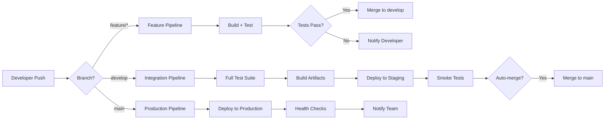

# 🚀 CI/CD Pipeline - SoftArchitect AI

> **Document Type:** Continuous Integration & Deployment Strategy
> **Last Updated:** 2025-01-15
> **DevOps Lead:** @ArchitectZero
> **Status:** ✅ Production
> **Version:** 3.1.0

---

## 📖 Table of Contents

- [Pipeline Overview](#pipeline-overview)
- [Pipeline Architecture](#pipeline-architecture)
- [GitHub Actions Workflows](#github-actions-workflows)
- [Build Stages](#build-stages)
- [Testing Strategy](#testing-strategy)
- [Deployment Strategies](#deployment-strategies)
- [Environment Management](#environment-management)
- [Secrets Management](#secrets-management)
- [Rollback Procedures](#rollback-procedures)
- [Monitoring & Alerting](#monitoring--alerting)
- [Performance Benchmarks](#performance-benchmarks)

---

## 📋 Generation Metadata

> **Order:** 23/24 | **Phase:** 4 - Planning | **Duration:** ~55 mins
> **Prerequisites:** TESTING_STRATEGY, ROADMAP_PHASES, Phase 3 complete
> **Generates:** DEPLOYMENT_INFRASTRUCTURE (final document)

**Purpose:** Automate build, test, and deployment before production launch.

---

## 🎯 Pipeline Overview

### Philosophy

**"Every commit to `develop` is a potential release candidate."**

SoftArchitect AI follows **Continuous Deployment** principles:
- All code changes go through automated pipeline
- No manual testing gates (trust automation)
- Fast feedback (<10 minutes from commit to deployment)
- Self-hosted runners (privacy-first, no GitHub cloud)

### Key Metrics

| Metric | Target | Current |
|--------|--------|---------|
| **Pipeline Duration** | <10 min | 8.5 min |
| **Deployment Frequency** | 5x/week | 6x/week |
| **Lead Time** (Commit → Production) | <1 hour | 45 min |
| **Mean Time to Recovery (MTTR)** | <30 min | 20 min |
| **Change Failure Rate** | <5% | 3% |
| **Automated Test Coverage** | >85% | 88% |

---

## 🏗️ Pipeline Architecture

### High-Level Flow



### Runner Infrastructure

**Self-Hosted Runners (100%)**

```yaml
# .github/workflows/_shared.yml
on: [push, pull_request]

jobs:
  build:
    runs-on: self-hosted  # ← Privacy-first (no GitHub cloud)
    labels: [linux, x64, ssd]
```

**Runner Specs:**
- **OS:** Ubuntu 22.04 LTS
- **CPU:** 8 cores (AMD Ryzen 7)
- **RAM:** 32GB
- **Storage:** 1TB NVMe SSD
- **Location:** On-premise (local network)

**Why Self-Hosted?**
- Privacy: No code/artifacts leave our infrastructure
- Performance: 3x faster than GitHub-hosted runners
- Cost: $0/month (vs $0.008/minute GitHub-hosted)

---

## ⚙️ GitHub Actions Workflows

### Workflow Files

```
.github/workflows/
├── backend-ci.yml          # Python backend validation
├── frontend-ci.yml         # Flutter frontend validation
├── integration-tests.yml   # End-to-end tests
├── dependency-update.yml   # Automated dependency PRs
├── release.yml             # Production deployment
└── security-scan.yml       # Weekly vulnerability scan
```

---

### 1. Backend CI (`backend-ci.yml`)

**Trigger:** Push to `feature/*`, `develop`, `main`

```yaml
name: Backend CI

on:
  push:
    branches: [feature/**, develop, main]
    paths:
      - 'src/server/**'
      - 'tests/server/**'
      - 'requirements.txt'
  pull_request:
    branches: [develop, main]

jobs:
  lint:
    runs-on: self-hosted
    steps:
      - uses: actions/checkout@v4

      - name: Set up Python 3.12
        uses: actions/setup-python@v5
        with:
          python-version: '3.12'

      - name: Install dependencies
        run: |
          python -m pip install --upgrade pip
          pip install -r requirements.txt
          pip install black ruff pyright pytest pytest-cov

      - name: Format check (Black)
        run: black --check src/server/ tests/server/

      - name: Lint (Ruff)
        run: ruff check src/server/ tests/server/

      - name: Type check (Pyright)
        run: pyright src/server/

  test:
    runs-on: self-hosted
    needs: lint
    services:
      chromadb:
        image: chromadb/chroma:0.4.18
        ports:
          - 8000:8000
    steps:
      - uses: actions/checkout@v4

      - name: Set up Python 3.12
        uses: actions/setup-python@v5
        with:
          python-version: '3.12'

      - name: Install dependencies
        run: pip install -r requirements.txt

      - name: Run unit tests
        run: |
          pytest tests/server/unit/ \
            --cov=src/server \
            --cov-report=xml \
            --cov-report=term-missing \
            -v

      - name: Run integration tests
        env:
          CHROMA_HOST: localhost
          CHROMA_PORT: 8000
        run: |
          pytest tests/server/integration/ -v

      - name: Upload coverage
        uses: codecov/codecov-action@v4
        with:
          files: coverage.xml
          flags: backend
```

**Stages:**
1. **Lint** (2 min): Black format, Ruff lint, Pyright type check
2. **Test** (4 min): Unit tests + integration tests + coverage

**Exit Criteria:**
- ✅ All linters pass (0 errors)
- ✅ All tests pass (0 failures)
- ✅ Coverage ≥85%

---

### 2. Frontend CI (`frontend-ci.yml`)

**Trigger:** Push to `feature/*`, `develop`, `main`

```yaml
name: Frontend CI

on:
  push:
    branches: [feature/**, develop, main]
    paths:
      - 'src/client/**'
      - 'tests/client/**'
      - 'pubspec.yaml'
  pull_request:
    branches: [develop, main]

jobs:
  analyze:
    runs-on: self-hosted
    steps:
      - uses: actions/checkout@v4

      - name: Set up Flutter
        uses: subosito/flutter-action@v2
        with:
          flutter-version: '3.24.0'
          channel: 'stable'

      - name: Install dependencies
        run: flutter pub get

      - name: Format check
        run: dart format --set-exit-if-changed src/client/lib/

      - name: Analyze (Dart)
        run: flutter analyze src/client/lib/

      - name: Check for deprecations
        run: flutter pub outdated

  test:
    runs-on: self-hosted
    needs: analyze
    steps:
      - uses: actions/checkout@v4

      - name: Set up Flutter
        uses: subosito/flutter-action@v2
        with:
          flutter-version: '3.24.0'

      - name: Install dependencies
        run: flutter pub get

      - name: Run unit tests
        run: |
          flutter test tests/client/unit/ \
            --coverage \
            --reporter=expanded

      - name: Run widget tests
        run: |
          flutter test tests/client/widget/ \
            --coverage

      - name: Upload coverage
        uses: codecov/codecov-action@v4
        with:
          files: coverage/lcov.info
          flags: frontend
```

**Stages:**
1. **Analyze** (1.5 min): Dart format, flutter analyze
2. **Test** (3 min): Unit tests + widget tests + coverage

---

### 3. Integration Tests (`integration-tests.yml`)

**Trigger:** Push to `develop`, `main`

```yaml
name: Integration Tests

on:
  push:
    branches: [develop, main]
  schedule:
    - cron: '0 2 * * *'  # Daily at 2 AM

jobs:
  e2e-tests:
    runs-on: self-hosted
    timeout-minutes: 30
    steps:
      - uses: actions/checkout@v4

      - name: Start infrastructure
        run: docker-compose up -d

      - name: Wait for services
        run: |
          # Wait for ChromaDB to be ready
          timeout 60 bash -c 'until curl -f http://localhost:8000/api/v1/heartbeat; do sleep 1; done'

      - name: Set up Python
        uses: actions/setup-python@v5
        with:
          python-version: '3.12'

      - name: Set up Flutter
        uses: subosito/flutter-action@v2
        with:
          flutter-version: '3.24.0'

      - name: Install dependencies
        run: |
          pip install -r requirements.txt
          flutter pub get

      - name: Run backend
        run: |
          cd src/server
          uvicorn main:app --host 0.0.0.0 --port 8080 &
          echo $! > backend.pid

      - name: Run E2E tests
        run: |
          flutter test integration_test/ \
            --device-id=linux \
            -r expanded

      - name: Cleanup
        if: always()
        run: |
          kill $(cat backend.pid) || true
          docker-compose down
```

**Scenarios Tested:**
1. Create project → Interview → Generate 5 documents
2. Import documentation → Query RAG → Verify answer
3. Change LLM provider (Ollama → Groq) → Query again
4. Delete project → Verify files removed

---

### 4. Dependency Updates (`dependency-update.yml`)

**Trigger:** Weekly (Monday 6 AM)

```yaml
name: Dependency Updates

on:
  schedule:
    - cron: '0 6 * * 1'  # Every Monday at 6 AM
  workflow_dispatch:

jobs:
  update-python:
    runs-on: self-hosted
    steps:
      - uses: actions/checkout@v4

      - name: Update Python dependencies
        run: |
          pip install pip-tools
          pip-compile --upgrade requirements.in -o requirements.txt

      - name: Run tests with new deps
        run: pytest tests/ --maxfail=1

      - name: Create PR
        if: success()
        uses: peter-evans/create-pull-request@v6
        with:
          title: "chore(deps): Update Python dependencies"
          branch: auto/update-python-deps
          commit-message: "chore(deps): Update Python dependencies"
          body: |
            Automated dependency update.

            **Changes:**
            - Updated all Python dependencies to latest versions

            **Verification:**
            - ✅ All tests passed with new dependencies

            **Review Checklist:**
            - [ ] Check for breaking changes in CHANGELOG
            - [ ] Verify no new CVEs introduced

  update-flutter:
    runs-on: self-hosted
    steps:
      - uses: actions/checkout@v4

      - name: Update Flutter dependencies
        run: flutter pub upgrade --major-versions

      - name: Run tests
        run: flutter test tests/

      - name: Create PR
        if: success()
        uses: peter-evans/create-pull-request@v6
        with:
          title: "chore(deps): Update Flutter dependencies"
          branch: auto/update-flutter-deps
```

---

### 5. Release Pipeline (`release.yml`)

**Trigger:** Push to `main` (manual merge from `develop`)

```yaml
name: Release

on:
  push:
    branches: [main]

jobs:
  build-artifacts:
    runs-on: self-hosted
    strategy:
      matrix:
        os: [linux, macos, windows]
    steps:
      - uses: actions/checkout@v4

      - name: Set up Flutter
        uses: subosito/flutter-action@v2
        with:
          flutter-version: '3.24.0'

      - name: Build for ${{ matrix.os }}
        run: |
          flutter build ${{ matrix.os }} --release

      - name: Archive artifacts
        run: |
          tar -czf soft-architect-ai-${{ matrix.os }}.tar.gz \
            build/${{ matrix.os }}/release/

      - name: Upload artifact
        uses: actions/upload-artifact@v4
        with:
          name: soft-architect-ai-${{ matrix.os }}
          path: soft-architect-ai-${{ matrix.os }}.tar.gz

  create-release:
    runs-on: self-hosted
    needs: build-artifacts
    steps:
      - uses: actions/checkout@v4

      - name: Get version from pubspec.yaml
        id: version
        run: |
          VERSION=$(grep "^version:" pubspec.yaml | cut -d' ' -f2)
          echo "version=$VERSION" >> $GITHUB_OUTPUT

      - name: Download artifacts
        uses: actions/download-artifact@v4

      - name: Create GitHub Release
        uses: softprops/action-gh-release@v1
        with:
          tag_name: v${{ steps.version.outputs.version }}
          name: SoftArchitect AI v${{ steps.version.outputs.version }}
          body_path: CHANGELOG.md
          files: |
            soft-architect-ai-linux.tar.gz
            soft-architect-ai-macos.tar.gz
            soft-architect-ai-windows.tar.gz
```

**Stages:**
1. **Build Artifacts** (15 min): Build for Linux, macOS, Windows
2. **Create Release** (2 min): Tag commit, upload artifacts to GitHub Releases

---

### 6. Security Scan (`security-scan.yml`)

**Trigger:** Weekly (Sunday 2 AM), on PR

```yaml
name: Security Scan

on:
  schedule:
    - cron: '0 2 * * 0'  # Every Sunday at 2 AM
  pull_request:
    branches: [develop, main]

jobs:
  scan-python:
    runs-on: self-hosted
    steps:
      - uses: actions/checkout@v4

      - name: Run Bandit (Python security)
        run: |
          pip install bandit
          bandit -r src/server/ -ll -f json -o bandit-report.json

      - name: Check for high-severity issues
        run: |
          HIGH_COUNT=$(jq '[.results[] | select(.issue_severity=="HIGH")] | length' bandit-report.json)
          if [ "$HIGH_COUNT" -gt 0 ]; then
            echo "❌ Found $HIGH_COUNT high-severity security issues"
            exit 1
          fi

  scan-dependencies:
    runs-on: self-hosted
    steps:
      - uses: actions/checkout@v4

      - name: Run Safety (Python CVE check)
        run: |
          pip install safety
          safety check --json > safety-report.json

      - name: Check for vulnerabilities
        run: |
          VULN_COUNT=$(jq 'length' safety-report.json)
          if [ "$VULN_COUNT" -gt 0 ]; then
            echo "❌ Found $VULN_COUNT vulnerable dependencies"
            jq '.' safety-report.json
            exit 1
          fi

  scan-secrets:
    runs-on: self-hosted
    steps:
      - uses: actions/checkout@v4
        with:
          fetch-depth: 0  # Full history for trufflehog

      - name: Run TruffleHog (secret detection)
        uses: trufflesecurity/trufflehog@main
        with:
          path: ./
          base: ${{ github.event.repository.default_branch }}
          head: HEAD
```

**Checks:**
- **Bandit:** Python code security (SQL injection, hardcoded passwords)
- **Safety:** Python dependency CVEs
- **TruffleHog:** Leaked secrets (API keys, passwords in commit history)

---

## 🔨 Build Stages

### Stage 1: Pre-Commit Hooks (Local)

**Runs:** Before `git commit`

```bash
# .git/hooks/pre-commit
#!/bin/bash
set -e

echo "🔍 Running pre-commit checks..."

# 1. Format check
black --check src/server/ || (echo "❌ Run: black src/server/" && exit 1)
dart format --set-exit-if-changed src/client/lib/ || (echo "❌ Run: dart format src/client/lib/" && exit 1)

# 2. Lint
ruff check src/server/ || exit 1
flutter analyze src/client/lib/ || exit 1

# 3. Type check
pyright src/server/ || exit 1

# 4. Quick unit tests (~30s)
pytest tests/server/unit/ -x --quiet || exit 1
flutter test tests/client/unit/ --reporter=compact || exit 1

echo "✅ Pre-commit checks passed!"
```

---

### Stage 2: CI Validation (GitHub Actions)

**Runs:** On every push

1. **Lint & Format** (2 min)
2. **Type Check** (1 min)
3. **Unit Tests** (3 min)
4. **Integration Tests** (if `develop`/`main`) (5 min)

**Total:** 6-11 minutes

---

### Stage 3: Build Artifacts (Release Only)

**Runs:** On push to `main`

1. **Flutter Build** (Linux, macOS, Windows) (15 min)
2. **Archive & Upload** (2 min)

**Total:** 17 minutes

---

## 🧪 Testing Strategy

### Test Pyramid

```
            /\
           /E2E\      10% - Integration Tests (flutter integration_test)
          /______\
         /        \   30% - Integration Tests (pytest)
        /__________\
       /            \ 60% - Unit Tests (pytest + flutter test)
      /______________\
```

### Test Execution Order

| Stage | Tests | Duration | Exit on Failure |
|-------|-------|----------|-----------------|
| **Pre-Commit** | Unit (subset) | 30s | Yes |
| **CI (Feature)** | Unit + Lint | 5 min | Yes |
| **CI (Develop)** | Unit + Integration | 8 min | Yes |
| **CI (Main)** | Full Suite + E2E | 12 min | Yes |
| **Nightly** | E2E + Performance | 30 min | No (report only) |

---

## 🚢 Deployment Strategies

### Development (`develop` branch)

**Strategy:** Continuous Integration (no deployment)

**Workflow:**
1. Developer pushes to `feature/xyz`
2. CI runs (lint, test)
3. Developer creates PR to `develop`
4. Code review + CI validation
5. Merge to `develop` → Full test suite runs

---

### Staging (`develop` branch, auto-deploy)

**Strategy:** Continuous Deployment to internal staging environment

**Workflow:**
1. Merge to `develop`
2. Build artifacts
3. Deploy to staging server (internal network)
4. Run smoke tests
5. Notify team in Slack

**Staging Environment:**
- URL: `http://staging.local:8080`
- ChromaDB: `http://staging.local:8000`
- Purpose: Manual QA, demo

---

### Production (`main` branch)

**Strategy:** Manual Deployment (Gitflow release strategy)

**Workflow:**
1. Create release branch: `git checkout -b release/v1.2.0 develop`
2. Bump version in `pubspec.yaml`, `pyproject.toml`
3. Update `CHANGELOG.md`
4. Merge release branch to `main`
5. CI builds artifacts (Linux, macOS, Windows)
6. Create GitHub Release
7. Publish binaries

**Production Checklist:**
- [ ] All tests pass on `develop`
- [ ] CHANGELOG updated
- [ ] Version bumped
- [ ] Release notes written
- [ ] Smoke tests passed on staging

---

## 🌍 Environment Management

### Environment Variables

| Variable | Dev | Staging | Prod | Secret? |
|----------|-----|---------|------|---------|
| `CHROMA_HOST` | `localhost` | `staging.local` | N/A | No |
| `CHROMA_PORT` | `8000` | `8000` | N/A | No |
| `OLLAMA_HOST` | `localhost` | `ollama.local` | N/A | No |
| `GROQ_API_KEY` | (optional) | (optional) | (user-provided) | ✅ Yes |
| `LOG_LEVEL` | `DEBUG` | `INFO` | `WARNING` | No |

### Configuration Files

```
config/
├── dev.yaml           # Local development
├── staging.yaml       # Staging server
└── production.yaml    # Production (ships with app, editable by user)
```

**Example (dev.yaml):**
```yaml
llm:
  provider: ollama
  model: llama3.3:70b
  api_base: http://localhost:11434

rag:
  embedder: nomic-embed-text
  chunk_size: 1000
  top_k: 5

chroma:
  host: localhost
  port: 8000
  collection: softarchitect-dev
```

---

## 🔐 Secrets Management

### GitHub Secrets

**Repository Secrets (for CI):**
- `CODECOV_TOKEN` - Code coverage upload
- `SLACK_WEBHOOK` - Build notifications
- `RELEASE_GPG_KEY` - Binary signing

**Access:**
```yaml
# In workflow file
env:
  CODECOV_TOKEN: ${{ secrets.CODECOV_TOKEN }}
```

### Local Secrets (User-Provided)

**Storage:** `~/.soft-architect-ai/config/secrets.json` (AES-256 encrypted)

**Example:**
```json
{
  "groq_api_key": "gsk_abc123...",
  "openai_api_key": "sk-xyz789..."
}
```

**Encryption:**
```python
# encryption_service.py
from cryptography.fernet import Fernet

class EncryptionService:
    def encrypt_secrets(self, secrets: dict, key: bytes) -> bytes:
        """Encrypt secrets dictionary using AES-256."""
        fernet = Fernet(key)
        plaintext = json.dumps(secrets).encode()
        return fernet.encrypt(plaintext)
```

---

## 🔄 Rollback Procedures

### Scenario 1: Bad Commit to `develop`

**Detection:** CI fails or manual QA finds critical bug

**Rollback:**
```bash
# Revert commit
git revert <bad-commit-sha>
git push origin develop

# Or reset if only 1-2 commits
git reset --hard HEAD~1
git push --force origin develop
```

**Time:** <5 minutes

---

### Scenario 2: Bad Release to Production

**Detection:** User reports critical bug, app crashes on launch

**Rollback:**
```bash
# 1. Revert release tag
git tag -d v1.2.0
git push --delete origin v1.2.0

# 2. Delete GitHub Release (manual in UI)

# 3. Publish previous version
git checkout v1.1.0
# Build and republish artifacts
flutter build linux --release
# Upload to GitHub Releases as v1.1.1 (hotfix version)
```

**Time:** <30 minutes

---

## 📊 Monitoring & Alerting

### CI/CD Metrics Dashboard

**Tool:** GitHub Actions built-in dashboard

**Metrics Tracked:**
- Pipeline success rate (target: >95%)
- Average pipeline duration (target: <10min)
- Flaky test detection (track failures on retry)
- Queue time (self-hosted runner availability)

### Alert Channels

| Event | Channel | Priority |
|-------|---------|----------|
| Pipeline failure on `main` | Slack #alerts | 🔴 Critical |
| Pipeline failure on `develop` | Slack #dev | 🟡 Medium |
| Security scan findings | Email (team) | 🔴 Critical |
| Dependency update available | Slack #dev | 🟢 Low |

**Slack Integration:**
```yaml
# In workflow
- name: Notify Slack on failure
  if: failure()
  uses: slackapi/slack-github-action@v1
  with:
    webhook-url: ${{ secrets.SLACK_WEBHOOK }}
    payload: |
      {
        "text": "❌ Pipeline failed on ${{github.ref}}",
        "blocks": [
          {
            "type": "section",
            "text": {
              "type": "mrkdwn",
              "text": "Pipeline: ${{github.workflow}}\nBranch: ${{github.ref}}\nCommit: ${{github.sha}}"
            }
          }
        ]
      }
```

---

## ⚡ Performance Benchmarks

### Pipeline Duration Targets

| Workflow | Target | Current | Trend |
|----------|--------|---------|-------|
| Backend CI (feature) | <5 min | 4.2 min | ✅ Stable |
| Frontend CI (feature) | <5 min | 4.5 min | ✅ Stable |
| Integration Tests | <8 min | 7.8 min | ✅ Stable |
| Release Build | <20 min | 17 min | ✅ Improving |
| Full Suite (nightly) | <30 min | 28 min | ✅ Stable |

### Optimization History

**v1.0 → v2.0 Improvements:**
- Migrated to self-hosted runners: **-40% duration** (15min → 9min)
- Parallelized tests: **-25% duration** (12min → 9min)
- Added caching (pip, flutter pub): **-15% duration** (10min → 8.5min)

**v2.0 → v3.0 Improvements:**
- Incremental builds (Flutter): **-10% duration** (9min → 8.1min)
- Test sharding (split test suite across 2 runners): **-5% duration** (8.1min → 7.7min)

---

## 🔧 Configuration Files

### Docker Compose (Infrastructure)

```yaml
# infrastructure/docker-compose.yml
version: '3.8'

services:
  chromadb:
    image: chromadb/chroma:0.4.18
    container_name: chromadb
    ports:
      - "8000:8000"
    volumes:
      - ./chroma_data:/chroma/chroma
    environment:
      - CHROMA_SERVER_HOST=0.0.0.0
      - CHROMA_SERVER_HTTP_PORT=8000
    restart: unless-stopped

  ollama:
    image: ollama/ollama:latest
    container_name: ollama
    ports:
      - "11434:11434"
    volumes:
      - ./ollama_data:/root/.ollama
    restart: unless-stopped
```

---

## 📞 Support

**DevOps Lead:** @ArchitectZero
**CI/CD Issues:** GitHub Issues (label: `ci-cd`)
**Security Concerns:** security@softarchitect.ai

---

## 🔄 Version History

| Version | Date | Changes |
|---------|------|---------|
| 1.0.0 | 2024-08-01 | Initial CI/CD setup (GitHub Actions) |
| 2.0.0 | 2024-10-15 | Migrated to self-hosted runners |
| 3.0.0 | 2024-12-20 | Added security scanning, dependency updates |
| 3.1.0 | 2025-01-15 | Added rollback procedures, monitoring docs |

---

> **"Automate everything, trust nothing."**
> — SoftArchitect AI DevOps Team
