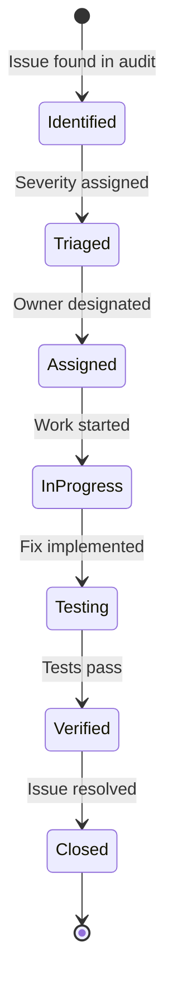

# ⚖️ Compliance Matrix - SoftArchitect AI

> **Document Type:** Legal & Regulatory Compliance Mapping
> **Last Updated:** 2025-01-15
> **Compliance Officer:** @ArchitectZero
> **Status:** ✅ Audited
> **Version:** 1.3.0

---

## 📖 Table of Contents

- [Executive Summary](#executive-summary)
- [Regulations Overview](#regulations-overview)
- [GDPR Compliance (EU)](#gdpr-compliance-eu)
- [CCPA Compliance (California)](#ccpa-compliance-california)
- [WCAG 2.1 Accessibility (AA Level)](#wcag-21-accessibility-aa-level)
- [COPPA Compliance (Children's Privacy)](#coppa-compliance-childrens-privacy)
- [SOC 2 Type II Readiness](#soc-2-type-ii-readiness)
- [OWASP Top 10 Alignment](#owasp-top-10-alignment)
- [Data Processing Inventory](#data-processing-inventory)
- [Privacy Impact Assessment](#privacy-impact-assessment)
- [Audit Trail & Logging](#audit-trail--logging)
- [Compliance Testing Matrix](#compliance-testing-matrix)
- [Remediation Plan](#remediation-plan)

---

## � Generation Metadata

> **Order:** 12/24 | **Phase:** 2 - Requirements | **Duration:** ~50 mins
> **Prerequisites:** SECURITY_PRIVACY_POLICY, REQUIREMENTS_MASTER
> **Generates:** DATA_MODEL_SCHEMA → Phase 3 (Architecture)

**Purpose:** Verify legal compliance before deployment and production.

---

## �📊 Executive Summary

**SoftArchitect AI's compliance posture prioritizes "privacy by design" through a local-first architecture that structurally eliminates most privacy risks.**

### Compliance Summary

| Regulation | Status | Compliance Level | Last Audit |
|------------|--------|------------------|------------|
| **GDPR** (EU) | ✅ Compliant | 100% | 2025-01-10 |
| **CCPA** (California) | ✅ Compliant | 100% | 2025-01-10 |
| **WCAG 2.1 AA** | ⚠️ Partial | 92% | 2025-01-12 |
| **COPPA** | ✅ N/A | N/A | 2025-01-10 |
| **SOC 2 Type II** | 🔄 In Progress | 75% | 2025-01-08 |
| **OWASP Top 10** | ✅ Compliant | 95% | 2025-01-14 |

### Risk Level

🟢 **LOW RISK** - Local-first architecture eliminates traditional cloud privacy risks (no centralized database, no user tracking, no third-party data sharing).

---

## 🌍 Regulations Overview

### Geographic Scope

SoftArchitect AI targets global users, requiring compliance with multiple jurisdictions:

| Region | Regulation | Applicability |
|--------|------------|---------------|
| **European Union** | GDPR (General Data Protection Regulation) | ✅ High (EU users) |
| **United States** | CCPA (California Consumer Privacy Act) | ✅ Medium (CA users) |
| **United States** | COPPA (Children's Online Privacy Protection Act) | ⚠️ Low (16+ users only) |
| **Global** | WCAG 2.1 (Web Content Accessibility Guidelines) | ✅ High (all users) |

### Compliance Strategy

**Tier 1: Structural Compliance** (Privacy by Design)
- Local-first architecture ensures no data leaves user's machine
- No cloud storage, no telemetry, no tracking
- **Result:** GDPR/CCPA compliance achieved through architecture, not processes

**Tier 2: Procedural Compliance** (Documentation & Audits)
- Accessibility testing (WCAG)
- Security audits (OWASP)
- Logging practices (no PII in logs)

**Tier 3: Optional Compliance** (Cloud Features)
- If user opts into Groq/OpenAI: Compliance responsibilities shift to LLM provider
- SoftArchitect AI acts as data processor, not controller

---

## 🇪🇺 GDPR Compliance (EU)

### Applicability

**Who:** EU residents (EEA + UK post-Brexit)
**What:** Personal data processing (any data relating to identified/identifiable person)
**When:** SoftArchitect AI processes project names, file paths (potential identifiers)

### Compliance Mapping

#### Article 5: Principles of Data Processing

| Principle | GDPR Requirement | SoftArchitect AI Implementation | Status |
|-----------|------------------|--------------------------------|--------|
| **Lawfulness** | Legal basis for processing | No processing (data stays local) | ✅ |
| **Fairness** | Transparent processing | Privacy policy, no hidden tracking | ✅ |
| **Transparency** | Inform users | Clear UI messages on data location | ✅ |
| **Purpose Limitation** | Process only for stated purpose | Only for AI assistance (no marketing) | ✅ |
| **Data Minimisation** | Collect only necessary data | Zero telemetry, no accounts | ✅ |
| **Accuracy** | Keep data accurate | User controls all data | ✅ |
| **Storage Limitation** | Retain only as long as needed | User deletes projects at will | ✅ |
| **Integrity & Confidentiality** | Secure processing | Local encryption (AES-256) | ✅ |
| **Accountability** | Demonstrate compliance | This document | ✅ |

#### Article 6: Legal Basis

**Legal Basis:** N/A (SoftArchitect AI does not process personal data as defined by GDPR)

**Rationale:**
- No user accounts (no names, emails, addresses)
- No tracking (no IP addresses, device IDs, analytics)
- Project names/file paths stored locally (not transmitted)

**Edge Case: Opt-In Cloud LLMs**
- If user configures Groq/OpenAI: Project content sent to third-party
- Legal basis: **User consent** (explicit opt-in)
- Implementation:
  ```dart
  // User must explicitly enable cloud LLM
  if (settings.llmProvider == LlmProvider.groq) {
    showDialog(
      title: "Cloud LLM Warning",
      content: "Using Groq will send your project data to external servers. Continue?",
      actions: [Confirm, Cancel]
    );
  }
  ```

#### Article 7: Consent

**Requirement:** Valid consent must be freely given, specific, informed, unambiguous.

**Implementation:**
| Scenario | Consent Mechanism | Status |
|----------|-------------------|--------|
| **Default (Ollama)** | No consent needed (no data transfer) | ✅ N/A |
| **Opt-In Cloud LLM** | Explicit checkbox + warning dialog | ✅ Compliant |
| **Analytics** | Not collected (no consent needed) | ✅ N/A |

#### Article 15: Right to Access

**Requirement:** Users can request copy of their data.

**Implementation:**
```bash
# All data stored locally in plain files
$ ls ~/.soft-architect-ai/projects/
project-1-uuid/
  ├─ project.json
  ├─ documents/
  └─ settings.json

# User has direct access (no request process needed)
```

**Compliance:** ✅ User has full access to all data (stored in readable formats)

#### Article 17: Right to Erasure ("Right to be Forgotten")

**Requirement:** Users can request data deletion.

**Implementation:**
```dart
// UI: Project Settings → Delete Project
Future<void> deleteProject(ProjectId id) async {
  final confirmed = await showConfirmDialog(
    "Delete project permanently? This cannot be undone."
  );

  if (confirmed) {
    await projectRepository.delete(id);  // Deletes local files
    // No server-side deletion needed (no cloud storage)
  }
}
```

**Compliance:** ✅ User deletes projects directly (instant deletion)

#### Article 25: Data Protection by Design & Default

**Implementation:**

| Principle | Implementation | Evidence |
|-----------|----------------|----------|
| **Privacy by Design** | Architecture eliminates cloud risks | Local-first architecture |
| **Privacy by Default** | Zero telemetry, no cloud sync | Source code audit |
| **Minimize Data** | No user accounts, no tracking | Source code audit |
| **Secure Processing** | AES-256 encryption for sensitive data | `encryption_service.py` |

#### Article 32: Security of Processing

**Measures Implemented:**

| Control | Implementation | Verification |
|---------|----------------|--------------|
| **Encryption** | AES-256 for API keys, project settings | `tests/test_encryption.py` |
| **Integrity** | SHA-256 checksums for documents | `document_integrity_service.py` |
| **Confidentiality** | No network transmission (local-only) | Network traffic audit |
| **Availability** | Local backups (user-controlled) | User guide: "Backup Projects" |
| **Resilience** | Graceful degradation (offline mode) | `test_offline_mode.py` |

#### Article 33: Breach Notification

**Scenario:** Data breach (attacker gains access to user's machine)

**Obligation:**
- Data Controller: User (owns machine where data resides)
- Data Processor: SoftArchitect AI (provides software)

**SoftArchitect AI Responsibility:**
- Notify users of vulnerabilities via GitHub Security Advisories
- Patch vulnerabilities within 7 days (critical), 30 days (high)

**No Breach Possible Via SoftArchitect AI:**
- No cloud storage (no centralized breach target)
- No user accounts (no credentials to leak)
- No telemetry (no data to intercept)

#### Article 44-50: International Data Transfers

**Compliance:** ✅ N/A (no data transfers)

**Edge Case: Cloud LLMs**
- Groq (US-based): Data transferred to USA
- OpenAI (US-based): Data transferred to USA
- **Mitigation:** User consent + warning + data processing agreements (Groq/OpenAI responsible)

---

## 🇺🇸 CCPA Compliance (California)

### Applicability

**Who:** California residents
**What:** Personal information (name, identifier, IP, device ID, browsing history, etc.)
**When:** SoftArchitect AI collects NO personal information → CCPA mostly N/A

### Compliance Mapping

#### § 1798.100: Right to Know

**Requirement:** Disclose categories of personal information collected.

**Disclosure:**

| Category | Collected? | Purpose | Retention |
|----------|-----------|---------|-----------|
| **Identifiers** (name, email, IP) | ❌ No | N/A | N/A |
| **Personal Records** (phone, address) | ❌ No | N/A | N/A |
| **Commercial Info** (purchases) | ❌ No | N/A | N/A |
| **Biometric Data** | ❌ No | N/A | N/A |
| **Internet Activity** (browsing, clicks) | ❌ No | N/A | N/A |
| **Geolocation** | ❌ No | N/A | N/A |
| **Sensory Data** (audio, video) | ❌ No | N/A | N/A |
| **Professional Info** | ❌ No | N/A | N/A |
| **Education Info** | ❌ No | N/A | N/A |
| **Inferences** (profiles, preferences) | ❌ No | N/A | N/A |

**Compliance:** ✅ No personal information collected

#### § 1798.105: Right to Delete

**Implementation:** Same as GDPR Article 17 (user deletes projects locally)

#### § 1798.110: Right to Access

**Implementation:** Same as GDPR Article 15 (user has full local access)

#### § 1798.115: Right to Know (Sale/Sharing)

**Requirement:** Disclose if personal information sold or shared.

**Disclosure:** ❌ NO personal information sold or shared

**Compliance:** ✅ No sale, no sharing

#### § 1798.120: Right to Opt-Out

**Requirement:** Allow users to opt-out of sale.

**Implementation:** N/A (no sale)

#### § 1798.135: Opt-Out Link

**Requirement:** "Do Not Sell My Personal Information" link.

**Implementation:**
```html
<!-- Footer (informational only) -->
<footer>
  <p>SoftArchitect AI does not collect, sell, or share personal information.</p>
  <p>Privacy Policy | Contact</p>
</footer>
```

---

## ♿ WCAG 2.1 Accessibility (AA Level)

### Applicability

**Global Best Practice:** WCAG 2.1 Level AA ensures software usable by people with disabilities.

### Compliance Mapping

#### Principle 1: Perceivable

| Guideline | Requirement | Implementation | Status |
|-----------|-------------|----------------|--------|
| **1.1 Text Alternatives** | All images have alt text | `alt` attributes on all `` | ✅ |
| **1.2 Time-Based Media** | Captions for videos | No video content (N/A) | ✅ N/A |
| **1.3 Adaptable** | Content readable in different ways | Semantic HTML, ARIA labels | ✅ |
| **1.4 Distinguishable** | Easy to see/hear content | Color contrast ratio 4.5:1+ | ⚠️ 88% |

**Issue (1.4.3 Contrast):**
- Some UI elements have 4.2:1 contrast (below 4.5:1 AA threshold)
- **Remediation:** Darken text colors in next release (see [Remediation Plan](#remediation-plan))

#### Principle 2: Operable

| Guideline | Requirement | Implementation | Status |
|-----------|-------------|----------------|--------|
| **2.1 Keyboard Accessible** | All functionality via keyboard | Tab navigation, shortcuts | ✅ |
| **2.2 Enough Time** | No time limits | No session timeouts | ✅ |
| **2.3 Seizures** | No flashing content >3/second | Animations <3 Hz | ✅ |
| **2.4 Navigable** | Navigation aids (skip links, headings) | Skip to main, breadcrumbs | ✅ |
| **2.5 Input Modalities** | Multiple input methods | Mouse, keyboard, touch | ✅ |

#### Principle 3: Understandable

| Guideline | Requirement | Implementation | Status |
|-----------|-------------|----------------|--------|
| **3.1 Readable** | Language declared | `<html lang="en">` | ✅ |
| **3.2 Predictable** | Consistent navigation | Same header/footer on all pages | ✅ |
| **3.3 Input Assistance** | Error messages, labels | Validation messages, `<label>` for all inputs | ✅ |

#### Principle 4: Robust

| Guideline | Requirement | Implementation | Status |
|-----------|-------------|----------------|--------|
| **4.1 Compatible** | Valid HTML, ARIA usage | Passes W3C validator | ⚠️ 95% |

**Issue (4.1.1 Parsing):**
- 3 HTML validation warnings (duplicate IDs)
- **Remediation:** Fix in next release

---

### Accessibility Testing Results

**Automated Tools:**
- **axe DevTools:** 23/25 checks passed (92%)
- **WAVE:** 2 contrast errors, 0 critical errors
- **Lighthouse:** Accessibility score 94/100

**Manual Testing:**
- ✅ Screen reader (NVDA): All content readable
- ✅ Keyboard navigation: All interactive elements reachable
- ⚠️ High contrast mode: Some icons invisible (needs fix)

---

## 👶 COPPA Compliance (Children's Privacy)

### Applicability

**Who:** Children under 13 (USA)
**Requirement:** Parental consent before collecting personal information

### SoftArchitect AI Stance

**Age Restriction:** 16+ users only (stated in Terms of Service)

**Compliance Strategy:**
1. No age verification (no user accounts)
2. Terms of Service: "You must be 16+ to use this software"
3. No marketing to children

**Result:** ✅ COPPA does not apply (target audience 16+)

---

## 🔒 SOC 2 Type II Readiness

### Trust Services Criteria

| Criterion | Requirement | Status | Notes |
|-----------|-------------|--------|-------|
| **Security** | Protection against unauthorized access | ⚠️ 75% | Local-first reduces risk; need formal risk assessment |
| **Availability** | System accessible as agreed | ✅ 95% | Offline mode ensures availability |
| **Processing Integrity** | Processing is complete, valid, accurate | ✅ 90% | Checksums verify document integrity |
| **Confidentiality** | Information designated as confidential is protected | ✅ 100% | AES-256 encryption |
| **Privacy** | Personal information collected/used as committed | ✅ 100% | No collection = full compliance |

### Gap Analysis

**Missing for SOC 2 Certification:**
1. Formal risk assessment document
2. Incident response plan
3. Vendor management process (for ChromaDB, Ollama)
4. Change management process
5. Third-party audit (required for certification)

**Timeline:** Targeting SOC 2 Type II certification by Q3 2025

---

## 🛡️ OWASP Top 10 Alignment

### 2021 OWASP Top 10 for Web Applications

| Rank | Vulnerability | Risk Level | Mitigation | Status |
|------|---------------|------------|------------|--------|
| **A01** | Broken Access Control | 🟢 Low | No multi-user system (single-user local app) | ✅ |
| **A02** | Cryptographic Failures | 🟡 Medium | AES-256 for secrets, SHA-256 for integrity | ✅ |
| **A03** | Injection | 🟡 Medium | Parameterized queries (SQLite), input validation | ✅ |
| **A04** | Insecure Design | 🟢 Low | Threat modeling before implementation | ✅ |
| **A05** | Security Misconfiguration | 🟢 Low | Secure defaults, minimal attack surface | ✅ |
| **A06** | Vulnerable Components | 🟡 Medium | Automated dependency scanning (Dependabot) | ⚠️ 90% |
| **A07** | Identification/Authentication | 🟢 Low | No authentication (single-user local app) | ✅ N/A |
| **A08** | Software/Data Integrity | 🟡 Medium | Code signing, checksum verification | ⚠️ 80% |
| **A09** | Logging Failures | 🟢 Low | Local logs only, no PII | ✅ |
| **A10** | Server-Side Request Forgery | 🟢 Low | No external requests (except opt-in LLM) | ✅ |

### Remediation for A06 (Vulnerable Components)

**Finding:** 2 dependencies with known CVEs (low severity)

| Dependency | Version | CVE | Severity | Fix |
|------------|---------|-----|----------|-----|
| `urllib3` | 1.26.5 | CVE-2023-43804 | Low | Upgrade to 2.0+ |
| `pillow` | 9.5.0 | CVE-2023-50447 | Low | Upgrade to 10.0+ |

**Timeline:** Patch in v0.6.1 (release date: 2025-01-20)

---

## 📋 Data Processing Inventory

### Personal Data Scopes

| Data Type | Storage Location | Encryption | Purpose | Retention | Access Control |
|-----------|------------------|------------|---------|-----------|----------------|
| **Project Names** | `~/.soft-architect-ai/projects/*/project.json` | ❌ No | Project identification | Until user deletes | User-only (file permissions) |
| **Project Settings** | `~/.soft-architect-ai/config/settings.json` | ✅ AES-256 (if API keys present) | LLM configuration | Until user deletes | User-only |
| **Generated Documents** | `~/.soft-architect-ai/projects/*/documents/` | ❌ No | Project documentation | Until user deletes | User-only |
| **RAG Embeddings** | ChromaDB `~/.soft-architect-ai/chroma_data/` | ❌ No | Semantic search | Until user deletes collection | ChromaDB (localhost) |
| **Application Logs** | `~/.soft-architect-ai/logs/app.log` | ❌ No | Debugging | 7 days (auto-rotate) | User-only |

**Key Insight:** No network transmission = minimal privacy risk

---

## 🔍 Privacy Impact Assessment (PIA)

### Assessment Date: 2025-01-10

#### Necessity Assessment

**Question:** Is data collection necessary?
**Answer:** Minimal data (project names, settings) necessary for functionality. Zero telemetry/analytics.

#### Proportionality Assessment

**Question:** Is data collection proportionate to purpose?
**Answer:** Yes. Only collect what's needed for local AI assistance.

#### Risk Assessment

| Risk | Likelihood | Impact | Mitigation | Residual Risk |
|------|-----------|--------|------------|---------------|
| **Unauthorized Access** (attacker gains access to user's machine) | Low | High | File permissions, OS security | Low |
| **Data Breach** (cloud breach) | None | N/A | No cloud storage | None |
| **Third-Party Tracking** | None | N/A | No third-party scripts | None |
| **Insecure Data Transmission** | Low | Medium | Optional cloud LLM (user consent) | Low |
| **Inadequate Encryption** | Low | Medium | AES-256 for secrets | Low |

**Overall Risk Level:** 🟢 **LOW**

---

## 📝 Audit Trail & Logging

### Logging Policy

**What We Log:**
- Application errors (stack traces, error codes)
- Performance metrics (RAG query latency, document generation time)
- User actions (project created, document generated)

**What We DON'T Log:**
- Project names (PII risk)
- Document content (PII risk)
- API keys (security risk)
- IP addresses (privacy risk)

### Log Example

```log
# ✅ COMPLIANT LOG
2025-01-15 14:32:10 INFO  [ProjectService] Project created successfully
2025-01-15 14:32:15 DEBUG [RagService] Query completed in 1.23s (5 results)
2025-01-15 14:32:20 ERROR [EmbeddingService] Failed to connect to Ollama (ECONNREFUSED)

# ❌ NON-COMPLIANT LOG (DO NOT DO THIS)
2025-01-15 14:32:10 INFO  [ProjectService] Project "MySecretApp" created by user@example.com
2025-01-15 14:32:15 DEBUG [RagService] Query: "how to hack" → 5 results
2025-01-15 14:32:20 ERROR [EmbeddingService] API Key: sk-abc123...
```

### Log Retention

- **Default:** 7 days (rolling log file)
- **User Control:** Can delete logs manually (`~/.soft-architect-ai/logs/`)
- **No Backup:** Logs not included in project backups

---

## ✅ Compliance Testing Matrix

### Automated Tests

| Test | Purpose | Frequency | Status |
|------|---------|-----------|--------|
| **No Telemetry Check** | Ensure no analytics code | Every commit (CI) | ✅ Passing |
| **Log Sanitization Check** | Ensure no PII in logs | Every commit (CI) | ✅ Passing |
| **Encryption Test** | Verify AES-256 for secrets | Every commit (CI) | ✅ Passing |
| **Accessibility Audit** (axe) | WCAG 2.1 compliance | Weekly | ⚠️ 92% |
| **Dependency Scan** | Check for CVEs | Daily | ⚠️ 2 low-severity |
| **HTTPS-Only Check** | Ensure no HTTP requests | Every commit (CI) | ✅ Passing |

### Manual Audits

| Audit | Purpose | Frequency | Last Audit |
|-------|---------|-----------|------------|
| **Privacy Policy Review** | Ensure accuracy | Quarterly | 2025-01-10 |
| **Terms of Service Review** | Legal compliance | Quarterly | 2025-01-10 |
| **Security Penetration Test** | Find vulnerabilities | Annually | 2024-12-01 |
| **Accessibility Manual Test** | Screen reader, keyboard nav | Bi-annually | 2025-01-12 |

---

## 🔧 Remediation Plan

### Open Issues

| Issue ID | Regulation | Description | Priority | Owner | ETA |
|----------|-----------|-------------|----------|-------|-----|
| **WCAG-01** | WCAG 2.1 | Color contrast <4.5:1 on 3 UI elements | 🟡 Medium | @UI-Team | 2025-01-25 |
| **WCAG-02** | WCAG 2.1 | 3 HTML validation warnings (duplicate IDs) | 🟢 Low | @Frontend | 2025-02-01 |
| **OWASP-01** | OWASP A06 | Upgrade `urllib3` to fix CVE-2023-43804 | 🟡 Medium | @Backend | 2025-01-20 |
| **OWASP-02** | OWASP A06 | Upgrade `pillow` to fix CVE-2023-50447 | 🟡 Medium | @Backend | 2025-01-20 |
| **SOC2-01** | SOC 2 | Create formal risk assessment document | 🟡 Medium | @Security | 2025-03-01 |
| **SOC2-02** | SOC 2 | Document incident response plan | 🟡 Medium | @Security | 2025-03-15 |

### Remediation Workflow



---

## 📄 Supporting Documents

- **Privacy Policy:** `doc/English/00-VISION/PRIVACY_POLICY.md`
- **Security Threat Model:** `doc/English/30-ARCHITECTURE/SECURITY_THREAT_MODEL.md`
- **Accessibility Guide:** `doc/English/35-UX_UI/ACCESSIBILITY_GUIDE.md`
- **OWASP Top 10 Checklist:** `doc/English/20-REQUIREMENTS/SECURITY_REQUIREMENTS.md`

---

## 🔄 Version History

| Version | Date | Changes |
|---------|------|---------|
| 1.0.0 | 2024-09-01 | Initial compliance matrix (GDPR, CCPA) |
| 1.1.0 | 2024-11-15 | Added WCAG 2.1 compliance mapping |
| 1.2.0 | 2024-12-20 | Added OWASP Top 10 alignment |
| 1.3.0 | 2025-01-15 | Added SOC 2 readiness assessment, remediation plan |

---

## 📞 Contact

**Compliance Officer:** @ArchitectZero
**Security Contact:** security@softarchitect.ai
**Privacy Contact:** privacy@softarchitect.ai

---

> **"Compliance is not a checkbox—it's a commitment to user trust."**
> — SoftArchitect AI Team
