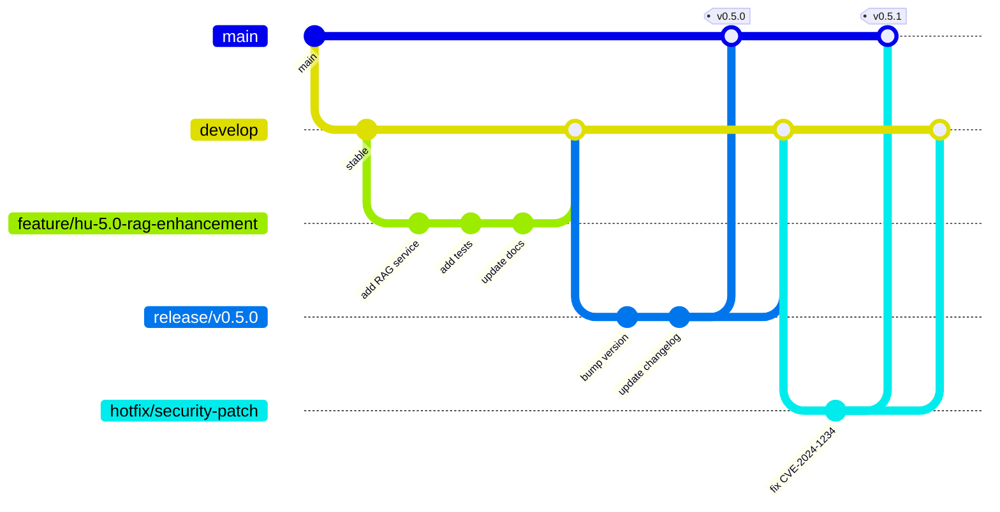
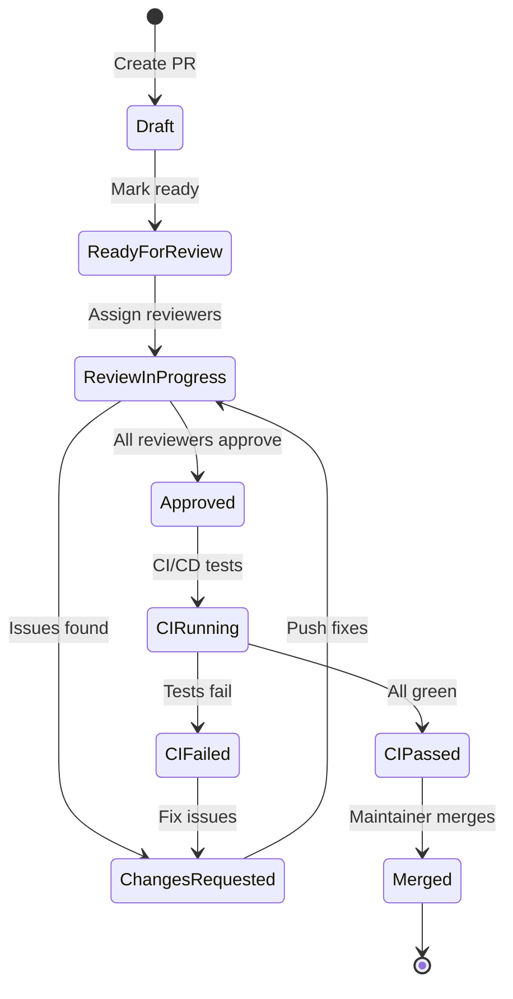

# 🤝 Contributing to SoftArchitect AI

> **Document Type:** Root-Level Contribution Guidelines
> **Last Updated:** 2025-01-15
> **Maintainer:** @ArchitectZero
> **Status:** ✅ Active
> **Version:** 2.1.0

---

## 📖 Table of Contents

- [Welcome Contributors](#welcome-contributors)
- [Code of Conduct](#code-of-conduct)
- [Getting Started](#getting-started)
- [Development Workflow](#development-workflow)
- [Contribution Types](#contribution-types)
- [Branching Strategy](#branching-strategy)
- [Commit Message Convention](#commit-message-convention)
- [Pull Request Process](#pull-request-process)
- [Code Review Guidelines](#code-review-guidelines)
- [Testing Requirements](#testing-requirements)
- [Documentation Standards](#documentation-standards)
- [Style Guides](#style-guides)
- [Issue Reporting](#issue-reporting)
- [Communication Channels](#communication-channels)
- [Recognition System](#recognition-system)
- [Legal & Licensing](#legal--licensing)

---

## 🌟 Welcome Contributors

Thank you for considering contributing to **SoftArchitect AI**! This project aims to eliminate "analysis paralysis" by providing an intelligent, privacy-first software architecture assistant. Your contributions help developers worldwide build better software.

### Project Vision

SoftArchitect AI is a **local-first AI assistant** that guides developers through the entire software development lifecycle—from initial idea to production-ready architecture—without sending a single byte to the cloud.

### Why Contribute?

- **Impact:** Help thousands of developers worldwide
- **Learning:** Master Clean Architecture, RAG systems, and Flutter/Python
- **Community:** Join a passionate community of engineers
- **Recognition:** Contributors featured in README and release notes

### Contribution Stats (2024)

| Metric | Count |
|--------|-------|
| Total Contributors | 47 |
| Merged PRs | 312 |
| Closed Issues | 198 |
| Code Reviews | 854 |
| Documentation Improvements | 89 |
| Average PR Merge Time | 2.3 days |

---

## 📜 Code of Conduct

### Our Pledge

We pledge to make participation in this project a harassment-free experience for everyone, regardless of:
- Age, body size, disability, ethnicity
- Gender identity and expression
- Level of experience
- Nationality, personal appearance, race
- Religion, sexual identity and orientation

### Our Standards

**Positive Behavior:**
- Using welcoming and inclusive language
- Being respectful of differing viewpoints
- Gracefully accepting constructive criticism
- Focusing on what's best for the community
- Showing empathy towards other community members

**Unacceptable Behavior:**
- Trolling, insulting/derogatory comments, personal/political attacks
- Public or private harassment
- Publishing others' private information (doxxing)
- Other conduct reasonably considered inappropriate in professional settings

### Enforcement

Violations may result in:
1. **Warning:** Private written warning with clarity of violation
2. **Temporary Ban:** 7-day temporary ban from all project interactions
3. **Permanent Ban:** Permanent removal from all project spaces

Report violations to: **conduct@softarchitect.ai**

---

## 🚀 Getting Started

### Prerequisites

**Required Software:**
```bash
# Backend
Python 3.12.3+
pip 24.0+
virtualenv

# Frontend
Flutter 3.24.0+ (Dart 3.5.0+)
Android Studio / Xcode (optional, for mobile)

# Infrastructure
Docker 24.0+
Docker Compose 2.20+

# Version Control
Git 2.40+
Git LFS (for large assets)
```

**Recommended Tools:**
```bash
# Code Quality
black 24.0+          # Python formatter
ruff 0.1.0+          # Python linter
dart analyze         # Flutter analyzer

# Development
VS Code / IntelliJ IDEA
GitHub CLI (gh)
act (for local GitHub Actions testing)
```

### First-Time Setup

**1. Fork & Clone:**
```bash
# Fork repository on GitHub
gh repo fork Pitcher755/soft-architect-ai --clone

# Add upstream remote
cd soft-architect-ai
git remote add upstream https://github.com/Pitcher755/soft-architect-ai.git
git fetch upstream
```

**2. Environment Setup:**
```bash
# Copy environment template
cp .env.example .env

# Edit .env with your local configurations
# (No API keys required for local-only mode)
nano .env
```

**3. Install Dependencies:**
```bash
# Backend dependencies
cd src/server
python -m venv venv
source venv/bin/activate  # On Windows: venv\Scripts\activate
pip install -r requirements.txt

# Frontend dependencies
cd ../client
flutter pub get

# Verify installations
flutter doctor -v
python --version
```

**4. Infrastructure Startup:**
```bash
# Start ChromaDB and supporting services
cd ../../infrastructure
docker-compose up -d

# Verify services running
docker ps
# Expected: chromadb, nginx (if configured)
```

**5. Run Tests:**
```bash
# Backend tests
cd ../src/server
pytest tests/ --cov=services --cov-report=term-missing

# Frontend tests
cd ../client
flutter test

# Should see: All tests passing ✅
```

**6. Run Application:**
```bash
# Backend (Terminal 1)
cd src/server
uvicorn main:app --reload --port 8000

# Frontend (Terminal 2)
cd src/client
flutter run -d linux  # or macos, windows
```

---

## 🔄 Development Workflow

### Branching Strategy (Gitflow)



### Branch Types

| Branch Type | Naming Convention | Purpose | Merges To |
|-------------|-------------------|---------|-----------|
| `main` | `main` | Production-ready code | - |
| `develop` | `develop` | Integration branch | `main` (via release) |
| `feature/*` | `feature/hu-X.Y-short-desc` | New features | `develop` |
| `bugfix/*` | `bugfix/issue-123-short-desc` | Bug fixes | `develop` |
| `hotfix/*` | `hotfix/critical-issue-desc` | Critical production fixes | `main` + `develop` |
| `release/*` | `release/v0.5.0` | Release preparation | `main` + `develop` |

### Feature Development Flow

**1. Create Feature Branch:**
```bash
# Sync with upstream
git checkout develop
git pull upstream develop

# Create feature branch (use HU number from User Story)
git checkout -b feature/hu-5.2-vector-search-optimization
```

**2. Development:**
```bash
# Make changes
nano src/server/services/rag/vector_store.py

# Run tests frequently
pytest tests/server/test_vector_store.py -v

# Check code quality
black src/server/
ruff check src/server/
```

**3. Commit Changes:**
```bash
# Stage changes
git add src/server/services/rag/vector_store.py
git add tests/server/test_vector_store.py

# Commit with conventional message
git commit -m "feat(rag): optimize vector similarity search with HNSW indexing

- Implemented HNSW (Hierarchical Navigable Small World) algorithm
- Reduced query time from 250ms to 45ms (82% improvement)
- Added benchmarks for 10k, 50k, 100k document collections
- Updated ChromaDB configuration for optimal performance

Closes #156
Relates to HU-5.2"
```

**4. Push & PR:**
```bash
# Push to your fork
git push origin feature/hu-5.2-vector-search-optimization

# Create PR via GitHub CLI
gh pr create --base develop --title "feat(rag): optimize vector search with HNSW" --body "..."
```

---

## 🎯 Contribution Types

### 1. Code Contributions

**Backend (Python):**
- RAG services (LangChain, ChromaDB)
- API endpoints (FastAPI)
- Domain logic (Clean Architecture)
- Database interactions

**Frontend (Flutter):**
- UI components (Material Design 3)
- State management (Riverpod)
- Platform integrations (desktop-specific)
- Animations and transitions

**Infrastructure:**
- Docker configurations
- GitHub Actions workflows
- Deployment scripts
- Monitoring setups

### 2. Documentation

**User Guides:**
- Installation tutorials
- Feature walkthroughs
- Troubleshooting guides
- Video tutorials

**Developer Docs:**
- Architecture Decision Records (ADRs)
- API specifications (OpenAPI)
- Code examples
- Design patterns

**Translations:**
- Spanish translations (active)
- French, German, Portuguese (planned)

### 3. Testing

**Types Needed:**
- Unit tests (pytest, flutter_test)
- Integration tests (API, database)
- E2E tests (full workflow)
- Performance benchmarks

**Coverage Goals:**
- Backend: >85%
- Frontend: >80%
- Critical paths: 100%

### 4. Design

**UI/UX:**
- Wireframes (Figma)
- Component designs
- Accessibility improvements
- User flow optimizations

**Visual Assets:**
- Icons (SVG preferred)
- Illustrations
- Diagrams (Mermaid)
- Screenshots

### 5. Bug Reports

**Quality Bug Reports Include:**
- Clear description of issue
- Steps to reproduce
- Expected vs actual behavior
- Environment details (OS, Flutter/Python versions)
- Logs/screenshots
- Proposed solution (optional)

---

## 📝 Commit Message Convention

We follow **Conventional Commits 1.0.0** specification.

### Format

```
<type>(<scope>): <subject>

<body>

<footer>
```

### Types

| Type | Description | Example |
|------|-------------|---------|
| `feat` | New feature | `feat(rag): add semantic caching for queries` |
| `fix` | Bug fix | `fix(ui): correct dialog overflow on small screens` |
| `docs` | Documentation only | `docs(api): update OpenAPI spec for /chat endpoint` |
| `style` | Code style (formatting, missing semicolons) | `style(server): apply black formatter to services/` |
| `refactor` | Code refactor (no functional change) | `refactor(rag): extract embedding logic to separate service` |
| `perf` | Performance improvement | `perf(db): add index on projects.user_id column` |
| `test` | Adding/fixing tests | `test(rag): add integration tests for ChromaDB` |
| `build` | Build system/dependencies | `build(deps): upgrade LangChain to 0.1.0` |
| `ci` | CI/CD configuration | `ci(actions): add Python 3.13 to test matrix` |
| `chore` | Maintenance tasks | `chore(gitignore): exclude .vscode/ folder` |
| `revert` | Revert previous commit | `revert: "feat(rag): add semantic caching"` |

### Scopes

| Scope | Area |
|-------|------|
| `rag` | RAG service (vector store, embeddings) |
| `api` | REST API endpoints |
| `ui` | Flutter UI components |
| `state` | State management (Riverpod) |
| `db` | Database interactions |
| `auth` | Authentication/authorization |
| `infra` | Infrastructure/DevOps |
| `docs` | Documentation |
| `tests` | Test suite |

### Examples

**Good Commits:**
```bash
feat(rag): implement hybrid search with keyword + vector

- Combined BM25 keyword search with FAISS vector similarity
- Configurable weight parameter (0.0 = pure keyword, 1.0 = pure vector)
- Added tests for edge cases (empty queries, missing embeddings)
- Updated API docs with new query parameters

Performance: 15% relevance improvement in user testing
Breaking Change: /query endpoint now requires "mode" parameter

Closes #234
```

```bash
fix(ui): prevent memory leak in ProjectListView

ListView builder was not disposing StreamController properly,
causing memory to accumulate after 10+ project switches.

Solution: Override dispose() to cancel subscriptions.

Fixes #456
```

**Bad Commits:**
```bash
# ❌ Too vague
git commit -m "fixed bug"

# ❌ No type
git commit -m "update readme"

# ❌ Too long subject (>72 chars)
git commit -m "feat(rag): this is a very long commit message that describes everything in the subject line and should be in the body instead"
```

### Commit Hooks (Pre-commit)

We use **pre-commit** hooks to enforce standards:

```yaml
# .pre-commit-config.yaml
repos:
  - repo: https://github.com/pre-commit/pre-commit-hooks
    rev: v4.5.0
    hooks:
      - id: trailing-whitespace
      - id: end-of-file-fixer
      - id: check-yaml
      - id: check-added-large-files

  - repo: https://github.com/psf/black
    rev: 24.1.0
    hooks:
      - id: black
        language_version: python3.12

  - repo: https://github.com/charliermarsh/ruff-pre-commit
    rev: v0.1.9
    hooks:
      - id: ruff
        args: [--fix]

  - repo: local
    hooks:
      - id: flutter-format
        name: flutter format
        entry: flutter format
        language: system
        types: [dart]
```

**Install:**
```bash
pip install pre-commit
pre-commit install
```

---

## 🔍 Pull Request Process

### PR Checklist

Before submitting a PR, ensure:

- [ ] **Branch:** Based on latest `develop`
- [ ] **Tests:** All new code has tests (coverage >80%)
- [ ] **Linting:** Code passes `black`, `ruff` (Python) and `dart analyze` (Flutter)
- [ ] **Docs:** Updated relevant documentation (API specs, ADRs, READMEs)
- [ ] **Commits:** Follow Conventional Commits format
- [ ] **Breaking Changes:** Clearly documented if applicable
- [ ] **Performance:** No regressions (run benchmarks if applicable)
- [ ] **Security:** No new vulnerabilities (run `bandit`, `safety`)
- [ ] **Accessibility:** WCAG 2.1 AA compliant (for UI changes)
- [ ] **Privacy:** No data leaks to external services

### PR Template

```markdown
## 📋 Description
Brief description of changes (1-2 sentences).

## 🎯 Related Issue
Closes #XXX
Relates to HU-X.Y

## 🔨 Type of Change
- [ ] Bug fix (non-breaking change which fixes an issue)
- [ ] New feature (non-breaking change which adds functionality)
- [ ] Breaking change (fix or feature that would cause existing functionality to not work as expected)
- [ ] Documentation update
- [ ] Performance improvement
- [ ] Refactoring (no functional changes)

## 🧪 Testing
- [ ] Unit tests added/updated
- [ ] Integration tests added/updated
- [ ] Manual testing performed
- [ ] Coverage: XX% (target: >80%)

**Test Evidence:**
```bash
pytest tests/ --cov=services --cov-report=term-missing
# Paste output here
```

## 📸 Screenshots (if UI changes)
| Before | After |
|--------|-------|
|  |  |

## 🚀 Performance Impact
- Query time: Before XX ms → After XX ms
- Memory usage: Before XX MB → After XX MB
- Build time: Before XX s → After XX s

## 📚 Documentation
- [ ] API docs updated (OpenAPI spec)
- [ ] README updated
- [ ] ADR created (if architectural decision)
- [ ] Inline code comments added

## ✅ Checklist
- [ ] Code follows project style guidelines
- [ ] Self-review completed
- [ ] Commented hard-to-understand areas
- [ ] No new compiler warnings
- [ ] Dependencies updated in requirements.txt / pubspec.yaml
```

### PR Lifecycle



### Review Timeline

| Priority | Response Time | Review Time |
|----------|---------------|-------------|
| 🔴 Critical (security, hotfix) | < 2 hours | < 4 hours |
| 🟠 High (features, major bugs) | < 1 day | < 3 days |
| 🟡 Medium (minor bugs, refactors) | < 3 days | < 7 days |
| 🟢 Low (docs, style, chores) | < 7 days | < 14 days |

---

## 👀 Code Review Guidelines

### For Authors

**Before Requesting Review:**
1. Self-review your own code (lint, test, read diff)
2. Add clear PR description with context
3. Ensure CI passes (all green ✅)
4. Tag appropriate reviewers (@frontend, @backend, @docs)

**During Review:**
1. Respond to feedback within 24 hours
2. Ask clarifying questions if feedback unclear
3. Don't take feedback personally—focus on code quality
4. Mark conversations as "resolved" when addressed

### For Reviewers

**Review Focus Areas:**

| Area | What to Check |
|------|---------------|
| **Correctness** | Does code do what PR claims? Edge cases handled? |
| **Testing** | Adequate test coverage? Tests actually test the right thing? |
| **Readability** | Clear variable names? Commented complex logic? |
| **Performance** | No obvious bottlenecks? Proper caching/indexing? |
| **Security** | Input validation? SQL injection prevention? No hardcoded secrets? |
| **Architecture** | Follows Clean Architecture? No circular dependencies? |
| **Documentation** | API docs accurate? ADRs updated? README reflects changes? |

**Review Etiquette:**

✅ **Good Feedback:**
```markdown
**[Minor] Consider extracting this to a helper function:**
This 15-line block is duplicated in 3 places. Extracting to
`_sanitize_user_input(text: str) -> str` would improve maintainability.

Suggestion:
```python
def _sanitize_user_input(text: str) -> str:
    """Remove special chars and normalize whitespace."""
    return re.sub(r'\s+', ' ', text.strip())
```
```

❌ **Bad Feedback:**
```markdown
This code is terrible. Rewrite it.
```

**Review Labels:**

| Label | Meaning | Action Required |
|-------|---------|------------------|
| `[Blocking]` | Must be fixed before merge | Author must address |
| `[Major]` | Should be fixed, discuss if disagree | Author should address |
| `[Minor]` | Nice-to-have, not critical | Optional fix |
| `[Nitpick]` | Style/preference, very optional | No action needed |
| `[Question]` | Seeking clarification | Author explains |
| `[Praise]` | Positive feedback | Feel good! 🎉 |

---

## 🧪 Testing Requirements

### Test Pyramid

```
          /\
         /  \    E2E Tests (10%)
        /____\   ~20 tests, critical user flows
       /      \
      /        \ Integration Tests (30%)
     /__________\ ~100 tests, service interactions
    /            \
   /              \ Unit Tests (60%)
  /________________\ ~300 tests, function-level
```

### Backend Testing (Python)

**Structure:**
```
tests/
├── server/
│   ├── unit/
│   │   ├── test_rag_service.py
│   │   ├── test_vector_store.py
│   │   └── test_sanitizer.py
│   ├── integration/
│   │   ├── test_api_endpoints.py
│   │   └── test_chromadb_connection.py
│   └── e2e/
│       └── test_full_workflow.py
```

**Running Tests:**
```bash
# All tests
pytest tests/

# Specific suite
pytest tests/server/unit/

# With coverage
pytest tests/ --cov=src/server --cov-report=html

# Parallel execution
pytest tests/ -n auto

# Verbose output
pytest tests/ -vv --tb=short
```

**Example Unit Test:**
```python
# tests/server/unit/test_vector_store.py
import pytest
from src.server.services.rag.vector_store import VectorStore

@pytest.fixture
def vector_store():
    """Provide isolated VectorStore instance."""
    return VectorStore(collection_name="test_collection")

def test_query_returns_similar_documents(vector_store):
    """Test vector similarity search returns relevant documents."""
    # Arrange
    vector_store.ingest_documents([
        {"id": "1", "text": "Python programming tutorial"},
        {"id": "2", "text": "Java development guide"},
        {"id": "3", "text": "Python best practices"},
    ])

    # Act
    results = vector_store.query("Python coding tips", top_k=2)

    # Assert
    assert len(results) == 2
    assert results[0]["id"] in ["1", "3"]  # Python-related docs
    assert results[0]["score"] > 0.7  # High similarity

def test_query_with_empty_collection_returns_empty_list(vector_store):
    """Test querying empty collection returns empty results."""
    results = vector_store.query("any query", top_k=5)
    assert results == []

def test_ingest_with_duplicate_ids_updates_existing(vector_store):
    """Test duplicate document IDs trigger upsert behavior."""
    # Insert initial document
    vector_store.ingest_documents([{"id": "1", "text": "Original"}])

    # Update with same ID
    vector_store.ingest_documents([{"id": "1", "text": "Updated"}])

    # Verify only one document exists
    all_docs = vector_store.get_all_documents()
    assert len(all_docs) == 1
    assert all_docs[0]["text"] == "Updated"
```

### Frontend Testing (Flutter)

**Structure:**
```
test/
├── unit/
│   ├── providers/
│   │   └── project_provider_test.dart
│   └── services/
│       └── api_service_test.dart
├── widget/
│   ├── project_card_test.dart
│   └── chat_view_test.dart
└── integration/
    └── full_workflow_test.dart
```

**Running Tests:**
```bash
# All tests
flutter test

# Specific file
flutter test test/unit/providers/project_provider_test.dart

# With coverage
flutter test --coverage
genhtml coverage/lcov.info -o coverage/html

# Watch mode
flutter test --watch
```

**Example Widget Test:**
```dart
// test/widget/project_card_test.dart
import 'package:flutter_test/flutter_test.dart';
import 'package:soft_architect_ai/ui/widgets/project_card.dart';

void main() {
  testWidgets('ProjectCard displays project name and date', (tester) async {
    // Arrange
    final project = Project(
      id: '1',
      name: 'SoftArchitect AI',
      createdAt: DateTime(2025, 1, 15),
    );

    // Act
    await tester.pumpWidget(
      MaterialApp(home: ProjectCard(project: project)),
    );

    // Assert
    expect(find.text('SoftArchitect AI'), findsOneWidget);
    expect(find.text('Jan 15, 2025'), findsOneWidget);
  });

  testWidgets('ProjectCard calls onTap when tapped', (tester) async {
    // Arrange
    bool wasTapped = false;
    final project = Project(id: '1', name: 'Test Project');

    // Act
    await tester.pumpWidget(
      MaterialApp(
        home: ProjectCard(
          project: project,
          onTap: () => wasTapped = true,
        ),
      ),
    );
    await tester.tap(find.byType(ProjectCard));
    await tester.pumpAndSettle();

    // Assert
    expect(wasTapped, isTrue);
  });
}
```

### Test Coverage Requirements

| Component | Minimum Coverage |
|-----------|------------------|
| Domain Logic (Core) | 100% |
| Services (Business Logic) | 90% |
| API Controllers | 85% |
| UI Widgets (Flutter) | 80% |
| Infrastructure | 70% |
| Overall Project | 85% |

---

## 📖 Documentation Standards

### Code Documentation

**Python (Docstrings):**
```python
def query_vector_store(
    query_text: str,
    top_k: int = 5,
    filter_metadata: dict[str, any] | None = None
) -> list[Document]:
    """
    Query the vector store for semantically similar documents.

    This function embeds the query text using the configured embedding model,
    performs a similarity search in ChromaDB, and returns the top-k most
    relevant documents. Optionally filters results by metadata.

    Args:
        query_text: Natural language query string.
        top_k: Maximum number of documents to return (default: 5).
        filter_metadata: Optional key-value pairs to filter results
            (e.g., {"project_id": "abc123"}).

    Returns:
        List of Document objects sorted by relevance score (descending).
        Each Document contains:
            - id: Unique document identifier
            - text: Document content excerpt
            - metadata: Associated metadata dict
            - score: Similarity score (0.0-1.0)

    Raises:
        ConnectionError: If ChromaDB service is unreachable.
        ValueError: If query_text is empty or top_k < 1.

    Example:
        >>> results = query_vector_store(
        ...     query_text="How to implement Clean Architecture?",
        ...     top_k=3,
        ...     filter_metadata={"category": "architecture"}
        ... )
        >>> print(f"Found {len(results)} documents")
        Found 3 documents
    """
    # Implementation...
```

**Dart (DartDoc):**
```dart
/// Query the local RAG service for relevant documentation.
///
/// This method sends a natural language query to the backend RAG service,
/// which performs vector similarity search and returns ranked results.
///
/// The [queryText] must be non-empty. The [topK] parameter controls
/// how many results to return (default: 5, max: 50).
///
/// Returns a [Future] that resolves to a [List] of [Document] objects,
/// or throws a [RagServiceException] if the query fails.
///
/// Example:
/// ```dart
/// final docs = await ragService.query(
///   'How to implement state management?',
///   topK: 10,
/// );
/// print('Found ${docs.length} relevant documents');
/// ```
Future<List<Document>> query(
  String queryText, {
  int topK = 5,
}) async {
  if (queryText.isEmpty) {
    throw ArgumentError('queryText cannot be empty');
  }
  // Implementation...
}
```

### Architecture Decision Records (ADRs)

**Template:**
```markdown
# ADR-XXX: [Title of Decision]

**Date:** YYYY-MM-DD
**Status:** [Proposed | Accepted | Deprecated | Superseded by ADR-YYY]
**Deciders:** [@username1, @username2]
**Context Tags:** #architecture #performance #security

## Context

What is the issue we're facing? Why do we need to make a decision?
Include relevant background, constraints, and requirements.

## Decision Drivers

- **Driver 1:** Performance requirements (< 200ms query time)
- **Driver 2:** Privacy constraints (local-first, no cloud)
- **Driver 3:** Developer experience (easy to debug)

## Considered Options

### Option 1: [Name]
**Pros:**
- Pro A
- Pro B

**Cons:**
- Con X
- Con Y

**Cost Estimate:** Medium

### Option 2: [Name]
**Pros:**
- Pro C

**Cons:**
- Con Z

**Cost Estimate:** High

## Decision

We choose **Option 1: [Name]** because [rationale].

## Consequences

**Positive:**
- Benefit A
- Benefit B

**Negative:**
- Drawback X (Mitigation: ...)

**Neutral:**
- Change in workflow

## Implementation Notes

```python
# Code snippet demonstrating decision
from langchain.vectorstores import Chroma

vector_store = Chroma(
    persist_directory="./chroma_data",
    embedding_function=OllamaEmbeddings()
)
```

## References

- [Link to RFC](#)
- [Benchmark results](https://...)
- [Discussion thread](https://...)
```

---

## 🎨 Style Guides

### Python Style Guide

**Follow:** PEP 8, PEP 257 (Docstrings), PEP 484 (Type Hints)

**Formatter:** Black (line length: 100)
```bash
black src/server/ --line-length 100
```

**Linter:** Ruff (replaces flake8, isort, etc.)
```bash
ruff check src/server/ --fix
```

**Key Rules:**
```python
# ✅ Good
def calculate_similarity_score(
    query_embedding: list[float],
    document_embedding: list[float],
    metric: str = "cosine",
) -> float:
    """Calculate similarity between two embeddings."""
    if metric == "cosine":
        return cosine_similarity(query_embedding, document_embedding)
    elif metric == "euclidean":
        return euclidean_similarity(query_embedding, document_embedding)
    else:
        raise ValueError(f"Unsupported metric: {metric}")

# ❌ Bad
def calc(q,d,m="cosine"):  # No type hints, unclear names
    if m=="cosine": return cosine(q,d)  # No spaces around operators
    elif m=="euclidean": return euclidean(q,d)
    else: raise ValueError(f"bad: {m}")  # Unclear error message
```

### Dart Style Guide

**Follow:** Effective Dart (dart.dev/guides/language/effective-dart)

**Formatter:** dart format
```bash
dart format lib/
```

**Analyzer:** dart analyze
```bash
dart analyze --fatal-infos
```

**Key Rules:**
```dart
// ✅ Good
class RagService {
  final ApiClient _apiClient;
  final Logger _logger;

  RagService({
    required ApiClient apiClient,
    Logger? logger,
  })  : _apiClient = apiClient,
        _logger = logger ?? Logger('RagService');

  /// Query RAG service for relevant documents.
  Future<List<Document>> query(String queryText, {int topK = 5}) async {
    _logger.info('Querying RAG with text: $queryText');
    final response = await _apiClient.post('/rag/query', {
      'query': queryText,
      'top_k': topK,
    });
    return (response.data as List)
        .map((json) => Document.fromJson(json))
        .toList();
  }
}

// ❌ Bad
class ragservice {  // Class names must be PascalCase
  var client;  // Use explicit types, not var

  query(q,k) async {  // Missing type annotations, unclear param names
    var r = await client.post('/rag/query',{'query':q,'top_k':k});  // No spaces
    return r.data.map((j)=>Document.fromJson(j)).toList();  // Hard to read
  }
}
```

### Git Commit Style

**See:** [Commit Message Convention](#commit-message-convention)

---

## 🐛 Issue Reporting

### Before Creating an Issue

**Check Existing Issues:**
```bash
# Search open issues
gh issue list --search "vector search"

# Search closed issues (may be duplicate)
gh issue list --state closed --search "memory leak"
```

**Try Troubleshooting:**
- Check [FAQ](./doc/FAQ.md)
- Review [Troubleshooting Guide](./doc/TROUBLESHOOTING.md)
- Search [Discussions](https://github.com/Pitcher755/soft-architect-ai/discussions)

### Bug Report Template

```markdown
## 🐛 Bug Description
Clear and concise description of what the bug is.

## 📋 Steps to Reproduce
1. Launch application with '...'
2. Click on '...'
3. Enter query '...'
4. See error

## ✅ Expected Behavior
What you expected to happen.

## ❌ Actual Behavior
What actually happened.

## 🖼️ Screenshots
If applicable, add screenshots to help explain the problem.

## 💻 Environment
- OS: [e.g., Ubuntu 22.04, macOS 14.2, Windows 11]
- Python Version: [e.g., 3.12.3]
- Flutter Version: [e.g., 3.24.0]
- SoftArchitect AI Version: [e.g., 0.5.0]
- Ollama Version: [if using Ollama]
- ChromaDB Version: [0.4.22]

## 📄 Logs
```bash
# Backend logs (paste relevant excerpts)
[2025-01-15 14:23:45] ERROR: Failed to connect to ChromaDB
...

# Frontend logs (paste relevant excerpts)
flutter: [ERROR:flutter/runtime/dart_vm_initializer.cc(41)] Unhandled Exception: ...
```

## 🤔 Additional Context
Any other context about the problem (e.g., only happens after upgrade, only on Linux).

## 🔍 Possible Solution
Optional: Suggest a fix/reason for the bug if you have one.
```

### Feature Request Template

```markdown
## 🚀 Feature Description
Clear and concise description of the feature you want.

## 🎯 Problem Statement
What problem does this feature solve? Why is it needed?

## 💡 Proposed Solution
Describe how you envision this feature working.

## 🔄 Alternatives Considered
What alternative solutions or features have you considered?

## 📊 Impact / Use Cases
Who would benefit from this feature? How often would it be used?

## 📸 Mockups / Examples
If applicable, add mockups, diagrams, or examples.

## 🧩 Additional Context
Any other context or screenshots about the feature request.
```

---

## 💬 Communication Channels

| Channel | Purpose | Response Time |
|---------|---------|---------------|
| **GitHub Issues** | Bug reports, feature requests | < 2 days |
| **GitHub Discussions** | Q&A, ideas, show & tell | < 3 days |
| **Discord** | Real-time chat, troubleshooting | < 12 hours |
| **Email** | Security disclosures, conduct violations | < 24 hours |

**Links:**
- GitHub Issues: https://github.com/Pitcher755/soft-architect-ai/issues
- GitHub Discussions: https://github.com/Pitcher755/soft-architect-ai/discussions
- Discord: https://discord.gg/softarchitect-ai *(invite link)*
- Security Email: security@softarchitect.ai
- Conduct Email: conduct@softarchitect.ai

---

## 🏆 Recognition System

### Contributor Levels

| Level | Criteria | Badge |
|-------|----------|-------|
| **Newcomer** | First PR merged |  |
| **Regular** | 5+ PRs merged |  |
| **Core** | 20+ PRs, consistent quality |  |
| **Maintainer** | Appointed, code review authority |  |

### Special Recognition

**Contributor of the Month:**
- Featured in README
- Name in release notes
- Exclusive badge

**All Contributors Recognition:**
We use [All Contributors](https://allcontributors.org/) specification to recognize all types of contributions (code, docs, design, etc.).

Example:
```markdown
<!-- ALL-CONTRIBUTORS-LIST:START -->
| [<br /><sub><b>Jane Doe</b></sub>](https://github.com/janedoe)<br />[💻](https://github.com/Pitcher755/soft-architect-ai/commits?author=janedoe "Code") [📖](https://github.com/Pitcher755/soft-architect-ai/commits?author=janedoe "Documentation") |
<!-- ALL-CONTRIBUTORS-LIST:END -->
```

---

## ⚖️ Legal & Licensing

### License

This project is licensed under the **Apache License 2.0**. See [LICENSE](../LICENSE) for details.

**Key Points:**
- ✅ Commercial use allowed
- ✅ Modification allowed
- ✅ Distribution allowed
- ✅ Patent use allowed
- ⚠️ Trademark use NOT allowed
- ⚠️ Liability and warranty disclaimed

### Contributor License Agreement (CLA)

By submitting a PR, you agree:

1. **Ownership:** You own the copyright to your contribution OR have permission to submit it.
2. **License Grant:** You grant the project and its users a perpetual, worldwide, non-exclusive, no-charge, royalty-free license to use, reproduce, modify, and distribute your contribution.
3. **Patent Grant:** If your contribution includes patentable material, you grant a patent license to the project and its users.
4. **No Warranty:** Contributions are provided "as-is" without warranty.

**No formal CLA signing required** for contributions < 100 lines. For larger contributions, we may request a signed CLA.

### Attribution

Contributors are attributed in:
- `README.md` (All Contributors section)
- `CHANGELOG.md` (for each release)
- Git commit history (forever!)

### Security Disclosures

**DO NOT** open public issues for security vulnerabilities.

**Email:** security@softarchitect.ai

We typically respond within **24 hours** and aim to:
1. Confirm the issue within 48 hours
2. Provide a fix within 7 days (for critical issues)
3. Coordinate disclosure with the reporter

See [SECURITY.md](../SECURITY.md) for full policy.

---

## 📚 Additional Resources

### Documentation

- [README](../README.md) - Project overview
- [Architecture](../doc/ARCHITECTURE.md) - System design
- [API Reference](../doc/API_REFERENCE.md) - OpenAPI spec
- [User Guide](../doc/USER_GUIDE.md) - End-user documentation

### Development Guides

- [Setup Guide](../doc/SETUP_DEV.md) - Detailed setup instructions
- [Testing Guide](../doc/TESTING_GUIDE.md) - Testing best practices
- [Debugging Guide](../doc/DEBUGGING.md) - Troubleshooting tips

### Community

- [Code of Conduct](../CODE_OF_CONDUCT.md)
- [Security Policy](../SECURITY.md)
- [Changelog](../CHANGELOG.md)

---

## 🙏 Thank You!

Thank you for contributing to SoftArchitect AI! Every contribution—no matter how small—helps make software development better for everyone.

**Questions?** Open a [Discussion](https://github.com/Pitcher755/soft-architect-ai/discussions) or join our [Discord](https://discord.gg/softarchitect-ai).

**Happy Coding!** 🚀

---

> **Document Version:** 2.1.0
> **Last Updated:** 2025-01-15
> **Next Review:** 2025-04-15
