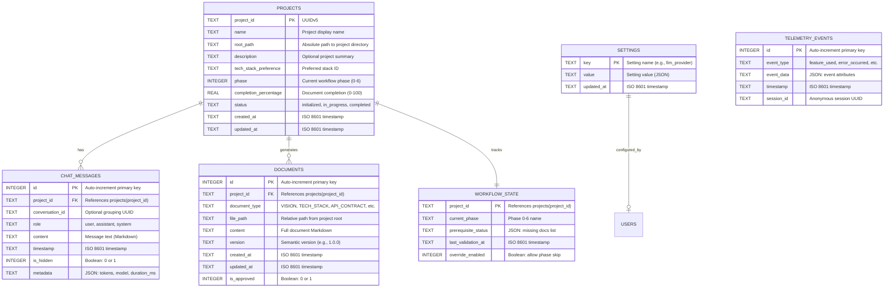

# 🗄️ Database Schema & Data Model - SoftArchitect AI

> **Document Type:** Technical Specification
> **Project:** SoftArchitect AI
> **Database:** SQLite 3.41+
> **Version:** 1.0.0
> **Last Updated:** February 2026
> **Status:** ✅ Implemented & Tested

---

## 📖 Table of Contents

1. [Schema Overview](#-schema-overview)
2. [Entity Relationship Diagram](#-entity-relationship-diagram)
3. [Table Definitions](#-table-definitions)
4. [Indexes & Performance](#-indexes--performance)
5. [Migration Scripts](#-migration-scripts)
6. [Sample Data](#-sample-data)

---

## 🎯 Schema Overview

### Database Architecture

**Two-Database Strategy:**
1. **Application Database** (`projects.db`): Global metadata for all projects
   - Location: `~/.soft-architect-ai/projects.db`
   - Tables: `projects`, `settings`, `telemetry_events`

2. **Project Database** (`project_data.db`): Per-project chat history and metadata
   - Location: `{project_root}/project_data.db`
   - Tables: `chat_messages`, `documents`, `workflow_state`

**Rationale:**
- **Isolation:** Each project has independent database (easy backup/delete)
- **Performance:** Small databases = faster queries (no JOIN across millions of rows)
- **Privacy:** Project data stays in project folder (user controls Git commits)

### Technology Choices

| Decision | Choice | Justification |
|----------|--------|---------------|
| **RDBMS** | SQLite | Embedded, zero-config, ACID compliant, cross-platform |
| **ORM** | None (Raw SQL) | Simplicity, full control, avoid abstraction leaks |
| **Migrations** | Manual SQL scripts | Predictable, version-controlled, no magic |
| **Backup** | File copy + WAL mode | Native SQLite reliability features |

---

## 🔗 Entity Relationship Diagram



---

## 📊 Table Definitions

### Application Database (`projects.db`)

#### Table: `projects`
Stores metadata for all projects managed by SoftArchitect AI.

```sql
CREATE TABLE IF NOT EXISTS projects (
    project_id TEXT PRIMARY KEY NOT NULL,
    name TEXT NOT NULL CHECK(length(name) > 0 AND length(name) <= 100),
    root_path TEXT NOT NULL UNIQUE,
    description TEXT,
    tech_stack_preference TEXT,
    phase INTEGER NOT NULL DEFAULT 0 CHECK(phase >= 0 AND phase <= 6),
    completion_percentage REAL NOT NULL DEFAULT 0.0 CHECK(completion_percentage >= 0 AND completion_percentage <= 100),
    status TEXT NOT NULL DEFAULT 'initialized' CHECK(status IN ('initialized', 'in_progress', 'completed', 'archived')),
    created_at TEXT NOT NULL DEFAULT (datetime('now')),
    updated_at TEXT NOT NULL DEFAULT (datetime('now'))
);
```

**Constraints:**
- `project_id`: UUIDv5 generated from root_path (deterministic)
- `name`: Alphanumeric + underscores/hyphens only, max 100 chars
- `root_path`: Absolute path, must be unique across all projects
- `phase`: Workflow phase (0 = Discovery, 1-3 = Architecture, 4-6 = Planning)
- `completion_percentage`: Calculated as `(docs_completed / 24) * 100`

**Example Row:**
```sql
INSERT INTO projects VALUES (
    '550e8400-e29b-41d4-a716-446655440000',
    'EcommercePlatform',
    '/home/dev/projects/ecommerce',
    'Multi-tenant SaaS ecommerce platform with inventory management',
    'python_fastapi_postgresql',
    2,
    42.5,
    'in_progress',
    '2026-02-20T10:30:00Z',
    '2026-02-23T14:15:00Z'
);
```

---

#### Table: `settings`
Stores user preferences (LLM provider, theme, telemetry consent).

```sql
CREATE TABLE IF NOT EXISTS settings (
    key TEXT PRIMARY KEY NOT NULL,
    value TEXT NOT NULL,  -- JSON format
    updated_at TEXT NOT NULL DEFAULT (datetime('now'))
);
```

**Example Rows:**
```sql
INSERT INTO settings (key, value) VALUES
('llm_provider', '{"provider": "ollama", "model": "llama3.3:70b", "endpoint": "http://localhost:11434"}'),
('theme', '{"mode": "dark", "primary_color": "#238636"}'),
('telemetry_enabled', '{"enabled": true, "anonymous_id": "anon_7f3a9d2b"}');
```

---

#### Table: `telemetry_events`
Anonymous usage analytics (if user consents).

```sql
CREATE TABLE IF NOT EXISTS telemetry_events (
    id INTEGER PRIMARY KEY AUTOINCREMENT,
    event_type TEXT NOT NULL CHECK(event_type IN ('feature_used', 'error_occurred', 'document_generated', 'app_opened')),
    event_data TEXT NOT NULL,  -- JSON format
    timestamp TEXT NOT NULL DEFAULT (datetime('now')),
    session_id TEXT NOT NULL
);
```

**Example Row:**
```sql
INSERT INTO telemetry_events (event_type, event_data, session_id) VALUES
('document_generated', '{"document_type": "VISION", "duration_ms": 4200, "llm_model": "llama3.3:70b"}', 'session_abc123');
```

---

### Project Database (`project_data.db`)

#### Table: `chat_messages`
Stores all chat messages for a specific project.

```sql
CREATE TABLE IF NOT EXISTS chat_messages (
    id INTEGER PRIMARY KEY AUTOINCREMENT,
    project_id TEXT NOT NULL,
    conversation_id TEXT,
    role TEXT NOT NULL CHECK(role IN ('user', 'assistant', 'system')),
    content TEXT NOT NULL,
    timestamp TEXT NOT NULL DEFAULT (datetime('now')),
    is_hidden INTEGER NOT NULL DEFAULT 0 CHECK(is_hidden IN (0, 1)),
    metadata TEXT,  -- JSON format: {"tokens": 142, "model": "llama3.3:70b", "duration_ms": 3400}
    FOREIGN KEY (project_id) REFERENCES projects(project_id) ON DELETE CASCADE
);
```

**Constraints:**
- `role`: Only 'user', 'assistant', or 'system' allowed
- `is_hidden`: Boolean stored as INTEGER (0 = visible, 1 = hidden, used for internal AI prompts)
- `metadata`: JSON with LLM execution details (optional)

**Example Row:**
```sql
INSERT INTO chat_messages (project_id, role, content, is_hidden, metadata) VALUES
('550e8400-e29b-41d4-a716-446655440000',
 'assistant',
 '✅ Vision Document created. [View File](context/VISION.md)',
 0,
 '{"tokens": 284, "model": "llama3.3:70b", "duration_ms": 4200}'
);
```

---

#### Table: `documents`
Tracks generated and approved documents.

```sql
CREATE TABLE IF NOT EXISTS documents (
    id INTEGER PRIMARY KEY AUTOINCREMENT,
    project_id TEXT NOT NULL,
    document_type TEXT NOT NULL CHECK(document_type IN (
        'INTERVIEW', 'PROJECT_BRIEF', 'VISION', 'PROMISE', 'JOURNEY_MAP', 'EXECUTIVE_SUMMARY',
        'GLOSSARY', 'FUNCTIONAL_REQUIREMENTS', 'NON_FUNCTIONAL_REQUIREMENTS', 'ACCESSIBILITY',
        'SECURITY_REQUIREMENTS', 'API_CONTRACT', 'DATABASE_SCHEMA', 'DOR_DOD', 'SYSTEM_DIAGRAM',
        'ADR', 'TECH_STACK', 'DEPLOYMENT', 'USER_STORIES', 'SPRINT_PLAN', 'FIRST_SPRINT_GUIDE',
        'README', 'CONTRIBUTING'
    )),
    file_path TEXT NOT NULL,
    content TEXT NOT NULL,
    version TEXT NOT NULL DEFAULT '1.0.0',
    created_at TEXT NOT NULL DEFAULT (datetime('now')),
    updated_at TEXT NOT NULL DEFAULT (datetime('now')),
    is_approved INTEGER NOT NULL DEFAULT 0 CHECK(is_approved IN (0, 1)),
    FOREIGN KEY (project_id) REFERENCES projects(project_id) ON DELETE CASCADE,
    UNIQUE(project_id, document_type)  -- Only one VISION per project
);
```

**Example Row:**
```sql
INSERT INTO documents (project_id, document_type, file_path, content, is_approved) VALUES
('550e8400-e29b-41d4-a716-446655440000',
 'VISION',
 'context/VISION.md',
 '# 🎯 Project Vision - EcommercePlatform\n\n## Problem Statement\n...',
 1
);
```

---

#### Table: `workflow_state`
Tracks workflow progression and validation status.

```sql
CREATE TABLE IF NOT EXISTS workflow_state (
    project_id TEXT PRIMARY KEY NOT NULL,
    current_phase TEXT NOT NULL DEFAULT 'Phase 0: Discovery',
    prerequisite_status TEXT NOT NULL DEFAULT '{}',  -- JSON: {"missing": ["TECH_STACK", "API_CONTRACT"]}
    last_validation_at TEXT NOT NULL DEFAULT (datetime('now')),
    override_enabled INTEGER NOT NULL DEFAULT 0 CHECK(override_enabled IN (0, 1)),
    FOREIGN KEY (project_id) REFERENCES projects(project_id) ON DELETE CASCADE
);
```

**Example Row:**
```sql
INSERT INTO workflow_state (project_id, current_phase, prerequisite_status) VALUES
('550e8400-e29b-41d4-a716-446655440000',
 'Phase 2: Architecture',
 '{"required": ["TECH_STACK", "API_CONTRACT", "DATABASE_SCHEMA"], "completed": ["TECH_STACK"], "missing": ["API_CONTRACT", "DATABASE_SCHEMA"]}'
);
```

---

## ⚡ Indexes & Performance

### Indexes for `projects.db`

```sql
-- Speed up project lookup by name (for search feature)
CREATE INDEX IF NOT EXISTS idx_projects_name ON projects(name);

-- Speed up project lookup by status
CREATE INDEX IF NOT EXISTS idx_projects_status ON projects(status);

-- Speed up telemetry queries by event type and timestamp
CREATE INDEX IF NOT EXISTS idx_telemetry_events_type_timestamp ON telemetry_events(event_type, timestamp);
```

### Indexes for `project_data.db`

```sql
-- Speed up chat history queries (most recent messages first)
CREATE INDEX IF NOT EXISTS idx_chat_messages_timestamp ON chat_messages(timestamp DESC);

-- Speed up queries for visible messages only (exclude hidden internal prompts)
CREATE INDEX IF NOT EXISTS idx_chat_messages_visible ON chat_messages(is_hidden) WHERE is_hidden = 0;

-- Speed up document lookup by type
CREATE INDEX IF NOT EXISTS idx_documents_type ON documents(document_type);

-- Speed up approval status queries
CREATE INDEX IF NOT EXISTS idx_documents_approved ON documents(is_approved) WHERE is_approved = 1;
```

---

## 🔧 Migration Scripts

### Version 1.0.0 → 1.1.0 (Add Conversation Grouping)

**Migration:** Add `conversation_id` to `chat_messages` table for multi-turn conversation tracking.

```sql
-- File: migrations/001_add_conversation_id.sql

-- Step 1: Add new column (nullable initially)
ALTER TABLE chat_messages ADD COLUMN conversation_id TEXT;

-- Step 2: Generate conversation IDs for existing messages (group by project_id)
UPDATE chat_messages
SET conversation_id = (
    SELECT LOWER(HEX(RANDOMBLOB(16)))
    FROM (SELECT 1) AS dummy
)
WHERE conversation_id IS NULL;

-- Step 3: Create index for performance
CREATE INDEX IF NOT EXISTS idx_chat_messages_conversation ON chat_messages(conversation_id);
```

**Rollback:**
```sql
-- Remove index
DROP INDEX IF EXISTS idx_chat_messages_conversation;

-- Remove column (SQLite doesn't support DROP COLUMN before 3.35)
-- Workaround: Recreate table without the column
CREATE TABLE chat_messages_backup AS SELECT id, project_id, role, content, timestamp, is_hidden, metadata FROM chat_messages;
DROP TABLE chat_messages;
ALTER TABLE chat_messages_backup RENAME TO chat_messages;
```

---

### Version 1.1.0 → 1.2.0 (Add Document Versioning)

**Migration:** Track document revision history.

```sql
-- File: migrations/002_add_document_versioning.sql

-- Step 1: Add version column (default 1.0.0)
ALTER TABLE documents ADD COLUMN version TEXT NOT NULL DEFAULT '1.0.0';

-- Step 2: Create revision history table
CREATE TABLE IF NOT EXISTS document_revisions (
    id INTEGER PRIMARY KEY AUTOINCREMENT,
    document_id INTEGER NOT NULL,
    version TEXT NOT NULL,
    content TEXT NOT NULL,
    created_at TEXT NOT NULL DEFAULT (datetime('now')),
    change_summary TEXT,  -- e.g., "Updated API endpoints section"
    FOREIGN KEY (document_id) REFERENCES documents(id) ON DELETE CASCADE
);

-- Step 3: Create index for revision lookup
CREATE INDEX IF NOT EXISTS idx_document_revisions_document_id ON document_revisions(document_id);
```

---

## 📝 Sample Data

### Seed Data for Testing

```sql
-- File: seeds/test_data.sql

-- Insert test project
INSERT INTO projects (project_id, name, root_path, description, phase, completion_percentage, status)
VALUES
('test-proj-001', 'TestApp', '/tmp/test_app', 'Sample test project', 1, 25.0, 'in_progress');

-- Insert test chat messages
INSERT INTO chat_messages (project_id, role, content) VALUES
('test-proj-001', 'user', 'Create a Vision Document for my project'),
('test-proj-001', 'assistant', '✅ Vision Document created. [View File](context/VISION.md)'),
('test-proj-001', 'user', 'What tech stack should I use?'),
('test-proj-001', 'assistant', 'Based on your requirements, I recommend:\n- **Frontend:** Flutter\n- **Backend:** FastAPI\n- **Database:** PostgreSQL');

-- Insert test document
INSERT INTO documents (project_id, document_type, file_path, content, is_approved) VALUES
('test-proj-001', 'VISION', 'context/VISION.md', '# Vision\n\nThis is a test vision document.', 1);

-- Insert test workflow state
INSERT INTO workflow_state (project_id, current_phase, prerequisite_status) VALUES
('test-proj-001', 'Phase 1: Requirements', '{"required": ["VISION", "TECH_STACK"], "completed": ["VISION"], "missing": ["TECH_STACK"]}');
```

---

## 🔐 Security Considerations

### Data Protection

1. **Encryption at Rest:** SQLite databases encrypted using SQLCipher (optional, user-configurable)
2. **SQL Injection Prevention:** Use parameterized queries exclusively (never string concatenation)
3. **Access Control:** Databases stored in user-controlled directories (no shared access)

### Example: Parameterized Query (Python)

```python
# ❌ WRONG (SQL Injection Risk)
query = f"SELECT * FROM projects WHERE name = '{user_input}'"
cursor.execute(query)

# ✅ CORRECT (Safe)
query = "SELECT * FROM projects WHERE name = ?"
cursor.execute(query, (user_input,))
```

---

## 📎 Appendices

### Database Size Estimates

| Table | Rows (per project) | Size per Row | Total Size |
|-------|-------------------|--------------|------------|
| `chat_messages` | ~500 messages | ~500 bytes | ~250 KB |
| `documents` | 24 documents | ~5 KB | ~120 KB |
| `workflow_state` | 1 row | ~500 bytes | ~500 bytes |
| **Total per project** | - | - | **~370 KB** |

---

### Related Documents

- **API Contract:** [API_CONTRACT_EXAMPLE.md](13-API_CONTRACT_EXAMPLE.md)
- **Functional Requirements:** [FUNCTIONAL_REQUIREMENTS_EXAMPLE.md](09-FUNCTIONAL_REQUIREMENTS_EXAMPLE.md)
- **Deployment Guide:** [DEPLOYMENT_EXAMPLE.md](19-DEPLOYMENT_EXAMPLE.md)

---

> **Document Metadata:**
> **Created:** 2026-02-14
> **Last Updated:** 2026-02-23
> **Owner:** Backend Team
> **Review Frequency:** Before major releases
> **Version:** 1.0.0
> **Status:** ✅ Production Schema
