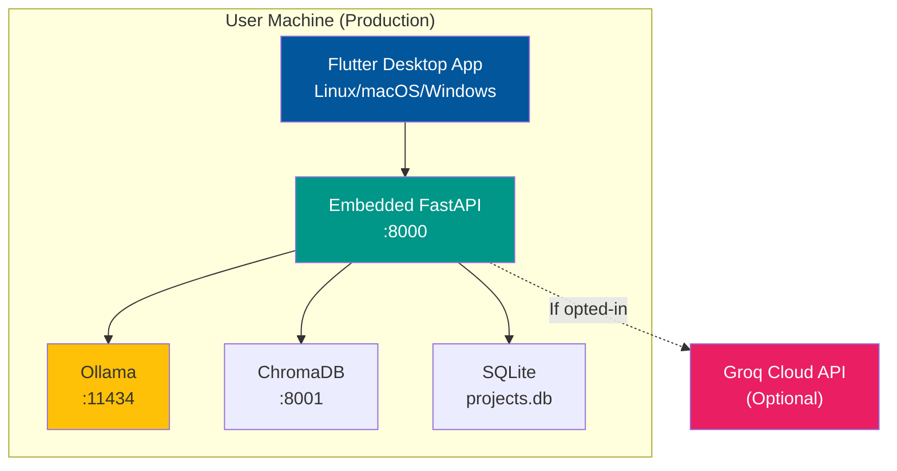

# 🚀 Deployment Guide - SoftArchitect AI

> **Document Type:** Operations & Deployment Reference
> **Project:** SoftArchitect AI
> **Version:** 1.0.0
> **Last Updated:** February 2026
> **Status:** ✅ Production-Ready

---

## 📖 Table of Contents

1. [Deployment Overview](#-deployment-overview)
2. [Local Development Setup](#-local-development-setup)
3. [Docker Compose Stack](#-docker-compose-stack)
4. [Production Deployment](#-production-deployment)
5. [CI/CD Pipeline](#-cicd-pipeline)
6. [Monitoring & Health Checks](#-monitoring--health-checks)
7. [Backup & Recovery](#-backup--recovery)
8. [Troubleshooting](#-troubleshooting)
9. [Performance Tuning](#-performance-tuning)

---

## 🌎 Deployment Overview

### Deployment Architecture



### Deployment Targets

| Target | Use Case | Complexity | Resources Required |
|--------|----------|------------|-------------------|
| **Local Dev** | Development & testing | 🟢 Low | 8GB RAM, Docker |
| **Production (Desktop)** | End-user distribution | 🟡 Medium | 16GB RAM, GPU optional |
| **CI/CD (GitHub Actions)** | Automated testing | 🟢 Low | Cloud runner |

---

## 🛠️ Local Development Setup

### Prerequisites

```bash
# System Requirements
- OS: Linux (Ubuntu 22.04+) / macOS 13+ / Windows 11
- RAM: 8GB minimum (16GB recommended for Ollama 70B)
- Disk: 60GB free space (40GB for Ollama models)
- GPU: Optional (NVIDIA/AMD/Apple Metal for faster inference)

# Required Software
- Git 2.43+
- Docker 24.0+ & Docker Compose 2.24+
- Flutter 3.27+ (Dart 3.6)
- Python 3.12.3
```

### Step 1: Clone Repository

```bash
git clone https://github.com/your-org/soft-architect-ai.git
cd soft-architect-ai
```

### Step 2: Install Flutter Dependencies

```bash
# Get Dart dependencies
flutter pub get

# Run build_runner for code generation (Riverpod)
flutter pub run build_runner build --delete-conflicting-outputs
```

### Step 3: Install Python Dependencies

```bash
# Create virtual environment
python3 -m venv .venv
source .venv/bin/activate  # Linux/macOS
# .venv\Scripts\activate  # Windows

# Install dependencies
pip install -r requirements.txt
```

### Step 4: Configure Environment Variables

```bash
# Copy template
cp .env.example .env

# Edit .env
nano .env
```

**Example `.env` file:**
```ini
# LLM Provider (ollama or groq)
LLM_PROVIDER=ollama

# Ollama Configuration (if LLM_PROVIDER=ollama)
OLLAMA_BASE_URL=http://localhost:11434
OLLAMA_MODEL=llama3.3:70b

# Groq Configuration (if LLM_PROVIDER=groq)
GROQ_API_KEY=gsk_your_api_key_here
GROQ_MODEL=llama-3.3-70b-versatile

# ChromaDB Configuration
CHROMA_HOST=localhost
CHROMA_PORT=8001
CHROMA_COLLECTION_NAME=knowledge_base

# Database Paths
PROJECTS_DB_PATH=./data/projects.db
CHROMA_DATA_PATH=./infrastructure/chroma_data

# Logging
LOG_LEVEL=INFO
LOG_FILE_PATH=./logs/app.log
```

### Step 5: Start Docker Compose Stack

```bash
# Start all services (FastAPI, ChromaDB, Ollama)
docker-compose up -d

# Check service health
docker-compose ps
```

**Expected Output:**
```
NAME                COMMAND                  SERVICE   STATUS       PORTS
fastapi_backend     "uvicorn main:app..."    backend   Up 10s       0.0.0.0:8000->8000/tcp
chromadb            "chroma run --host..."   chroma    Up 10s       0.0.0.0:8001->8001/tcp
ollama              "ollama serve"           ollama    Up 10s       0.0.0.0:11434->11434/tcp
```

### Step 6: Download Ollama Model

```bash
# Download llama3.3:70b (~40GB, may take 1-2 hours)
docker exec -it ollama ollama pull llama3.3:70b

# Verify model downloaded
docker exec -it ollama ollama list
```

### Step 7: Seed Knowledge Base (ChromaDB)

```bash
# Run ingestion script
python src/server/scripts/seed_knowledge_base.py
```

**Script Output:**
```
✅ Ingested 25 documents (CONTEXT, REQUIREMENTS, ARCHITECTURE)
✅ Generated 25 embeddings (all-MiniLM-L6-v2)
✅ ChromaDB collection "knowledge_base" ready
ℹ️ Total documents: 25, Total chunks: 142
```

### Step 8: Run Flutter App

```bash
# Run in debug mode
flutter run -d linux  # or macos, windows

# Or use VS Code launch config (F5)
```

**Verify Connectivity:**
1. Open app → Create new project
2. Send message "Hello" → AI should respond (streaming)
3. Check logs: `docker-compose logs -f backend`

---

## 🐳 Docker Compose Stack

### Full `docker-compose.yml`

```yaml
version: '3.9'

services:
  # ========================================
  # Backend (FastAPI)
  # ========================================
  backend:
    build:
      context: ./src/server
      dockerfile: Dockerfile
    container_name: fastapi_backend
    ports:
      - "8000:8000"
    environment:
      - LLM_PROVIDER=${LLM_PROVIDER:-ollama}
      - OLLAMA_BASE_URL=http://ollama:11434
      - CHROMA_HOST=chroma
      - CHROMA_PORT=8001
      - LOG_LEVEL=${LOG_LEVEL:-INFO}
    volumes:
      - ./src/server:/app
      - ./data:/app/data
      - ./logs:/app/logs
    depends_on:
      - chroma
      - ollama
    restart: unless-stopped
    networks:
      - softarchitect-network
    healthcheck:
      test: ["CMD", "curl", "-f", "http://localhost:8000/health"]
      interval: 30s
      timeout: 10s
      retries: 3

  # ========================================
  # ChromaDB (Vector Database)
  # ========================================
  chroma:
    image: chromadb/chroma:0.5.23
    container_name: chromadb
    ports:
      - "8001:8000"  # Map host 8001 to container 8000
    volumes:
      - ./infrastructure/chroma_data:/chroma/chroma
    environment:
      - ANONYMIZED_TELEMETRY=False
      - ALLOW_RESET=True
    restart: unless-stopped
    networks:
      - softarchitect-network
    healthcheck:
      test: ["CMD", "curl", "-f", "http://localhost:8000/api/v1/heartbeat"]
      interval: 30s
      timeout: 5s
      retries: 3

  # ========================================
  # Ollama (LLM Inference)
  # ========================================
  ollama:
    image: ollama/ollama:0.5.1
    container_name: ollama
    ports:
      - "11434:11434"
    volumes:
      - ollama_models:/root/.ollama  # Persistent model storage
    environment:
      - OLLAMA_KEEP_ALIVE=30m
      - OLLAMA_HOST=0.0.0.0:11434
    restart: unless-stopped
    networks:
      - softarchitect-network
    deploy:
      resources:
        reservations:
          devices:
            - driver: nvidia  # GPU acceleration (if available)
              count: 1
              capabilities: [gpu]

networks:
  softarchitect-network:
    driver: bridge

volumes:
  ollama_models:
    driver: local
```

### Backend Dockerfile

```dockerfile
# src/server/Dockerfile
FROM python:3.12.3-slim

WORKDIR /app

# Install system dependencies
RUN apt-get update && apt-get install -y \
    curl \
    gcc \
    && rm -rf /var/lib/apt/lists/*

# Copy requirements and install Python deps
COPY requirements.txt .
RUN pip install --no-cache-dir -r requirements.txt

# Copy application code
COPY . .

# Expose port
EXPOSE 8000

# Health check
HEALTHCHECK --interval=30s --timeout=5s --start-period=5s --retries=3 \
  CMD curl -f http://localhost:8000/health || exit 1

# Run Uvicorn
CMD ["uvicorn", "main:app", "--host", "0.0.0.0", "--port", "8000", "--reload"]
```

### Docker Commands Quick Reference

```bash
# Start all services
docker-compose up -d

# View logs (all services)
docker-compose logs -f

# View logs (single service)
docker-compose logs -f backend

# Restart service
docker-compose restart backend

# Stop all services
docker-compose down

# Stop and remove volumes (full cleanup)
docker-compose down -v

# Rebuild after code changes
docker-compose up -d --build

# Check resource usage
docker stats
```

---

## 📦 Production Deployment

### Desktop Distribution (Linux)

#### Step 1: Build Release Binary

```bash
# Build optimized release
flutter build linux --release

# Output: build/linux/x64/release/bundle/
```

**Build Output:**
```
build/linux/x64/release/bundle/
├── soft_architect_ai          # Main executable (~45MB)
├── lib/                       # Shared libraries
│   └── libflutter_linux_gtk.so
├── data/
│   ├── icudtl.dat
│   └── flutter_assets/        # Assets, fonts, images
└── soft_architect_ai.desktop  # Desktop entry (optional)
```

#### Step 2: Package with Backend

```bash
# Create distribution directory
mkdir -p dist/soft-architect-ai
cd dist/soft-architect-ai

# Copy Flutter app
cp -r ../../build/linux/x64/release/bundle/* .

# Copy backend (as Python virtual environment)
python3 -m venv backend_env
source backend_env/bin/activate
pip install -r ../../requirements.txt

# Copy backend code
cp -r ../../src/server backend/

# Create launcher script
cat > launch.sh << 'EOF'
#!/bin/bash
# Start backend in background
cd backend
../backend_env/bin/python -m uvicorn main:app --host 127.0.0.1 --port 8000 &
BACKEND_PID=$!

# Wait for backend to be ready
sleep 3

# Launch Flutter app
cd ..
./soft_architect_ai

# Kill backend on app exit
kill $BACKEND_PID
EOF

chmod +x launch.sh
```

#### Step 3: Bundle Ollama

```bash
# Download Ollama binary
wget https://ollama.com/download/ollama-linux-amd64 -O ollama

# Make executable
chmod +x ollama

# Download model (offline installation)
./ollama pull llama3.3:70b
```

**Final Distribution Structure:**
```
soft-architect-ai/
├── launch.sh                  # Main launcher
├── soft_architect_ai          # Flutter executable
├── lib/                       # Flutter libraries
├── data/                      # Flutter assets
├── backend/                   # Python backend code
├── backend_env/               # Python virtual environment
├── ollama                     # Ollama binary
└── models/                    # Ollama models (40GB)
    └── llama3.3-70b/
```

#### Step 4: Create `.deb` Package (Optional)

```bash
# Create Debian control file
mkdir -p DEBIAN
cat > DEBIAN/control << EOF
Package: soft-architect-ai
Version: 1.0.0
Section: base
Priority: optional
Architecture: amd64
Depends: libc6, libgtk-3-0, libglib2.0-0
Maintainer: Your Name <you@example.com>
Description: SoftArchitect AI - Local-first AI assistant
EOF

# Build package
dpkg-deb --build soft-architect-ai

# Install
sudo dpkg -i soft-architect-ai.deb
```

---

### macOS Distribution

```bash
# Build macOS app bundle
flutter build macos --release

# Output: build/macos/Build/Products/Release/soft_architect_ai.app
```

**Code Signing (Required for macOS 13+):**
```bash
# Sign app
codesign --force --deep --sign "Developer ID Application: Your Name" \
  build/macos/Build/Products/Release/soft_architect_ai.app

# Notarize with Apple
xcrun notarytool submit soft_architect_ai.zip \
  --apple-id you@example.com \
  --password app-specific-password \
  --team-id TEAM_ID

# Staple notarization ticket
xcrun stapler staple soft_architect_ai.app
```

---

### Windows Distribution

```bash
# Build Windows executable
flutter build windows --release

# Output: build/windows/x64/runner/Release/soft_architect_ai.exe
```

**Create Installer (NSIS):**
```nsis
# installer.nsi
!include "MUI2.nsh"

Name "SoftArchitect AI"
OutFile "SoftArchitectAI-Setup.exe"
InstallDir "$PROGRAMFILES64\SoftArchitect AI"

!insertmacro MUI_PAGE_WELCOME
!insertmacro MUI_PAGE_DIRECTORY
!insertmacro MUI_PAGE_INSTFILES
!insertmacro MUI_PAGE_FINISH

Section "Install"
  SetOutPath "$INSTDIR"
  File /r "build\windows\x64\runner\Release\*"
  CreateShortcut "$DESKTOP\SoftArchitect AI.lnk" "$INSTDIR\soft_architect_ai.exe"
SectionEnd
```

---

## 🔄 CI/CD Pipeline

### GitHub Actions Workflow

#### Backend CI (`backend-ci.yml`)

```yaml
name: Backend CI

on:
  push:
    branches: [main, develop]
  pull_request:
    branches: [main, develop]

jobs:
  test:
    runs-on: self-hosted

    services:
      chromadb:
        image: chromadb/chroma:0.5.23
        ports:
          - 8001:8000

    steps:
      - uses: actions/checkout@v4

      - name: Set up Python 3.12
        uses: actions/setup-python@v5
        with:
          python-version: '3.12.3'

      - name: Cache pip dependencies
        uses: actions/cache@v4
        with:
          path: ~/.cache/pip
          key: ${{ runner.os }}-pip-${{ hashFiles('requirements.txt') }}

      - name: Install dependencies
        run: |
          pip install -r requirements.txt
          pip install pytest coverage black ruff pyright

      - name: Format check (Black)
        run: black --check src/server/

      - name: Lint (Ruff)
        run: ruff check src/server/

      - name: Type check (Pyright)
        run: pyright src/server/services

      - name: Run unit tests
        env:
          CHROMA_HOST: localhost
          CHROMA_PORT: 8001
        run: |
          pytest tests/server/ \
            --cov=src/server \
            --cov-report=xml \
            --cov-report=term-missing \
            --cov-fail-under=80

      - name: Upload coverage to Codecov
        uses: codecov/codecov-action@v4
        with:
          file: ./coverage.xml
          flags: backend
```

#### Frontend CI (`frontend-ci.yml`)

```yaml
name: Frontend CI

on:
  push:
    branches: [main, develop]
  pull_request:
    branches: [main, develop]

jobs:
  test:
    runs-on: self-hosted

    steps:
      - uses: actions/checkout@v4

      - name: Set up Flutter
        uses: subosito/flutter-action@v2
        with:
          flutter-version: '3.27.0'
          channel: 'stable'

      - name: Get dependencies
        run: flutter pub get

      - name: Run code generation
        run: flutter pub run build_runner build --delete-conflicting-outputs

      - name: Analyze code
        run: flutter analyze

      - name: Run unit tests
        run: flutter test --coverage

      - name: Upload coverage
        uses: codecov/codecov-action@v4
        with:
          file: ./coverage/lcov.info
          flags: frontend
```

---

## 📊 Monitoring & Health Checks

### Health Check Endpoint

```python
# api/routers/health.py
from fastapi import APIRouter
from pydantic import BaseModel

router = APIRouter()

class HealthCheck(BaseModel):
    status: str
    version: str
    services: dict[str, str]

@router.get("/health", response_model=HealthCheck)
async def health_check():
    """Health check endpoint for monitoring."""
    # Check Ollama
    ollama_status = "up" if await ping_ollama() else "down"

    # Check ChromaDB
    chroma_status = "up" if await ping_chroma() else "down"

    # Check SQLite
    sqlite_status = "up" if check_sqlite() else "down"

    return HealthCheck(
        status="healthy" if all([ollama_status == "up", chroma_status == "up"]) else "degraded",
        version="1.0.0",
        services={
            "ollama": ollama_status,
            "chromadb": chroma_status,
            "sqlite": sqlite_status
        }
    )
```

**Example Response:**
```json
{
  "status": "healthy",
  "version": "1.0.0",
  "services": {
    "ollama": "up",
    "chromadb": "up",
    "sqlite": "up"
  }
}
```

---

## 💾 Backup & Recovery

### Backup Strategy

```bash
#!/bin/bash
# scripts/backup.sh

BACKUP_DIR="./backups/$(date +%Y%m%d_%H%M%S)"
mkdir -p "$BACKUP_DIR"

# Backup SQLite databases
cp ./data/projects.db "$BACKUP_DIR/projects.db"

# Backup ChromaDB data
tar -czf "$BACKUP_DIR/chroma_data.tar.gz" ./infrastructure/chroma_data

# Backup user documents (context/ folders from all projects)
find ./data/projects -name "context" -type d -exec cp -r {} "$BACKUP_DIR/contexts/" \;

echo "✅ Backup complete: $BACKUP_DIR"
```

### Recovery

```bash
# Restore from backup
BACKUP_DIR="./backups/20260223_140000"

# Restore SQLite
cp "$BACKUP_DIR/projects.db" ./data/projects.db

# Restore ChromaDB
tar -xzf "$BACKUP_DIR/chroma_data.tar.gz" -C ./infrastructure/

# Verify integrity
sqlite3 ./data/projects.db "PRAGMA integrity_check;"
```

---

## 🐛 Troubleshooting

### Issue 1: Ollama Model Not Responding

**Symptom:** "Connection refused" when sending messages

**Solution:**
```bash
# Check if Ollama is running
docker ps | grep ollama

# Check Ollama logs
docker logs ollama

# Restart Ollama
docker-compose restart ollama

# Verify model loaded
docker exec -it ollama ollama list
```

---

### Issue 2: Flutter App Can't Connect to Backend

**Symptom:** "Failed to load projects" error on app start

**Solution:**
```bash
# Check backend health
curl http://localhost:8000/health

# Check backend logs
docker-compose logs backend

# Verify port not in use
lsof -i :8000

# Restart backend
docker-compose restart backend
```

---

### Issue 3: ChromaDB Embeddings Slow

**Symptom:** "Query took 5s" (should be <200ms)

**Solution:**
```bash
# Check collection size
curl http://localhost:8001/api/v1/collections/knowledge_base

# Optimize: Reduce chunk size in seed script
# Edit seed_knowledge_base.py: chunk_size=500 (default 1000)

# Re-ingest
python src/server/scripts/seed_knowledge_base.py --reset
```

---

## ⚡ Performance Tuning

### Ollama Performance

```bash
# Use GPU acceleration (NVIDIA)
docker run -d --gpus all \
  -p 11434:11434 \
  ollama/ollama:0.5.1

# Use smaller model for low-resource machines
ollama pull llama3.2:3b  # 2GB model, 4GB RAM
```

### SQLite Performance

```sql
-- Run in SQLite CLI
PRAGMA journal_mode=WAL;        -- Write-Ahead Logging
PRAGMA synchronous=NORMAL;      -- Balance safety/speed
PRAGMA cache_size=10000;        -- 10MB cache
PRAGMA temp_store=MEMORY;       -- Store temp tables in RAM
```

---

## 🔗 Related Documents

- **Tech Stack:** [TECH_STACK_DETAILED_EXAMPLE.md](18-TECH_STACK_DETAILED_EXAMPLE.md)
- **System Diagram:** [SYSTEM_DIAGRAM_EXAMPLE.md](16-SYSTEM_DIAGRAM_EXAMPLE.md)
- **API Contract:** [API_CONTRACT_EXAMPLE.md](13-API_CONTRACT_EXAMPLE.md)
- **Database Schema:** [DATABASE_SCHEMA_EXAMPLE.md](14-DATABASE_SCHEMA_EXAMPLE.md)

---

> **Document Metadata:**
> **Created:** 2026-01-20
> **Last Updated:** 2026-02-23
> **Maintainer:** DevOps Team
> **Review Frequency:** Before each release
> **Status:** ✅ Production Deployment Guide
