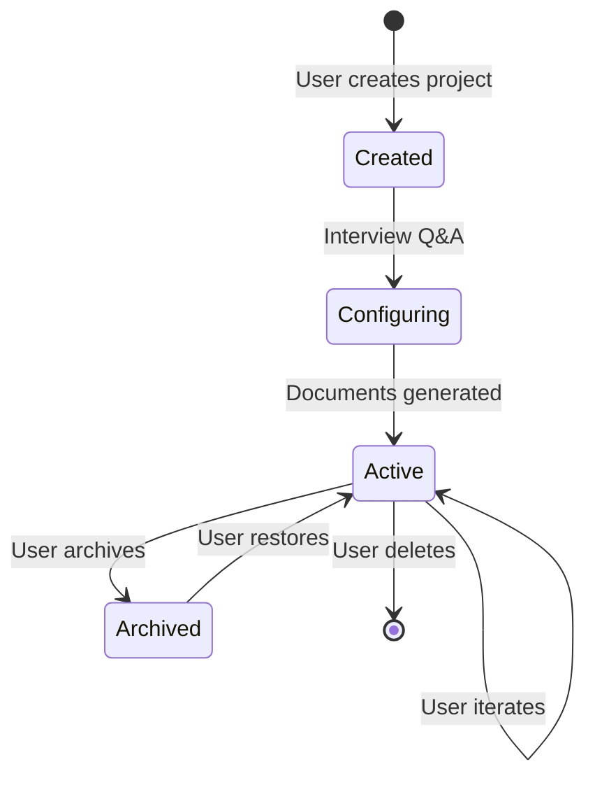
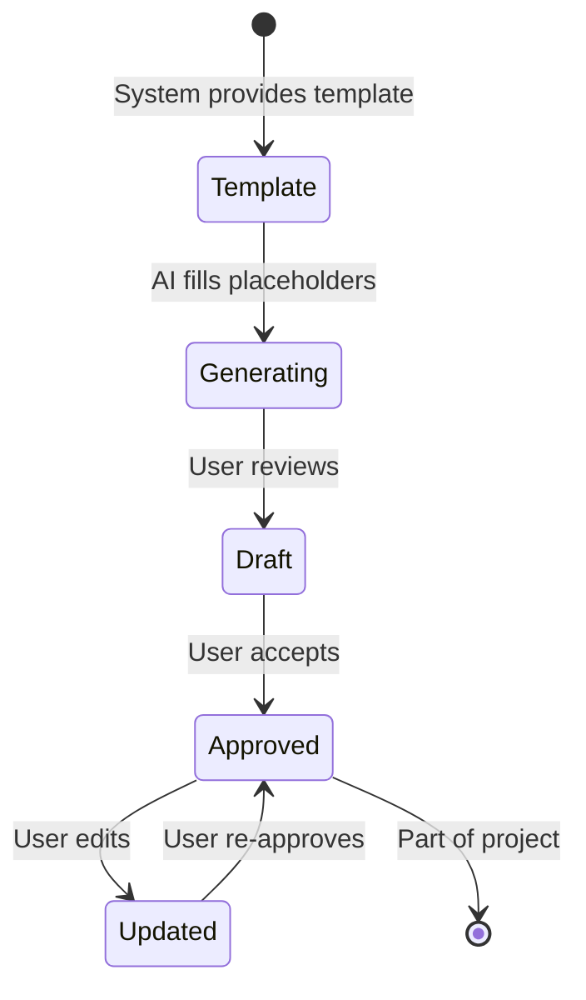

# 📖 Domain Language - SoftArchitect AI

> **Document Type:** Ubiquitous Language Dictionary (DDD)
> **Last Updated:** 2025-01-15
> **Maintainer:** @ArchitectZero
> **Status:** ✅ Living Document
> **Version:** 3.2.0

---

## 📋 Table of Contents

- [Introduction](#introduction)
- [Purpose & Scope](#purpose--scope)
- [Core Concepts](#core-concepts)
- [Domain Entities](#domain-entities)
- [Value Objects](#value-objects)
- [Aggregates](#aggregates)
- [Domain Services](#domain-services)
- [Application Services](#application-services)
- [Domain Events](#domain-events)
- [Bounded Contexts](#bounded-contexts)
- [Anti-Corruption Layer](#anti-corruption-layer)
- [Technical Terminology](#technical-terminology)
- [User-Facing Terminology](#user-facing-terminology)
- [Workflow Phases](#workflow-phases)
- [Document Types](#document-types)
- [Quality Attributes](#quality-attributes)
- [Glossary Index](#glossary-index)

---

## 📋 Generation Metadata

> **Order:** 5/24 | **Phase:** 1 - Context | **Duration:** ~30 mins
> **Prerequisites:** Phase 0 complete (AGENTS, README, RULES, CONTRIBUTING)
> **Generates:** PROJECT_MANIFESTO → USER_JOURNEY_MAP

**Purpose:** Establish ubiquitous language before writing requirements or code.

---

## 🎯 Introduction

This document defines the **Ubiquitous Language** for SoftArchitect AI—a shared vocabulary used consistently across:
- Code (classes, methods, variables)
- Documentation (specs, ADRs, user guides)
- Conversations (team meetings, code reviews)
- UI (button labels, tooltips, messages)

**Principle:** One concept = One term = One meaning (no synonyms, no ambiguity).

**Domain-Driven Design (DDD):**
SoftArchitect AI follows DDD principles to align software structure with business domain. This language is the foundation of that alignment.

---

## 🎯 Purpose & Scope

### Purpose

1. **Eliminate Ambiguity:** Everyone (developers, designers, users) uses the same terms
2. **Accelerate Onboarding:** New team members understand domain quickly
3. **Improve Communication:** No translation needed between business and tech
4. **Guide Implementation:** Code structure reflects domain concepts directly

### Scope

**In Scope:**
- Core business domain (project setup, RAG, workflow)
- Technical domain specific to SoftArchitect AI (vector stores, embeddings)
- User interactions (queries, projects, documents)

**Out of Scope:**
- Generic programming terms (class, function, module) unless domain-specific
- Framework-specific jargon (Flutter/Python internals) unless critical to understanding

---

## 🏛️ Core Concepts

### Project

**Definition:** A software initiative that a user wants to architect using SoftArchitect AI.

**Synonyms (DO NOT USE):** Application, System, Software *(use "Project" consistently)*

**Properties:**
- Unique identifier (UUID)
- Name (user-defined, editable)
- Creation timestamp
- Tech stack (languages, frameworks)
- Phase (Discovery, Context, Requirements, Architecture, Planning)

**Lifecycle:**


**Example in Code:**
```python
# Domain Entity
@dataclass
class Project:
    id: ProjectId  # Value Object
    name: ProjectName  # Value Object
    created_at: datetime
    tech_stack: TechStack  # Value Object
    phase: WorkflowPhase  # Enum
    documents: List[Document]  # Aggregate relationship
```

**Example in UI:**
- "Create New Project" (button)
- "Project Settings" (menu)
- "Archive Project" (action)

---

### Master Workflow

**Definition:** The sequential process of generating 24 documents that fully define a software project, from initial interview to deployment guide.

**Phases:**
1. **Discovery** (Phase 00): Initial interview, tech stack decision
2. **Context** (Phase 10): Vision, promise, user journey
3. **Requirements** (Phase 20): Functional/non-functional specs, API contracts
4. **Architecture** (Phase 30): System diagrams, ADRs, threat model
5. **Planning** (Phase 40): Roadmap, CI/CD, testing strategy

**Synonyms (DO NOT USE):** Pipeline, Flow, Process *(use "Master Workflow" or just "Workflow")*

**Visual Representation:**
```
Discovery → Context → Requirements → Architecture → Planning
   (3)        (5)          (7)            (4)         (4)
[Total: 24 documents + 2 root files]
```

**Example in Code:**
```python
class WorkflowPhase(Enum):
    DISCOVERY = "00"
    CONTEXT = "10"
    REQUIREMENTS = "20"
    ARCHITECTURE = "30"
    PLANNING = "40"
```

**Example in UI:**
- "Master Workflow Progress: 18/24 Complete" (progress bar)
- "Next Document: Database Schema" (suggestion)

---

### RAG (Retrieval-Augmented Generation)

**Definition:** A technique that enhances AI responses by retrieving relevant context from a knowledge base before generating answers.

**How It Works:**
1. **Ingestion:** User's existing docs → Chunked → Embedded (vectors) → Stored (ChromaDB)
2. **Query:** User asks question → Embedded → Similarity search → Retrieved passages
3. **Generation:** Retrieved context + User query → LLM → Answer

**Components:**
- **Knowledge Base:** Collection of documents (templates, examples, tech packs)
- **Vector Store:** ChromaDB database storing embeddings
- **Embeddings:** Numerical representations of text (e.g., 768-dimensional vectors)
- **Similarity Search:** Finding documents closest to query embedding (cosine similarity)

**Synonyms (DO NOT USE):** Search, Lookup *(RAG is technically distinct)*

**Example in Code:**
```python
class RagService:
    def query(self, query_text: str, top_k: int = 5) -> List[Document]:
        """Retrieve relevant documents via vector similarity search."""
        query_embedding = self.embedder.embed(query_text)
        results = self.vector_store.similarity_search(
            query_embedding,
            top_k=top_k
        )
        return [self._to_document(r) for r in results]
```

**Example in UI:**
- "RAG Knowledge Base: 1,234 Documents Indexed" (status)
- "Query AI Assistant" (button)

---

### Document

**Definition:** A generated artifact following the Master Workflow structure (e.g., API_INTERFACE_CONTRACT.md, DATABASE_SCHEMA.md).

**Properties:**
- Type (Interview, Vision, API Contract, etc.)
- Template (Markdown template with placeholders)
- Generated Content (Filled-in template with project-specific data)
- Metadata (creation date, version, status)

**Document Lifecycle:**


**Example in Code:**
```python
@dataclass
class Document:
    type: DocumentType  # Enum (INTERVIEW, VISION, API_CONTRACT, etc.)
    template_path: Path  # e.g., "01-TEMPLATES/20-REQUIREMENTS/API_INTERFACE_CONTRACT.template.md"
    content: str  # Filled-in Markdown
    metadata: DocumentMetadata  # creation_date, version, status
```

**Example in UI:**
- "Generate Database Schema" (action)
- "View API Contract" (link)
- "Download All Documents" (export)

---

## 🧩 Domain Entities

### User

**Definition:** An individual developer or team using SoftArchitect AI to architect software.

**Properties:**
- ID (UUID, local-only, no cloud sync)
- Preferences (language, theme, LLM provider)
- Projects (list of owned projects)

**No Authentication:** SoftArchitect AI is single-user, local-first. No login, no passwords.

**Example in Code:**
```python
@dataclass
class User:
    id: UserId
    preferences: UserPreferences
    projects: List[ProjectId]  # References, not full objects
```

---

### Interview

**Definition:** The initial Q&A session where the AI asks structured questions to understand the user's project vision.

**Properties:**
- Questions (predefined list from template)
- Answers (user-provided text)
- Timestamp (when interview conducted)

**Purpose:** Gather information to fill templates for subsequent documents.

**Example Questions:**
1. What type of application are you building? (Web, Mobile, Desktop, API)
2. What is your preferred tech stack? (React+Node, Flutter+Python, etc.)
3. What are the 3 main features of your project?
4. Who is your primary user? (Demographics, pain points)
5. What is your biggest technical concern? (Scalability, security, UX)

**Example in Code:**
```python
@dataclass
class Interview:
    questions: List[Question]
    answers: Dict[QuestionId, str]
    conducted_at: datetime
```

---

## 💎 Value Objects

### ProjectName

**Definition:** Immutable string representing a project's human-readable name.

**Constraints:**
- Length: 3-50 characters
- Allowed: Alphanumeric, spaces, hyphens, underscores
- Forbidden: Special characters (`!@#$%^&*`)
- Unique: Per user

**Example:**
```python
class ProjectName:
    def __init__(self, name: str):
        if not 3 <= len(name) <= 50:
            raise ValueError("Name must be 3-50 characters")
        if not re.match(r'^[a-zA-Z0-9 _-]+$', name):
            raise ValueError("Invalid characters in name")
        self.value = name

    def __str__(self) -> str:
        return self.value
```

---

### TechStack

**Definition:** Immutable collection of technologies chosen for a project.

**Components:**
- Backend Language (Python, Node.js, Java, Go)
- Frontend Framework (React, Vue, Flutter, Angular)
- Database (PostgreSQL, MongoDB, SQLite)
- Deployment (Docker, Kubernetes, AWS, Azure)

**Example:**
```python
@dataclass(frozen=True)
class TechStack:
    backend: str  # e.g., "Python 3.12 + FastAPI"
    frontend: str  # e.g., "Flutter 3.24"
    database: str  # e.g., "PostgreSQL 15"
    deployment: str  # e.g., "Docker + AWS ECS"

    def to_dict(self) -> Dict[str, str]:
        return {
            "backend": self.backend,
            "frontend": self.frontend,
            "database": self.database,
            "deployment": self.deployment,
        }
```

---

### Embedding

**Definition:** Numerical vector representation of text, used for semantic similarity search.

**Properties:**
- Dimensions: 384 (MiniLM), 768 (BERT), 1536 (OpenAI text-embedding-3-small)
- Model: Ollama/nomic-embed-text, OpenAI, HuggingFace
- Normalized: L2-normalized for cosine similarity

**Example:**
```python
@dataclass(frozen=True)
class Embedding:
    vector: ndarray  # NumPy array of floats
    dimensions: int
    model: str

    def similarity(self, other: 'Embedding') -> float:
        """Calculate cosine similarity with another embedding."""
        return np.dot(self.vector, other.vector)  # Assumes L2-normalized
```

---

## 🎯 Aggregates

### ProjectAggregate

**Definition:** Aggregate root combining Project, Documents, and related metadata.

**Consistency Boundary:** All operations on documents must go through the Project aggregate to maintain consistency.

**Example:**
```python
class ProjectAggregate:
    def __init__(self, project: Project):
        self._project = project
        self._documents: Dict[DocumentType, Document] = {}

    def generate_document(self, doc_type: DocumentType, content: str) -> Document:
        """Generate new document (ensures consistency)."""
        if doc_type in self._documents:
            raise ValueError(f"Document {doc_type} already exists")

        doc = Document(type=doc_type, content=content, metadata=...)
        self._documents[doc_type] = doc
        self._project.add_event(DocumentGeneratedEvent(doc))
        return doc

    def get_all_documents(self) -> List[Document]:
        return list(self._documents.values())
```

---

## ⚙️ Domain Services

### EmbeddingService

**Definition:** Service responsible for converting text to vector embeddings.

**Operations:**
- `embed(text: str) -> Embedding`: Generate embedding for single text
- `embed_batch(texts: List[str]) -> List[Embedding]`: Batch processing

**Example:**
```python
class EmbeddingService:
    def __init__(self, model: str = "nomic-embed-text"):
        self.model = model
        self.ollama_client = OllamaClient()

    def embed(self, text: str) -> Embedding:
        """Generate embedding using Ollama."""
        response = self.ollama_client.embeddings(
            model=self.model,
            prompt=text
        )
        return Embedding(
            vector=np.array(response['embedding']),
            dimensions=len(response['embedding']),
            model=self.model
        )
```

---

### TemplateRenderingService

**Definition:** Service that fills template placeholders with project-specific data.

**Operations:**
- `render(template: str, context: Dict[str, str]) -> str`: Fill placeholders
- `validate_template(template: str) -> bool`: Check syntax

**Example:**
```python
class TemplateRenderingService:
    def render(self, template: str, context: Dict[str, str]) -> str:
        """Replace {{PLACEHOLDER}} with context values."""
        result = template
        for key, value in context.items():
            placeholder = f"{{{{{key}}}}}"  # {{PLACEHOLDER}}
            result = result.replace(placeholder, value)

        # Verify no placeholders remain
        if "{{" in result:
            raise TemplateRenderingError("Unresolved placeholders")

        return result
```

---

## 🔄 Application Services

### ProjectManagementService

**Definition:** Orchestrates creation, retrieval, update, and deletion of projects.

**Operations:**
- `create_project(name: str, tech_stack: TechStack) -> Project`
- `list_projects() -> List[Project]`
- `archive_project(project_id: ProjectId) -> None`

**Example:**
```python
class ProjectManagementService:
    def __init__(self, repository: ProjectRepository):
        self.repository = repository

    def create_project(self, name: str, tech_stack: TechStack) -> Project:
        """Create new project with default settings."""
        project_name = ProjectName(name)
        project = Project(
            id=ProjectId.generate(),
            name=project_name,
            created_at=datetime.utcnow(),
            tech_stack=tech_stack,
            phase=WorkflowPhase.DISCOVERY,
            documents=[]
        )
        self.repository.save(project)
        return project
```

---

## 📡 Domain Events

### DocumentGeneratedEvent

**Definition:** Event fired when AI successfully generates a new document.

**Payload:**
- Document ID
- Document Type
- Project ID
- Generated At (timestamp)

**Example:**
```python
@dataclass
class DocumentGeneratedEvent:
    document_id: DocumentId
    document_type: DocumentType
    project_id: ProjectId
    generated_at: datetime
```

**Handlers:**
```python
class DocumentGeneratedEventHandler:
    def handle(self, event: DocumentGeneratedEvent) -> None:
        # Update project progress (e.g., 12/24 documents complete)
        # Send notification to UI (if applicable)
        # Log event for analytics
        pass
```

---

### WorkflowPhaseCompletedEvent

**Definition:** Event fired when all documents in a workflow phase are complete.

**Example:**
```python
@dataclass
class WorkflowPhaseCompletedEvent:
    project_id: ProjectId
    phase: WorkflowPhase
    completed_at: datetime
```

---

## 🏗️ Bounded Contexts

SoftArchitect AI has **3 main bounded contexts**:

### 1. Project Management Context

**Responsibility:** CRUD operations for projects.

**Entities:** Project, User, Preferences

**Services:** ProjectManagementService

**Repository:** ProjectRepository

---

### 2. Knowledge Base Context (RAG)

**Responsibility:** Ingesting documents, performing semantic search, providing context to LLM.

**Entities:** Document, Embedding, VectorStore

**Services:** EmbeddingService, RagService, VectorStoreService

**Repository:** VectorStoreRepository

---

### 3. Workflow Orchestration Context

**Responsibility:** Guiding user through Master Workflow, generating documents in correct order.

**Entities:** Interview, WorkflowPhase, Template

**Services:** TemplateRenderingService, WorkflowOrchestratorService

**Repository:** TemplateRepository

---

## 🛡️ Anti-Corruption Layer

Since SoftArchitect AI integrates with external services (Ollama, ChromaDB, Groq), we use an **Anti-Corruption Layer** to prevent external models from leaking into our domain.

### Example: ChromaDB Adapter

```python
# Infrastructure Layer (adapter)
class ChromaDBVectorStoreAdapter:
    def __init__(self, client: HttpClient):
        self.client = client  # External ChromaDB dependency

    def search(self, query_embedding: List[float], top_k: int) -> List[ChromaResult]:
        """Returns ChromaDB-specific result objects."""
        return self.client.query(
            query_embeddings=[query_embedding],
            n_results=top_k
        )

# Domain Layer (interface)
class VectorStore(ABC):
    @abstractmethod
    def similarity_search(self, embedding: Embedding, top_k: int) -> List[Document]:
        """Returns domain Document objects (no ChromaDB types)."""
        pass

# Adapter Implementation (bridges external to domain)
class ChromaVectorStore(VectorStore):
    def __init__(self, adapter: ChromaDBVectorStoreAdapter):
        self.adapter = adapter

    def similarity_search(self, embedding: Embedding, top_k: int) -> List[Document]:
        # Call external service
        chroma_results = self.adapter.search(embedding.vector.tolist(), top_k)

        # Convert to domain objects (anti-corruption)
        return [
            Document(
                id=DocumentId(result.id),
                type=DocumentType.from_string(result.metadata['type']),
                content=result.document,
                metadata=self._convert_metadata(result.metadata)
            )
            for result in chroma_results
        ]
```

---

## 🔧 Technical Terminology

### Vector Similarity Search

**Definition:** Finding documents with embeddings closest to a query embedding using distance metrics.

**Metrics:**
- **Cosine Similarity:** Measures angle between vectors (0 = orthogonal, 1 = identical)
- **Euclidean Distance:** L2 distance between vectors
- **Dot Product:** Inner product (faster, requires normalized vectors)

**Formula (Cosine Similarity):**
```
similarity = (A · B) / (||A|| * ||B||)
```

**Example:**
```python
def cosine_similarity(a: ndarray, b: ndarray) -> float:
    return np.dot(a, b) / (np.linalg.norm(a) * np.linalg.norm(b))
```

---

### Prompt Engineering

**Definition:** Crafting LLM inputs to maximize quality of outputs.

**Techniques Used:**
- **System Prompts:** Define AI role (e.g., "You are an expert software architect")
- **Few-Shot Examples:** Provide 3-5 examples of desired output format
- **Chain-of-Thought:** Ask AI to explain reasoning step-by-step
- **Structured Output:** Request JSON, Markdown tables, or specific formats

**Example:**
```python
system_prompt = """
You are an expert software architect specializing in Clean Architecture.
Your task is to generate an API contract in OpenAPI 3.0 format.

Requirements:
- All endpoints must include authentication
- All responses must include error codes
- All schemas must have examples

Respond ONLY with valid YAML.
"""

user_prompt = f"""
Generate an API contract for a project with these features:
{features}

Tech Stack: {tech_stack}
"""
```

---

## 👤 User-Facing Terminology

Terms used in UI must be intuitive to non-technical users:

| Technical Term | User-Facing Term | Example |
|----------------|------------------|---------|
| RAG | AI Assistant | "Ask AI Assistant" |
| Embedding | (Hidden) | User never sees this term |
| Vector Store | Knowledge Base | "1,234 Documents in Knowledge Base" |
| LLM | AI Model | "Using Llama 3.3 70B AI Model" |
| Ingest | Import | "Import Your Documentation" |
| Template | Document Template | "Available Templates: API Contract, Database Schema" |
| Workflow Phase | Project Stage | "Current Stage: Architecture" |

---

## 🔄 Workflow Phases

### Phase 00: Discovery

**Goal:** Understand project scope via interview.

**Documents:**
1. Interview Q&A
2. Project Brief
3. Tech Stack Decision

**Duration:** 5-10 minutes

---

### Phase 10: Context

**Goal:** Define vision, value proposition, user journey.

**Documents:**
4. Vision Statement
5. Value Promise
6. User Journey Map
7. Executive Summary
8. Glossary

**Duration:** 15-20 minutes

---

### Phase 20: Requirements

**Goal:** Specify functional/non-functional requirements, API, database.

**Documents:**
9. Functional Requirements
10. Non-Functional Requirements
11. Accessibility Checklist
12. Security Requirements
13. API Contract
14. Database Schema
15. Definition of Ready/Done

**Duration:** 30-40 minutes

---

### Phase 30: Architecture

**Goal:** Design system architecture, make technical decisions.

**Documents:**
16. System Architecture
17. Technical Decisions (ADR)
18. Tech Stack Detailed
19. Deployment Architecture

**Duration:** 20-30 minutes

---

### Phase 40: Planning

**Goal:** Create roadmap, CI/CD pipeline, testing strategy.

**Documents:**
20. User Stories Master
21. Sprint Planning
22. Implementation Guide
23. README.md
24. CONTRIBUTING.md

**Duration:** 20-25 minutes

**Total Workflow Time:** ~90-125 minutes (1.5-2 hours)

---

## 📄 Document Types

| Type | Folder | Template File | Purpose |
|------|--------|---------------|---------|
| Interview Q&A | `00-DISCOVERY` | `INTERVIEW.template.md` | Initial project understanding |
| Project Brief | `00-DISCOVERY` | `PROJECT_BRIEF.template.md` | One-page executive summary |
| Tech Stack Decision | `00-DISCOVERY` | `TECH_STACK.template.md` | Technology choices with rationale |
| Vision Statement | `10-CONTEXT` | `VISION.template.md` | Long-term project vision (5-10 years) |
| Value Promise | `10-CONTEXT` | `PROMISE.template.md` | User value proposition |
| User Journey Map | `10-CONTEXT` | `JOURNEY_MAP.template.md` | End-to-end user flows with pain points |
| Executive Summary | `10-CONTEXT` | `EXECUTIVE_SUMMARY.template.md` | Stakeholder-facing summary |
| Glossary | `10-CONTEXT` | `GLOSSARY.template.md` | Technical terms dictionary |
| Functional Requirements | `20-REQUIREMENTS` | `FUNCTIONAL.template.md` | Feature specifications |
| Non-Functional Requirements | `20-REQUIREMENTS` | `NON_FUNCTIONAL.template.md` | Performance, scalability, reliability |
| Accessibility Checklist | `20-REQUIREMENTS` | `ACCESSIBILITY.template.md` | WCAG 2.1 AA compliance |
| Security Requirements | `20-REQUIREMENTS` | `SECURITY.template.md` | OWASP Top 10, data sovereignty |
| API Contract | `20-REQUIREMENTS` | `API_CONTRACT.template.md` | RESTful/GraphQL API specification |
| Database Schema | `20-REQUIREMENTS` | `DATABASE_SCHEMA.template.md` | ER diagrams, migrations |
| Definition of Ready/Done | `20-REQUIREMENTS` | `DOR_DOD.template.md` | Acceptance criteria standards |
| System Architecture | `30-ARCHITECTURE` | `SYSTEM_DIAGRAM.template.md` | C4 model diagrams |
| Technical Decisions | `30-ARCHITECTURE` | `ADR.template.md` | Architecture Decision Records |
| Tech Stack Detailed | `30-ARCHITECTURE` | `TECH_STACK_DETAILED.template.md` | Libraries, frameworks, versions |
| Deployment Architecture | `30-ARCHITECTURE` | `DEPLOYMENT.template.md` | Infrastructure diagram |
| User Stories Master | `40-PLANNING` | `USER_STORIES_MASTER.template.json` | Complete backlog (JSON format) |
| Sprint Planning | `40-PLANNING` | `SPRINT_PLAN.template.md` | First 3 sprints detailed |
| Implementation Guide | `40-PLANNING` | `FIRST_SPRINT_GUIDE.template.md` | Code structure, setup instructions |
| README.md | (Root) | `README.template.md` | Project introduction, setup, usage |
| CONTRIBUTING.md | (Root) | `CONTRIBUTING.template.md` | Contribution guidelines |

---

## ⚡ Quality Attributes

### Latency

**Definition:** Time between user action and system response.

**Target:** < 200ms for UI interactions, < 2s for RAG queries

**Measurement:**
```python
import time

start = time.perf_counter()
results = rag_service.query("How to implement Clean Architecture?")
latency = time.perf_counter() - start

assert latency < 2.0, f"RAG query too slow: {latency:.2f}s"
```

---

### Privacy (Data Sovereignty)

**Definition:** User data never leaves the local machine.

**Enforcement:**
- No telemetry
- No cloud sync
- No external API calls (except opt-in Groq/OpenAI)
- All data stored in `~/.soft-architect-ai/` (local filesystem)

**Verification:**
```bash
# Check for outbound connections
netstat -an | grep ESTABLISHED
# Expected: Only ChromaDB (localhost:8000), no external IPs
```

---

### Offline Capability

**Definition:** System works without internet connection.

**Requirements:**
- Ollama models downloaded locally
- ChromaDB running on localhost
- No external dependencies for core functionality

---

## 📚 Glossary Index

| Term | Category | Definition Link |
|------|----------|-----------------|
| API Contract | Document Type | [API Contract](#document-types) |
| ChromaDB | Technology | [Vector Store](#rag-retrieval-augmented-generation) |
| Clean Architecture | Pattern | [Architecture](#core-concepts) |
| Domain Event | Pattern | [Domain Events](#domain-events) |
| Embedding | Value Object | [Embedding](#embedding) |
| Interview | Entity | [Interview](#interview) |
| LLM | Technology | [User-Facing Terminology](#user-facing-terminology) |
| Master Workflow | Process | [Master Workflow](#master-workflow) |
| Ollama | Technology | [RAG](#rag-retrieval-augmented-generation) |
| Project | Entity | [Project](#project) |
| RAG | Technique | [RAG](#rag-retrieval-augmented-generation) |
| Template | Artifact | [Document Types](#document-types) |
| Ubiquitous Language | Concept | [Introduction](#introduction) |
| Vector Store | Infrastructure | [Technical Terminology](#technical-terminology) |
| Workflow Phase | Enum | [Workflow Phases](#workflow-phases) |

---

## 🔄 Version History

| Version | Date | Changes |
|---------|------|---------|
| 1.0.0 | 2024-06-01 | Initial domain language definition |
| 2.0.0 | 2024-10-15 | Added bounded contexts, anti-corruption layer |
| 3.0.0 | 2025-01-10 | Expanded technical terminology, added code examples |
| 3.1.0 | 2025-01-12 | Added user-facing terminology mapping |
| 3.2.0 | 2025-01-15 | Added quality attributes, glossary index |

---

## 📝 Maintenance Notes

**Review Cadence:** Quarterly (every 3 months)

**Update Triggers:**
- New domain concepts introduced
- Terminology confusion arises in team discussions
- Code diverges from documented language

**Responsible Party:** Tech Lead (@ArchitectZero)

---

> **Living Document:** This language evolves with the project. Suggest changes via PR to `DOMAIN_LANGUAGE.md`.
