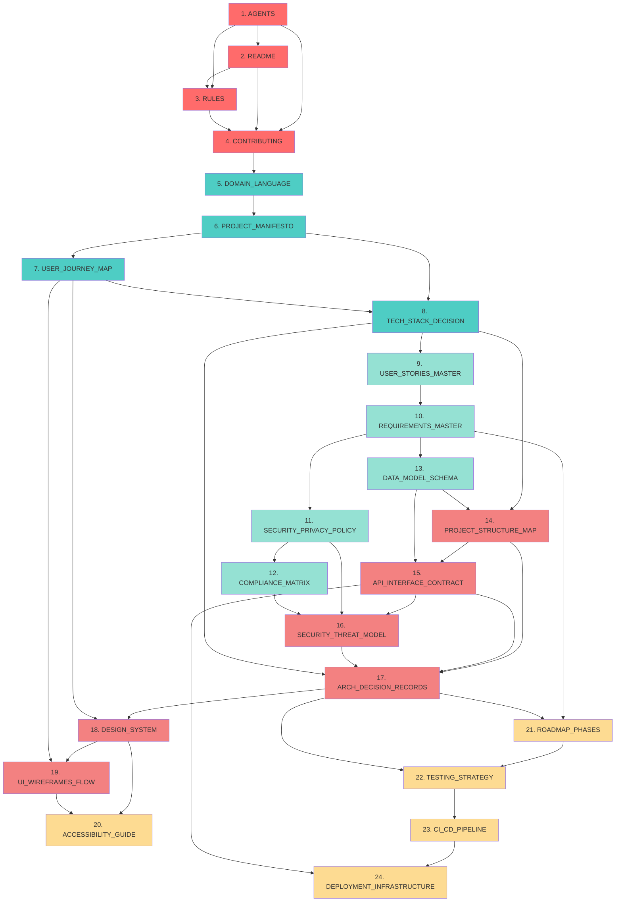

# 📋 Master Workflow - Document Generation Order

> **Purpose:** Define the optimal sequence for generating project documentation
> **Last Updated:** 2025-01-15
> **Maintainer:** @ArchitectZero
> **Status:** ✅ Production Ready
> **Total Documents:** 24/24
> **Total Duration:** ~16-20 hours (full workflow)

---

## 📖 Table of Contents

- [Overview](#overview)
- [Generation Phases](#generation-phases)
- [Complete Generation Sequence](#complete-generation-sequence)
- [Dependency Graph](#dependency-graph)
- [Phase Breakdown](#phase-breakdown)
- [Duration Estimates](#duration-estimates)
- [Prerequisites Matrix](#prerequisites-matrix)
- [Automation Opportunities](#automation-opportunities)

---

## 🎯 Overview

The **Master Workflow** is the canonical sequence for generating all 24 project documents in **SoftArchitect AI**. This order ensures:

1. **Logical Dependencies:** Documents build on information from previous documents
2. **Minimal Rework:** Critical decisions made early prevent late-stage changes
3. **Parallel Opportunities:** Independent documents can be generated concurrently
4. **Risk Mitigation:** High-risk/high-impact documents prioritized

---

## 🏗️ Generation Phases

```
Phase 0: Root Foundation (1-4/24)
├─ Establish team structure, development rules
├─ Duration: ~1 hour
└─ No external dependencies

Phase 1: Context (5-8/24)
├─ Define project vision, language, user needs, technology
├─ Duration: ~2.5 hours
└─ Depends on: Phase 0

Phase 2: Requirements (9-13/24)
├─ Specify features, legal compliance, data model
├─ Duration: ~3.5 hours
└─ Depends on: Phase 1

Phase 3: Architecture (14-19/24)
├─ Design system structure, APIs, security, UI
├─ Duration: ~4.5 hours
└─ Depends on: Phase 2

Phase 4: Planning (20-24/24)
├─ Plan accessibility, roadmap, testing, CI/CD, deployment
├─ Duration: ~4 hours
└─ Depends on: Phase 3
```

---

## 📜 Complete Generation Sequence

| # | Document | Phase | Duration | Prerequisites | Generates |
|---|----------|-------|----------|---------------|-----------|
| **1** | `AGENTS` | 0 | ~15 min | None | README |
| **2** | `README` | 0 | ~20 min | AGENTS | RULES |
| **3** | `RULES` | 0 | ~20 min | AGENTS, README | CONTRIBUTING |
| **4** | `CONTRIBUTING` | 0 | ~25 min | 1-3 | Phase 1 |
| **5** | `DOMAIN_LANGUAGE` | 1 | ~30 min | Phase 0 | PROJECT_MANIFESTO |
| **6** | `PROJECT_MANIFESTO` | 1 | ~35 min | 1-5 | USER_JOURNEY_MAP |
| **7** | `USER_JOURNEY_MAP` | 1 | ~40 min | 6 | TECH_STACK_DECISION |
| **8** | `TECH_STACK_DECISION` | 1 | ~45 min | 6-7 | Phase 2 |
| **9** | `USER_STORIES_MASTER` | 2 | ~50 min | Phase 1 | REQUIREMENTS_MASTER |
| **10** | `REQUIREMENTS_MASTER` | 2 | ~45 min | 9 | SECURITY_PRIVACY_POLICY |
| **11** | `SECURITY_PRIVACY_POLICY` | 2 | ~35 min | 10 | COMPLIANCE_MATRIX |
| **12** | `COMPLIANCE_MATRIX` | 2 | ~50 min | 11 | DATA_MODEL_SCHEMA |
| **13** | `DATA_MODEL_SCHEMA` | 2 | ~40 min | 9-10 | Phase 3 |
| **14** | `PROJECT_STRUCTURE_MAP` | 3 | ~35 min | 8, 13 | API_INTERFACE_CONTRACT |
| **15** | `API_INTERFACE_CONTRACT` | 3 | ~45 min | 13-14 | SECURITY_THREAT_MODEL |
| **16** | `SECURITY_THREAT_MODEL` | 3 | ~50 min | 11-12, 15 | ARCH_DECISION_RECORDS |
| **17** | `ARCH_DECISION_RECORDS` | 3 | ~40 min | 8, 14-16 | DESIGN_SYSTEM |
| **18** | `DESIGN_SYSTEM` | 3 | ~55 min | 7, 17 | UI_WIREFRAMES_FLOW |
| **19** | `UI_WIREFRAMES_FLOW` | 3 | ~50 min | 7, 18 | Phase 4 |
| **20** | `ACCESSIBILITY_GUIDE` | 4 | ~40 min | 18-19 | ROADMAP_PHASES |
| **21** | `ROADMAP_PHASES` | 4 | ~45 min | 10, 17 | TESTING_STRATEGY |
| **22** | `TESTING_STRATEGY` | 4 | ~50 min | 17, 21 | CI_CD_PIPELINE |
| **23** | `CI_CD_PIPELINE` | 4 | ~55 min | 22 | DEPLOYMENT_INFRASTRUCTURE |
| **24** | `DEPLOYMENT_INFRASTRUCTURE` | 4 | ~50 min | 15, 23 | ✅ Workflow Complete |

**Total Duration:** ~960 minutes (~16 hours)

---

## 🔗 Dependency Graph



---

## 📊 Phase Breakdown

### Phase 0: Root Foundation (4 documents, ~80 minutes)

**Goal:** Establish team structure and development standards

| Document | Purpose | Key Deliverable |
|----------|---------|-----------------|
| AGENTS | Define roles (human + AI) | RACI matrix |
| README | Project overview | Quick-start guide |
| RULES | Development standards | Code quality rules |
| CONTRIBUTING | Collaboration workflow | PR process |

**Critical Path:** AGENTS → README → RULES → CONTRIBUTING (sequential)

---

### Phase 1: Context (4 documents, ~150 minutes)

**Goal:** Define project vision, language, user needs, technology

| Document | Purpose | Key Deliverable |
|----------|---------|-----------------|
| DOMAIN_LANGUAGE | Ubiquitous language | DDD glossary |
| PROJECT_MANIFESTO | Vision & values | North star |
| USER_JOURNEY_MAP | User flows | Persona journeys |
| TECH_STACK_DECISION | Technology choices | Architecture diagram |

**Critical Path:** DOMAIN_LANGUAGE → PROJECT_MANIFESTO → USER_JOURNEY_MAP → TECH_STACK_DECISION

**Parallel Opportunities:**
- USER_JOURNEY_MAP & TECH_STACK_DECISION (if tech stack already known)

---

### Phase 2: Requirements (5 documents, ~220 minutes)

**Goal:** Specify features, legal compliance, data model

| Document | Purpose | Key Deliverable |
|----------|---------|-----------------|
| USER_STORIES_MASTER | Feature backlog | Prioritized user stories |
| REQUIREMENTS_MASTER | Consolidated specs | FR/NFR catalog |
| SECURITY_PRIVACY_POLICY | Security & privacy | Privacy guarantees |
| COMPLIANCE_MATRIX | Legal compliance | GDPR/CCPA/WCAG mapping |
| DATA_MODEL_SCHEMA | Database design | ER diagrams |

**Critical Path:** USER_STORIES → REQUIREMENTS → SECURITY_PRIVACY_POLICY → COMPLIANCE_MATRIX

**Parallel Opportunities:**
- DATA_MODEL_SCHEMA (parallel with COMPLIANCE_MATRIX if schema independent of compliance)

---

### Phase 3: Architecture (6 documents, ~275 minutes)

**Goal:** Design system structure, APIs, security, UI

| Document | Purpose | Key Deliverable |
|----------|---------|-----------------|
| PROJECT_STRUCTURE_MAP | Folder structure | File tree |
| API_INTERFACE_CONTRACT | API specs | OpenAPI/GraphQL |
| SECURITY_THREAT_MODEL | Threat analysis | STRIDE matrix |
| ARCH_DECISION_RECORDS | Technical decisions | ADR log |
| DESIGN_SYSTEM | UI foundation | Component library |
| UI_WIREFRAMES_FLOW | Screen flows | Mockups |

**Critical Path:** PROJECT_STRUCTURE_MAP → API_INTERFACE_CONTRACT → SECURITY_THREAT_MODEL → ARCH_DECISION_RECORDS → DESIGN_SYSTEM → UI_WIREFRAMES_FLOW

**Parallel Opportunities:**
- PROJECT_STRUCTURE_MAP & API_INTERFACE_CONTRACT (if API design independent of folder structure)

---

### Phase 4: Planning (5 documents, ~240 minutes)

**Goal:** Plan accessibility, roadmap, testing, CI/CD, deployment

| Document | Purpose | Key Deliverable |
|----------|---------|-----------------|
| ACCESSIBILITY_GUIDE | WCAG compliance | A11y checklist |
| ROADMAP_PHASES | Sprint planning | Release timeline |
| TESTING_STRATEGY | Test plan | Test pyramid |
| CI_CD_PIPELINE | Automation | GitHub Actions workflows |
| DEPLOYMENT_INFRASTRUCTURE | Production setup | Docker Compose |

**Critical Path:** ACCESSIBILITY_GUIDE → ROADMAP_PHASES → TESTING_STRATEGY → CI_CD_PIPELINE → DEPLOYMENT_INFRASTRUCTURE

**Parallel Opportunities:**
- ACCESSIBILITY_GUIDE (parallel with ROADMAP_PHASES if independent)

---

## ⏱️ Duration Estimates

### Optimistic Scenario (Parallel Execution)

| Phase | Sequential | Parallel | Savings |
|-------|-----------|----------|---------|
| Phase 0 | 80 min | 80 min | 0% (sequential critical path) |
| Phase 1 | 150 min | 110 min | -27% (2 parallel streams) |
| Phase 2 | 220 min | 180 min | -18% (DATA_MODEL parallel) |
| Phase 3 | 275 min | 220 min | -20% (3 parallel streams) |
| Phase 4 | 240 min | 195 min | -19% (2 parallel streams) |
| **Total** | **965 min** | **785 min** | **-19%** |

**Parallel Workflow Duration:** ~13 hours (vs 16 hours sequential)

---

## 🧩 Prerequisites Matrix

### No Prerequisites
- **AGENTS** (1/24) - Starting point

### Phase 0 Foundation Required
- DOMAIN_LANGUAGE, PROJECT_MANIFESTO (require AGENTS, README, RULES, CONTRIBUTING)

### Multiple Prerequisites
| Document | Count | Prerequisites |
|----------|-------|---------------|
| SECURITY_THREAT_MODEL | 3 | API_INTERFACE_CONTRACT, SECURITY_PRIVACY_POLICY, COMPLIANCE_MATRIX |
| ARCH_DECISION_RECORDS | 4 | PROJECT_STRUCTURE_MAP, API_INTERFACE_CONTRACT, SECURITY_THREAT_MODEL, TECH_STACK_DECISION |
| DEPLOYMENT_INFRASTRUCTURE | 2 | API_INTERFACE_CONTRACT, CI_CD_PIPELINE |

---

## 🤖 Automation Opportunities

### Fully Automatable (AI-Generated)

| Document | Automation Level | Rationale |
|----------|------------------|-----------|
| README | 90% | Standard structure, extract from AGENTS/RULES |
| PROJECT_STRUCTURE_MAP | 85% | Generate from tech stack template |
| DATA_MODEL_SCHEMA | 80% | Derive from USER_STORIES entities |
| API_INTERFACE_CONTRACT | 75% | Generate from data model + CRUD |
| CI_CD_PIPELINE | 90% | Template-based (tech stack dependent) |

### Partially Automatable (AI-Assisted)

| Document | Automation Level | Rationale |
|----------|------------------|-----------|
| DOMAIN_LANGUAGE | 60% | Extract from USER_STORIES, require validation |
| USER_JOURNEY_MAP | 50% | Generate personas, require UX review |
| DESIGN_SYSTEM | 60% | Template-based, colors/fonts require design |
| TESTING_STRATEGY | 70% | Generate from REQUIREMENTS, customize coverage |

### Minimal Automation (Human-Driven)

| Document | Automation Level | Rationale |
|----------|------------------|-----------|
| AGENTS | 30% | Team-specific, organizational context |
| PROJECT_MANIFESTO | 40% | Vision requires human creativity |
| TECH_STACK_DECISION | 50% | Decision matrix template, requires judgment |
| COMPLIANCE_MATRIX | 55% | Legal expertise required |

---

## 📝 Quick Start Guide

### Option 1: Sequential (Recommended for Solo Developers)

```bash
# Generate documents 1-24 in order
for i in {1..24}; do
  softarchitect-ai generate --order $i
done
```

**Duration:** ~16 hours
**Pros:** Simple, no coordination needed
**Cons:** Slower

---

### Option 2: Parallel (Recommended for Teams)

```bash
# Phase 0: One person (80 minutes)
softarchitect-ai generate --phase 0

# Phase 1: Two people (110 minutes)
# Person A: DOMAIN_LANGUAGE → PROJECT_MANIFESTO
# Person B: USER_JOURNEY_MAP → TECH_STACK_DECISION (after PROJECT_MANIFESTO)

# Phase 2: Two people (180 minutes)
# Person A: USER_STORIES_MASTER → REQUIREMENTS_MASTER → SECURITY_PRIVACY_POLICY
# Person B: DATA_MODEL_SCHEMA (parallel with SECURITY_PRIVACY_POLICY)

# Phase 3: Three people (220 minutes)
# Person A: PROJECT_STRUCTURE_MAP → API_INTERFACE_CONTRACT
# Person B: SECURITY_THREAT_MODEL → ARCH_DECISION_RECORDS
# Person C: DESIGN_SYSTEM → UI_WIREFRAMES_FLOW (after ARCH_DECISION_RECORDS)

# Phase 4: Two people (195 minutes)
# Person A: ACCESSIBILITY_GUIDE → ROADMAP_PHASES
# Person B: TESTING_STRATEGY → CI_CD_PIPELINE → DEPLOYMENT_INFRASTRUCTURE
```

**Duration:** ~13 hours
**Pros:** Faster, team collaboration
**Cons:** Requires coordination

---

## 🔄 Version History

| Version | Date | Changes |
|---------|------|---------|
| 1.0.0 | 2025-01-15 | Initial release with 24-document workflow |

---

> **Note:** This workflow is optimized for **SoftArchitect AI**'s RAG-powered document generation. Actual durations vary based on project complexity and AI model performance.
