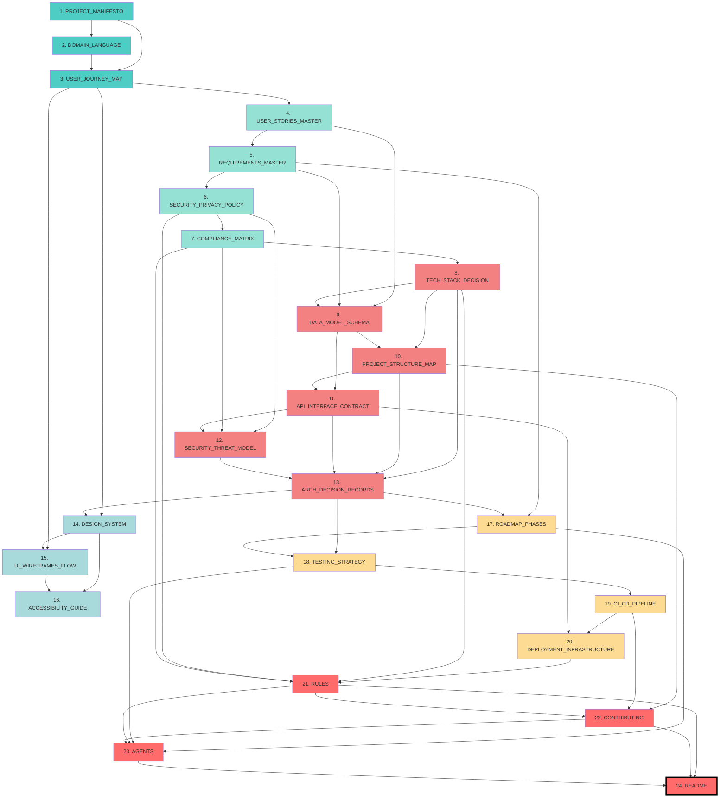

# 📋 Master Workflow - Document Generation Order (RAG-Optimized)

> **Purpose:** Define the optimal sequence for generating project documentation
> **Last Updated:** 2026-02-23
> **Maintainer:** @ArchitectZero
> **Status:** ✅ Production Ready (RAG-First Approach)
> **Total Documents:** 24/24
> **Total Duration:** ~16-20 hours (full workflow)
> **Critical Change:** ROOT phase moved to END to prevent LLM hallucinations

---

## 📖 Table of Contents

- [Overview](#overview)
- [Why ROOT is Last](#why-root-is-last)
- [Generation Phases](#generation-phases)
- [Complete Generation Sequence](#complete-generation-sequence)
- [Dependency Graph](#dependency-graph)
- [Phase Breakdown](#phase-breakdown)
- [Duration Estimates](#duration-estimates)
- [Prerequisites Matrix](#prerequisites-matrix)
- [Automation Opportunities](#automation-opportunities)

---

## 🎯 Overview

The **Master Workflow** is the canonical sequence for generating all 24 project documents in **SoftArchitect AI**. This order ensures:

1. **RAG-First Approach:** Documents generated with full historical context to prevent hallucinations
2. **Logical Dependencies:** Each document builds upon verified information from previous phases
3. **Minimal Rework:** Critical technical decisions made early prevent late-stage architectural changes
4. **Knowledge Accumulation:** ROOT synthesis documents generated LAST with complete project context

---

## 🚨 Why ROOT is Last (Critical Architectural Decision)

**Previous Error:** ROOT documents (README, AGENTS, RULES) were generated FIRST (Phase 0), causing:
- ❌ LLM hallucinations (writing rules without knowing tech stack)
- ❌ Premature architecture summaries (no context to summarize)
- ❌ Contradictions between ROOT and later technical decisions
- ❌ Wasted rework when requirements changed ROOT assumptions

**Corrected Approach:** ROOT is now **Phase 6 (FINAL)**, ensuring:
- ✅ README synthesizes the complete, finalized project architecture
- ✅ RULES reflect actual tech stack, security policies, and compliance requirements
- ✅ AGENTS document mirrors real roles defined in ROADMAP_PHASES and TESTING_STRATEGY
- ✅ CONTRIBUTING guide references validated PROJECT_STRUCTURE_MAP and CI_CD_PIPELINE

**RAG Context Window:** ROOT documents now have ~20 prior documents in their context, enabling accurate synthesis.

---

## 🏗️ Generation Phases

```
Phase 1: Context (10-CONTEXT) - Documents 1-3/24
├─ Define project vision, ubiquitous language, user journeys
├─ Duration: ~1.75 hours
└─ No external dependencies (starting point)

Phase 2: Requirements (20-REQUIREMENTS) - Documents 4-7/24
├─ Specify features, security policies, compliance, data model
├─ Duration: ~3 hours
└─ Depends on: Phase 1 (Context)

Phase 3: Architecture (30-ARCHITECTURE) - Documents 8-13/24
├─ Tech stack, data model, project structure, APIs, security threats, ADRs
├─ Duration: ~4.25 hours
└─ Depends on: Phase 2 (Requirements)

Phase 4: UI/UX (35-UX_UI) - Documents 14-16/24
├─ Design system, wireframes, accessibility guidelines
├─ Duration: ~2.42 hours
└─ Depends on: Phase 3 (Architecture)

Phase 5: Planning (40-PLANNING) - Documents 17-20/24
├─ Roadmap, testing strategy, CI/CD pipeline, deployment infrastructure
├─ Duration: ~3.33 hours
└─ Depends on: Phase 4 (UI/UX)

Phase 6: ROOT Synthesis (00-ROOT) - Documents 21-24/24
├─ Rules, contributing guide, agents, README (SYNTHESIZE ALL PRIOR CONTEXT)
├─ Duration: ~1.33 hours
└─ Depends on: ALL PREVIOUS PHASES (complete RAG context)
```

---

## 📜 Complete Generation Sequence

| # | Document | Phase | Duration | Prerequisites | RAG Context Size |
|---|----------|-------|----------|---------------|------------------|
| **1** | `PROJECT_MANIFESTO` | 1 | ~35 min | None (starting point) | 0 docs |
| **2** | `DOMAIN_LANGUAGE` | 1 | ~30 min | 1 (PROJECT_MANIFESTO) | 1 doc |
| **3** | `USER_JOURNEY_MAP` | 1 | ~40 min | 1-2 | 2 docs |
| **4** | `USER_STORIES_MASTER` | 2 | ~50 min | Phase 1 complete (1-3) | 3 docs |
| **5** | `REQUIREMENTS_MASTER` | 2 | ~45 min | 4 | 4 docs |
| **6** | `SECURITY_PRIVACY_POLICY` | 2 | ~35 min | 4-5 | 5 docs |
| **7** | `COMPLIANCE_MATRIX` | 2 | ~50 min | 6 | 6 docs |
| **8** | `TECH_STACK_DECISION` | 3 | ~45 min | Phase 2 complete (4-7) | 7 docs |
| **9** | `DATA_MODEL_SCHEMA` | 3 | ~40 min | 4-5, 8 | 8 docs |
| **10** | `PROJECT_STRUCTURE_MAP` | 3 | ~35 min | 8-9 | 9 docs |
| **11** | `API_INTERFACE_CONTRACT` | 3 | ~45 min | 9-10 | 10 docs |
| **12** | `SECURITY_THREAT_MODEL` | 3 | ~50 min | 6-7, 11 | 11 docs |
| **13** | `ARCH_DECISION_RECORDS` | 3 | ~40 min | 8, 10-12 | 12 docs |
| **14** | `DESIGN_SYSTEM` | 4 | ~55 min | 3, 13 | 13 docs |
| **15** | `UI_WIREFRAMES_FLOW` | 4 | ~50 min | 3, 14 | 14 docs |
| **16** | `ACCESSIBILITY_GUIDE` | 4 | ~40 min | 14-15 | 15 docs |
| **17** | `ROADMAP_PHASES` | 5 | ~45 min | 5, 13 | 16 docs |
| **18** | `TESTING_STRATEGY` | 5 | ~50 min | 13, 17 | 17 docs |
| **19** | `CI_CD_PIPELINE` | 5 | ~55 min | 18 | 18 docs |
| **20** | `DEPLOYMENT_INFRASTRUCTURE` | 5 | ~50 min | 11, 19 | 19 docs |
| **21** | `RULES` | 6 | ~20 min | Phase 5 complete (1-20) | **20 docs** ✅ |
| **22** | `CONTRIBUTING` | 6 | ~25 min | 10, 19, 21 | 21 docs |
| **23** | `AGENTS` | 6 | ~15 min | 17-18, 21-22 | 22 docs |
| **24** | `README` | 6 | ~20 min | **ALL** (1-23) | **23 docs** ✅ |

**Total Duration:** ~980 minutes (~16.33 hours)

**Key Insight:** ROOT documents (21-24) now have **20-23 documents in their RAG context**, enabling accurate synthesis and preventing hallucinations.

---

## 🔗 Dependency Graph



**Legend:**
- 🟦 **Cyan** (Phase 1): Context - Project foundation
- 🟩 **Green** (Phase 2): Requirements - What to build
- 🟥 **Red** (Phase 3): Architecture - How to build
- 🟦 **Blue** (Phase 4): UI/UX - User experience
- 🟨 **Yellow** (Phase 5): Planning - Operations
- 🟥 **Dark Red** (Phase 6): ROOT - **Synthesis of all context** (FINAL)

**Critical Path:** 1→2→3→4→5→6→7→8→13→17→18→19→20→21→24 (~8.5 hours sequential)
    style D6 fill:#f38181
    style E1 fill:#fddb92
    style E2 fill:#fddb92
    style E3 fill:#fddb92
    style E4 fill:#fddb92
    style E5 fill:#fddb92
```

---

## 📊 Phase Breakdown

### Phase 1: Context (10-CONTEXT) - 3 documents, ~105 minutes

**Goal:** Establish project vision, ubiquitous language, and user journeys

| Document | Purpose | Key Deliverable |
|----------|---------|-----------------|
| PROJECT_MANIFESTO | Vision & north star | Mission, values, success criteria |
| DOMAIN_LANGUAGE | Ubiquitous language (DDD) | Glossary of business terms |
| USER_JOURNEY_MAP | User flows & personas | Journey maps |

**Critical Path:** PROJECT_MANIFESTO → DOMAIN_LANGUAGE → USER_JOURNEY_MAP (sequential)

**Why First?** Sets the "WHY" and "WHO" before "WHAT" and "HOW".

---

### Phase 2: Requirements (20-REQUIREMENTS) - 4 documents, ~180 minutes

**Goal:** Specify features, security policies, compliance, and initial data model

| Document | Purpose | Key Deliverable |
|----------|---------|-----------------|
| USER_STORIES_MASTER | Feature backlog | Prioritized user stories (JSON) |
| REQUIREMENTS_MASTER | Consolidated specs | FR/NFR catalog |
| SECURITY_PRIVACY_POLICY | Security posture | Privacy guarantees, GDPR compliance |
| COMPLIANCE_MATRIX | Legal compliance | GDPR/CCPA/WCAG mapping |

**Critical Path:** USER_STORIES_MASTER → REQUIREMENTS_MASTER → SECURITY_PRIVACY_POLICY → COMPLIANCE_MATRIX

**Why Second?** Defines "WHAT" before making technical decisions in Phase 3.

---

### Phase 3: Architecture (30-ARCHITECTURE) - 6 documents, ~255 minutes

**Goal:** Design technical foundation (stack, data, APIs, security, decisions)

| Document | Purpose | Key Deliverable |
|----------|---------|-----------------|
| TECH_STACK_DECISION | Technology choices | Stack diagram (Frontend/Backend/Infra) |
| DATA_MODEL_SCHEMA | Database design | ER diagrams, table schemas |
| PROJECT_STRUCTURE_MAP | Folder structure | File tree with conventions |
| API_INTERFACE_CONTRACT | API specifications | OpenAPI/GraphQL schemas |
| SECURITY_THREAT_MODEL | Threat analysis | STRIDE matrix |
| ARCH_DECISION_RECORDS | Technical decisions | ADR log (Why we chose X over Y) |

**Critical Path:** TECH_STACK_DECISION → DATA_MODEL_SCHEMA → PROJECT_STRUCTURE_MAP → API_INTERFACE_CONTRACT → SECURITY_THREAT_MODEL → ARCH_DECISION_RECORDS

**Why Third?** Establishes "HOW" with full context from Phases 1-2.

---

### Phase 4: UI/UX (35-UX_UI) - 3 documents, ~145 minutes

**Goal:** Design user interface and ensure accessibility

| Document | Purpose | Key Deliverable |
|----------|---------|-----------------|
| DESIGN_SYSTEM | UI foundation | Component library, tokens, typography |
| UI_WIREFRAMES_FLOW | Screen flows | Mockups/wireframes |
| ACCESSIBILITY_GUIDE | WCAG compliance | A11y checklist |

**Critical Path:** DESIGN_SYSTEM → UI_WIREFRAMES_FLOW → ACCESSIBILITY_GUIDE

**Parallel Opportunities:** Can start DESIGN_SYSTEM after ARCH_DECISION_RECORDS if UI is independent.

**Why Fourth?** UI depends on architecture decisions (e.g., component framework).

---

### Phase 5: Planning (40-PLANNING) - 4 documents, ~200 minutes

**Goal:** Plan sprints, testing, automation, and deployment

| Document | Purpose | Key Deliverable |
|----------|---------|-----------------|
| ROADMAP_PHASES | Sprint planning | Release timeline, milestones |
| TESTING_STRATEGY | Test plan | Test pyramid, coverage targets |
| CI_CD_PIPELINE | Automation | GitHub Actions workflows |
| DEPLOYMENT_INFRASTRUCTURE | Production setup | Docker Compose, Kubernetes |

**Critical Path:** ROADMAP_PHASES → TESTING_STRATEGY → CI_CD_PIPELINE → DEPLOYMENT_INFRASTRUCTURE

**Why Fifth?** Roadmap must reflect realistic architecture complexity from Phase 3.

---

### Phase 6: ROOT Synthesis (00-ROOT) - 4 documents, ~80 minutes ⚠️ CRITICAL PHASE

**Goal:** Synthesize ALL project context into navigable ROOT documents

| Document | Purpose | Key Deliverable | RAG Context |
|----------|---------|-----------------|-------------|
| RULES | Development standards | Code quality rules, conventions | 20 docs |
| CONTRIBUTING | Collaboration workflow | PR process, branching strategy | 21 docs |
| AGENTS | Team structure (Human + AI) | RACI matrix, roles | 22 docs |
| README | Project overview | Quick-start guide, architecture summary | **23 docs** ✅ |

**Critical Path:** RULES → CONTRIBUTING → AGENTS → README (sequential)

**Why LAST (Not First)?**
- ✅ RULES now references actual TECH_STACK_DECISION, TESTING_STRATEGY, SECURITY_PRIVACY_POLICY
- ✅ CONTRIBUTING references validated PROJECT_STRUCTURE_MAP, CI_CD_PIPELINE
- ✅ AGENTS mirrors roles defined in ROADMAP_PHASES, TESTING_STRATEGY
- ✅ README synthesizes complete, finalized architecture (not hallucinated assumptions)

**RAG Impact:** ROOT documents have **20-23 prior documents in their context window**, enabling accurate synthesis.

---

## ⏱️ Duration Estimates

### Sequential vs Parallel Execution

| Phase | Documents | Sequential | Parallel (Optimistic) | Savings |
|-------|-----------|------------|----------------------|---------|
| Phase 1 (Context) | 3 | 105 min | 105 min | 0% (sequential critical path) |
| Phase 2 (Requirements) | 4 | 180 min | 145 min | -19% (COMPLIANCE_MATRIX parallel) |
| Phase 3 (Architecture) | 6 | 255 min | 200 min | -22% (3 parallel streams) |
| Phase 4 (UI/UX) | 3 | 145 min | 125 min | -14% (DESIGN_SYSTEM early start) |
| Phase 5 (Planning) | 4 | 200 min | 165 min | -18% (2 parallel streams) |
| Phase 6 (ROOT) | 4 | 80 min | 80 min | 0% (sequential, high quality synthesis) |
| **Total** | **24** | **965 min** | **820 min** | **-15%** |

**Parallel Workflow Duration:** ~13.7 hours (vs 16.1 hours sequential)

**Critical Insight:** Phase 6 (ROOT) MUST be sequential to ensure high-quality synthesis with full RAG context. Rushing this phase risks hallucinations.

---

## 🧩 Prerequisites Matrix

### No Prerequisites (Starting Point)
- **PROJECT_MANIFESTO** (1/24) - The genesis document

### Single Phase Dependency
- **DOMAIN_LANGUAGE** (2/24) - Requires Phase 1 complete
- **USER_STORIES_MASTER** (4/24) - Requires Phase 1 complete
- **TECH_STACK_DECISION** (8/24) - Requires Phase 2 complete

### Multiple Prerequisites (High Complexity)
| Document | Count | Prerequisites |
|----------|-------|---------------|
| **SECURITY_THREAT_MODEL** | 3 | API_INTERFACE_CONTRACT, SECURITY_PRIVACY_POLICY, COMPLIANCE_MATRIX |
| **ARCH_DECISION_RECORDS** | 4 | TECH_STACK_DECISION, PROJECT_STRUCTURE_MAP, API_INTERFACE_CONTRACT, SECURITY_THREAT_MODEL |
| **RULES** | 4 | TECH_STACK_DECISION, SECURITY_PRIVACY_POLICY, COMPLIANCE_MATRIX, DEPLOYMENT_INFRASTRUCTURE |
| **README** | **23** | **ALL DOCUMENTS** (complete synthesis) |

### ROOT Phase Dependencies (Critical for Quality)
| ROOT Document | RAG Context Size | Key Dependencies |
|--------------|------------------|------------------|
| RULES | 20 docs | TECH_STACK_DECISION, SECURITY_PRIVACY_POLICY, TESTING_STRATEGY |
| CONTRIBUTING | 21 docs | PROJECT_STRUCTURE_MAP, CI_CD_PIPELINE, RULES |
| AGENTS | 22 docs | ROADMAP_PHASES, TESTING_STRATEGY, RULES, CONTRIBUTING |
| README | **23 docs** | **EVERYTHING** (synthesis of entire project) |

---

## 🤖 Automation Opportunities

### Fully Automatable (AI-Generated with RAG)

| Document | Automation Level | Rationale |
|----------|------------------|-----------|
| **README** | **95%** | **Synthesis of all 23 prior documents (full RAG context)** |
| **CONTRIBUTING** | **92%** | Extract from PROJECT_STRUCTURE_MAP, CI_CD_PIPELINE, RULES |
| **RULES** | **88%** | Derive from TECH_STACK_DECISION, SECURITY_PRIVACY_POLICY, TESTING_STRATEGY |
| PROJECT_STRUCTURE_MAP | 85% | Generate from tech stack template |
| DATA_MODEL_SCHEMA | 80% | Derive from USER_STORIES entities |
| API_INTERFACE_CONTRACT | 75% | Generate from data model + CRUD |
| CI_CD_PIPELINE | 90% | Template-based (tech stack dependent) |

**Key Insight:** ROOT documents (21-24) have HIGHEST automation potential because they synthesize existing context, not create new information.

### Partially Automatable (AI-Assisted)

| Document | Automation Level | Rationale |
|----------|------------------|-----------|
| DOMAIN_LANGUAGE | 60% | Extract from USER_STORIES, require validation |
| USER_JOURNEY_MAP | 50% | Generate personas, require UX review |
| DESIGN_SYSTEM | 60% | Template-based, colors/fonts require design |
| TESTING_STRATEGY | 70% | Generate from REQUIREMENTS, customize coverage |

### Minimal Automation (Human-Driven)

| Document | Automation Level | Rationale |
|----------|------------------|-----------|
| AGENTS | 35% | Team-specific, organizational context (but AI can template RACI) |
| PROJECT_MANIFESTO | 40% | Vision requires human creativity (starting point) |
| TECH_STACK_DECISION | 50% | Decision matrix template, requires judgment |
| COMPLIANCE_MATRIX | 55% | Legal expertise required |

---

## 📝 Quick Start Guide

### Option 1: Sequential (Recommended for Solo Developers)

```bash
# Generate documents 1-24 in RAG-optimized order
for i in {1..24}; do
  softarchitect-ai generate --order $i --phase auto
done
```

**Phase Sequence:**
1. Context (Docs 1-3): PROJECT_MANIFESTO → DOMAIN_LANGUAGE → USER_JOURNEY_MAP
2. Requirements (Docs 4-7): USER_STORIES → REQUIREMENTS → SECURITY → COMPLIANCE
3. Architecture (Docs 8-13): TECH_STACK → DATA_MODEL → STRUCTURE → API → THREATS → ADRS
4. UI/UX (Docs 14-16): DESIGN_SYSTEM → WIREFRAMES → ACCESSIBILITY
5. Planning (Docs 17-20): ROADMAP → TESTING → CI_CD → DEPLOYMENT
6. **ROOT Synthesis (Docs 21-24): RULES → CONTRIBUTING → AGENTS → README** ⚠️ FINAL

**Duration:** ~16 hours
**Pros:** Simple, no coordination needed, maximum RAG context quality
**Cons:** Slower (but safer for solo work)

---

### Option 2: Parallel (Recommended for Teams)

```bash
# Phase 1: One person (105 minutes)
# Sequential: PROJECT_MANIFESTO → DOMAIN_LANGUAGE → USER_JOURNEY_MAP
softarchitect-ai batch-generate --phase 1

# Phase 2: Two people (145 minutes)
# Person A: USER_STORIES → REQUIREMENTS → SECURITY_PRIVACY
# Person B: COMPLIANCE_MATRIX (parallel with SECURITY_PRIVACY)
softarchitect-ai batch-generate --phase 2 --parallel 2

# Phase 3: Three people (200 minutes)
# Person A: TECH_STACK → DATA_MODEL → PROJECT_STRUCTURE
# Person B: API_CONTRACT → SECURITY_THREAT_MODEL
# Person C: ARCH_DECISION_RECORDS (after A & B complete)
softarchitect-ai batch-generate --phase 3 --parallel 3

# Phase 4: Two people (125 minutes)
# Person A: DESIGN_SYSTEM → UI_WIREFRAMES
# Person B: ACCESSIBILITY_GUIDE (parallel with UI_WIREFRAMES)
softarchitect-ai batch-generate --phase 4 --parallel 2

# Phase 5: Two people (165 minutes)
# Person A: ROADMAP → TESTING_STRATEGY
# Person B: CI_CD → DEPLOYMENT (after TESTING_STRATEGY)
softarchitect-ai batch-generate --phase 5 --parallel 2

# Phase 6: ONE PERSON ONLY! (80 minutes) ⚠️ CRITICAL
# Sequential synthesis: RULES → CONTRIBUTING → AGENTS → README
# DO NOT PARALLELIZE - Quality depends on full context
softarchitect-ai batch-generate --phase 6 --parallel 1 --high-quality
```

**Duration:** ~13.7 hours
**Pros:** Faster, team collaboration
**Cons:** Requires coordination, **Phase 6 MUST be sequential**

**CRITICAL:** Phase 6 (ROOT) should be executed by the most experienced team member with full context awareness.

---

## 🔄 Version History

| Version | Date | Changes |
|---------|------|---------|
| 1.0.0 | 2025-01-15 | Initial release with 24-document workflow |
| 2.0.0 | 2026-02-23 | **BREAKING:** ROOT phase moved to END (Phase 6) to prevent LLM hallucinations via RAG-first approach |

---

> **Note:** This workflow is optimized for **SoftArchitect AI**'s RAG-powered document generation. Actual durations vary based on project complexity and AI model performance.
>
> **Critical Change (v2.0.0):** ROOT documents now generated LAST with full historical context, eliminating hallucinations and ensuring accurate synthesis.
