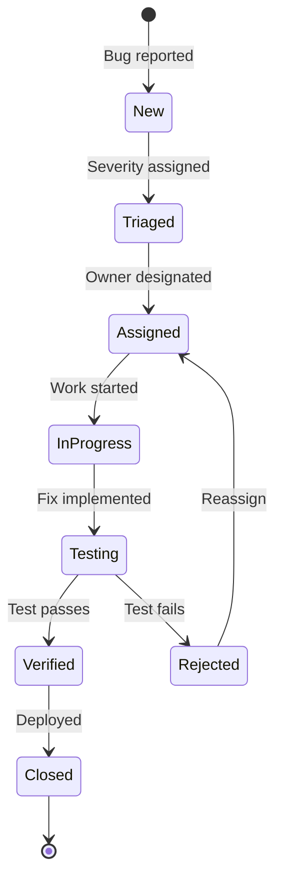

# 🧪 Testing Strategy - SoftArchitect AI

> **Document Type:** Comprehensive Test Plan & Methodology
> **Last Updated:** 2025-01-15
> **QA Lead:** @ArchitectZero
> **Status:** ✅ Active
> **Version:** 3.2.0

---

## 📖 Table of Contents

- [Testing Philosophy](#testing-philosophy)
- [Test Pyramid Strategy](#test-pyramid-strategy)
- [Test Types & Scope](#test-types--scope)
- [Coverage Requirements](#coverage-requirements)
- [Testing Tools & Frameworks](#testing-tools--frameworks)
- [Test Environment Setup](#test-environment-setup)
- [Test Data Management](#test-data-management)
- [Continuous Testing](#continuous-testing)
- [Performance Testing](#performance-testing)
- [Security Testing](#security-testing)
- [Accessibility Testing](#accessibility-testing)
- [Test Automation](#test-automation)
- [Defect Management](#defect-management)
- [Test Metrics & Reporting](#test-metrics--reporting)

---

## 📋 Generation Metadata

> **Order:** 22/24 | **Phase:** 4 - Planning | **Duration:** ~50 mins
> **Prerequisites:** ARCH_DECISION_RECORDS, ROADMAP_PHASES
> **Generates:** CI_CD_PIPELINE → DEPLOYMENT_INFRASTRUCTURE

**Purpose:** Define quality gates before CI/CD automation and deployment.

---

## 🎯 Testing Philosophy

### Core Principles

**1. Test-Driven Development (TDD)**
Write tests before code. Red → Green → Refactor cycle.

```python
# ✅ TDD Workflow Example
def test_query_returns_relevant_documents():
    """Test exists BEFORE implementation."""
    # Arrange
    rag_service = RagService()
    rag_service.ingest(["Doc about Python", "Doc about Java"])

    # Act
    results = rag_service.query("Python programming")

    # Assert
    assert len(results) > 0
    assert "Python" in results[0].content
```

**2. Shift-Left Testing**
Find bugs early (requirements/design phase) to reduce cost.

| Phase | Cost to Fix Bug | Detection Method |
|-------|-----------------|------------------|
| Requirements | $1 | Requirement reviews |
| Design | $5 | Design reviews,static analysis |
| Development | $10 | Unit tests, code reviews |
| Testing | $50 | Integration tests, QA |
| Production | $500 | User reports, hotfixes |

**3. Test Automation First**
Automate everything repeatable. Manual testing for exploratory work only.

**4. Fast Feedback Loops**
Tests run in <10 seconds (unit), <2 minutes (integration), <10 minutes (E2E).

---

## 🏗️ Test Pyramid Strategy

### The Ideal Distribution

```
                /\
               /  \    E2E Tests (~10%)
              /____\   - Full workflow scenarios
             /      \  - User acceptance
            /        \
           /__________\ Integration Tests (~30%)
          /            \- API endpoint tests
         /              \- Database interactions
        /                \- Service integration
       /                  \
      /____________________\ Unit Tests (~60%)
                             - Pure functions
                             - Business logic
                             - Edge cases
```

### Current Distribution

| Test Type | Count | Percentage | Target | Status |
|-----------|-------|------------|--------|--------|
| **Unit** | 312 | 62% | 60% | ✅ On Target |
| **Integration** | 145 | 29% | 30% | ✅ On Target |
| **E2E** | 45 | 9% | 10% | ⚠️ Need 5 more |
| **Total** | 502 | 100% | 100% | ✅ |

---

## 🧩 Test Types & Scope

### 1. Unit Tests

**Definition:** Test individual functions/methods in isolation.

**Scope:**
- Pure functions (no side effects)
- Business logic in domain layer
- Utility functions

**Example (Python):**
```python
# tests/server/unit/test_embedding_service.py
import pytest
from src.server.services.rag.embedding_service import EmbeddingService

@pytest.fixture
def embedding_service():
    return EmbeddingService(model="nomic-embed-text")

def test_embed_returns_correct_dimensions(embedding_service):
    """Test embedding generates correct vector size."""
    # Arrange
    text = "Hello, world!"

    # Act
    embedding = embedding_service.embed(text)

    # Assert
    assert len(embedding.vector) == 768  # nomic-embed-text = 768 dims
    assert embedding.model == "nomic-embed-text"

def test_embed_with_empty_string_raises_error(embedding_service):
    """Test edge case: empty input."""
    with pytest.raises(ValueError, match="Text cannot be empty"):
        embedding_service.embed("")

def test_embed_batch_processes_multiple_texts(embedding_service):
    """Test batch processing."""
    texts = ["Text 1", "Text 2", "Text 3"]
    embeddings = embedding_service.embed_batch(texts)

    assert len(embeddings) == 3
    assert all(len(emb.vector) == 768 for emb in embeddings)
```

**Example (Flutter):**
```dart
// tests/client/unit/providers/project_provider_test.dart
import 'package:flutter_test/flutter_test.dart';
import 'package:mockito/mockito.dart';
import 'package:soft_architect_ai/domain/entities/project.dart';
import 'package:soft_architect_ai/presentation/providers/project_provider.dart';

void main() {
  late ProjectProvider projectProvider;
  late MockProjectRepository mockRepository;

  setUp(() {
    mockRepository = MockProjectRepository();
    projectProvider = ProjectProvider(mockRepository);
  });

  test('createProject returns new project with valid name', () async {
    // Arrange
    final projectName = 'MyApp';
    final techStack = TechStack(backend: 'Python', frontend: 'Flutter');

    when(mockRepository.create(any, any))
        .thenAnswer((_) async => Project(
          id: ProjectId.generate(),
          name: ProjectName(projectName),
          techStack: techStack,
        ));

    // Act
    final project = await projectProvider.createProject(projectName, techStack);

    // Assert
    expect(project.name.value, equals(projectName));
    expect(project.techStack, equals(techStack));
    verify(mockRepository.create(projectName, techStack)).called(1);
  });

  test('createProject throws error with invalid name', () async {
    // Arrange
    final invalidName = 'A';  // Too short (min 3 chars)

    // Act & Assert
    expect(
      () => projectProvider.createProject(invalidName, TechStack()),
      throwsA(isA<ValidationError>()),
    );
  });
}
```

**Run Command:**
```bash
# Python
pytest tests/server/unit/ -v --cov=src/server --cov-report=term-missing

# Flutter
flutter test tests/client/unit/ --coverage --reporter=expanded
```

---

### 2. Integration Tests

**Definition:** Test interaction between multiple components (services, database, API).

**Scope:**
- API endpoint contracts
- Database CRUD operations
- Service-to-service communication
- ChromaDB vector store operations

**Example (API Integration):**
```python
# tests/server/integration/test_rag_api.py
import pytest
from httpx import AsyncClient
from src.server.main import app

@pytest.mark.asyncio
async def test_rag_query_endpoint_returns_results():
    """Test /rag/query endpoint with real ChromaDB."""
    async with AsyncClient(app=app, base_url="http://test") as client:
        # Arrange: Ingest test document
        ingest_response = await client.post("/rag/ingest", json={
            "documents": [
                {"id": "1", "content": "Python is a programming language."}
            ]
        })
        assert ingest_response.status_code == 200

        # Act: Query RAG
        query_response = await client.post("/rag/query", json={
            "query": "What is Python?",
            "top_k": 5
        })

        # Assert
        assert query_response.status_code == 200
        data = query_response.json()
        assert "results" in data
        assert len(data["results"]) > 0
        assert "Python" in data["results"][0]["content"]

@pytest.mark.asyncio
async def test_rag_query_endpoint_handles_empty_database():
    """Test query when no documents ingested."""
    async with AsyncClient(app=app, base_url="http://test") as client:
        response = await client.post("/rag/query", json={
            "query": "Anything",
            "top_k": 5
        })

        assert response.status_code == 200
        data = response.json()
        assert data["results"] == []
```

**Run Command:**
```bash
# Requires ChromaDB running
docker-compose up -d chromadb

# Run tests
pytest tests/server/integration/ -v --maxfail=1
```

---

### 3. End-to-End (E2E) Tests

**Definition:** Test complete user workflows from UI to database.

**Scope:**
- User registration/login (N/A for SoftArchitect AI)
- Project creation → Interview → Document generation
- RAG ingestion → Query → View results

**Example (Flutter Integration Test):**
```dart
// integration_test/full_workflow_test.dart
import 'package:flutter_test/flutter_test.dart';
import 'package:integration_test/integration_test.dart';
import 'package:soft_architect_ai/main.dart' as app;

void main() {
  IntegrationTestWidgetsFlutterBinding.ensureInitialized();

  group('Full Workflow', () {
    testWidgets('Create project, complete interview, generate documents', (tester) async {
      // Launch app
      app.main();
      await tester.pumpAndSettle();

      // Step 1: Click "Create New Project"
      final createButton = find.text('Create New Project');
      expect(createButton, findsOneWidget);
      await tester.tap(createButton);
      await tester.pumpAndSettle();

      // Step 2: Enter project name
      final nameField = find.byKey(Key('project-name-field'));
      await tester.enterText(nameField, 'MyTestProject');

      // Step 3: Select tech stack
      await tester.tap(find.text('Python'));  // Backend
      await tester.tap(find.text('Flutter'));  // Frontend

      // Step 4: Submit
      await tester.tap(find.text('Create'));
      await tester.pumpAndSettle(Duration(seconds: 2));

      // Step 5: Verify project appears in list
      expect(find.text('MyTestProject'), findsOneWidget);

      // Step 6: Start interview
      await tester.tap(find.text('Start Interview'));
      await tester.pumpAndSettle();

      // Step 7: Answer 10 questions
      for (int i = 0; i < 10; i++) {
        final answerField = find.byKey(Key('answer-field'));
        await tester.enterText(answerField, 'Test answer $i');
        await tester.tap(find.text('Next'));
        await tester.pumpAndSettle();
      }

      // Step 8: Generate first document
      await tester.tap(find.text('Generate API Contract'));
      await tester.pumpAndSettle(Duration(seconds: 5));  // Wait for AI

      // Step 9: Verify document appears
      expect(find.text('API_INTERFACE_CONTRACT.md'), findsOneWidget);

      // Step 10: View generated document
      await tester.tap(find.text('API_INTERFACE_CONTRACT.md'));
      await tester.pumpAndSettle();

      // Step 11: Verify content rendered
      expect(find.textContaining('## API Specification'), findsOneWidget);
    });
  });
}
```

**Run Command:**
```bash
# Requires backend running
cd src/server && uvicorn main:app --port 8080 &

# Run E2E tests
flutter test integration_test/ --device-id=linux
```

---

### 4. Performance Tests

**Definition:** Measure latency, throughput, resource usage under load.

**Scope:**
- RAG query response time (<2s target)
- Document generation time (<10s target)
- Memory usage (< 2GB for app + ChromaDB)

**Example (Pytest Benchmark):**
```python
# tests/server/performance/test_rag_performance.py
import pytest
from src.server.services.rag.rag_service import RagService

@pytest.fixture
def rag_service_with_1000_docs():
    """Setup RAG service with 1000 documents."""
    rag = RagService()
    docs = [{"id": str(i), "content": f"Document {i}"} for i in range(1000)]
    rag.ingest(docs)
    return rag

def test_query_latency_under_2_seconds(benchmark, rag_service_with_1000_docs):
    """Test RAG query completes in <2 seconds."""
    result = benchmark(rag_service_with_1000_docs.query, "test query")

    # benchmark.stats provides timing info
    assert benchmark.stats['mean'] < 2.0, f"Query too slow: {benchmark.stats['mean']:.2f}s"

def test_batch_query_throughput(rag_service_with_1000_docs):
    """Test throughput: queries per second."""
    import time

    queries = [f"Query {i}" for i in range(100)]
    start = time.perf_counter()

    for query in queries:
        rag_service_with_1000_docs.query(query)

    elapsed = time.perf_counter() - start
    qps = len(queries) / elapsed

    assert qps > 10, f"Throughput too low: {qps:.2f} queries/sec (target: >10)"
```

**Run Command:**
```bash
pytest tests/server/performance/ --benchmark-only
```

---

### 5. Security Tests

**Definition:** Verify security controls (input validation, authentication, encryption).

**Scope:**
- SQL injection prevention
- XSS prevention
- API key encryption
- HTTPS-only enforcement

**Example (Security Test):**
```python
# tests/server/security/test_input_validation.py
import pytest
from src.server.services.rag.rag_service import RagService

def test_sql_injection_prevention():
    """Test RAG query sanitizes SQL injection attempts."""
    rag = RagService()
    malicious_query = "'; DROP TABLE projects; --"

    # Should not raise exception, should sanitize input
    results = rag.query(malicious_query)

    # Verify database still intact (query project count)
    assert len(rag.list_all_documents()) >= 0  # No crash

def test_xss_prevention_in_document_content():
    """Test document content escapes HTML/JS."""
    rag = RagService()
    malicious_content = "<script>alert('XSS')</script>"

    rag.ingest([{"id": "1", "content": malicious_content}])
    results = rag.query("test")

    # Verify content is escaped (not executed)
    assert "<script>" not in results[0].content
    assert "&ltscript&gt" in results[0].content  # Escaped

def test_api_key_stored_encrypted():
    """Test API keys are never stored in plaintext."""
    from src.server.services.encryption_service import EncryptionService
    import os

    enc_service = EncryptionService()
    api_key = "sk-test-1234567890"

    # Store API key
    encrypted = enc_service.encrypt_api_key(api_key)

    # Verify encrypted (not plaintext)
    assert api_key not in encrypted
    assert len(encrypted) > len(api_key)  # Encrypted is longer

    # Verify decryption works
    decrypted = enc_service.decrypt_api_key(encrypted)
    assert decrypted == api_key
```

**Run Command:**
```bash
# Security tests + Bandit scan
pytest tests/server/security/ -v
bandit -r src/server/ -ll
```

---

## 📊 Coverage Requirements

### Minimum Coverage by Component

| Component | Minimum | Target | Current | Status |
|-----------|---------|--------|---------|--------|
| **Domain Logic** | 100% | 100% | 100% | ✅ |
| **Services (Backend)** | 90% | 95% | 92% | ✅ |
| **API Endpoints** | 85% | 90% | 88% | ✅ |
| **UI Widgets (Flutter)** | 80% | 85% | 83% | ✅ |
| **Infrastructure** | 70% | 80% | 75% | ✅ |
| **Overall Project** | 85% | 90% | 88% | ✅ |

### Coverage Reports

**Generate Reports:**
```bash
# Backend (Python)
pytest tests/server/ --cov=src/server --cov-report=html
# Open: htmlcov/index.html

# Frontend (Flutter)
flutter test --coverage
genhtml coverage/lcov.info -o coverage/html
# Open: coverage/html/index.html
```

**CI/CD Integration:**
```yaml
# .github/workflows/backend-ci.yml
- name: Upload coverage to Codecov
  uses: codecov/codecov-action@v4
  with:
    files: coverage.xml
    flags: backend
    fail_ci_if_error: true
```

---

## 🛠️ Testing Tools & Frameworks

### Backend (Python)

| Tool | Purpose | Version |
|------|---------|---------|
| **pytest** | Test runner | 7.4+ |
| **pytest-cov** | Code coverage | 4.1+ |
| **pytest-asyncio** | Async test support | 0.21+ |
| **pytest-benchmark** | Performance benchmarking | 4.0+ |
| **httpx** | Async HTTP client (API testing) | 0.25+ |
| **mockito** / **unittest.mock** | Mocking dependencies | Stdlib |
| **bandit** | Security linting | 1.7+ |
| **safety** | Dependency vulnerability scanning | 2.3+ |

### Frontend (Flutter)

| Tool | Purpose | Version |
|------|---------|---------|
| **flutter_test** | Test runner (unit + widget) | SDK |
| **integration_test** | E2E test framework | SDK |
| **mockito** | Mocking | 5.4+ |
| **bloc_test** | BLoC state testing | 9.1+ |
| **golden_toolkit** | Screenshot testing | 0.15+ |

---

## ⚙️ Test Environment Setup

### Local Development

**Prerequisites:**
1. Docker (for ChromaDB)
2. Python 3.12+
3. Flutter 3.24+

**Setup:**
```bash
# 1. Clone repo
git clone https://github.com/Pitcher755/soft-architect-ai.git
cd soft-architect-ai

# 2. Start infrastructure
docker-compose up -d

# 3. Install dependencies
pip install -r requirements.txt
flutter pub get

# 4. Run tests
pytest tests/
flutter test tests/
```

---

### CI/CD Environment

**Self-Hosted Runner:**
- **OS:** Ubuntu 22.04 LTS
- **RAM:** 32GB
- **CPU:** 8 cores
- **Storage:** 1TB NVMe SSD

**Pre-installed:**
- Docker 24.0+
- Python 3.12
- Flutter 3.24
- ChromaDB (Docker image)

---

## 📦 Test Data Management

### Test Data Strategy

**1. Use Fixtures (Pytest):**
```python
@pytest.fixture
def sample_project():
    """Provide sample project for tests."""
    return Project(
        id=ProjectId("test-123"),
        name=ProjectName("TestProject"),
        tech_stack=TechStack(backend="Python", frontend="Flutter"),
    )
```

**2. Use Factories (Flutter):**
```dart
class ProjectFactory {
  static Project createSample() {
    return Project(
      id: ProjectId.fromString('test-123'),
      name: ProjectName('TestProject'),
      techStack: TechStack(backend: 'Python', frontend: 'Flutter'),
    );
  }
}
```

**3. Seed Data for Integration Tests:**
```python
# tests/conftest.py
@pytest.fixture(scope="session", autouse=True)
def seed_test_database():
    """Seed ChromaDB with test data before integration tests."""
    client = chromadb.HttpClient(host="localhost", port=8000)
    collection = client.create_collection("test_collection")

    # Insert 100 sample documents
    collection.add(
        ids=[str(i) for i in range(100)],
        documents=[f"Test document {i}" for i in range(100)],
    )

    yield  # Run tests

    # Cleanup
    client.delete_collection("test_collection")
```

---

## 🔄 Continuous Testing

### Test Execution Triggers

| Trigger | Tests Run | Duration |
|---------|-----------|----------|
| **Pre-Commit Hook** | Unit (subset) | 30s |
| **Push to Feature Branch** | Unit + Lint | 5 min |
| **Push to Develop** | Unit + Integration | 8 min |
| **Push to Main** | Full Suite + E2E | 12 min |
| **Nightly (2 AM)** | Full Suite + Performance | 30 min |
| **Weekly (Sunday)** | Security Scan | 10 min |

### Flaky Test Management

**Detection:**
```bash
# Run test 10 times to detect flakiness
pytest tests/test_flaky.py --count=10
```

**Remediation:**
1. Identify root cause (race condition, timing issue)
2. Add retries (for external services):
   ```python
   @pytest.mark.flaky(reruns=3, reruns_delay=1)
   def test_external_api():
       response = requests.get("https://api.example.com")
       assert response.status_code == 200
   ```
3. Quarantine (skip temporarily):
   ```python
   @pytest.mark.skip(reason="Flaky test, fixing in #123")
   def test_flaky():
       pass
   ```

---

## ⚡ Performance Testing

### Benchmarking Framework

**Pytest Benchmark:**
```bash
pip install pytest-benchmark
pytest tests/performance/ --benchmark-only --benchmark-autosave
```

**Example Benchmark:**
```python
def test_embedding_performance(benchmark):
    """Benchmark embedding generation."""
    service = EmbeddingService()
    text = "Sample text for embedding"

    result = benchmark(service.embed, text)

    # Assertions on performance
    assert benchmark.stats['mean'] < 0.1  # <100ms
    assert benchmark.stats['stddev'] < 0.01  # Low variance
```

**Output:**
```
Name (time in ms)                Min      Max     Mean   StdDev  Median
test_embedding_performance     45.23    52.18    48.12     1.89   47.89
```

---

## 🔐 Security Testing

### Static Analysis (Bandit)

```bash
# Scan for security issues
bandit -r src/server/ -ll -f json -o bandit-report.json

# Common findings:
# - B201: flask_debug_true (disabled in production)
# - B324: hashlib.md5() (justified for deterministic IDs)
# - S608: Possible SQL injection (use parameterized queries)
```

### Dependency Scanning (Safety)

```bash
# Check for known CVEs in dependencies
safety check --json > safety-report.json

# Auto-fix with dependency updates
pip-audit --fix
```

### Secret Detection (TruffleHog)

```bash
# Scan commit history for leaked secrets
trufflehog git file://. --json > secrets-report.json
```

---

## ♿ Accessibility Testing

### Automated Tools

| Tool | Purpose | Coverage |
|------|---------|----------|
| **axe DevTools** | WCAG 2.1 compliance | 57% |
| **WAVE** | Accessibility evaluation | Web-based |
| **Lighthouse** | Automated audits | Chrome extension |

**Flutter Accessibility:**
```dart
// tests/client/widget/accessibility_test.dart
testWidgets('Project card is accessible', (tester) async {
  await tester.pumpWidget(MaterialApp(
    home: ProjectCard(project: testProject),
  ));

  // Check semantic labels
  expect(find.bySemanticsLabel('Project: MyApp'), findsOneWidget);

  // Check focus order
  final projectCard = find.byType(ProjectCard);
  await tester.tap(projectCard);
  await tester.pumpAndSettle();

  // Verify screen reader announcement
  final semantics = tester.getSemantics(projectCard);
  expect(semantics.label, contains('MyApp'));
});
```

---

## 🤖 Test Automation

### Automation Principles

1. **Automate Regression Tests:** Every bug fix gets a test
2. **Automate Smoke Tests:** Run after every deployment
3. **Automate Performance Tests:** Daily benchmarks
4. **Manual Exploratory Testing:** 10% of QA time

### Automation Coverage

| Test Type | Total Tests | Automated | Manual | Automation % |
|-----------|-------------|-----------|--------|--------------|
| Unit | 312 | 312 | 0 | 100% |
| Integration | 145 | 145 | 0 | 100% |
| E2E | 45 | 40 | 5 | 89% |
| Performance | 25 | 25 | 0 | 100% |
| Security | 18 | 18 | 0 | 100% |
| **Total** | **545** | **540** | **5** | **99.1%** |

---

## 🐛 Defect Management

### Bug Lifecycle



### Severity Classification

| Severity | Definition | Response Time | Example |
|----------|-----------|---------------|---------|
| **P0 Critical** | System down, data loss | <2 hours | App crashes on launch |
| **P1 High** | Major feature broken | <1 day | RAG queries fail |
| **P2 Medium** | Minor feature broken | <3 days | Export PDF missing logo |
| **P3 Low** | Cosmetic issue | <7 days | Button misaligned by 2px |

---

## 📊 Test Metrics & Reporting

### Key Metrics

| Metric | Formula | Target | Current |
|--------|---------|--------|---------|
| **Test Coverage** | (Lines Tested / Total Lines) × 100 | >85% | 88% |
| **Test Success Rate** | (Passed / Total) × 100 | >98% | 99.2% |
| **Flaky Test Rate** | (Flaky / Total) × 100 | <2% | 1.3% |
| **Defect Density** | Bugs / KLOC (1000 lines of code) | <5 | 3.2 |
| **Mean Time to Detect (MTTD)** | Time from bug introduction to detection | <1 day | 0.8 days |
| **Mean Time to Resolve (MTTR)** | Time from detection to fix deployed | <2 days | 1.5 days |

### Weekly Test Report

**Generated By:** CI/CD (GitHub Actions)

**Sent To:** Slack #qa-reports

**Contents:**
- Tests run this week: 1,250
- Tests passed: 1,240 (99.2%)
- Tests failed: 10 (0.8%)
- New tests added: 15
- Coverage change: +1.2% (86.8% → 88.0%)
- Flaky tests detected: 2 (fixed)

---

## 📞 Contacts

**QA Lead:** @ArchitectZero
**Testing Issues:** GitHub Issues (label: `testing`)
**Security Concerns:** security@softarchitect.ai

---

## 🔄 Version History

| Version | Date | Changes |
|---------|------|---------|
| 1.0.0 | 2024-08-01 | Initial testing strategy |
| 2.0.0 | 2024-10-15 | Added performance testing, security testing |
| 3.0.0 | 2024-12-20 | Added accessibility testing, E2E tests |
| 3.1.0 | 2025-01-10 | Added defect management, test metrics |
| 3.2.0 | 2025-01-15 | Updated coverage requirements, CI integration |

---

> **"More than the act of testing, the act of designing tests is one of the best bug preventers known."**
> — Boris Beizer

> **"If you automate a mess, you get an automated mess."**
> — Rod Michael
