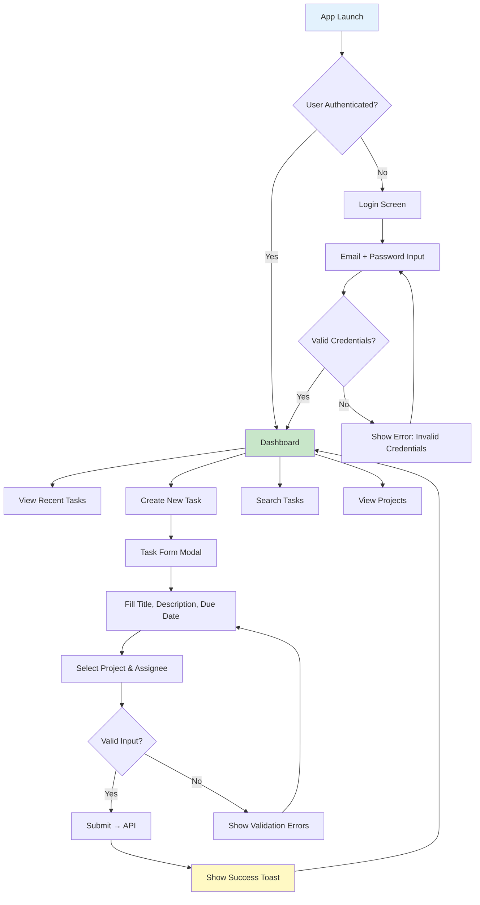
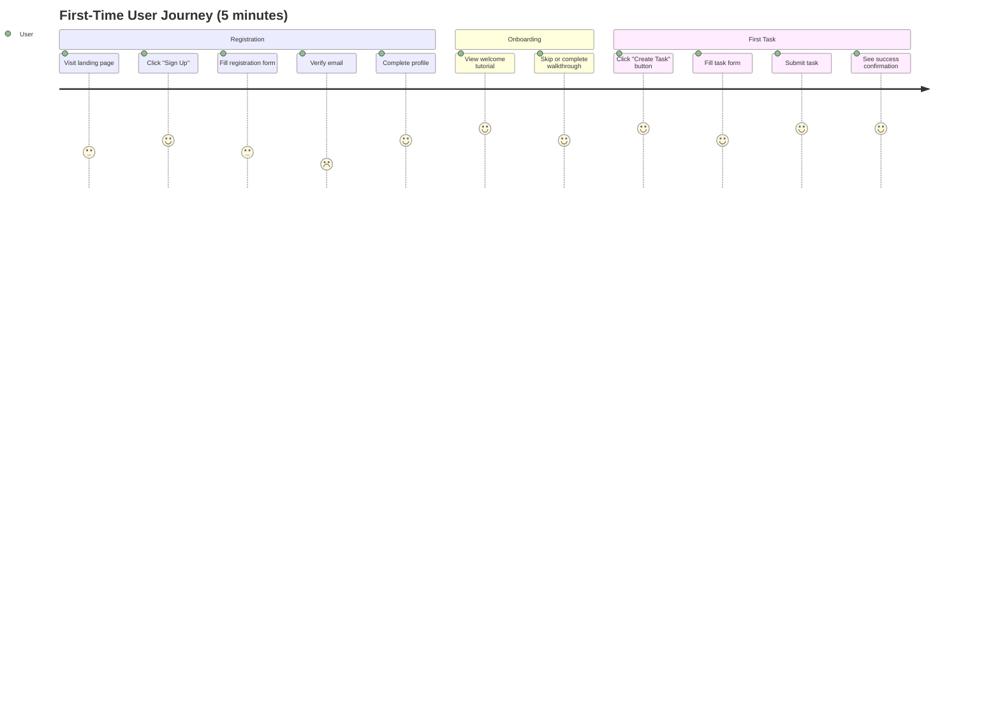
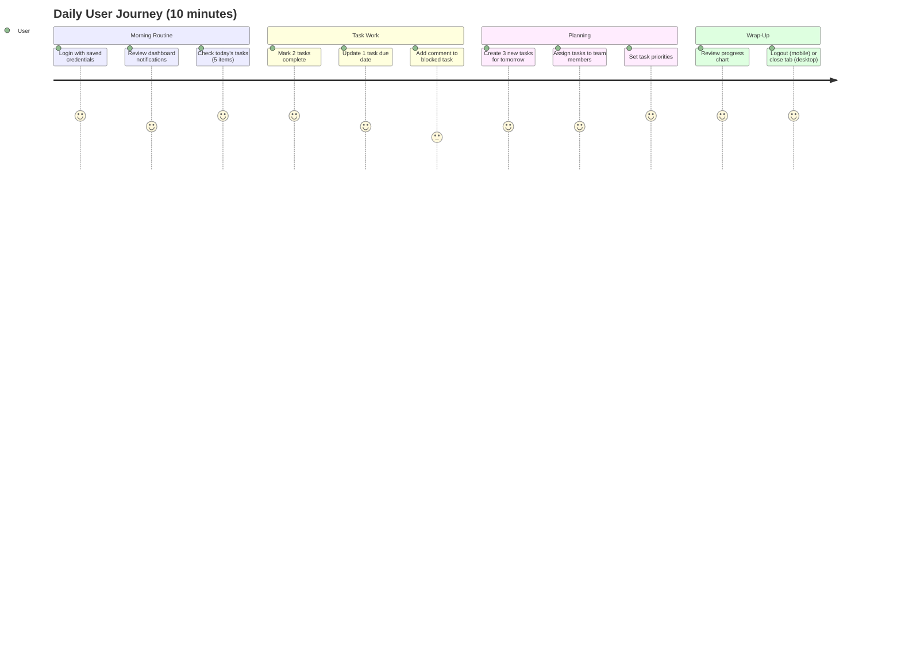
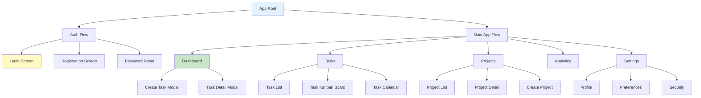

# 📐 UI WIREFRAMES & FLOW: TaskFlow Pro

> **Project:** TaskFlow Pro - Enterprise Task Management System
> **Document Type:** User Interface Wireframes & Interaction Flows
> **Version:** 2.0.0
> **Last Updated:** February 22, 2026
> **Status:** ✅ Active Reference
> **Authority:** UX/UI Designer (Keiko Tanaka) + Product Owner

---

## 📋 Table of Contents

- [Document Purpose](#document-purpose)
- [User Flow Overview](#user-flow-overview)
- [Key User Journeys](#key-user-journeys)
- [Screen Wireframes](#screen-wireframes)
- [Interaction Patterns](#interaction-patterns)
- [Navigation Architecture](#navigation-architecture)
- [Responsive Behavior](#responsive-behavior)
- [Micro-Interactions](#micro-interactions)
- [Figma Prototypes](#figma-prototypes)
- [Design Annotations](#design-annotations)

---

## 🎯 Document Purpose

This document provides:

1. **Visual Blueprint** - Wireframes for all major screens
2. **User Flow Diagrams** - Step-by-step interaction paths
3. **Interaction Specs** - Hover states, clicks, gestures
4. **Responsive Layouts** - Adaptations for desktop/tablet/mobile
5. **Developer Handoff** - Annotations for implementation

**Target Audience:**
- Developers (implementation reference)
- UX Designers (design consistency)
- Product Owners (feature validation)
- QA Engineers (test case creation)

---

## 🌊 User Flow Overview

### Primary User Flows (Priority 1)



---

### Secondary User Flows (Priority 2)

1. **Task Editing** - Update task details
2. **Task Deletion** - Delete with confirmation
3. **Project Management** - Create/edit projects
4. **User Settings** - Update profile, preferences
5. **Logout** - Clear session

---

## 🚶 Key User Journeys

### Journey 1: First-Time User Registration & Task Creation



**Pain Points Identified:**
- ⚠️ Email verification adds 2-3 min friction → **Solution:** Optional skip in onboarding
- ⚠️ Too many form fields → **Solution:** Simplified 3-field task creation (title, due date, project)

---

### Journey 2: Daily Active User - Task Management



**Key Insights:**
- ✅ Dashboard is central hub (visited 8-10 times/day)
- ✅ Quick task creation is critical (must be <30 sec)
- ⚠️ Comment feature underutilized → **Solution:** Add @mentions, inline replies

---

## 📱 Screen Wireframes

### Screen 1: Login Page

```
┌─────────────────────────────────────────────────────┐
│                                                       │
│                  [TaskFlow Pro Logo]                 │
│                                                       │
│            Enterprise Task Management                │
│                                                       │
│   ┌──────────────────────────────────────────┐      │
│   │  Email Address                          │      │
│   │  [email@example.com              ]      │      │
│   └──────────────────────────────────────────┘      │
│                                                       │
│   ┌──────────────────────────────────────────┐      │
│   │  Password                                │      │
│   │  [••••••••••••              ] [👁]      │      │
│   └──────────────────────────────────────────┘      │
│                                                       │
│   [ ] Remember me         [Forgot Password?]        │
│                                                       │
│          ┌───────────────────────┐                   │
│          │     Login             │                   │
│          └───────────────────────┘                   │
│                                                       │
│   Don't have an account? [Sign Up]                  │
│                                                       │
│   ───────────── OR ─────────────                    │
│                                                       │
│   [Sign in with Google]  [Sign in with Microsoft]   │
│                                                       │
└─────────────────────────────────────────────────────┘
```

**Dimensions:**
- Container: 400px width, centered
- Input height: 48px
- Button height: 48px
- Vertical spacing: 16px between fields

**Interactions:**
- Password toggle (eye icon) shows/hides plaintext
- "Forgot Password?" opens reset modal
- OAuth buttons redirect to provider

---

### Screen 2: Dashboard (Desktop)

```
┌─────────────────────────────────────────────────────────────────────┐
│ ☰  TaskFlow Pro            [🔍 Search]  [🔔 3]  [👤 Sarah Chen ▾]    │
├─────────────────────────────────────────────────────────────────────┤
│                                                                       │
│  [← Dashboard]  /  Projects  /  Analytics                            │
│                                                                       │
│  ┌────────────┐                                                      │
│  │  📊 Dashboard                                     [+ New Task]    │
│  │                                                                   │
│  │  ┌──────────────────────────────────────────────────────┐        │
│  │  │  Today's Overview                                    │        │
│  │  │  ┌───────┐ ┌───────┐ ┌───────┐ ┌───────┐          │        │
│  │  │  │  12   │ │   8   │ │   4   │ │  67%  │          │        │
│  │  │  │ Total │ │ Done  │ │ Overdue│ │Complete│       │        │
│  │  │  └───────┘ └───────┘ └───────┘ └───────┘          │        │
│  │  └──────────────────────────────────────────────────────┘        │
│  │                                                                   │
│  │  ┌──────────────────────────────────────────────────────┐        │
│  │  │  Recent Tasks                       [Filter ▾] [Sort ▾]│      │
│  │  │  ┌────────────────────────────────────────────┐       │      │
│  │  │  │ ☐ Implement user authentication            │ 🔴    │      │
│  │  │  │   Project: Backend API  │  Due: Feb 25      │       │      │
│  │  │  │   Assigned: Raj Patel               [Edit] [Delete]│      │
│  │  │  └────────────────────────────────────────────┘       │      │
│  │  │  ┌────────────────────────────────────────────┐       │      │
│  │  │  │ ☑ Design login screen mockups              │ 🟢    │      │
│  │  │  │   Project: Frontend  │  Due: Feb 22 (Completed)    │      │
│  │  │  │   Assigned: Keiko Tanaka            [View]         │      │
│  │  │  └────────────────────────────────────────────┘       │      │
│  │  │  [Show 8 more tasks...]                                │      │
│  │  └──────────────────────────────────────────────────────┘        │
│  │                                                                   │
│  │  ┌──────────────┐  ┌──────────────┐                             │
│  │  │ Weekly Chart │  │ Team Activity│                             │
│  │  │ [Bar Chart]  │  │ [List]       │                             │
│  │  └──────────────┘  └──────────────┘                             │
│  └────────────┘                                                      │
│                                                                       │
└─────────────────────────────────────────────────────────────────────┘
```

**Layout Specs:**
- Sidebar: 280px width (collapsible)
- Main content: Remaining width (min 800px)
- Top bar: 64px height
- Cards: 16px border-radius, 1px border
- Grid: 3 columns (desktop), 2 (tablet), 1 (mobile)

---

### Screen 3: Task Detail Modal

```
┌──────────────────────────────────────────────────┐
│  Create New Task                          [✕]    │
├──────────────────────────────────────────────────┤
│                                                   │
│  Task Title *                                     │
│  [Implement OAuth2 authentication         ]      │
│                                                   │
│  Description                                      │
│  ┌─────────────────────────────────────────┐     │
│  │ Add OAuth2 support for Google and       │     │
│  │ Microsoft identity providers.            │     │
│  │                                          │     │
│  │ [B] [I] [U] [📎] [🔗]                   │     │
│  └─────────────────────────────────────────┘     │
│                                                   │
│  ┌─────────────┐  ┌─────────────┐               │
│  │ Project *   │  │ Priority    │               │
│  │ [Backend ▾] │  │ [High    ▾] │               │
│  └─────────────┘  └─────────────┘               │
│                                                   │
│  ┌─────────────┐  ┌─────────────┐               │
│  │ Assignee    │  │ Due Date    │               │
│  │ [Raj Patel▾]│  │ [📅 Feb 28]  │               │
│  └─────────────┘  └─────────────┘               │
│                                                   │
│  Tags                                             │
│  [authentication] [security] [+Add Tag]          │
│                                                   │
│  ─────────────────────────────────────────────   │
│                                                   │
│         [Cancel]          [Create Task]          │
│                                                   │
└──────────────────────────────────────────────────┘
```

**Modal Specs:**
- Width: 600px
- Max-height: 80vh (scrollable)
- Backdrop: rgba(0,0,0,0.5)
- Animation: Fade in 250ms

**Validation Rules:**
- Title: Required, 1-255 chars
- Project: Required, must exist
- Due Date: Optional, cannot be in past
- Assignee: Optional, must be team member

---

### Screen 4: Responsive Layout (Mobile)

```
┌────────────────────┐
│ ☰  TaskFlow  [🔔 3] │
├────────────────────┤
│                    │
│  Dashboard         │
│                    │
│  ┌──────────────┐  │
│  │ Today's Stats│  │
│  │ 12 Tasks     │  │
│  │ 8 Done       │  │
│  │ 4 Overdue    │  │
│  └──────────────┘  │
│                    │
│  Recent Tasks      │
│  ┌──────────────┐  │
│  │ ☐ Implement  │  │
│  │   auth       │🔴│
│  │ Due: Feb 25  │  │
│  └──────────────┘  │
│  ┌──────────────┐  │
│  │ ☑ Design     │  │
│  │   mockups    │🟢│
│  │ Completed    │  │
│  └──────────────┘  │
│                    │
│  [+ New Task]      │
│                    │
└────────────────────┘
     [= Bottom Nav =]
```

**Mobile Adaptations:**
- Sidebar collapses to hamburger menu
- Cards stack vertically (single column)
- Bottom navigation appears (Home, Tasks, Projects, Profile)
- Floating action button for quick task creation

---

## 🖱️ Interaction Patterns

### Pattern 1: Hover States

#### Button Hover
```
Default State:          Hover State:           Pressed State:
┌──────────┐           ┌──────────┐           ┌──────────┐
│  Submit  │    →      │  Submit  │    →      │  Submit  │
└──────────┘           └──────────┘           └──────────┘
Background:            Background:            Background:
#2563EB (Blue)        #60A5FA (Light Blue)   #1E40AF (Dark Blue)
                      Shadow: 0 4px 8px
```

**Implementation:**
```dart
MouseRegion(
  onEnter: (_) => setState(() => isHovered = true),
  onExit: (_) => setState(() => isHovered = false),
  child: AnimatedContainer(
    duration: Duration(milliseconds: 150),
    color: isHovered ? AppColors.primaryBlueLight : AppColors.primaryBlue,
  ),
)
```

---

#### Card Hover (Lift Effect)
```
Default:               Hover:
┌──────────┐           ┌──────────┐
│ Task Card│           │ Task Card│  ← Elevated 4px
│          │    →      │          │  ← Shadow increased
└──────────┘           └──────────┘
Shadow:                Shadow:
0 2px 4px              0 8px 16px
```

---

### Pattern 2: Click Feedback

#### Checkbox Toggle
```
Unchecked → Checking → Checked
☐           ☑ (blue)   ☑ (green)
            + checkmark animation (150ms)
```

**Animation Sequence:**
1. User clicks checkbox (t=0ms)
2. Border changes to blue (t=0ms)
3. Checkmark fades in (t=0-150ms, ease-out)
4. Background fills green (t=150-200ms)
5. Success haptic feedback (mobile)

---

### Pattern 3: Drag & Drop (Task Reordering)

```
Initial State:         Dragging:              Drop:
┌──────────┐           ┌──────────┐           ┌──────────┐
│ Task A   │           │          │           │ Task B   │
├──────────┤    →      │ [Task A] │    →      ├──────────┤
│ Task B   │           │   ↓ ↓    │           │ Task A   │
├──────────┤           ├──────────┤           ├──────────┤
│ Task C   │           │ Task B   │           │ Task C   │
└──────────┘           └──────────┘           └──────────┘
                       Opacity: 0.6
                       Cursor: grabbing
```

**Implementation:**
```dart
ReorderableListView(
  onReorder: (oldIndex, newIndex) {
    setState(() {
      if (newIndex > oldIndex) newIndex--;
      final item = tasks.removeAt(oldIndex);
      tasks.insert(newIndex, item);
    });
  },
  children: tasks.map((task) => TaskCard(key: ValueKey(task.id))).toList(),
)
```

---

### Pattern 4: Form Validation (Real-Time)

```
Typing in Email Field:

1. Initial (Empty):
   ┌─────────────────────┐
   │ Email *             │
   └─────────────────────┘
   Border: Gray (#D1D5DB)

2. Invalid Input (user types "abc"):
   ┌─────────────────────┐
   │ abc                 │
   └─────────────────────┘
   Border: Red (#EF4444)
   Error: "Invalid email format"

3. Valid Input (user types "user@example.com"):
   ┌─────────────────────┐
   │ user@example.com    │ ✓
   └─────────────────────┘
   Border: Green (#10B981)
   Checkmark appears
```

**Validation Trigger:** `onChanged` (real-time), `onBlur` (on focus loss)

---

## 🗺️ Navigation Architecture

### App Navigation Structure



---

### Routing Configuration (Flutter)

```dart
// lib/core/routes/app_routes.dart
class AppRoutes {
  static const String login = '/login';
  static const String dashboard = '/dashboard';
  static const String tasks = '/tasks';
  static const String taskDetail = '/tasks/:id';
  static const String projects = '/projects';
  static const String projectDetail = '/projects/:id';
  static const String settings = '/settings';

  static Route<dynamic> generateRoute(RouteSettings settings) {
    switch (settings.name) {
      case login:
        return MaterialPageRoute(builder: (_) => LoginPage());
      case dashboard:
        return MaterialPageRoute(builder: (_) => DashboardPage());
      case tasks:
        return MaterialPageRoute(builder: (_) => TaskListPage());
      case taskDetail:
        final args = settings.arguments as Map<String, dynamic>;
        return MaterialPageRoute(
          builder: (_) => TaskDetailPage(taskId: args['id']),
        );
      default:
        return MaterialPageRoute(builder: (_) => NotFoundPage());
    }
  }
}
```

---

### Breadcrumb Navigation

```
Desktop Header:
[🏠 Home] / [Projects] / [Backend API] / [Task Detail]
                                           ↑ Current page
```

**Implementation:**
```dart
Row(
  children: [
    TextButton(child: Text('Home'), onPressed: () => Navigator.popUntil(...)),
    Text(' / '),
    TextButton(child: Text('Projects'), onPressed: () => ...),
    Text(' / '),
    Text('Task Detail', style: TextStyle(fontWeight: FontWeight.bold)),
  ],
)
```

---

## 📐 Responsive Behavior

### Breakpoint Adaptations

#### Desktop (≥1024px)
- 3-column dashboard grid
- Sidebar always visible (280px)
- Hover states enabled
- Keyboard shortcuts enabled (Ctrl+K search)

#### Tablet (641-1023px)
- 2-column dashboard grid
- Collapsible sidebar (hamburger menu)
- Touch-optimized buttons (min 44x44px)

#### Mobile (≤640px)
- Single column layout
- Bottom navigation bar
- Floating action button (FAB)
- Swipe gestures (delete, complete)

---

### Responsive Grid Example

```dart
LayoutBuilder(
  builder: (context, constraints) {
    int columns;
    if (constraints.maxWidth >= 1024) {
      columns = 3; // Desktop
    } else if (constraints.maxWidth >= 641) {
      columns = 2; // Tablet
    } else {
      columns = 1; // Mobile
    }

    return GridView.builder(
      gridDelegate: SliverGridDelegateWithFixedCrossAxisCount(
        crossAxisCount: columns,
        crossAxisSpacing: 16,
        mainAxisSpacing: 16,
      ),
      itemBuilder: (context, index) => TaskCard(task: tasks[index]),
    );
  },
)
```

---

## ✨ Micro-Interactions

### Interaction 1: Success Toast (Task Created)

```
Initial:                   Slide In:                  Auto-Dismiss:
                           ┌────────────────┐
                           │ ✓ Task created │        (fades out after 3s)
                           └────────────────┘
                           ↓ Slides down from top
                           Background: Green (#D1FAE5)
                           Duration: 250ms ease-out
```

**Implementation:**
```dart
ScaffoldMessenger.of(context).showSnackBar(
  SnackBar(
    content: Row(
      children: [
        Icon(Icons.check_circle, color: AppColors.success),
        SizedBox(width: 8),
        Text('Task created successfully'),
      ],
    ),
    backgroundColor: AppColors.successSubtle,
    duration: Duration(seconds: 3),
    behavior: SnackBarBehavior.floating,
  ),
);
```

---

### Interaction 2: Loading Skeleton (Async Data)

```
Initial Load:              Data Loaded:
┌──────────────┐           ┌──────────────┐
│ ░░░░░░░░░░   │    →      │ Task Title   │
│ ░░░░░░       │           │ Description  │
│ ░░░░         │           │ Due: Feb 25  │
└──────────────┘           └──────────────┘
Shimmer animation          Fade in (200ms)
```

**Implementation:**
```dart
Shimmer.fromColors(
  baseColor: AppColors.gray200,
  highlightColor: AppColors.gray100,
  child: Container(
    height: 80,
    width: double.infinity,
    decoration: BoxDecoration(
      color: AppColors.white,
      borderRadius: BorderRadius.circular(8),
    ),
  ),
);
```

---

### Interaction 3: Delete Confirmation (Two-Step)

```
Step 1: User clicks delete icon
   ↓
Step 2: Button changes to "Confirm Delete?" (3 sec timeout)
   ↓ (if clicked again within 3s)
Step 3: Task deleted + Undo toast appears
   ↓ (if timeout)
Step 4: Button reverts to default
```

**Security Benefit:** Prevents accidental deletions

---

## 🎨 Figma Prototypes

### Interactive Prototypes

**Main Prototype:**
🔗 [TaskFlow Pro - Full App Prototype](https://figma.com/proto/abc123/taskflow-prototype)

**Key Flows:**
1. **Onboarding Flow** (6 screens)
   - Splash → Welcome → Registration → Email Verify → Profile Setup → Dashboard

2. **Task Management Flow** (8 screens)
   - Dashboard → Task List → Create Task → Task Detail → Edit Task → Complete Task → Delete Task → Success

3. **Project Flow** (5 screens)
   - Projects List → Create Project → Project Detail → Add Members → Edit Project

---

### Figma Components Used

| Component | Figma Library | Usage Count |
|-----------|---------------|-------------|
| Primary Button | TaskFlow/Buttons | 47 instances |
| Input Field | TaskFlow/Forms | 32 instances |
| Task Card | TaskFlow/Cards | 156 instances |
| Modal Container | TaskFlow/Overlays | 12 instances |
| Navigation Bar | TaskFlow/Navigation | 1 instance (global) |

---

## 📝 Design Annotations

### Annotation 1: Task Card Hover Behavior

```
Component: TaskCard
Location: Dashboard, Task List
Trigger: Mouse hover (desktop only)

Default State:
- Background: White (#FFFFFF)
- Border: 1px solid Gray300 (#D1D5DB)
- Shadow: 0 2px 4px rgba(0,0,0,0.05)

Hover State:
- Background: Gray50 (#F9FAFB)
- Border: 1px solid Gray400 (#9CA3AF)
- Shadow: 0 8px 16px rgba(0,0,0,0.1)
- Cursor: pointer
- Transition: 150ms ease-out

Actions Revealed:
- Edit icon (right side)
- Delete icon (right side)
- Fade in duration: 100ms
```

---

### Annotation 2: Form Validation Timing

```
Component: TextInput
Validation Logic:

1. On Input (onChange):
   - Basic format check (email regex, length)
   - Update border color (red if invalid)

2. On Blur (onFocusLost):
   - Full validation (check against backend if needed)
   - Show error message below field

3. On Submit:
   - Final validation (all fields)
   - Prevent submission if invalid
   - Scroll to first error field

Error Display:
- Position: Below input field
- Color: Error Red (#EF4444)
- Font: Caption (12px)
- Icon: ⚠️ Warning icon (16px)
```

---

### Annotation 3: Loading States

```
Component: All async operations
Pattern: Optimistic UI + Skeleton Loaders

Sequence:
1. User triggers action (e.g., "Create Task")
2. Immediately show success state (optimistic)
3. Task appears in list (with loading shimmer)
4. API call in background
5. If success: Shimmer fades, task becomes interactive
6. If error: Revert change + show error toast

Benefits:
- Perceived performance improvement (instant feedback)
- Reduced wait time perception
- Better UX for slow networks
```

---

## 📚 References

### Internal Documents
- [DESIGN_SYSTEM.md](DESIGN_SYSTEM.md) - Visual design specs
- [ACCESSIBILITY_GUIDE.md](ACCESSIBILITY_GUIDE.md) - WCAG compliance
- [USER_JOURNEY_MAP.md](../../10-CONTEXT/USER_JOURNEY_MAP.md) - High-level user flows

### External Resources
- [Material Design Motion](https://material.io/design/motion/)
- [Nielsen Norman Group - UX Best Practices](https://www.nngroup.com/)
- [Figma Best Practices](https://help.figma.com/hc/en-us/articles/360040450213-Guide-to-design-systems)

---

**Document Signature:**

```
Approved by:
- Keiko Tanaka (UX/UI Designer) - February 22, 2026
- Sarah Chen (Lead Architect) - February 22, 2026
- Marcus Williams (Product Owner) - February 22, 2026

Next Review Date: May 22, 2026 (Quarterly)
Figma Prototype Version: 2.8.1
```

---

*This document is version-controlled and stored in `context/35-UX_UI/UI_WIREFRAMES_FLOW.md`. All wireframes should be validated against Figma prototypes before development.*
