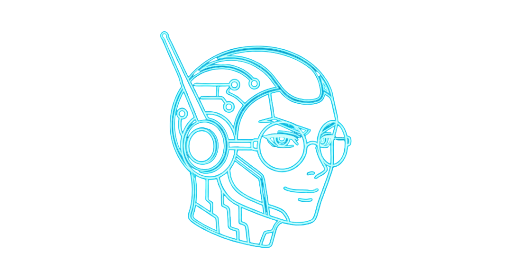
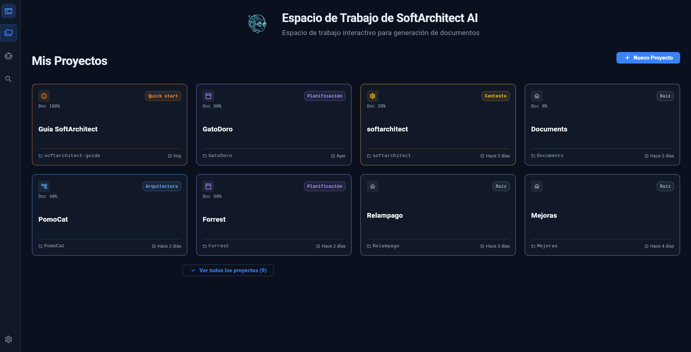
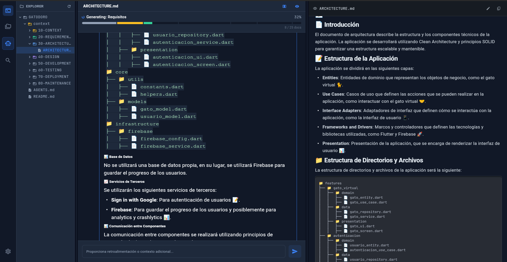
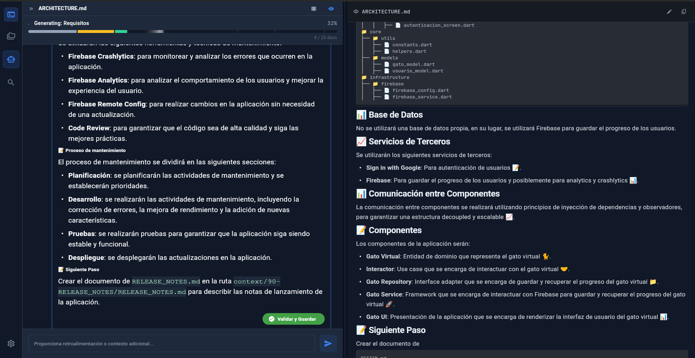
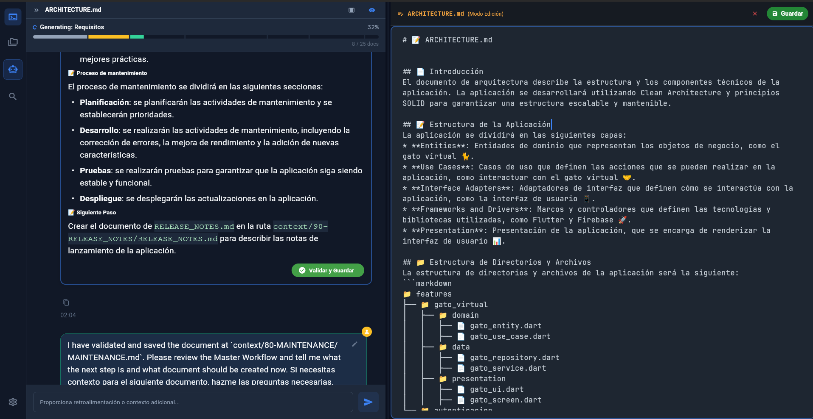
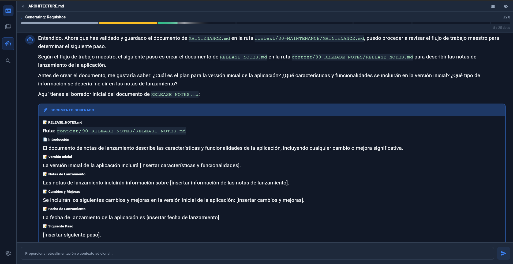
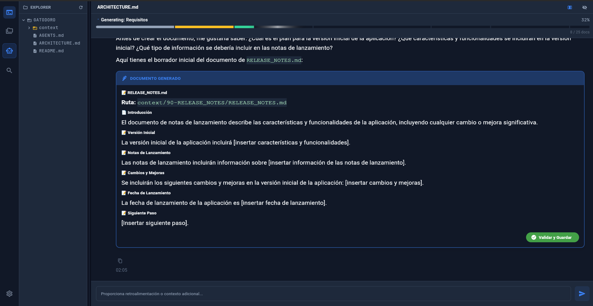

  
   
  
Trabajo de Fin de Máster

  <h1>SoftArchitect <strong>AI</strong></h1>
  
Tu Arquitecto de Software Local.

  
De una idea vaga a la arquitectura completa antes de escribir código.

Javier Fernández | Presentación TFM

---

## El Abismo del Diseño

  

    
El lienzo en blanco detiene la innovación.

    <ul>
      <li><strong style="color: #F87171;">Parálisis de definición:</strong> El 60% de los proyectos sufren retrasos en la concepción inicial.</li>
      <li><strong style="color: #F87171;">Desconexión técnica:</strong> Documentación estática que rara vez refleja la arquitectura real.</li>
      <li><strong style="color: #F87171;">Privacidad Comprometida:</strong> IAs en la nube exponen propiedad intelectual corporativa.</li>
    </ul>
  

  

    <h3 style="color: #F87171;">El Problema Principal</h3>
    
La industria necesita documentar rápido, pero externalizar el contexto a APIs públicas es un riesgo de seguridad inasumible para proyectos serios.

  

---

## La Solución: SoftArchitect AI

  

    <ul>
      <li><strong style="color: #34D399;">Diseño dirigido por IA:</strong> Plataforma híbrida. Orquestación paso a paso mediante prompts.</li>
      <li><strong style="color: #34D399;">Privacidad 100% Local:</strong> Un LLM ejecutándose íntegramente en el hardware del usuario.</li>
      <li><strong style="color: #34D399;">Salida Estandarizada:</strong> Generación automatizada de 24 documentos técnicos.</li>
    </ul>
  

  

    <h3 style="color: #34D399;">El Resultado</h3>
    
Pasar de una simple frase a un repositorio con C4 Models, esquemas JSON y flujos de usuario en <strong>menos de 15 minutos</strong>.

  

---

## Arquitectura Técnica Híbrida

  

    <h3 style="color: #60A5FA; font-size: 22px;">1. Frontend (Flutter)</h3>
    
App Desktop nativa con Riverpod. Gestión de estado fluida, renderizado de Markdown y diagramas Mermaid en tiempo real.

  

  

    <h3 style="color: #2DD4BF; font-size: 22px;">2. Backend (FastAPI)</h3>
    
Orquestador en Python. Control de Server-Sent Events (SSE) y pipeline asíncrono robusto.

  

  

    <h3 style="color: #A78BFA; font-size: 22px;">3. Capa de IA (RAG)</h3>
    
<strong>Llama 3 (8B):</strong> Razonamiento local.  <strong>ChromaDB:</strong> Base vectorial para contexto histórico.

  

---

## Interfaz de Usuario Desktop

Un entorno de desarrollo familiar con explorador de archivos y previsualización en vivo.

  
  
  
  
  
  

---

## El Corazón del Sistema: Motor RAG

  <h3 style="color: #E2E8F0;">⚡ Retrieval-Augmented Generation</h3>
  
El modelo de lenguaje no parte de cero. Utiliza una base de conocimiento especializada inyectada en cada iteración:

   
  <ul>
    <li>Inyección estricta de plantillas en el prompt.</li>
    <li>Arquitectura Limpia forzada (Clean Architecture, Microservicios).</li>
    <li><strong>Resultado:</strong> Cero alucinaciones. Adherencia a los estándares de la industria.</li>
  </ul>

---

## El Workflow (Fases 1 a 3)

  

    <h3 style="color: #FBBF24; font-size: 22px;">01. CONTEXTO</h3>
    
Definición de objetivos, visión de negocio, lenguaje del dominio y viaje del usuario.

  

  

    <h3 style="color: #34D399; font-size: 22px;">02. REQUISITOS</h3>
    
Especificaciones técnicas, historias de usuario estructuradas (JSON) y seguridad.

  

  

    <h3 style="color: #2DD4BF; font-size: 22px;">03. ARQUITECTURA</h3>
    
Estructura del sistema, diagrama de directorios, base de datos y ADRs.

  

---

## El Workflow (Fases 4 a 6)

  

    <h3 style="color: #F472B6; font-size: 22px;">04. UX / UI</h3>
    
Sistemas de diseño visual, paletas de colores, flujos de usuario y accesibilidad.

  

  

    <h3 style="color: #A78BFA; font-size: 22px;">05. PLANIFICACIÓN</h3>
    
Planificación de Sprints, estrategia de CI/CD, infraestructura y DevOps.

  

  

    <h3 style="color: #94A3B8; font-size: 22px;">06. ROOT (NÚCLEO)</h3>
    
Generación de archivos núcleo del repositorio y perfiles de los agentes de IA.

  

---

## Conclusiones y Roadmap

  

    <h3 style="color: #60A5FA;">Estado Actual (MVP)</h3>
    
Viabilidad técnica demostrada.

    <ul style="font-size: 18px;">
      <li>Generación secuencial de 24 docs.</li>
      <li>Persistencia local.</li>
      <li>Compatibilidad con Microservicios.</li>
    </ul>
  

  

    <h3 style="color: #2DD4BF;">Backlog Futuro</h3>
    <ul style="font-size: 18px;">
      <li><strong>Scaffolding:</strong> Exportación a código real.</li>
      <li><strong>Sincronización:</strong> Jira / GitHub Issues.</li>
      <li><strong>Multimodal:</strong> Interpretar bocetos a mano.</li>
    </ul>
  

