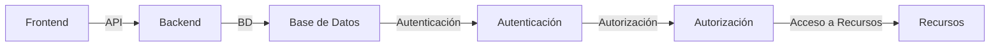
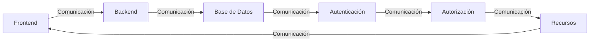

# 🏗️ Arquitectura del Sistema
## 📊 Componentes del Sistema
| Componente | Descripción | Tecnología |
| --- | --- | --- |
| **Frontend** | Interfaz de usuario para los clientes | **React** |
| **Backend** | Servicio de API para manejar pedidos y productos | **Node.js** con **Express** |
| **Base de Datos** | Almacenamiento de información de productos y pedidos | **MongoDB** |
| **Autenticación** | Servicio de autenticación para usuarios | **OAuth** con **JWT** |
| **Autorización** | Servicio de autorización para acceso a recursos | **Role-Based Access Control (RBAC)** |
## 🛡️ Seguridad
| Medida de Seguridad | Descripción | Implementación |
| --- | --- | --- |
| **Autenticación de Dos Factores** | Requerir autenticación de dos factores para acceso a recursos | **Google Authenticator** |
| **Cifrado de Datos** | Cifrar datos sensibles para proteger la información | **SSL/TLS** |
| **Firewall** | Configurar firewall para bloquear acceso no autorizado | **AWS Security Group** |
## 📈 Escalabilidad
| Estrategia de Escalabilidad | Descripción | Implementación |
| --- | --- | --- |
| **Caching** | Utilizar caching para mejorar el rendimiento | **Redis** |
| **Load Balancing** | Utilizar load balancing para distribuir el tráfico | **HAProxy** |
| **Escalabilidad Horizontal** | Utilizar escalabilidad horizontal para aumentar la capacidad del sistema | **Kubernetes** |
## 📊 Base de Datos
| Tipo de Datos | Descripción | Esquema |
| --- | --- | --- |
| **Productos** | Información de productos | **_id**, **nombre**, **descripcion**, **precio** |
| **Pedidos** | Información de pedidos | **_id**, **fecha**, **total**, **estado** |
| **Usuarios** | Información de usuarios | **_id**, **nombre**, **email**, **contraseña** |
## 📈 Diagrama de Arquitectura

## 📈 Diagrama de Componentes

